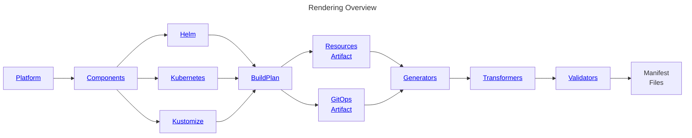

# Holos


[Holos] is a configuration management tool for Kubernetes implementing the
[rendered manifests pattern]. It handles configurations ranging from single
resources to multi-cluster platforms across regions.

Key components:
- Platform schemas defining component integration
- Building blocks unifying Helm, Kustomize and Kubernetes configs with CUE
- BuildPlan pipeline for generating, transforming and validating manifests



## Setup

```shell
brew install holos-run/tap/holos
```

Refer to [setup] for other installation methods and dependencies.

## Example

See our [tutorial] for a complete hello world example.

```cue showLineNumbers
package holos

holos: Component.BuildPlan

Component: #Helm & {
	Name: "podinfo"
	Chart: {
		version: "6.6.2"
		repository: {
			name: "podinfo"
			url:  "https://stefanprodan.github.io/podinfo"
		}
	}
	Values: ui: {
		message: string | *"Hello World" @tag(message, type=string)
	}
}
```

## Organizational Role

Platform engineers use Holos to generate Kubernetes manifests, both locally and
in CI pipelines. The manifests are committed to version control and deployed via
GitOps tools like ArgoCD or Flux.

Holos integrates seamlessly with existing Helm charts, Kustomize bases, and
other version-controlled configurations.

## Advantages of Holos

### Safe

Holos leverages [CUE] for strong typing and validation of configuration data,
ensuring consistent output from Helm and other tools.

### Consistent

A unified pipeline processes all configurations - whether from CUE, Helm, or
Kustomize - through the same well-defined stages.

### Flexible

Composable building blocks for generation, transformation, validation and
integration let teams assemble workflows that match their needs.

The core is intentionally unopinionated about platform configuration patterns.
Common needs like environments and clusters are provided as customizable
[topics] recipes rather than enforced structures.

## Getting Help

Get support through our [Discord] channel or [GitHub discussions]. Configuration
challenges arise at all experience levels - we welcome your questions and are
here to help.

## License

Holos is licensed under Apache 2.0 as found in the [LICENSE file](LICENSE).

[Holos]: https://holos.run/docs/overview/
[rendered manifests pattern]: https://akuity.io/blog/the-rendered-manifests-pattern
[CUE]: https://cuelang.org/
[Discord]: https://discord.gg/JgDVbNpye7
[GitHub discussions]: https://github.com/holos-run/holos/discussions
[Why CUE for Configuration]: https://holos.run/blog/why-cue-for-configuration/
[tutorial]: https://holos.run/docs/overview/
[setup]: https://holos.run/docs/setup/
[topics]: https://holos.run/docs/topics/
