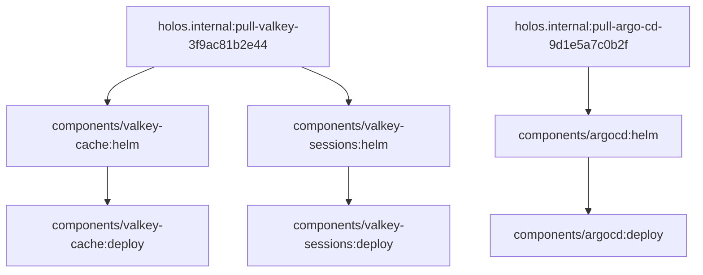

# Rendering: Compiler Pool and the Platform-Wide DAG

This chapter specifies how v1beta1 renders a platform: a pool of compiler
subprocesses evaluates every component's CUE concurrently and returns each
component's TaskSet over a protobuf stdin/stdout protocol; the parent process
merges all TaskSets into one platform-wide DAG, deduplicates helm chart
vendoring across components, topologically sorts the graph, and executes it
with bounded concurrency.  It is the design authority for Phase 2 — HOL-1494
(compiler pool) and HOL-1495 (platform DAG) transcribe the protocol and
pipeline below — and its numbered design decisions
([R1](#r1-wire-framing)–[R8](#r8-failure-semantics)) are cited by later
phases as `rendering.md#r1-wire-framing` and so on.  It builds on the
schema properties fixed in [schema.md](schema.md) decisions
[D1](schema.md#d1-edge-derivation) (derived edges) and
[D3](schema.md#d3-task-naming-and-namespacing) (canonical task IDs).

## Before: the v1alpha6 render pipeline

Three existing mechanisms define the baseline v1beta1 evolves.  Two survive
with a new wire format and a new graph; one is replaced outright.

### The JSON compiler protocol

`holos render platform` already avoids evaluating CUE for every component in
its own process: it spawns compiler subprocesses and speaks newline-delimited
JSON to them over stdin and stdout.  The request and response types, from
[`internal/compile/compile.go`](../../../internal/compile/compile.go)
(lines 31–45):

```go
type BuildPlanRequest struct {
	APIVersion string `json:"apiVersion,omitempty" yaml:"apiVersion,omitempty"`
	Kind       string `json:"kind,omitempty" yaml:"kind,omitempty"`
	Root       string `json:"root,omitempty" yaml:"root,omitempty"`
	Leaf       string `json:"leaf,omitempty" yaml:"leaf,omitempty"`
	WriteTo    string `json:"writeTo,omitempty" yaml:"writeTo,omitempty"`
	TempDir    string `json:"tempDir,omitempty" yaml:"tempDir,omitempty"`
	Tags       []string
}

type BuildPlanResponse struct {
	APIVersion string          `json:"apiVersion,omitempty" yaml:"apiVersion,omitempty"`
	Kind       string          `json:"kind,omitempty" yaml:"kind,omitempty"`
	RawMessage json.RawMessage `json:"rawMessage,omitempty" yaml:"rawMessage,omitempty"`
}
```

The pool mechanics live in `compile.go` lines 149–254.  `Compile()` runs a
producer/consumer over a `tasks` channel: one producer feeds a
`BuildPlanRequest` per component, and each of N consumers owns one
long-lived subprocess started as `exec.CommandContext(ctx, exe, "compile")`
— the same holos executable, re-invoked as its own compiler.  Each consumer
attaches a `json.Encoder` to the subprocess's stdin and a `json.Decoder` to
its stdout, writes one request, and blocks reading one response, reusing the
subprocess for request after request until the channel closes.  Stderr is
buffered per subprocess and surfaced when a decode fails or the process
exits uncleanly.

v1beta1 keeps this process topology — long-lived pooled subprocesses, one
in-flight request each — and replaces the wire format.

### Why compilers are subprocesses

From [`internal/cue/cue.go`](../../../internal/cue/cue.go) (lines 26–27):

```go
// cue context and loading is not safe for concurrent use.
var cueMutex sync.Mutex
```

Every CUE evaluation in a holos process — `BuildInstance` and everything
above it — serializes on this one mutex.  Goroutines cannot make CUE
evaluation parallel; only additional processes can, each with its own CUE
runtime.  This is the entire reason the compiler pool exists, and why
v1beta1 keeps subprocesses rather than reaching for in-process concurrency.
A softer second reason: CUE evaluation is memory-hungry
(`internal/platform/platform.go` lines 174–175 limits goroutines "due to
CUE memory usage concerns"), and a subprocess returns its memory to the
operating system when it exits.

### The phase-ordered Build

After compilation, v1alpha6 executes each component's BuildPlan with a
per-component worker pool.  From
[`internal/component/v1alpha6/v1alpha6.go`](../../../internal/component/v1alpha6/v1alpha6.go)
(lines 668–711), `Build` starts `Opts.Concurrency` workers over a `tasks`
channel and one producer per artifact; `buildArtifact` (lines 590–660) then
hard-codes the pipeline shape: all generators run concurrently, then a
`wg.Wait()` barrier, then transformers run sequentially as a single task,
then another barrier, then validators run concurrently, then a final barrier
before the artifact file is written:

```go
	// Process Generators concurrently
	for gid, gen := range artifact.Generators {
		// ... one generatorTask per generator sent to the pool
	}
	wg.Wait()

	// Process Transformers sequentially
	// ... one transformersTask wrapping the whole list
	wg.Wait()

	// Process Validators concurrently
	for vid, val := range artifact.Validators {
		// ... one validatorTask per validator sent to the pool
	}
	wg.Wait()

	// Write the final artifact
	out := string(artifact.Artifact)
	if err := opts.Store.Save(opts.AbsWriteTo(), out); err != nil {
```

The DAG is implicit in the barriers, fixed per artifact, and invisible
across components: nothing can order a task in one component after a task in
another.  This is the model the platform-wide DAG replaces — in v1beta1 the
graph is explicit in the schema ([D1](schema.md#d1-edge-derivation)), and
the executor schedules one graph for the whole platform rather than one
phase sequence per artifact.

### The per-component chart cache

Helm charts are vendored per component today.  From `v1alpha6.go` (lines
151–155):

```go
func (t *generatorTask) helm(ctx context.Context) error {
	h := t.generator.Helm
	// Cache the chart by version to pull new versions. (#273)
	cacheDir := filepath.Join(t.opts.AbsLeaf(), "vendor", t.generator.Helm.Chart.Version)
	cachePath := filepath.Join(cacheDir, filepath.Base(h.Chart.Name))
```

When the cache path does not exist, the pull runs under `onceWithLock`
(line 172), a mkdir-based filesystem lock that prevents two concurrent
renders from pulling into the *same* `vendor/{version}` directory.  The
dedup scope is the directory, not the chart: two components using the same
chart at the same version hold two separate cache paths and pull the chart
twice.  Step 3 of the platform DAG centralizes this mechanism into one
shared vendor task per distinct chart.

## The compiler protocol: protobuf over stdin and stdout

One request per component compile, sent by `holos render platform` to a
pooled compiler subprocess over stdin; one response per request on stdout.
The messages below are normative; Phase 2 (HOL-1494) transcribes them into
`proto/holos/compiler/v1beta1/compiler.proto` (no `.proto` files exist in
the repository today — [R5](#r5-proto-toolchain) picks the toolchain).

```proto
syntax = "proto3";

package holos.compiler.v1beta1;

// CompilerHello is the first message a compiler subprocess writes to
// stdout, before reading any request.  The parent verifies it before
// sending the first CompileRequest (R3).
message CompilerHello {
  // version of the holos executable acting as the compiler.
  string version = 1;
  // api_versions lists the TaskSet api versions the compiler can emit,
  // e.g. "v1beta1".
  repeated string api_versions = 2;
}

// CompileRequest represents one component compile.
message CompileRequest {
  // root is the platform root (CUE module root).
  string root = 1;
  // leaf is the component path relative to root.
  string leaf = 2;
  // write_to is the output directory for final artifacts.
  string write_to = 3;
  // temp_dir is the build temp directory injected into BuildContext.
  string temp_dir = 4;
  // tags are CUE @tag() injections: component name, labels, annotations.
  repeated string tags = 5;
  // config is a JSON-encoded #Config value unified into the component
  // (the Phase 5 injection point).  Empty until Phase 5.
  bytes config = 6;
}

// Error represents a failed component compile (R4).
message Error {
  // leaf is the component path relative to root, attributing the failure.
  string leaf = 1;
  // message is the human-readable error, carrying CUE's error text with
  // file positions verbatim.
  string message = 2;
}

// CompileResponse represents the result of one CompileRequest.
message CompileResponse {
  oneof result {
    // task_set is the component's JSON-encoded TaskSet (R2).
    bytes task_set = 1;
    // error reports a compile failure; the subprocess stays alive (R4).
    Error error = 2;
  }
}
```

### R1: Wire framing

**Decision: messages are binary protobuf, delimited by a varint length
prefix (the standard `protodelim` framing), in both directions.**

Newline-delimited JSON is retired for three reasons.  First, message
boundaries: a length prefix states exactly how many bytes to read, so a
subprocess killed mid-message produces a clean truncation error rather than
a JSON syntax error at an arbitrary token, and binary payloads (the `bytes`
fields) need no base64 detour through a text encoding.  Second, schema
discipline: the current protocol's wire format is whatever `encoding/json`
does to the Go structs — the `Tags []string` field (`compile.go` line 38)
carries no json tag at all, so the wire spells it `Tags` while every other
field is camelCase; an accident of struct definition became a protocol
commitment nobody decided.  Protobuf makes the wire schema an explicit,
reviewed artifact with defined unknown-field semantics.  Third, evolution:
`buf breaking` can gate changes to a `.proto` file in CI; no equivalent
guard exists for ad-hoc JSON structs.  Go implementations use
`google.golang.org/protobuf/encoding/protodelim` (`MarshalTo` /
`UnmarshalFrom`), which implements exactly this framing.

### R2: TaskSet payload encoding

**Decision: the TaskSet crosses the wire as JSON in a `bytes` field, not as
a fully modeled protobuf message.**

The TaskSet is born as a CUE export, which is JSON; its normative schema is
`api/core/v1beta1/types.go` plus the published CUE schema
([schema.md](schema.md)).  Modeling TaskSet as protobuf messages would
create a third normative schema for the same shape, and the three would
drift — the exact duplication disease v1beta1 eliminates by collapsing the
v1alpha6 wrapper kinds.  With `bytes` + JSON the parent decodes and
validates the TaskSet with the same code path Phase 1 uses for
single-component renders, and the CUE-to-wire step in the compiler is a
straight export with no re-marshaling.  Revisit only if a later phase needs
partial decode or streaming of very large TaskSets; the `oneof` admits a
message-modeled variant as a new field without breaking old readers.

### R3: Versioning and negotiation

**Decision: the proto package name (`holos.compiler.v1beta1`) versions the
message schema; a `CompilerHello` handshake verifies the same-binary
invariant at startup; the parent selects the protocol by spawning
`holos compile --protobuf`.**

The parent spawns its own executable (`util.Executable()`), so both ends of
the pipe are the same build and skew is structurally impossible in normal
operation.  The handshake makes that invariant *checked* rather than
assumed: the subprocess writes `CompilerHello` before reading anything; the
parent verifies `version` matches its own and `api_versions` contains the
version it needs, failing fast with a clear error instead of a framing
error deep into the stream — which matters the moment anything relaxes the
invariant, such as a cross-version testing override or a packaging mistake
that puts a stale `holos` on `PATH`.  Bare `holos compile` keeps
speaking the v1alpha6 JSON protocol unchanged for as long as v1alpha6
components are supported (see [Migration](#migration-v1alpha5-and-v1alpha6-components));
the `--protobuf` flag selects the new protocol, and a future
`holos.compiler.v1beta2` package would arrive as a new flag value or a
`CompilerHello` capability, negotiated before the first request.

### R4: Error propagation

**Decision: compile failures are structured `Error` responses carrying the
component path and the CUE error text; the subprocess survives them.
Protocol failures are fatal: the subprocess exits nonzero and the parent
surfaces its buffered stderr.**

A component that fails to evaluate is a normal, expected outcome — one bad
component must not tear down a pooled subprocess that other components'
requests are queued behind.  The compiler catches the evaluation error,
responds with `Error{leaf, message}` (preserving CUE's formatted positions,
as `BuildPlan.Load` in `v1alpha6.go` does today by returning `v.Err()`
unwrapped), and reads the next request.  The parent attributes the failure
via `leaf` and applies the failure semantics of
[R8](#r8-failure-semantics).  Framing corruption, an unparseable message, or
an unsupported request are protocol errors: the subprocess writes detail to
stderr and exits nonzero, and the parent reports the buffered stderr exactly
as `compiler()` does today (`compile.go` lines 213–228).

### R5: Proto toolchain

**Decision: `buf` manages the proto module; generated Go code is committed
to the repository.**

The `.proto` files live under `proto/` with `proto/holos/compiler/v1beta1/compiler.proto`
as the first file; `buf generate` writes Go code to
`internal/gen/holos/compiler/v1beta1/` — under `internal/` because the
compiler protocol is a private interface between a holos parent and its own
subprocess, not a public API.  Generated code is committed so `go build`
needs neither network access nor a locally installed `protoc`/`buf`; CI runs
`buf lint` and `buf breaking` against the base branch and verifies committed
code matches `buf generate` output, the same pattern the repository already
uses for other generated artifacts checked by `make update-docs`.

## The platform-wide DAG

Six steps take a Platform to a fully rendered deploy tree.  Steps 1–3 build
the graph; steps 4–5 execute it; step 6 hands the result to the next phase.

### Step 1: load the platform and fan out

The parent loads the platform exactly as today:
`internal/platform/platform.go` `Load` (lines 129–157) reads the type meta,
switches on `APIVersion`, builds the CUE instance, and decodes the `holos`
field value.  v1beta1 adds one case to the dispatch (per the
[README layer model](README.md#normative-the-go-tooling-knows-only-platform--component)).
Component selection (`Select` with label selectors) is unchanged.  The
parent then spawns N compiler subprocesses, where N is `--concurrency` —
because `cueMutex` serializes evaluation within any one process, N
subprocesses is the only way to get N-way compile parallelism — and feeds
one `CompileRequest` per selected component through the producer/consumer
topology carried over from `Compile()` in `compile.go`.

### Step 2: collect TaskSets and merge into one DAG

Each `CompileResponse` yields one component's TaskSet.  The parent validates
it (the same schema validation Phase 1 applies), derives the component's
intra-component edges from `inputs`/`output` matching and `dependsOn` per
[D1](schema.md#d1-edge-derivation), and namespaces every task into its
canonical ID `<component-path>:<task-name>` per
[D3](schema.md#d3-task-naming-and-namespacing).  Because the merged
`spec.tasks` structs are keyed by canonical ID, the merge is a struct union
with no possibility of positional conflict.  Artifact-store paths remain
namespaced per component — `vault.gen.yaml` in two components names two
distinct store entries — so derived data-flow edges never cross a component
boundary.  Cross-component edges arrive two ways: explicit `dependsOn` keys
containing a colon (canonical IDs, per D3), and the synthetic vendor edges
of step 3.  Final artifact paths (`Artifact` task `path` values, relative to
the write-to directory) are platform-global: two sinks declaring the same
path is an error naming both canonical IDs, the platform-wide extension of
D1's write-once rule.

### Step 3: deduplicate helm chart vendoring

**Decision (R6 below): components sharing a chart share one vendor task.**
After the merge, the parent scans every `Helm` task and computes its dedup
key: the triple **`(repository.url, chart.name, chart.version)`**.  For
each distinct key it synthesizes ONE vendor task node that pulls the chart
into a platform-level cache, and adds an edge from that node to every
`Helm` task carrying the key.  Where v1alpha6 pulls into a per-component
directory guarded by a per-path filesystem lock (`vendor/{version}` +
`onceWithLock`, quoted [above](#the-per-component-chart-cache)), v1beta1
lifts the same once-only semantics into the graph: the dedup is a node, the
ordering is an edge, and the scheduler provides the mutual exclusion for
free.  A component whose chart is already committed inside its module
(the hermetic-vendoring convention of the
[README](README.md#normative-the-transparency-principle)) needs no pull:
its `Helm` task gets no vendor edge and reads the committed chart.

### R6: Shared vendor task identity

**Decision: synthetic vendor tasks live under the reserved virtual
component path `holos.internal`; the task name is `pull-` + the sanitized
chart name + `-` + the first 12 hex digits of the SHA-256 of the dedup
key.**

Canonical IDs parse as `<component-path>:<task-name>` (D3), so synthetic
nodes need a component path that no real component can claim: holos
validates at platform load that no selected component's path equals or is
nested under `holos.internal`, making IDs like
`holos.internal:pull-valkey-3f9ac81b2e44` collision-free.  The task name
must satisfy D3's RFC 1123 label constraint, so the chart name is sanitized
(characters outside `[a-z0-9-]` map to `-`, uppercase folds to lowercase)
and the digest — computed over the key triple joined with `\n` — guarantees
uniqueness even when two distinct keys sanitize to the same chart name.
The digest also keys the platform-level cache directory, so repeated
renders reuse pulled charts just as the per-component `vendor/{version}`
cache does today.

### Step 4: topological sort and bounded execution

The parent executes the merged DAG with Kahn's algorithm over a
deterministically ordered ready queue, dispatching to a bounded pool of
errgroup workers (the worker-pool shape of v1alpha6's `Build`, promoted
from one component's artifacts to the whole platform):

1. Compute every task's in-degree; insert all in-degree-zero tasks into the
   ready queue.
2. Each of N workers pops the minimum ready task, runs it, then atomically
   decrements the in-degree of its successors, inserting any that reach
   zero.
3. The render completes when all tasks have run; if tasks remain but none
   are ready, the graph has a cycle — reported at graph-build time (D1),
   before any task runs.

### R7: Deterministic ordering

**Decision: the ready queue is a min-heap ordered by canonical task ID,
byte-wise lexicographic.  Dispatch order is a deterministic function of the
completion order.**

Whenever the executor chooses among ready tasks, the choice is the smallest
canonical ID — reproducible across runs, platforms, and Go versions, with
no reliance on map iteration order.  Task *outputs* are schedule-independent
anyway (tasks are functions of their declared inputs, and outputs are
write-once), so determinism here buys reproducible logs, reproducible
failure attribution, and diffable execution traces rather than correctness.
Byte-wise lexicographic order is deliberately naive: it is not
makespan-optimal (the [worked example](#worked-example-three-components-two-sharing-a-chart)
shows a schedule one step longer than optimal), but optimality would
require duration estimates the executor does not have, and determinism is
worth more than a heuristic's occasional step.

### Step 5: failure semantics

### R8: Failure semantics

**Decision: fail fast.  The first task failure cancels the shared context;
no new tasks dispatch, running tasks are cancelled, and the render exits
nonzero naming the failed task's canonical ID.**

Compile errors ([R4](#r4-error-propagation)) and task failures get the same
treatment: the errgroup's context cancellation stops the world, matching
both current behaviors — `Compile()`'s errgroup and `Build`'s worker pool
already fail this way.  Final artifacts written by sinks that completed
before the failure remain on disk; artifacts whose sinks never ran are
absent; no sink is ever partially written because the `Artifact` task is
atomic (write to temp, rename).  Continue-on-error scheduling of
independent subgraphs (a `--keep-going` in the make sense) is deliberately
out of scope: a partially rendered deploy tree that *looks* complete is a
deployment hazard, and CI use cases that want maximal error reporting can
re-render per component.  Any future `--keep-going` arrives as an explicit
opt-in; fail-fast stays the default regardless.

### Step 6: the result

When the graph completes, every component's resources are rendered and
written under the write-to directory.  The parent assembles the complete
listing of rendered resources organized by **Profile, Role, and Component**:
the component labels injected at compile time (`ComponentLabelsTag`, carried
on each TaskSet's `metadata.labels` per
[schema.md](schema.md#buildcontext-and-cue-tags-carry-over)) carry the
profile and role names the author layers assigned, so the grouping is a
fold over TaskSet metadata — the Go tooling still knows nothing of profiles
and roles structurally, honoring the
[layer-model normative rule](README.md#normative-the-go-tooling-knows-only-platform--component).
This listing is the input to the Phase 4 rendered-resource round-trip
verification specified in [resources.md](resources.md).  Because every task
is a hermetic function of its declared inputs, the listing is also the
natural seam for future content-addressed caching of task outputs — a
deferred design this chapter does not foreclose.

## Worked example: three components, two sharing a chart

Three components, each with the two-task pipeline of the
[schema.md worked example](schema.md#worked-example-two-tasksets-unify-into-one-struct)
(`helm` → `deploy`):

| Component | Chart | Repository | Version |
| -- | -- | -- | -- |
| `components/valkey-cache` | `valkey` | `https://charts.example.com` | `1.4.0` |
| `components/valkey-sessions` | `valkey` | `https://charts.example.com` | `1.4.0` |
| `components/argocd` | `argo-cd` | `https://argoproj.github.io/argo-helm` | `7.7.0` |

Two distinct dedup keys emerge: the valkey triple, shared by two
components, and the argo-cd triple.  Step 3 synthesizes one vendor node per
key (digests abbreviated), and the merged platform DAG is:



The valkey chart is pulled once, not twice — the two `helm` tasks share the
`pull-valkey` node — and each `deploy` sink follows its `helm` task through
a derived data-flow edge (D1).

Executing at concurrency 2, with unit task durations for illustration.  The
initial ready set is the two vendor nodes (in-degree zero); every choice
among ready tasks takes the lexicographically smallest canonical ID (R7):

| Step | Worker 1 | Worker 2 |
| -- | -- | -- |
| 1 | `holos.internal:pull-argo-cd-9d1e5a7c0b2f` | `holos.internal:pull-valkey-3f9ac81b2e44` |
| 2 | `components/argocd:helm` | `components/valkey-cache:helm` |
| 3 | `components/argocd:deploy` | `components/valkey-cache:deploy` |
| 4 | `components/valkey-sessions:helm` | *(idle)* |
| 5 | `components/valkey-sessions:deploy` | *(idle)* |

After step 1 all three `helm` tasks are ready; `components/argocd:helm` and
`components/valkey-cache:helm` win the tie-break.  After step 2 the ready
queue holds both completed pipelines' `deploy` sinks and the still-waiting
`components/valkey-sessions:helm` — and `deploy` sorts before
`valkey-sessions:helm`, so the sessions pipeline waits again.  The schedule
finishes in 5 steps where a duration-aware scheduler could finish in 4 (run
`valkey-sessions:helm` at step 2); this is R7's trade, determinism over
heuristic optimality, made visible.

## Migration: v1alpha5 and v1alpha6 components

Per-component API version dispatch is unchanged: `(*Component).TypeMeta()`
reads each component's `typemeta.yaml` discriminator
(`internal/component/component.go`, cited in the
[README](README.md#normative-the-go-tooling-knows-only-platform--component)),
so components of different API versions coexist in one platform.  In a
mixed platform, each v1alpha5/v1alpha6 component becomes exactly one opaque
node in the platform DAG: "render component `<path>`", executed through the
existing JSON compiler protocol and the phase-ordered `Build` quoted above,
with no intra-component task visibility, no cross-component edges, and no
participation in vendor dedup.  v1beta1 components join the graph natively;
the opaque nodes schedule under the same executor and the same R7/R8 rules,
so migrating component-by-component changes each component's graph
granularity and nothing else.  The JSON protocol and the per-component
`vendor/{version}` cache retire together with v1alpha6 support, not before.
