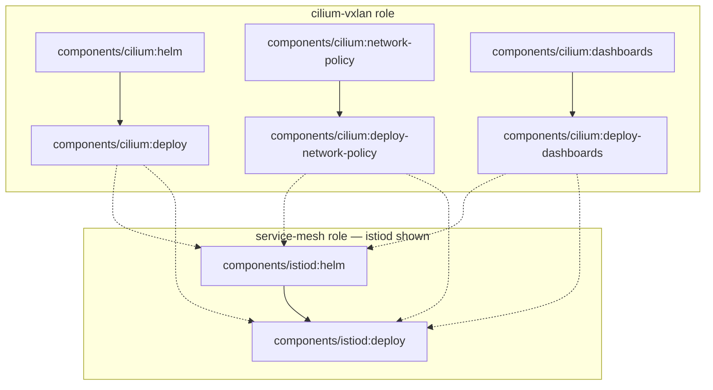

# Use Case: The Canonical Management Cluster

This chapter grounds the design in one canonical, end-to-end use case: a
`management-cluster` Profile composing a `cilium-vxlan` Role (the Cilium
VXLAN data plane — the cluster's container network) and a dependent
`service-mesh` Role (Istio Ambient), with a `secrets` Role demonstrating the
Secret → ExternalSecret knockout.  It is the design authority for Phase 5
(HOL-1498), which implements everything below as a fixture; its decisions
([U1](#u1-the-author-layer-and-the-flattening)–[U6](#u6-the-secret--externalsecret-knockout))
are cited as `use-case.md#u1-the-author-layer-and-the-flattening` and so on.
The chapter composes its three siblings: the TaskSet the modules produce is
[schema.md](schema.md)'s, the modules are packaged per
[modules.md](modules.md), and the verification policy unifies over the
[resources.md](resources.md) round-trip structure.

One constraint governs everything here, fixed by the
[README layer model](README.md#normative-the-go-tooling-knows-only-platform--component):
**Profile and Role are pure CUE conventions.**  Nothing in this chapter
requires a Go change beyond what the earlier chapters already specify — the
Go tooling sees only a Platform holding components, each producing a
TaskSet.  Every CUE mechanism shown below was verified to evaluate as
described with `cue vet` (cue v0.16.0).

## The canonical target

One management cluster, three roles, five component modules, two mixin
modules:

| Layer | Name | Contents |
| -- | -- | -- |
| Profile | `management-cluster` | selects the three roles; injects site data (cluster name, pod CIDR) |
| Role | `cilium-vxlan` | `cilium` component, composed with security and observability mixins |
| Role | `service-mesh` | `istio-cni`, `istiod`, `ztunnel` components; **depends on `cilium-vxlan`** |
| Role | `secrets` | `vault` component with the Secret → ExternalSecret knockout |

| Module | Kind | Publisher |
| -- | -- | -- |
| `example.com/holos/cilium` | component | community |
| `example.com/holos/istio-cni`, `…/istiod`, `…/ztunnel` | component | community |
| `example.com/holos/vault` | component | community |
| `example.com/security/cilium-policy` | mixin | Security team |
| `example.com/sre/cilium-observability` | mixin | SRE Observability team |

The platform repository — itself a CUE module, per
[modules.md M3](modules.md#m3-version-selection-and-platform-pinning) — lays
out as:

```
platform.example.com/
├── cue.mod/module.cue            # module: "platform.example.com@v0"; deps pin every module (M3)
├── platform/platform.cue         # holos: the core Platform resource — what `holos render platform` reads
├── author/author.cue             # the author layer: #Platform, #Profile, #Role, #ComponentRef (U1)
├── site/                         # the concrete site — one package, several files
│   ├── platform.cue              # platform: author.#Platform & {…}; site data
│   ├── profile-management.cue    # the management-cluster profile
│   ├── role-cilium-vxlan.cue     # the cilium-vxlan role (U5: three-module composition)
│   ├── role-service-mesh.cue     # the service-mesh role (U4: inter-role dependency)
│   └── role-secrets.cue          # the secrets role (U6: the knockout)
├── policy/secrets/policy.cue     # verification policy over #Resources (resources.md V3)
└── components/                   # one shim directory per component instance (U2)
    ├── cilium/component.cue
    ├── istio-cni/component.cue
    ├── istiod/component.cue
    ├── ztunnel/component.cue
    └── vault/component.cue
```

## The author layer

### U1: The author layer and the flattening

**Decision: the site owns an `author` package defining `#Platform`,
`#Profile`, `#Role`, and `#ComponentRef`.  `#Platform` flattens
profiles → roles → components by comprehension into the only structures the
Go tooling reads — the core Platform resource (`spec.components`, struct-
keyed by component path) and one TaskSet per component instance — stamping
`holos.run/profile.name` and `holos.run/role.name` labels onto every
component.**

The complete author layer.  This is the CUE Phase 5 transcribes:

```cue
// author/author.cue
package author

import core "github.com/holos-run/holos/api/core/v1beta1"

// #ComponentRef binds one component instance into a role: the module's
// component function (unified with any mixins) and the instance path the
// Go tooling compiles.
#ComponentRef: {
	name: string
	path: string | *"components/\(name)"
	// component is the module's component function — the #Component shape
	// of the README layer model — with mixins unified in (U5).
	component: {
		config: {...}
		taskSet: core.#TaskSet
		...
	}
	taskSet: component.taskSet
}

// #Role is a reusable capability composed of components.  Pure convention:
// holos never reads this definition — it flattens into Platform components.
#Role: {
	name: string
	// dependsOn expresses inter-role ordering, compiled into task DAG edges
	// on each member component's TaskSet (U4).  Struct-keyed, not a list,
	// for the same reason Task.dependsOn is (schema.md D1): mixins compose
	// edges by unification.
	dependsOn: [Role=string]: {}
	// config carries data injected at the role layer, unified into every
	// member component's closed #Config (U3).
	config: {...}
	components: [Name=string]: #ComponentRef & {
		"name":    Name
		component: "config": config
	}
}

// #Profile composes roles for one cluster class.
#Profile: {
	name: string
	roles: [Name=string]: #Role & {name: Name}
}

// #Platform flattens profiles → roles → components into the ONLY
// structures the Go tooling reads.
#Platform: {
	name: string
	profiles: [Name=string]: #Profile & {name: Name}

	// resource is the core Platform.  spec.components is struct-keyed by
	// component path — v1beta1 finishes design-inputs item 2 for the
	// Platform spec — and every component carries the Profile and Role
	// labels, so rendered output is organized by Profile, Role, Component
	// (rendering.md step 6).
	resource: core.#Platform & {
		metadata: "name": name
		spec: components: {
			for pn, p in profiles
			for rn, r in p.roles
			for cn, c in r.components {
				(c.path): {
					name: cn
					path: c.path
					labels: {
						"holos.run/profile.name": pn
						"holos.run/role.name":    rn
					}
				}
			}
		}
	}

	// taskSets carries each instance's TaskSet keyed by component path;
	// the instance shim exports taskSets[path] (U2).  The same labels land
	// on TaskSet metadata, which is what step 6 folds over.
	taskSets: [Path=string]: core.#TaskSet
	taskSets: {
		for pn, p in profiles
		for rn, r in p.roles
		for cn, c in r.components {
			(c.path): c.taskSet
			(c.path): metadata: labels: {
				"holos.run/profile.name": pn
				"holos.run/role.name":    rn
			}
		}
	}

	// Inter-role dependency edges (U4): every task of every member of a
	// role gains a dependsOn edge to the terminal (Artifact sink) tasks of
	// every member of each role it depends on — canonical IDs per
	// schema.md D3.
	taskSets: {
		for pn, p in profiles
		for rn, r in p.roles
		for dep, _ in r.dependsOn
		for cn, c in r.components {
			(c.path): spec: tasks: [_]: dependsOn: {
				for dcn, dc in p.roles[dep].components
				for tn, t in dc.taskSet.spec.tasks
				if t.kind == "Artifact" {
					"\(dc.path):\(tn)": {}
				}
			}
		}
	}
}
```

Three properties of the flattening are load-bearing:

- **Labels land everywhere they are needed.**  `spec.components` labels
  flow into compile-time tag injection (`ComponentLabelsTag`,
  [schema.md](schema.md#buildcontext-and-cue-tags-carry-over)) and the same
  comprehension stamps them onto each TaskSet's `metadata.labels`, which is
  the fold [rendering.md step 6](rendering.md#step-6-the-result) groups by.
  The Go tooling reads labels as opaque strings; only the author layer
  knows they name a profile and a role.
- **Collisions are conflicts.**  Component paths key both structures, so
  two roles (or two profiles) claiming `components/cilium` unify — and
  their differing `holos.run/role.name` labels are a CUE conflict naming
  both sources.  Instance paths are site-unique by construction, enforced
  by unification rather than by a checker.
- **The comprehension is the whole mechanism.**  There is no registration
  step, no generated file, no Go awareness.  Deleting a role from a
  profile removes its components, its TaskSets, and its labels in one
  edit.

The author package is site-owned by design.  Sites with different
intermediate layers — or none — write a different `author` package (or skip
one entirely) and the Go tooling cannot tell the difference.  A shared
`author` package may graduate to a published module once conventions
stabilize; nothing in this design requires it.

### U2: Component instance wiring

**Decision: each component instance directory contains one generic shim
that exports its TaskSet from the flattened `taskSets` structure, selected
by the injected component path tag.  Per-component `#Config` injection via
`CompileRequest.config` is deferred as an optimization.**

```cue
// components/cilium/component.cue — identical in every instance directory.
package holos

import "platform.example.com/site"

_path: string @tag(holos_component_path)
holos: site.platform.taskSets[_path]
```

The shim uses only the existing tag mechanism
(`ComponentPathTag`, [schema.md](schema.md#buildcontext-and-cue-tags-carry-over)).
`holos render component components/cilium` works unchanged: the leaf
instance evaluates to a complete TaskSet with the role's config already
unified in.  The cost is that every component compile evaluates the whole
`site` package — acceptable for this use case and for the Phase 5 fixture,
and bounded by the compiler pool's parallelism
([rendering.md step 1](rendering.md#step-1-load-the-platform-and-fan-out)).
The `CompileRequest.config` field ([rendering.md](rendering.md), "the
Phase 5 injection point") exists so a later optimization can flatten each
instance's `#Config` value into `spec.components` at platform load and let
each leaf import only its own module; that variant changes evaluation cost,
not semantics, and this chapter does not depend on it.

### U3: Role config injection through the closed #Config

**Decision: a role's `config` value is unified into every member
component's closed `#Config` by the `#Role` schema — one declaration, no
per-component plumbing.  Fields a member does not declare are conflicts,
not silent drops.**

The `component: "config": config` line in `#Role` is the entire mechanism.
Its consequences:

- **Mesh-wide values stay consistent.**  The `service-mesh` role injects
  `{profile, meshID, trustDomain}` into `istio-cni`, `istiod`, and
  `ztunnel` at once; all three modules declare those fields in their closed
  `#Config` precisely so the role can inject them uniformly.  A member that
  drifted — say a ztunnel release that renamed `trustDomain` — fails the
  render with a `field not allowed` error naming both sources.
- **Typos are errors.**  Setting `tunelMode` at any layer fails evaluation
  the same way, because every layer's value funnels through the same
  closed definition:

```console
$ holos render platform
error: platform.profiles.management.roles."cilium-vxlan".config.tunelMode: field not allowed:
    ./site/role-cilium-vxlan.cue:9:3
exit status 1
```

- **Profiles inject deeper, not differently.**  Site data enters by
  unifying into `roles.<name>.config` from the profile layer — the same
  field, one level up — so "every site opinion is greppable in the profile
  and platform layers" ([README](README.md#how-the-layers-compose)) holds
  structurally.

## The component modules

Each module follows the [modules.md](modules.md) layout.  The cilium
module in full, and the other four compactly — every module referenced in
this chapter has the same shape:

```
modules/cilium/
├── cue.mod/module.cue          # module: "example.com/holos/cilium@v0"
├── README.md                   # every #Config field documented
├── config.cue                  # closed #Config — the site-variance interface
├── component.cue               # #Component: #Config → core.#TaskSet
├── vendor/charts/cilium-1.16.5.tgz     # embedded chart (M5)
└── examples/vxlan/             # reference #Config instance …
    └── deploy/                 # … and its committed golden render

modules/istio-cni/              # module: "example.com/holos/istio-cni@v0"
├── cue.mod/module.cue          #   (istiod and ztunnel mirror this tree)
├── README.md
├── config.cue
├── component.cue
├── vendor/charts/cni-1.24.2.tgz        # istiod-1.24.2.tgz / ztunnel-1.24.2.tgz
└── examples/ambient/deploy/

modules/vault/                  # module: "example.com/holos/vault@v0"
├── cue.mod/module.cue
├── README.md
├── config.cue
├── component.cue
├── vendor/charts/vault-0.28.0.tgz
└── examples/default/deploy/

modules/cilium-policy/          # module: "example.com/security/cilium-policy@v0"
├── cue.mod/module.cue          #   mixin-only package — no chart, no #Config
├── README.md                   #   (cilium-observability mirrors this tree)
├── mixin.cue                   # #Mixin over the cilium component function
└── examples/default/deploy/
```

### The cilium module

```cue
// modules/cilium/config.cue
package cilium

import "net"

// #Config is the entire site-variance interface (transparency principle).
#Config: close({
	// namespace the chart installs into.
	namespace: string | *"kube-system"
	// version of the embedded chart archive.
	version: string | *"1.16.5"
	// cluster identity, injected by the profile layer.
	cluster: {
		name: string
		id:   int & >=1 & <=255 | *1
	}
	// tunnelMode selects the data plane encapsulation.  "disabled" selects
	// native routing and requires ipv4NativeRoutingCIDR.
	tunnelMode: "vxlan" | "geneve" | "disabled" | *"vxlan"
	// ipv4NativeRoutingCIDR is the pod CIDR excluded from masquerading.
	// null (the default) omits the value from the chart.
	ipv4NativeRoutingCIDR: *null | net.IPCIDR
	// kubeProxyReplacement enables the eBPF kube-proxy replacement.
	kubeProxyReplacement: bool | *true
	// policyEnforcementMode is the seam the security mixin pins (U5).
	policyEnforcementMode: "default" | "always" | "never" | *"default"
})
```

The issue-level sketch declared `ipv4NativeRoutingCIDR?:` optional; the
definition refines it to a `*null | net.IPCIDR` disjunction because a null
default is testable in a comprehension guard (`!= null`), while CUE offers
no clean presence test for an absent optional field.

```cue
// modules/cilium/component.cue
package cilium

import core "github.com/holos-run/holos/api/core/v1beta1"

// #Component is the component function: #Config in, TaskSet out.
#Component: {
	config: #Config

	taskSet: core.#TaskSet & {
		metadata: "name": "cilium"
		spec: tasks: {
			helm: {
				kind: "Helm"
				helm: {
					chart: {
						name:    "cilium"
						version: config.version
						release: "cilium"
						// The embedded chart travels inside the module (M5);
						// no repository, no network.
						source: {
							module: "example.com/holos/cilium"
							path:   "vendor/charts/cilium-\(config.version).tgz"
						}
					}
					namespace: config.namespace
					values: {
						cluster: {
							name: config.cluster.name
							id:   config.cluster.id
						}
						if config.tunnelMode != "disabled" {
							routingMode:    "tunnel"
							tunnelProtocol: config.tunnelMode
						}
						if config.tunnelMode == "disabled" {
							routingMode: "native"
						}
						if config.ipv4NativeRoutingCIDR != null {
							ipv4NativeRoutingCIDR: config.ipv4NativeRoutingCIDR
						}
						kubeProxyReplacement: config.kubeProxyReplacement
						policyEnforcementMode: config.policyEnforcementMode
					}
				}
				output: "cilium.gen.yaml"
			}
			deploy: {
				kind: "Artifact"
				// The interposition seam (U5): a default the consuming role
				// may override to rewire the data path.
				inputs: [...string] | *["cilium.gen.yaml"]
				artifact: path: "deploy/components/cilium/cilium.gen.yaml"
			}
		}
	}
}
```

### The istio modules

Istio Ambient ships as three charts, so it packages as three sibling
modules — never subpackages, per the
[README design inputs](README.md#holos-paas-research-team-repository-layout) —
sharing the mesh-wide `#Config` triple `{profile, meshID, trustDomain}` so
the `service-mesh` role can inject one config into all three (U3):

```cue
// modules/istio-cni/config.cue
package istiocni

#Config: close({
	namespace: string | *"istio-system"
	version:   string | *"1.24.2"
	// These modules package Istio's ambient data plane; a sidecar-mode
	// istiod would be a different module (or major version).
	profile:     "ambient"
	meshID:      string
	trustDomain: string | *"cluster.local"
})
```

```cue
// modules/istiod/config.cue
package istiod

#Config: close({
	namespace:   string | *"istio-system"
	version:     string | *"1.24.2"
	profile:     "ambient"
	meshID:      string
	trustDomain: string | *"cluster.local"
})
```

```cue
// modules/ztunnel/config.cue
package ztunnel

#Config: close({
	namespace:   string | *"istio-system"
	version:     string | *"1.24.2"
	profile:     "ambient"
	meshID:      string
	trustDomain: string | *"cluster.local"
})
```

The component functions have the same two-task shape as cilium's.  Shown
for istiod; `istio-cni` and `ztunnel` differ only in chart name and values
mapping:

```cue
// modules/istiod/component.cue
package istiod

import core "github.com/holos-run/holos/api/core/v1beta1"

#Component: {
	config: #Config
	taskSet: core.#TaskSet & {
		metadata: "name": "istiod"
		spec: tasks: {
			helm: {
				kind: "Helm"
				helm: {
					chart: {
						name:    "istiod"
						version: config.version
						release: "istiod"
						source: {
							module: "example.com/holos/istiod"
							path:   "vendor/charts/istiod-\(config.version).tgz"
						}
					}
					namespace: config.namespace
					values: {
						profile: config.profile
						meshConfig: trustDomain: config.trustDomain
						global: meshID: config.meshID
					}
				}
				output: "istiod.gen.yaml"
			}
			deploy: {
				kind: "Artifact"
				inputs: [...string] | *["istiod.gen.yaml"]
				artifact: path: "deploy/components/istiod/istiod.gen.yaml"
			}
		}
	}
}
```

## The site: roles, profile, platform

The `secrets` role is deferred to [U6](#u6-the-secret--externalsecret-knockout);
the other two roles and the profile:

```cue
// site/role-cilium-vxlan.cue
package site

import (
	ciliumpkg "example.com/holos/cilium"
	secpol "example.com/security/cilium-policy"
	obsmix "example.com/sre/cilium-observability"
)

// The three-module composition (U5): community component function unified
// with the Security and SRE Observability mixins.  Unification only.
_roles: "cilium-vxlan": {
	config: ciliumpkg.#Config & {
		tunnelMode:           "vxlan"
		kubeProxyReplacement: true
	}
	components: cilium: component: ciliumpkg.#Component & secpol.#Mixin & obsmix.#Mixin
}
```

```cue
// site/role-service-mesh.cue
package site

import (
	cnipkg "example.com/holos/istio-cni"
	istiodpkg "example.com/holos/istiod"
	ztunnelpkg "example.com/holos/ztunnel"
)

_roles: "service-mesh": {
	// The inter-role dependency (U4): compiled into task DAG edges on
	// every member component's TaskSet by the #Platform flattening.
	dependsOn: "cilium-vxlan": {}
	// Injected into all three members' closed #Config (U3).
	config: {
		profile:     "ambient"
		trustDomain: "cluster.local"
	}
	components: {
		"istio-cni": component: cnipkg.#Component
		istiod: component: istiodpkg.#Component
		ztunnel: component: ztunnelpkg.#Component
	}
}
```

```cue
// site/profile-management.cue
package site

// The management-cluster profile selects the roles and injects site data
// at the profile layer: cluster name and pod CIDR.
platform: profiles: management: roles: {
	"cilium-vxlan": _roles["cilium-vxlan"] & {
		config: {
			cluster: "name":       _site.cluster
			ipv4NativeRoutingCIDR: _site.podCIDR
		}
	}
	"service-mesh": _roles["service-mesh"] & {
		config: meshID: _site.cluster
	}
	secrets: _roles.secrets
}
```

```cue
// site/platform.cue
package site

import "platform.example.com/author"

// Site data injected at the profile layer.
_site: {
	cluster: "management"
	podCIDR: "10.32.0.0/12"
}

platform: author.#Platform & {
	name: "example"
	// The verification policy over rendered resources (resources.md V3, U6).
	resource: spec: policies: "secret-knockouts": path: "./policy/secrets"
}
```

```cue
// platform/platform.cue — the instance `holos render platform` evaluates.
package holos

import "platform.example.com/site"

holos: site.platform.resource
```

The flattening yields (evaluated, abridged):

```cue
resource: spec: components: {
	"components/cilium": {
		name: "cilium"
		path: "components/cilium"
		labels: {
			"holos.run/profile.name": "management"
			"holos.run/role.name":    "cilium-vxlan"
		}
	}
	"components/istio-cni": {
		name: "istio-cni"
		path: "components/istio-cni"
		labels: {
			"holos.run/profile.name": "management"
			"holos.run/role.name":    "service-mesh"
		}
	}
	// … istiod, ztunnel (service-mesh), vault (secrets)
}
```

Every rendered manifest is thereby attributable to its Profile, Role, and
Component: the labels select components on the CLI
(`holos render platform --selector holos.run/role.name=service-mesh`),
label the render's logs and listing
([rendering.md step 6](rendering.md#step-6-the-result)), and key the
grouped output — while the Go tooling treats them as opaque selector
strings throughout.

## U4: The inter-role dependency becomes DAG edges

**Decision: `dependsOn` on a Role compiles to explicit task edges: every
task of every member component of the dependent role gains a
`dependsOn` entry naming each terminal task — each `Artifact` sink — of
every member component of the depended-on role, by canonical ID.  Role
dependencies resolve within the profile that instantiates the roles;
naming a role the profile does not carry fails evaluation.**

The third `taskSets` comprehension in [U1](#u1-the-author-layer-and-the-flattening)
is the compiler.  For the management profile it evaluates to (istiod
shown; `istio-cni` and `ztunnel` are identical):

```cue
taskSets: "components/istiod": spec: tasks: {
	helm: {
		kind: "Helm"
		dependsOn: {
			"components/cilium:deploy":                {}
			"components/cilium:deploy-network-policy": {}
			"components/cilium:deploy-dashboards":     {}
		}
		// …
	}
	deploy: {
		kind: "Artifact"
		dependsOn: {
			"components/cilium:deploy":                {}
			"components/cilium:deploy-network-policy": {}
			"components/cilium:deploy-dashboards":     {}
		}
		inputs: ["istiod.gen.yaml"]
		// …
	}
}
```

Each element of the mapping is grounded in a sibling chapter:

- **Keys are canonical IDs** (`<component-path>:<task-name>`,
  [schema.md D3](schema.md#d3-task-naming-and-namespacing)).  A key
  containing a colon is a cross-component edge, exactly the form
  [rendering.md step 2](rendering.md#step-2-collect-tasksets-and-merge-into-one-dag)
  merges into the platform DAG.
- **Terminal tasks are the `Artifact` sinks** — the nodes
  [D2](schema.md#d2-artifact-writing) already defines as the end of a
  component's pipeline, selected structurally by `kind == "Artifact"`.
  The three cilium sinks include the two the mixins added (U5): a role
  that depends on `cilium-vxlan` waits for *everything* the composed
  cilium component produces, without knowing what the mixins added.
- **Every task gains the edges, redundantly.**  `istiod:deploy` already
  follows `istiod:helm` through a derived data-flow edge, so its explicit
  cilium edges are redundant — and harmless, because
  [D1](schema.md#d1-edge-derivation) defines duplicate edges as legal.
  Stamping every task keeps the comprehension trivial; computing a
  minimal edge set in CUE would buy nothing.
- **`dependsOn` is struct-keyed**, so the stamped edges unify with any
  edges the module or another mixin declared — no positional conflict
  ([D1](schema.md#d1-edge-derivation)).

The merged platform DAG for the two roles (solid arrows are derived
data-flow edges; dashed arrows are the compiled role edges; the same
dashed fan-in repeats for `istio-cni` and `ztunnel`):



**What the edge means.**  It orders *render-time* work: no service-mesh
task runs until the cilium role's artifacts are completely written, so a
cilium failure fails fast before any mesh work starts
([R8](rendering.md#r8-failure-semantics)), and a mesh task that consumes a
cilium output — a validator `Command` checking CNI compatibility, a
generator reading the rendered CNI configuration — has a well-defined
input.  Apply-time ordering on the cluster is a GitOps concern out of
holos's scope; the profile and role labels give sync-wave tooling exactly
the grouping it needs.

## U5: Three-module composition by unification

**Decision: a mixin module imports the component module it extends and
exports `#Mixin` as a constraint over that module's `#Component`.  A role
composes `community.#Component & security.#Mixin & observability.#Mixin` —
unification only.  Additive changes (new tasks, new edges, config
constraints) need no cooperation from the module; rewiring the data path
uses a default seam the module declares.  Conflicts are bottom: an error
naming every source, never last-writer-wins.**

The Security team's mixin pins a config field and adds a policy pipeline:

```cue
// example.com/security/cilium-policy — mixin.cue
package ciliumpolicy

import cilium "example.com/holos/cilium"

// #Mixin constrains the community component function.  Typing it against
// cilium.#Component makes every addition schema-checked: a constraint on
// a #Config field the module drops in an upgrade fails loudly.
#Mixin: cilium.#Component & {
	// Security requires always-on policy enforcement.  A site that sets
	// anything else gets a conflict, not an override.
	config: policyEnforcementMode: "always"
	taskSet: spec: tasks: {
		"network-policy": {
			kind:   "Resources"
			output: "network-policy.gen.yaml"
			resources: CiliumClusterwideNetworkPolicy: "default-deny": {
				apiVersion: "cilium.io/v2"
				kind:       "CiliumClusterwideNetworkPolicy"
				metadata: "name": "default-deny"
				spec: {
					endpointSelector: {}
					// … default-deny with explicit allowlist elided
				}
			}
		}
		"deploy-network-policy": {
			kind: "Artifact"
			inputs: ["network-policy.gen.yaml"]
			artifact: path: "deploy/components/cilium/network-policy.gen.yaml"
		}
	}
}
```

The SRE Observability team's mixin adds dashboards and alert thresholds:

```cue
// example.com/sre/cilium-observability — mixin.cue
package ciliumobservability

import cilium "example.com/holos/cilium"

#Mixin: cilium.#Component & {
	taskSet: spec: tasks: {
		dashboards: {
			kind:   "Resources"
			output: "dashboards.gen.yaml"
			resources: {
				ConfigMap: "grafana-dashboards": {
					apiVersion: "v1"
					kind:       "ConfigMap"
					metadata: {
						name:      "cilium-dashboards"
						namespace: "monitoring"
						labels: grafana_dashboard: "1"
					}
					data: {
						// … dashboard JSON elided
					}
				}
				PrometheusRule: "cilium-alerts": {
					apiVersion: "monitoring.coreos.com/v1"
					kind:       "PrometheusRule"
					metadata: {name: "cilium-alerts", namespace: "monitoring"}
					spec: groups: [{
						name: "cilium"
						rules: [{
							alert: "CiliumAgentDown"
							expr:  "up{job=\"cilium-agent\"} == 0"
							for:   "5m"
						}]
					}]
				}
			}
		}
		"deploy-dashboards": {
			kind: "Artifact"
			inputs: ["dashboards.gen.yaml"]
			artifact: path: "deploy/components/cilium/dashboards.gen.yaml"
		}
	}
}
```

The role's one-line composition
(`ciliumpkg.#Component & secpol.#Mixin & obsmix.#Mixin`, in
`site/role-cilium-vxlan.cue` above) unifies the three modules into one
component whose TaskSet holds six tasks in three independent pipelines —
`helm → deploy`, `network-policy → deploy-network-policy`,
`dashboards → deploy-dashboards`.  Three mechanics make this work:

- **New task names slot in without conflict** because `spec.tasks` is
  struct-keyed and open to new keys
  ([schema.md D5](schema.md#d5-open-and-closed-structs)) — the exact
  composition the v1alpha6 lists made impossible.
- **Mixins add their own `Artifact` sinks** rather than rewiring the
  module's pipeline, so any number of mixins compose without contending
  for a seam — and the role dependency of [U4](#u4-the-inter-role-dependency-becomes-dag-edges)
  automatically covers their sinks.
- **A mixin that must interpose** — rewrite what flows into an existing
  sink — overrides the module's declared default seam instead
  ([U6](#u6-the-secret--externalsecret-knockout)).

**Conflict behavior.**  There is no overwrite in CUE, so a disagreement
between layers is bottom by design.  The site sets
`policyEnforcementMode: "default"`; the Security mixin pins `"always"`:

```console
$ holos render platform
error: platform.profiles.management.roles."cilium-vxlan".components.cilium.component.config.policyEnforcementMode: conflicting values "default" and "always":
    ./site/role-cilium-vxlan.cue:14:27
    ./example.com/security/cilium-policy/mixin.cue:11:33
exit status 1
```

Both positions are cited (verified with `cue vet`): the operator sees
*which two layers* disagree and negotiates with the Security team — or
removes the mixin — explicitly.  Compare a template or overlay system,
where the last writer silently wins and the disagreement ships to
production.

## U6: The Secret → ExternalSecret knockout

**Decision: a role knocks out a resource an upstream chart emits with
three unified additions to the component's TaskSet — a transformer task
that deletes the resource from the stream, a `Resources` task that adds
the replacement, and a `Join` that retargets the module's sink through its
default seam — plus a platform verification policy asserting the resource
is absent and the replacement present.  The upstream module is not
modified; component modules MUST declare their sink `inputs` as a default
so roles can interpose.**

CUE unification can add and constrain but never delete, so removal happens
in the data pipeline — where the TaskSet already transforms manifests —
and is then *proven* in the round-trip structure, where policies check
final output.  The vault chart emits `v1/Secret vault/vault-unseal`; the
site's `secrets` role replaces it with an ExternalSecret:

```cue
// site/role-secrets.cue
package site

import vaultpkg "example.com/holos/vault"

_roles: secrets: {
	config: vaultpkg.#Config & {}
	components: vault: component: vaultpkg.#Component & {
		taskSet: spec: tasks: {
			// 1. Interpose: delete the Secret from the rendered stream with
			// a strategic-merge $patch: delete.  The upstream chart and
			// module are untouched.
			"remove-unseal-secret": {
				kind: "Kustomize"
				inputs: ["vault.gen.yaml"]
				output: "vault.knockout.yaml"
				kustomize: {
					kustomization: {
						resources: ["vault.gen.yaml"]
						patches: [{path: "delete-unseal-secret.yaml"}]
					}
					files: "delete-unseal-secret.yaml": """
						apiVersion: v1
						kind: Secret
						metadata:
						  name: vault-unseal
						  namespace: vault
						$patch: delete
						"""
				}
			}

			// 2. Add the replacement resource.
			"unseal-external-secret": {
				kind:   "Resources"
				output: "unseal-external-secret.gen.yaml"
				resources: ExternalSecret: "vault-unseal": {
					apiVersion: "external-secrets.io/v1beta1"
					kind:       "ExternalSecret"
					metadata: {name: "vault-unseal", namespace: "vault"}
					spec: {
						refreshInterval: "1h"
						secretStoreRef: {kind: "ClusterSecretStore", name: "vault"}
						target: "name": "vault-unseal"
						dataFrom: [{extract: key: "vault/unseal"}]
					}
				}
			}

			// 3. Join both streams and retarget the module's sink through
			// its declared default seam.
			"join": {
				kind: "Join"
				inputs: ["vault.knockout.yaml", "unseal-external-secret.gen.yaml"]
				output: "vault.final.yaml"
			}
			deploy: inputs: ["vault.final.yaml"]
		}
	}
}
```

The `deploy: inputs:` line is the seam in action.  The vault module — like
every component module in this chapter — declares its sink input as a
default:

```cue
deploy: {
	kind: "Artifact"
	inputs: [...string] | *["vault.gen.yaml"]
	artifact: path: "deploy/components/vault/vault.gen.yaml"
}
```

A default is CUE's one sanctioned override point: the role's concrete
`["vault.final.yaml"]` displaces the default without a conflict, while two
*mixins* that both set the seam to different concrete values still
conflict — composition stays safe.  This is a normative packaging
convention for component modules: **declare sink `inputs` (and any other
intended interposition point) as a default**; the package lint gate of
[modules.md M1](modules.md#m1-publishing) checks it.  The derived edges
([D1](schema.md#d1-edge-derivation)) rewire themselves from the
declarations: `helm → remove-unseal-secret → join → deploy` and
`unseal-external-secret → join`, with no edge left from `helm` directly to
`deploy`.  The final artifact path is unchanged, so downstream FilePath
keys ([resources.md V1](resources.md#v1-key-formats)) are stable.

**The verification policy** closes the loop over the round-trip structure.
Declared as `spec: policies: "secret-knockouts": path: "./policy/secrets"`
in `site/platform.cue`:

```cue
// policy/secrets/policy.cue
package policy

import "list"

// Absence: the knocked-out Secret must not appear in any rendered file.
// Optional fields scope the constraint to resources that exist (V3).
resources: [_]: "v1/Secret"?: "vault/vault-unseal"?: kind: "Forbidden: knocked out by role secrets; use ExternalSecret vault/vault-unseal"

// Presence: at least one rendered file must carry the replacement.
_replacements: [
	for _, file in resources
	for gvk, names in file if gvk == "external-secrets.io/v1beta1/ExternalSecret"
	for name, _ in names if name == "vault/vault-unseal" {true},
]
replacementPresent: true & list.Contains(_replacements, true)
```

The absence check is the [resources.md V3](resources.md#v3-verification-policy)
conflict mechanism scoped to one GVK and one namespace/name.  The presence
check is a package-level assertion: holos unifies the loaded structure
into the policy package's `resources` field and validates the whole
package value (V3), so `replacementPresent` evaluates against the
populated data — `list.Contains` over a comprehension that scans every
file, `true & false` when no file carries the replacement.  Both checks
were verified with `cue vet` against populated structures.  If the
knockout is removed but the policy remains:

```console
$ holos render platform
error: policy secret-knockouts: resources."deploy/components/vault/vault.gen.yaml"."v1/Secret"."vault/vault-unseal".kind: conflicting values "Forbidden: knocked out by role secrets; use ExternalSecret vault/vault-unseal" and "Secret":
    ./policy/secrets/policy.cue:8:60
exit status 1
```

If the replacement task is removed but the knockout remains:

```console
$ holos render platform
error: policy secret-knockouts: replacementPresent: conflicting values false and true:
    ./policy/secrets/policy.cue:16:21
    ./policy/secrets/policy.cue:16:28
exit status 1
```

Either failure cancels the render at the verification barrier — before any
sink writes — so a deploy tree containing the raw Secret, or missing its
replacement, never exists ([V3](resources.md#v3-verification-policy)).
When both role and policy are in place the render passes: the pipeline
performs the knockout, and the policy proves it happened.

## What Phase 5 builds

This chapter is implemented as a fixture: the platform repository tree
above, the seven modules, and golden renders for the composed platform,
exercised end to end — flattening, labels, role config injection, the
compiled inter-role edges in the platform DAG, the three-module
composition, and the knockout with its verification policy.  The fixture
is also the first reference consumer for the
[modules.md M7](modules.md#m7-reverse-dependency-checking) promotion gate:
`holos module check example.com/holos/cilium@<candidate>` re-renders this
profile's examples and reports whether a cilium update breaks the
management cluster before it ships.
