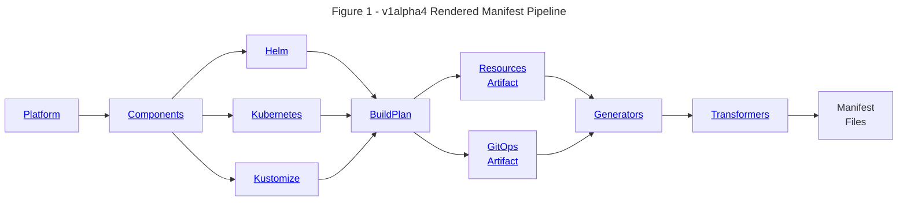

<head>
  <meta property="og:title" content="Technical Overview | Holos" />
  <meta property="og:image" content="/img/cards/technical-overview.png" />
</head>

import Tabs from '@theme/Tabs';
import TabItem from '@theme/TabItem';
import Admonition from '@theme/Admonition';

## Overview

Holos makes it easier for platform teams to integrate software into their
platform.  Existing tools in the Kubernetes ecosystem are narrowly focused on
application management.  Holos takes a holistic approach, focusing on the broad
integration layer where applications are joined into the platform.  Holos
improves cross team collaboration through well defined, typed structures at the
integration layer.  These definitions provide golden paths for other teams to
easily integrate their own services into the platform.

<!-- truncate -->

## The Problem

Platform teams need to develop and maintain significant glue code to integrate
Helm charts and YAML manifests into a platform built on Kubernetes.  This glue
code is often implemented with home grown umbrella charts and scripts.
Maintaining these charts and scripts takes time and effort that could otherwise
be spent improving the platform.  The need for each organization to develop and
maintain this glue code indicates a gap in the Kubernetes ecosystem.  Holos is a
Go command line tool leveraging [CUE] to fill this gap.

## Key Features

1. Holos enables teams to provide simple definitions for other teams to use as golden paths.
2. Define integrations in [CUE] with strong type checking.  No more text templates or bash scripts.
3. Simplify complex integration.  Order does not matter.  Validation is early and quick.
4. Reuse your existing Helm charts and Kustomize bases.
5. Implement the [rendered manifests pattern].  Changes are clearly visible platform-wide.
6. Fully render manifests to plain files.  Use your existing GitOps tools and processes.
7. Post-process with Kustomize from CUE instead of plain text files.  Customize your Kustomizations.
8. Mix in resources to Helm charts and Kustomize bases, for example ExternalSecrets.
9. Render all of Helm, Kustomize, CUE, JSON, and YAML consistently with the same process.

## Rendering Pipeline



## Use Case

One of the development teams at the fictional Bank of Holos wants to deploy a
simple web app for an experimental project they're working on.

The platform team at the bank wants to build a simple golden path for teams to
provision projects consistently and easily in compliance with the bank's
policies.

### Platform Team

The platform team builds a golden path for development teams to register their
project with the platform.  In compliance with bank policy, the platform team
needs to manage important security resources for each new project.  All of these
resources can be derived from only 3 pieces of information.

1. The name of the project the dev team is working on.
2. The name of the team who currently owns the project.
3. The services, if any, the project is exposing.

The platform team defines a structure for the dev team to register this
information.  This structure provides the golden path for the dev team.

The development team registers their experimental project, creatively named
"experiment" by submitting a pull request that contains this information.

<Tabs groupId="EB9C9AF1-F1AA-4189-B746-A5B8E3043F87">
  <TabItem value="projects/experiment.cue" label="projects/experiment.cue">
```cue showLineNumbers
package holos

// The development team registers a project name.
_Projects: experiment: {
  // The project owner must be named.
  Owner: Name: "dev-team"
  // Expose Service podinfo at https://podinfo.example.com
  Hostnames: podinfo: Port: 9898
}
```
  </TabItem>
</Tabs>

The platform team uses these three pieces of information to derive all of the
platform resources necessary to support the development team.

1. **Namespace** for the project resources.
2. **RoleBinding** to grant the dev team access to the project namespace.
3. **SecretStore** which implements the secret management policy for the bank.
4. **ReferenceGrant** to expose the project services through the Gateway API.
5. **HTTPRoutes** to expose the project services, if any.
6. **AppProject** to deploy and manage the project Applications with ArgoCD.
7. **Common Labels** to ensure every resource is labeled for resource accounting.

Rendering the platform generates fully rendered manifests for all of these
resources.  These manifests are derived from the three pieces of information the
dev team provided.

Note the platform team must manage these resources across multiple namespaces.
The first four reside in the project namespace owned by the dev team.  The
HTTPRoute and AppProject go into two namespaces managed by the platform team.
Holos makes it easier for the platform team to organize these resources into
different components with different owners.

:::important
Holos supports [CODEOWNERS] by clearly defining the teams responsible for each
platform component.
:::

<Tabs groupId="2E46EA1C-B118-44BF-AE20-752E8D1CE131">
  <TabItem value="command" label="Command">
```bash
holos render platform ./platform
```
  </TabItem>
  <TabItem value="output" label="Output">
```txt
rendered httproutes for cluster overview in 177.823625ms
rendered app-projects for cluster overview in 180.946834ms
rendered projects for cluster overview in 181.98725ms
rendered namespaces for cluster overview in 182.30725ms
rendered platform in 182.31075ms
```
:::tip
If you'd like to try this for yourself, `cd` into [examples/tech-overview] and
render the platform.
:::

  </TabItem>
</Tabs>

The fully rendered manifests are written into the `deploy/` directory organized
by cluster and component for GitOps.

<Tabs groupId="07FBE14E-E9EA-437B-9FA1-C6D8806524AD">
  <TabItem value="deploy/clusters/local/components/namespaces/namespaces.gen.yaml" label="namespaces">
```
cat deploy/clusters/local/components/namespaces/namespaces.gen.yaml
```
```yaml showLineNumbers
apiVersion: v1
kind: Namespace
metadata:
  labels:
    argocd.argoproj.io/instance: namespaces
    example.com/owner.email: sg-dev-team@example.com
    example.com/owner.name: dev-team
    example.com/project.name: experiment
    holos.run/component.name: namespaces
    kubernetes.io/metadata.name: experiment
  name: experiment
```
  </TabItem>
  <TabItem value="deploy/clusters/local/components/projects/projects.gen.yaml" label="projects">
```
cat deploy/clusters/local/components/projects/projects.gen.yaml
```
```yaml showLineNumbers
apiVersion: rbac.authorization.k8s.io/v1
kind: RoleBinding
metadata:
  labels:
    argocd.argoproj.io/instance: projects
    example.com/owner.email: sg-dev-team@example.com
    example.com/owner.name: dev-team
    example.com/project.name: experiment
    holos.run/component.name: projects
  name: admin
  namespace: experiment
roleRef:
  apiGroup: rbac.authorization.k8s.io
  kind: ClusterRole
  name: admin
subjects:
- apiGroup: rbac.authorization.k8s.io
  kind: Group
  name: oidc:sg-dev-team@example.com
---
apiVersion: external-secrets.io/v1beta1
kind: SecretStore
metadata:
  labels:
    argocd.argoproj.io/instance: projects
    example.com/owner.email: sg-dev-team@example.com
    example.com/owner.name: dev-team
    example.com/project.name: experiment
    holos.run/component.name: projects
  name: default
  namespace: experiment
spec:
  provider:
    kubernetes:
      auth:
        token:
          bearerToken:
            key: token
            name: eso-reader
      remoteNamespace: experiment
      server:
        caBundle: LS0tLS1CRUd...QVRFLS0tLS0K
        url: https://management.example.com:6443
---
apiVersion: gateway.networking.k8s.io/v1beta1
kind: ReferenceGrant
metadata:
  labels:
    argocd.argoproj.io/instance: projects
    example.com/owner.email: sg-dev-team@example.com
    example.com/owner.name: dev-team
    example.com/project.name: experiment
    holos.run/component.name: projects
  name: istio-ingress
  namespace: experiment
spec:
  from:
  - group: gateway.networking.k8s.io
    kind: HTTPRoute
    namespace: istio-ingress
  to:
  - group: ""
    kind: Service
```
  </TabItem>
  <TabItem value="deploy/clusters/local/components/httproutes/httproutes.gen.yaml" label="httproutes">
```
cat deploy/clusters/local/components/httproutes/httproutes.gen.yaml
```
```yaml showLineNumbers
apiVersion: gateway.networking.k8s.io/v1
kind: HTTPRoute
metadata:
  labels:
    argocd.argoproj.io/instance: httproutes
    example.com/owner.email: sg-dev-team@example.com
    example.com/owner.name: dev-team
    example.com/project.name: experiment
    holos.run/component.name: httproutes
  name: podinfo.example.com
  namespace: istio-ingress
spec:
  hostnames:
  - podinfo.example.com
  parentRefs:
  - name: default
    namespace: istio-ingress
  rules:
  - backendRefs:
    - name: podinfo
      namespace: experiment
      port: 9898
    matches:
    - path:
        type: PathPrefix
        value: /
```
  </TabItem>
</Tabs>

The rendered manifests are derived from the project registration information by
definitions implemented by the platform team.  The [Author API] provides a
[Project] schema, but does not define an implementation.  The platform team
implements the [Project] schema by adding a `_Projects` struct to manage
resources according to bank policies.

:::important
The Author API is intended as a convenient, ergonomic reference for component
authors.  Definitions **are not** confined to the Author API.
:::

The following example shows how the platform team wrote the `_Projects`
definition to derive the Namespace from the project registration provided by the
dev team.

<Tabs groupId="5732727B-295E-46E1-B851-F8A1C5D7DF88">
  <TabItem value="projects/platform/components/namespaces/namespaces.cue" label="Namespaces Component">
```txt
projects/platform/components/namespaces/namespaces.cue
```
```cue showLineNumbers
package holos

_Kubernetes: #Kubernetes & {
	Name: "namespaces"
	Resources: Namespace: _Namespaces
}

// Produce a kubernetes objects build plan.
_Kubernetes.BuildPlan
```

1. This is the namespaces component which manages a collection of Namespace resources derived from the project registration data shown in the second tab.
2. Line 5 manages a Namespace for each value of the `#Namespaces` struct.  See the second tab for how the platform team defines this structure.
  </TabItem>
  <TabItem value="projects/projects.cue" label="Projects Definition">
```txt
projects/projects.cue
```
```cue showLineNumbers
package holos

import api "github.com/holos-run/holos/api/author/v1alpha4"

// Projects defines the structure other teams register with to manage project
// resources.  The platform team defines the schema, development teams provide
// the values.
_Projects: api.#Projects & {
	[NAME=string]: {
		Name: NAME
		// The platform team requires the development teams to indicate an owner of
		// the project.
		Owner: Name: string
		// The default value for the owner email address is derived from the owner
		// name, but development teams can provide a different email address if
		// needed.
		Owner: Email: string | *"sg-\(Owner.Name)@\(_Organization.Domain)"
		// The platform team constrains the project to a single namespace.
		Namespaces: close({(NAME): Name: NAME})
		// The platform team constrains the exposed services to the project
		// namespace.
		Hostnames: [HOST=string]: {
			Name:      HOST
			Namespace: Namespaces[NAME].Name
			Service:   HOST
			Port:      number | *80
		}

		CommonLabels: {
			"\(_Organization.Domain)/project.name": Name
			"\(_Organization.Domain)/owner.name":   Owner.Name
			"\(_Organization.Domain)/owner.email":  Owner.Email
		}
	}
}

for Project in _Projects {
	// Register project namespaces with the namespaces component.
	_Namespaces: {
		for Namespace in Project.Namespaces {
			(Namespace.Name): metadata: labels: Project.CommonLabels
		}
	}
}
```

1. On lines 8-35 the platform team derives most fields from the project name (line 9), and the owner name (line 13).  The purpose is to fill in the remaining fields defined by the Author API.
2. Line 13 The dev team is expected to provide a concrete owner name, indicated by the `string` value.
3. Line 17 The platform team provides a default value for the email address.  The project team may define a different value.
4. Line 19 The Author API allows a project to have many namespaces.  The platform team constrains this down to one namespace per project by closing the struct.  The namespace name must be the same as the project name.
5. Lines 22-27 The platform team derives values for a Gateway API [BackendObjectReference] from the hostname provided by the project team.  These values are used later to build HTTPRoutes to expose their service.
6. Lines 30-32 Common labels are derived to mix into resources associated with this project.
7. Lines 37-44 The platform team adds a namespace with common labels for each project to the struct we saw in the first tab.

  </TabItem>
</Tabs>

The RoleBinding, SecretScore, and ReferenceGrant are managed in the
[projects](https://github.com/holos-run/bank-of-holos/blob/v0.4.1/examples/tech-overview/projects/platform/components/projects/projects.cue)
component, similar to the previous namespaces example.
The HTTPRoute is managed separately in the
[httproutes](https://github.com/holos-run/bank-of-holos/blob/v0.4.1/examples/tech-overview/projects/platform/components/httproutes/httproutes.cue)
component.

All components are registered with the platform in the
[platform](https://github.com/holos-run/bank-of-holos/tree/v0.4.1/examples/tech-overview/platform)
directory.

:::important
Multiple components, potentially owned by different teams, derive fully rendered
resources from the same three project values.  The dev team added these three
values to the `_Projects` struct.  The platform team wrote the definition to
integrate software according to bank policies.  CUE powers this _unified_
platform configuration model.
:::

:::tip
Components map 1:1 to ArgoCD Applications or Flux Kustomizations.
:::

### Development Team

The development team has the platform resources they need, but they still need
to deploy their container.  The development team submits a pull request adding
the following two files to deploy their existing Helm chart.

<Tabs groupId="7AD1DDA9-8001-462B-8BE0-D9410EB51233">
  <TabItem value="projects/experiment/components/podinfo/podinfo.cue" label="Helm Component">
```txt
projects/experiment/components/podinfo/podinfo.cue
```
```cue showLineNumbers
package holos

// Produce a helm chart build plan.
_HelmChart.BuildPlan

_HelmChart: #Helm & {
	Name: "podinfo"
	Chart: {
		version: "6.6.2"
		repository: {
			name: "podinfo"
			url:  "https://stefanprodan.github.io/podinfo"
		}
	}
}
```
This file represents a Helm chart component to add to the platform.  The second
tab registers this component with the platform.
  </TabItem>
  <TabItem value="platform/podinfo.cue" label="Component Registration">
```
platform/podinfo.cue
```
```cue showLineNumbers
package holos

// Manage the component on every workload Cluster, but not management clusters.
for Cluster in _Fleets.workload.clusters {
	_Platform: Components: "\(Cluster.name):podinfo": {
		name:      "podinfo"
		component: "projects/experiment/components/podinfo"
		cluster:   Cluster.name
		tags: project: "experiment"
	}
}
```
This file registers the component with the platform.  When the platform is
rendered the dev team's Helm chart will be rendered on all workload clusters
across the platform.
  </TabItem>
</Tabs>

The project tag links the component to the same field of the `_Projects` struct.

:::important
You can add your own key=value tags in your platform specification to inject
values into components.  This feature is useful to reuse one component path for
several environments or customers.
:::

Once the dev team's component is registered, rendering the platform will render
their component.

<Tabs groupId="1BAF7AD2-BBCD-4797-A3A6-55A626732845">
  <TabItem value="command" label="Command">
```bash
holos render platform ./platform
```
  </TabItem>
  <TabItem value="output" label="Output">
```txt
rendered namespaces for cluster overview in 185.64075ms
rendered app-projects for cluster overview in 186.729292ms
rendered httproutes for cluster overview in 195.222833ms
rendered projects for cluster overview in 195.217125ms
// highlight-next-line
rendered podinfo for cluster overview in 195.830042ms
rendered platform in 195.90275ms
```
  </TabItem>
</Tabs>

<Tabs groupId="77BF500B-105A-4AB4-A615-DEC19F501AE1">
  <TabItem value="command" label="Command">
```bash
cat deploy/clusters/local/components/podinfo/podinfo.gen.yaml
```
  </TabItem>
  <TabItem value="output" label="Output">
```yaml showLineNumbers
apiVersion: v1
kind: Service
metadata:
  labels:
    app.kubernetes.io/managed-by: Helm
    app.kubernetes.io/name: podinfo
    app.kubernetes.io/version: 6.6.2
    argocd.argoproj.io/instance: podinfo
    example.com/owner.email: sg-dev-team@example.com
    example.com/owner.name: dev-team
    example.com/project.name: experiment
    helm.sh/chart: podinfo-6.6.2
    holos.run/component.name: podinfo
  name: podinfo
spec:
  ports:
  - name: http
    port: 9898
    protocol: TCP
    targetPort: http
  - name: grpc
    port: 9999
    protocol: TCP
    targetPort: grpc
  selector:
    app.kubernetes.io/name: podinfo
    argocd.argoproj.io/instance: podinfo
    example.com/owner.email: sg-dev-team@example.com
    example.com/owner.name: dev-team
    example.com/project.name: experiment
    holos.run/component.name: podinfo
  type: ClusterIP
---
apiVersion: apps/v1
kind: Deployment
metadata:
  labels:
    app.kubernetes.io/managed-by: Helm
    app.kubernetes.io/name: podinfo
    app.kubernetes.io/version: 6.6.2
    argocd.argoproj.io/instance: podinfo
    example.com/owner.email: sg-dev-team@example.com
    example.com/owner.name: dev-team
    example.com/project.name: experiment
    helm.sh/chart: podinfo-6.6.2
    holos.run/component.name: podinfo
  name: podinfo
spec:
  replicas: 1
  selector:
    matchLabels:
      app.kubernetes.io/name: podinfo
      argocd.argoproj.io/instance: podinfo
      example.com/owner.email: sg-dev-team@example.com
      example.com/owner.name: dev-team
      example.com/project.name: experiment
      holos.run/component.name: podinfo
  strategy:
    rollingUpdate:
      maxUnavailable: 1
    type: RollingUpdate
  template:
    metadata:
      annotations:
        prometheus.io/port: "9898"
        prometheus.io/scrape: "true"
      labels:
        app.kubernetes.io/name: podinfo
        argocd.argoproj.io/instance: podinfo
        example.com/owner.email: sg-dev-team@example.com
        example.com/owner.name: dev-team
        example.com/project.name: experiment
        holos.run/component.name: podinfo
    spec:
      containers:
      - command:
        - ./podinfo
        - --port=9898
        - --cert-path=/data/cert
        - --port-metrics=9797
        - --grpc-port=9999
        - --grpc-service-name=podinfo
        - --level=info
        - --random-delay=false
        - --random-error=false
        env:
        - name: PODINFO_UI_COLOR
          value: '#34577c'
        image: ghcr.io/stefanprodan/podinfo:6.6.2
        imagePullPolicy: IfNotPresent
        livenessProbe:
          exec:
            command:
            - podcli
            - check
            - http
            - localhost:9898/healthz
          failureThreshold: 3
          initialDelaySeconds: 1
          periodSeconds: 10
          successThreshold: 1
          timeoutSeconds: 5
        name: podinfo
        ports:
        - containerPort: 9898
          name: http
          protocol: TCP
        - containerPort: 9797
          name: http-metrics
          protocol: TCP
        - containerPort: 9999
          name: grpc
          protocol: TCP
        readinessProbe:
          exec:
            command:
            - podcli
            - check
            - http
            - localhost:9898/readyz
          failureThreshold: 3
          initialDelaySeconds: 1
          periodSeconds: 10
          successThreshold: 1
          timeoutSeconds: 5
        resources:
          limits: null
          requests:
            cpu: 1m
            memory: 16Mi
        volumeMounts:
        - mountPath: /data
          name: data
      terminationGracePeriodSeconds: 30
      volumes:
      - emptyDir: {}
        name: data
```
  </TabItem>
</Tabs>

Note the rendered Helm chart resources have consistent project labels.  The
platform team added a constraint to the project so all Helm charts are post
processed with Kustomize to add these common labels.  The platform team
accomplishes this by adding a constraint in the project directory.  This can be
seen in
[schema.cue](https://github.com/holos-run/bank-of-holos/blob/v0.4.1/schema.cue#L35-L38)
where the platform team configures all component kinds for the platform.

We've covered how the platform team provides a golden path for development teams
to register their projects by defining a Projects structure.  We've also covered
how the development team deploys their existing Helm chart onto the platform.

## Support & Resources

1. See our [Quickstart] guide to get started with Holos.
2. Check out our other [Guides] which cover specific topics.
3. Refer to the [Author API] when writing components.
4. Consider the [Core API] if you need to do something more advanced than the Author API supports.
5. Community and commercial [Support] is available.
6. [Discussions Forum](https://github.com/holos-run/holos/discussions)

[Support]: /docs/support/
[Guides]: /docs/guides/
[API Reference]: /docs/api/
[Quickstart]: /docs/quickstart/
[CUE]: https://cuelang.org/
[Author API]: /docs/api/author/
[Core API]: /docs/api/core/
[Open Infrastructure Services]: https://openinfrastructure.co/
[Why are we templating YAML]: https://hn.algolia.com/?dateRange=all&page=0&prefix=false&query=https%3A%2F%2Fleebriggs.co.uk%2Fblog%2F2019%2F02%2F07%2Fwhy-are-we-templating-yaml&sort=byDate&type=story
[Holos]: https://holos.run/
[Quickstart]: /docs/quickstart/
[rendered manifests pattern]: https://akuity.io/blog/the-rendered-manifests-pattern/
[examples/tech-overview]: https://github.com/holos-run/bank-of-holos/tree/v0.2.0/examples/tech-overview
[BackendObjectReference]: https://gateway-api.sigs.k8s.io/reference/spec/#gateway.networking.k8s.io%2fv1.BackendObjectReference
[CODEOWNERS]: https://docs.github.com/en/repositories/managing-your-repositorys-settings-and-features/customizing-your-repository/about-code-owners
[Project]: /docs/api/author/v1alpha3/#Project
