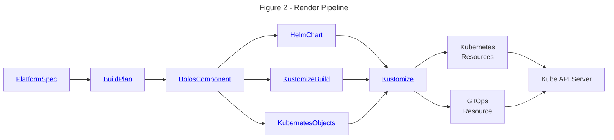

# Rendering

:::tip

This document provides a brief overview of the rendering process, a core design
element in Holos.

:::

Holos uses the Kubernetes resource model to manage configuration.  The `holos`
command line interface is the primary method you'll use to manage your platform.
Holos uses CUE to provide a unified configuration model of the platform.  This
unified configuration is built up from components packaged with Helm, Kustomize,
CUE, or any other tool that can produce Kubernetes resource manifests as output.

This process can be thought of as a data **rendering pipeline**.  The key
concept is that `holos` will always produce fully rendered output, but delegates
the _application_ of the configuration to other tools like `kubectl apply`,
ArgoCD, or Flux.

