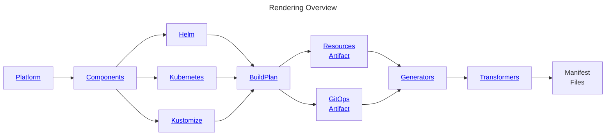

```mermaid
---
title: Rendering Overview
---
graph LR
    Platform[<a href="/docs/api/author/v1alpha4/#Platform">Platform</a>]
    Component[<a href="/docs/api/author/v1alpha4/#ComponentConfig">Components</a>]

    Helm[<a href="/docs/api/author/v1alpha4/#Helm">Helm</a>]
    Kustomize[<a href="/docs/api/author/v1alpha4/#Kustomize">Kustomize</a>]
    Kubernetes[<a href="/docs/api/author/v1alpha4/#Kubernetes">Kubernetes</a>]

    BuildPlan[<a href="/docs/api/core/v1alpha4/#buildplan">BuildPlan</a>]

    ResourcesArtifact[<a href="/docs/api/core/v1alpha4/#artifact">Resources<br/>Artifact</a>]
    GitOpsArtifact[<a href="/docs/api/core/v1alpha4/#artifact">GitOps<br/>Artifact</a>]

    Generators[<a href="/docs/api/core/v1alpha4/#generators">Generators</a>]
    Transformers[<a href="/docs/api/core/v1alpha4/#transformer">Transformers</a>]
    Files[Manifest<br/>Files]

    Platform --> Component
    Component --> Helm --> BuildPlan
    Component --> Kubernetes --> BuildPlan
    Component --> Kustomize --> BuildPlan

    BuildPlan --> ResourcesArtifact --> Generators
    BuildPlan --> GitOpsArtifact --> Generators

    Generators --> Transformers --> Files
```
