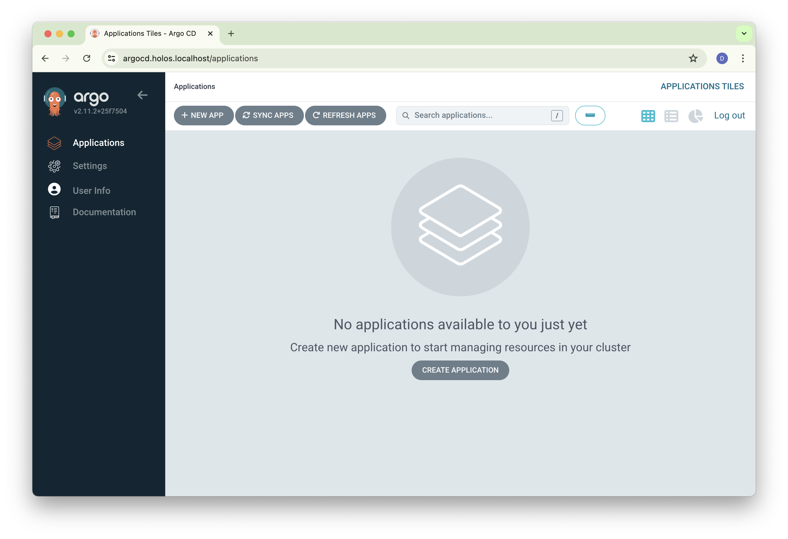
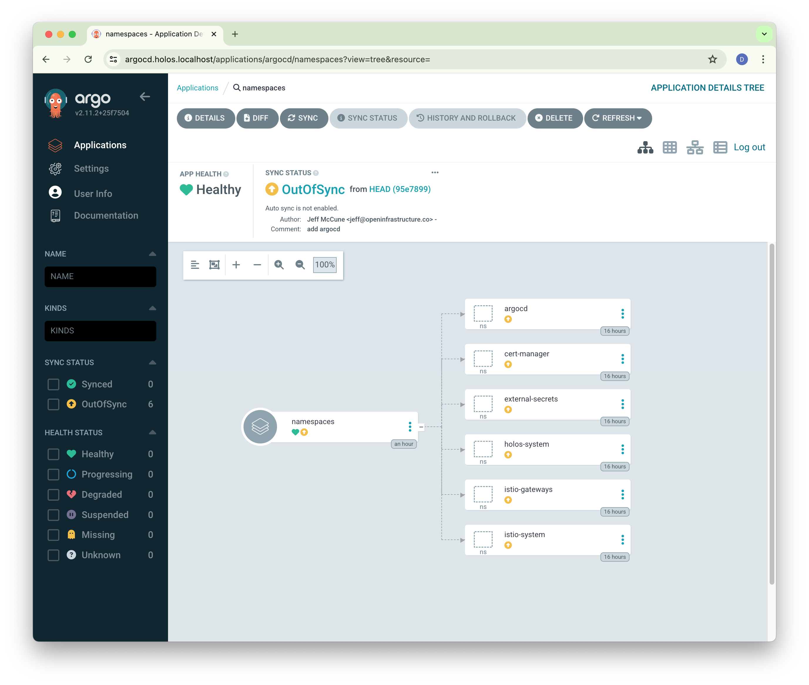
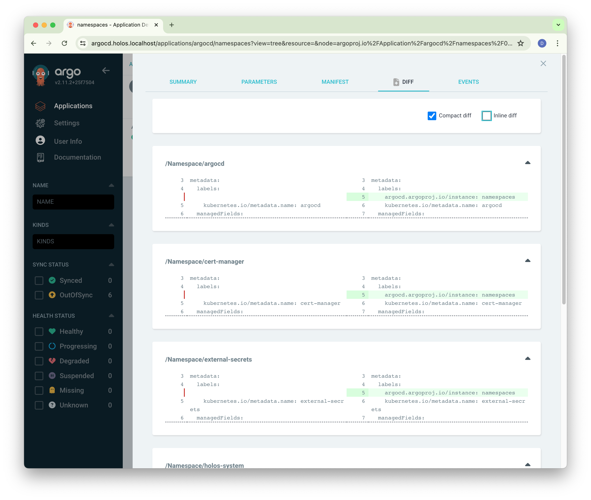
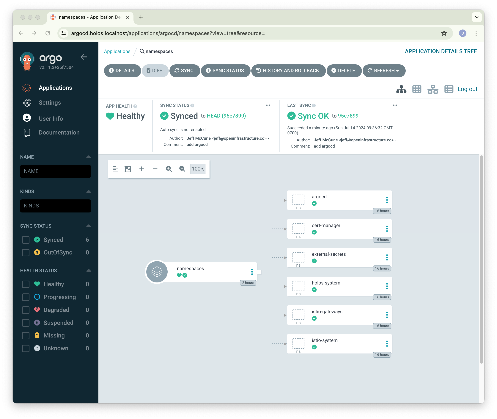

import Tabs from '@theme/Tabs';
import TabItem from '@theme/TabItem';

# ArgoCD

Learn how Holos works with ArgoCD to manage the platform.

## Repository

Holos uses a Git repository to store all configuration code and data necessary
to build the platform.

[Fork the holos-k3d](https://github.com/holos-run/holos-k3d/fork) repository and
clone it locally.  Replace the URL with your fork.

```bash
git clone https://github.com/holos-run/holos-k3d.git
cd holos-k3d
```


## Push the Git repository

This tutorial deploys ArgoCD, which needs to sync configuration from a Git
repository.  Push the repository you created to a new blank repository.  Note
that holos is designed to never store secrets in version control.

```bash
git push origin HEAD:main
```

### GitOps {#GitOps}

<Tabs groupId="registration">
  <TabItem value="registered" label="Signed In">
    **Enter the url of your `holos-k3d` GitHub fork** into the ArgoCD GIt repository URL field.

    Don't forget to submit the form.
  </TabItem>
  <TabItem value="unregistered" label="Signed Out">
    Configure the ArgoCD repoURL in the next section.
  </TabItem>
</Tabs>

### Custom Resource Definitions

```bash
kubectl apply --server-side=true -f ./deploy/clusters/workload/components/argo-crds
```

### ArgoCD

ArgoCD automatically applies resources defined in Git similar to how this guide
uses `kubectl apply`.

Apply controller deployments and supporting resources.

```bash
kubectl apply --server-side=true -f ./deploy/clusters/workload/components/argo-cd
kubectl apply --server-side=true -f ./deploy/clusters/workload/components/argo-authpolicy
kubectl apply --server-side=true -f ./deploy/clusters/workload/components/argo-routes
```

Verify all Pods are running and all containers are ready.

```bash
kubectl get pods -n argocd
```

```txt
NAME                                                READY   STATUS      RESTARTS   AGE
argocd-application-controller-0                     1/1     Running     0          10s
argocd-applicationset-controller-578db65fcd-lnn76   1/1     Running     0          10s
argocd-notifications-controller-67c856dbb7-12stk    1/1     Running     0          10s
argocd-redis-698f57d9b9-v4kqs                       1/1     Running     0          10s
argocd-redis-secret-init-z5zg8                      0/1     Completed   0          10s
argocd-repo-server-69f78dfb8-f6pb7                  1/1     Running     0          10s
argocd-server-58f7f4466d-db5fv                      2/2     Running     0          10s
```

:::important

Browse to [https://argocd.holos.localhost/](https://argocd.holos.localhost/) to access ArgoCD.

:::

<Tabs groupId="registration">
  <TabItem value="registered" label="Signed In">
    ArgoCD is configured to authenticate using the Holos identity provider.

    

    Login using the SSO button and verify you get to the Applications page.

    
  </TabItem>
  <TabItem value="unregistered" label="Signed Out">
    ArgoCD is configured to allow anonymous users.  Note, the platform
    authorization policy allows requests only if the `User-Agent: anonymous`
    header is set.

    
  </TabItem>
</Tabs>

:::note

Both the platform layer and the ArgoCD application layer perform authentication
and authorization using the same identity provider.  The Zero Trust model
provides additional layers of security.

:::

### ArgoCD Applications

Apply the Application resources for all of the Holos components that compose the
platform.  The Application resources provide drift detection and optional
automatic reconciliation of platform components.

```bash
kubectl apply --server-side=true -f deploy/clusters/workload/gitops
```

Browse to or refresh [https://argocd.holos.localhost/applications](https://argocd.holos.localhost/applications).


:::important

If you do not see any applications after refreshing the page ensure the `sub`
value in the Platform Model (`platform.config.json`) is correct and matches
`holos login --print-claims`.

:::

### Sync Applications

Navigate to the [namespaces Application](https://argocd.holos.localhost/applications/argocd/namespaces).



Review the differences between the live platform and the git configuration.



Sync the application to reconcile the differences.


The Holos components should report Sync OK.



:::tip

Automatic reconciliation is turned off by default.

:::

Enable automatic reconciliation for all `Application` resources holos produces
by adjusting the `#Argo` definition.

Add the following to `buildplan.site.cue`.  The new file avoids over-writes in
case you run `holos generate platform k3d` again.

CUE merges definitions located in multiple files.  Holos uses this feature to
customize the platform without conflicts at the file level.

```bash
cat <<EOF > buildplan.site.cue
package holos

#Argo: Application: spec: syncPolicy: #ArgoDefaultSyncPolicy
EOF
```

Re-render the platform.

```bash
holos render platform ./platform
```

Add and commit the changes.

```bash
git add .
git commit -m 'enable argocd automatic sync'
git push origin HEAD
```

Apply the new changes.

```bash
kubectl apply --server-side=true -f deploy/clusters/workload/gitops
```

Automatic reconciliation is enabled for all platform components.


