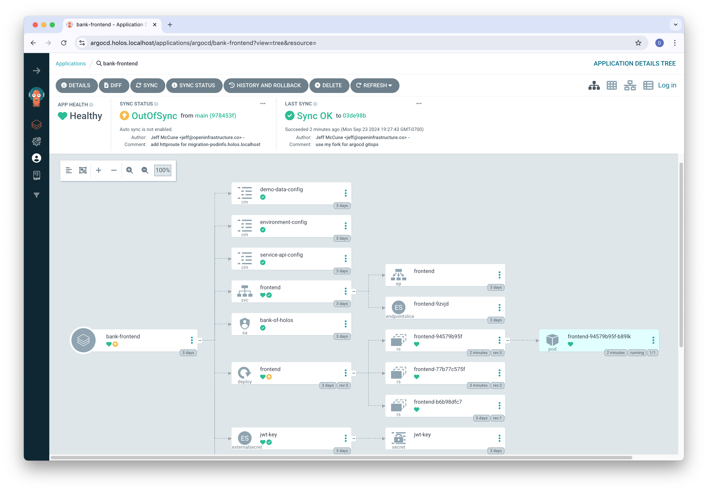
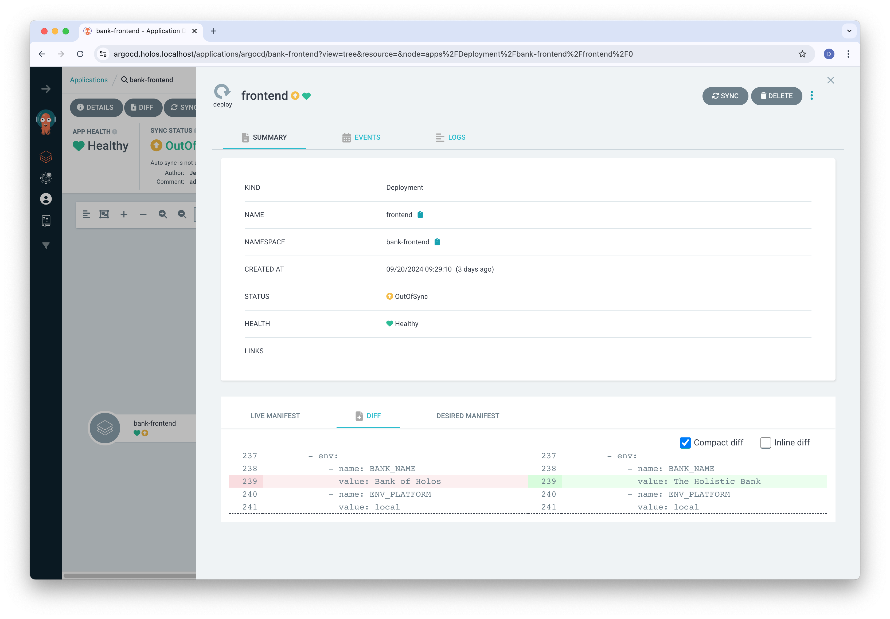

import Tabs from '@theme/Tabs';
import TabItem from '@theme/TabItem';
import Admonition from '@theme/Admonition';

# Change a Service

In this guide we'll explore how Holos helps the frontend development team at the
[Bank of Holos] reconfigures a service they've already deployed.  In doing so,
we'll see how simple configuration configuration changes are safer with type
checking, and how rendering the complete platform provides clear visibility into
changes.

We'll build on the concepts we learned in the [Quickstart] and [Deploy a
Service] guides.

## What you'll need {#requirements}

Like our other guides, this guide is intended to be useful without needing to
run the commands.  If you'd like to render the platform and apply the manifests
to a real Cluster, complete the [Local Cluster
Guide](/docs/guides/local-cluster) before this guide.

You'll need the following tools installed to run the commands in this guide.

1. [holos](/docs/install) - to build the Platform.
2. [helm](https://helm.sh/docs/intro/install/) - to render Holos Components that
wrap Helm charts.
3. [kubectl](https://kubernetes.io/docs/tasks/tools/) - to render Holos
Components that render with Kustomize.

## Fork the Git Repository

If you haven't already done so, [fork the Bank of
Holos](https://github.com/holos-run/bank-of-holos/fork) then clone the
repository to your local machine.

<Tabs groupId="git-clone">
  <TabItem value="command" label="Command">
```bash
# Change YourName
git clone https://github.com/YourName/bank-of-holos
cd bank-of-holos
```
  </TabItem>
  <TabItem value="output" label="Output">
```txt
Cloning into 'bank-of-holos'...
remote: Enumerating objects: 1177, done.
remote: Counting objects: 100% (1177/1177), done.
remote: Compressing objects: 100% (558/558), done.
remote: Total 1177 (delta 394), reused 1084 (delta 303), pack-reused 0 (from 0)
Receiving objects: 100% (1177/1177), 2.89 MiB | 6.07 MiB/s, done.
Resolving deltas: 100% (394/394), done.
```
  </TabItem>
</Tabs>

Run the rest of the commands in this guide from the root of the repository.

If you plan to apply the changes we make, you can delete and re-create your
local platform synced to the start of this guide.

```bash
./scripts/reset-cluster
```

Then apply the current manifests with.

```bash
./scripts/apply
```


## Rename the Bank

Let's imagine the bank recently re-branded from The Bank of Holos to The
Holistic Bank.  The software development team responsible for the front end
website needs to update the branding accordingly.

Let's explore how Holos catches errors early, before they land in production,
then guides the team to the correct place to make a change.

The bank front end web service is managed by the
`projects/bank-of-holos/frontend/components/bank-frontend/` component which
refers to the organization display name in `schema.gen.cue`.

<Tabs groupId="F5B546EB-566F-4B83-84C3-C55B40F55555">
  <TabItem value="schema.gen.cue" label="schema.gen.cue">
```cue showLineNumbers
package holos

import api "github.com/holos-run/holos/api/author/v1alpha3"

// Define the default organization name
// highlight-next-line
#Organization: DisplayName: string | *"Bank of Holos"
#Organization: Name:        string | *"bank-of-holos"

#Organization: api.#OrganizationStrict
#Platform:     api.#Platform
#Fleets:       api.#StandardFleets

_ComponentConfig: {
  Resources:  #Resources
  ArgoConfig: #ArgoConfig
}

#Helm:       api.#Helm & _ComponentConfig
#Kustomize:  api.#Kustomize & _ComponentConfig
#Kubernetes: api.#Kubernetes & _ComponentConfig

#ArgoConfig: api.#ArgoConfig & {
  ClusterName: _ClusterName
}
```
  </TabItem>
  <TabItem value="projects/bank-of-holos/frontend/components/bank-frontend/bank-frontend.cue" label="projects/bank-of-holos/frontend/components/bank-frontend/bank-frontend.cue">
```cue showLineNumbers
package holos

// Produce a kubernetes objects build plan.
(#Kubernetes & Objects).BuildPlan

let Objects = {
  Name:      "bank-frontend"
  Namespace: #BankOfHolos.Frontend.Namespace

  // Ensure resources go in the correct namespace
  Resources: [_]: [_]: metadata: namespace: Namespace

  // https://github.com/GoogleCloudPlatform/bank-of-anthos/blob/release/v0.6.5/kubernetes-manifests/frontend.yaml
  Resources: {
    Service: frontend: {
      metadata: name: "frontend"
      metadata: labels: {
        application: "bank-of-holos"
        environment: "development"
        team:        "frontend"
        tier:        "web"
      }
      spec: {
        selector: {
          app:         "frontend"
          application: "bank-of-holos"
          environment: "development"
          team:        "frontend"
          tier:        "web"
        }
        _ports: http: {
          name:       "http"
          port:       80
          targetPort: 8080
          protocol:   "TCP"
        }
        ports: [for x in _ports {x}]
      }
    }

    Deployment: frontend: {
      metadata: name: "frontend"
      metadata: labels: {
        application: "bank-of-holos"
        environment: "development"
        team:        "frontend"
        tier:        "web"
      }
      spec: {
        selector: matchLabels: {
          app:         "frontend"
          application: "bank-of-holos"
          environment: "development"
          team:        "frontend"
          tier:        "web"
        }
        template: {
          metadata: labels: {
            app:         "frontend"
            application: "bank-of-holos"
            environment: "development"
            team:        "frontend"
            tier:        "web"
          }
          spec: {
            securityContext: {
              seccompProfile: type: "RuntimeDefault"
              fsGroup:      1000
              runAsGroup:   1000
              runAsNonRoot: true
              runAsUser:    1000
            }
            serviceAccountName:            "bank-of-holos"
            terminationGracePeriodSeconds: 5
            containers: [{
              env: [{
                name:  "BANK_NAME"
                // highlight-next-line
                value: #Organization.DisplayName
              }, {
                name:  "ENV_PLATFORM"
                value: "local"
              }, {
                name:  "VERSION"
                value: "v0.6.5"
              }, {
                name:  "PORT"
                value: "8080"
              }, {
                name:  "ENABLE_TRACING"
                value: "false"
              }, {
                name:  "SCHEME"
                value: "https"
              }, {
                name:  "LOG_LEVEL"
                value: "info"
              }, {
                name: "DEFAULT_USERNAME"
                valueFrom: configMapKeyRef: {
                  key:  "DEMO_LOGIN_USERNAME"
                  name: "demo-data-config"
                }
              }, {
                name: "DEFAULT_PASSWORD"
                valueFrom: configMapKeyRef: {
                  key:  "DEMO_LOGIN_PASSWORD"
                  name: "demo-data-config"
                }
              }, {
                name: "REGISTERED_OAUTH_CLIENT_ID"
                valueFrom: configMapKeyRef: {
                  key:      "DEMO_OAUTH_CLIENT_ID"
                  name:     "oauth-config"
                  optional: true
                }
              }, {
                name: "ALLOWED_OAUTH_REDIRECT_URI"
                valueFrom: configMapKeyRef: {
                  key:      "DEMO_OAUTH_REDIRECT_URI"
                  name:     "oauth-config"
                  optional: true
                }
              }]
              envFrom: [{
                configMapRef: name: "environment-config"
              }, {
                configMapRef: name: "service-api-config"
              }]
              image: "us-central1-docker.pkg.dev/bank-of-anthos-ci/bank-of-anthos/frontend:v0.6.5@sha256:d72050f70d12383e4434ad04d189b681dc625f696087ddf0b5df641645c9dafa"
              livenessProbe: {
                httpGet: {
                  path: "/ready"
                  port: 8080
                }
                initialDelaySeconds: 60
                periodSeconds:       15
                timeoutSeconds:      30
              }
              name: "front"
              readinessProbe: {
                httpGet: {
                  path: "/ready"
                  port: 8080
                }
                initialDelaySeconds: 10
                periodSeconds:       5
                timeoutSeconds:      10
              }
              resources: {
                limits: {
                  cpu:    "250m"
                  memory: "128Mi"
                }
                requests: {
                  cpu:    "100m"
                  memory: "64Mi"
                }
              }
              securityContext: {
                allowPrivilegeEscalation: false
                capabilities: drop: ["all"]
                privileged:             false
                readOnlyRootFilesystem: true
              }
              volumeMounts: [{
                mountPath: "/tmp"
                name:      "tmp"
              }, {
                mountPath: "/tmp/.ssh"
                name:      "publickey"
                readOnly:  true
              }]
            }]
            volumes: [
              {
                emptyDir: {}
                name: "tmp"
              },
              {
                name: "publickey"
                secret: {
                  items: [{key: "jwtRS256.key.pub", path: "publickey"}]
                  secretName: "jwt-key"
                }
              },
            ]
          }
        }
      }
    }

    // Allow HTTPRoutes in the ingress gateway namespace to reference Services
    // in this namespace.
    ReferenceGrant: grant: #ReferenceGrant & {
      metadata: namespace: Namespace
    }

    // Include shared resources
    #BankOfHolos.Resources
  }
}
```
  </TabItem>
</Tabs>

Line 6 of the schema cue file defines the _default_ display name by using
`string | *"..."`.  In CUE, the asterisk denotes a [default value].

Line 78 of the bank-frontend cue file refers to `#Organization.DisplayName` to
configure the front end web container.

Let's change the name of the bank by defining a new name at the root of the
configuration.  Create `projects/organization.cue` with the following content.

<Tabs groupId="B386181F-EBE7-469D-8CB5-37631067669B">
  <TabItem value="projects/organization.cue" label="projects/organization.cue">
```cue showLineNumbers
package holos

#Organization: DisplayName: "The Holistic-Bank"
```
  </TabItem>
</Tabs>

Let's render the platform and see if this changes the name.

<Tabs groupId="A014333C-3271-4C22-87E6-2B7BF898EA3E">
  <TabItem value="command" label="Command">
```bash
holos render platform ./platform
```
  </TabItem>
  <TabItem value="output" label="Output">
```txt
#Organization.DisplayName: 2 errors in empty disjunction:
#Organization.DisplayName: conflicting values "Bank of Holos" and "The Holistic-Bank":
    /bank-of-holos/projects/organization.cue:3:29
    /bank-of-holos/schema.gen.cue:6:39
// highlight-next-line
#Organization.DisplayName: invalid value "The Holistic-Bank" (out of bound =~"^[0-9A-Za-z][0-9A-Za-z ]{2,61}[0-9A-Za-z]$"):
    /bank-of-holos/cue.mod/gen/github.com/holos-run/holos/api/author/v1alpha3/definitions_go_gen.cue:203:25
    /bank-of-holos/cue.mod/gen/github.com/holos-run/holos/api/author/v1alpha3/definitions_go_gen.cue:188:15
    /bank-of-holos/cue.mod/gen/github.com/holos-run/holos/api/author/v1alpha3/definitions_go_gen.cue:203:15
    /bank-of-holos/projects/organization.cue:3:29
    /bank-of-holos/schema.gen.cue:6:29
could not run: could not render component: exit status 1 at internal/render/platform.go:50
```
  </TabItem>
</Tabs>

Whoops, the development team defined a value that isn't allowed by the
configuration.  Someone else in the organization placed a [constraint] on the
configuration to ensure the display name contains only letters, numbers, and
spaces.

:::tip
CUE provides clear visibility where to start looking to resolve conflicts.  Each
file and line number listed is a place the `#Organization.DisplayName` field is
defined.
:::

Let's try again, this time replacing the hyphen with a space.

<Tabs groupId="F93B34FA-C0C6-4793-A32F-DAD094403208">
  <TabItem value="projects/organization.cue" label="projects/organization.cue">
```cue showLineNumbers
package holos

#Organization: DisplayName: "The Holistic Bank"
```
  </TabItem>
</Tabs>

<Tabs groupId="5FD68778-476A-4F82-8817-71CEE205216E">
  <TabItem value="command" label="Command">
```bash
holos render platform ./platform
```
  </TabItem>
  <TabItem value="output" label="Output">
```txt
rendered bank-ledger-db for cluster workload in 139.863625ms
rendered bank-accounts-db for cluster workload in 151.74875ms
rendered bank-balance-reader for cluster workload in 154.356083ms
rendered bank-ledger-writer for cluster workload in 161.209541ms
rendered bank-userservice for cluster workload in 163.373417ms
rendered bank-backend-config for cluster workload in 179.271208ms
rendered bank-secrets for cluster workload in 204.35625ms
rendered gateway for cluster workload in 118.707583ms
rendered httproutes for cluster workload in 140.981541ms
rendered bank-transaction-history for cluster workload in 156.066875ms
rendered bank-frontend for cluster workload in 300.102292ms
rendered bank-contacts for cluster workload in 159.89625ms
rendered cni for cluster workload in 150.754458ms
rendered istiod for cluster workload in 222.922625ms
rendered app-projects for cluster workload in 118.422792ms
rendered ztunnel for cluster workload in 142.840625ms
rendered cert-manager for cluster workload in 190.938834ms
rendered base for cluster workload in 340.679416ms
rendered local-ca for cluster workload in 107.120334ms
rendered external-secrets for cluster workload in 145.020834ms
rendered argocd for cluster workload in 299.690917ms
rendered namespaces for cluster workload in 115.862334ms
rendered gateway-api for cluster workload in 225.783833ms
rendered external-secrets-crds for cluster workload in 339.741166ms
rendered crds for cluster workload in 421.849041ms
rendered platform in 718.015959ms
```
  </TabItem>
</Tabs>

Great, the platform rendered successfully so we know the display name is valid
according to the constraints.  Let's see if the new display name value updated
the configuration for the bank frontend.

<Tabs groupId="6C068651-2061-4262-BE1E-7BB3E7EB66CB">
  <TabItem value="command" label="Command">
```bash
git status
```
  </TabItem>
  <TabItem value="output" label="Output">
```txt
On branch main
Your branch and 'jeffmccune/main' have diverged,
and have 2 and 4 different commits each, respectively.
  (use "git pull" to merge the remote branch into yours)

Changes not staged for commit:
  (use "git add <file>..." to update what will be committed)
  (use "git restore <file>..." to discard changes in working directory)
        // highlight-next-line
        modified:   deploy/clusters/workload/components/app-projects/app-projects.gen.yaml
        modified:   deploy/clusters/workload/components/bank-frontend/bank-frontend.gen.yaml

Untracked files:
  (use "git add <file>..." to include in what will be committed)
        projects/organization.cue

no changes added to commit (use "git add" and/or "git commit -a")
```
  </TabItem>
</Tabs>

<Tabs groupId="4A20831E-461B-4EDE-8F6E-E73C3AEC12DB">
  <TabItem value="command" label="Command">
```bash
git diff
```
  </TabItem>
  <TabItem value="output" label="Output">
```diff
diff --git a/deploy/clusters/workload/components/app-projects/app-projects.gen.yaml b/deploy/clusters/workload/components/app-projects/app-projects.gen.yaml
index 7914756..250c660 100644
--- a/deploy/clusters/workload/components/app-projects/app-projects.gen.yaml
+++ b/deploy/clusters/workload/components/app-projects/app-projects.gen.yaml
@@ -9,7 +9,7 @@ spec:
   clusterResourceWhitelist:
     - group: '*'
       kind: '*'
-  description: Holos managed AppProject for Bank of Holos
+  description: Holos managed AppProject for The Holistic Bank
   destinations:
     - namespace: '*'
       server: '*'
@@ -26,7 +26,7 @@ spec:
   clusterResourceWhitelist:
     - group: '*'
       kind: '*'
-  description: Holos managed AppProject for Bank of Holos
+  description: Holos managed AppProject for The Holistic Bank
   destinations:
     - namespace: '*'
       server: '*'
@@ -43,7 +43,7 @@ spec:
   clusterResourceWhitelist:
     - group: '*'
       kind: '*'
-  description: Holos managed AppProject for Bank of Holos
+  description: Holos managed AppProject for The Holistic Bank
   destinations:
     - namespace: '*'
       server: '*'
@@ -60,7 +60,7 @@ spec:
   clusterResourceWhitelist:
     - group: '*'
       kind: '*'
-  description: Holos managed AppProject for Bank of Holos
+  description: Holos managed AppProject for The Holistic Bank
   destinations:
     - namespace: '*'
       server: '*'
diff --git a/deploy/clusters/workload/components/bank-frontend/bank-frontend.gen.yaml b/deploy/clusters/workload/components/bank-frontend/bank-frontend.gen.yaml
index dae6f93..d41516b 100644
--- a/deploy/clusters/workload/components/bank-frontend/bank-frontend.gen.yaml
+++ b/deploy/clusters/workload/components/bank-frontend/bank-frontend.gen.yaml
@@ -71,7 +71,7 @@ spec:
       containers:
         - env:
             - name: BANK_NAME
-              value: Bank of Holos
+              value: The Holistic Bank
             - name: ENV_PLATFORM
               value: local
             - name: VERSION

```
  </TabItem>
</Tabs>

The new display name changed the frontend container, but it _also_ affected the
app-projects component.  Submitting a pull request would trigger a code review
from the platform engineering team who manages the app-projects component.
Let's see how to narrow the change down to limit the scope to the bank's user
facing services.  All of these serves are managed under
`projects/bank-of-holos/` Move the `organization.cue` file we created into this
folder to limit the scope of configuration to the the components contained within.

```bash
mv projects/organization.cue projects/bank-of-holos/
```

Render the platform and review what changed.

<Tabs groupId="0FFEC244-B59B-4136-9C82-837985DC2AB8">
  <TabItem value="command" label="Command">
```bash
holos render platform ./platform
```
  </TabItem>
  <TabItem value="output" label="Output">
```txt
rendered bank-ledger-db for cluster workload in 163.814917ms
rendered bank-accounts-db for cluster workload in 163.960208ms
rendered bank-userservice for cluster workload in 164.1625ms
rendered bank-ledger-writer for cluster workload in 169.185291ms
rendered bank-balance-reader for cluster workload in 174.5455ms
rendered bank-backend-config for cluster workload in 178.092125ms
rendered bank-secrets for cluster workload in 202.305334ms
rendered gateway for cluster workload in 122.81725ms
rendered httproutes for cluster workload in 134.121084ms
rendered bank-contacts for cluster workload in 146.4185ms
rendered bank-frontend for cluster workload in 311.35425ms
rendered bank-transaction-history for cluster workload in 160.103ms
rendered cni for cluster workload in 145.762083ms
rendered istiod for cluster workload in 216.0065ms
rendered app-projects for cluster workload in 117.684333ms
rendered ztunnel for cluster workload in 144.555292ms
rendered cert-manager for cluster workload in 178.247917ms
rendered base for cluster workload in 336.679ms
rendered external-secrets for cluster workload in 142.21825ms
rendered local-ca for cluster workload in 101.249ms
rendered argocd for cluster workload in 280.54525ms
rendered namespaces for cluster workload in 106.822042ms
rendered gateway-api for cluster workload in 200.459791ms
rendered external-secrets-crds for cluster workload in 470.125833ms
rendered crds for cluster workload in 844.388666ms
rendered platform in 1.154937084s
```
  </TabItem>
</Tabs>

<Tabs groupId="DE4FEEE5-FC53-48A6-BC6F-D0EA1DBFD00C">
  <TabItem value="command" label="Command">
```bash
git diff
```
  </TabItem>
  <TabItem value="output" label="Output">
```diff
diff --git a/deploy/clusters/workload/components/bank-frontend/bank-frontend.gen.yaml b/deploy/clusters/workload/components/bank-frontend/bank-frontend.gen.yaml
index dae6f93..d41516b 100644
--- a/deploy/clusters/workload/components/bank-frontend/bank-frontend.gen.yaml
+++ b/deploy/clusters/workload/components/bank-frontend/bank-frontend.gen.yaml
@@ -71,7 +71,7 @@ spec:
       containers:
         - env:
             - name: BANK_NAME
-              value: Bank of Holos
+              value: The Holistic Bank
             - name: ENV_PLATFORM
               value: local
             - name: VERSION

```
  </TabItem>
</Tabs>

Great!  This time, the only manifest affected is our `bank-frontend.gen.yaml`.
The `BANK_NAME` environment variable will change as we expected.

Let's commit and push this change and see if it works in the platform.

<Tabs groupId="435D9C60-F841-4CF1-A947-506422E6BAC9">
  <TabItem value="command" label="Command">
```bash
git add .
git commit -m 'frontend: rename bank to The Holistic Bank'
git push
```
  </TabItem>
  <TabItem value="output" label="Output">
```txt
[main fda74ec] frontend: rename bank to The Holistic Bank
 2 files changed, 4 insertions(+), 1 deletion(-)
 create mode 100644 projects/bank-of-holos/organization.cue
```
  </TabItem>
</Tabs>

Now that we've pushed the change, let's apply the change to the platform.

## Apply the Change

Once we've pushed the change, navigate to the [bank-frontend GitOps
Application](https://argocd.holos.localhost/applications/argocd/bank-frontend?view=tree&resource=).
We can see the Deployment needs to sync to the desired state we just pushed.



Clicking on the frontend Deployment, we see the diff with the change we expect.



Sync the change, ArgoCD applies the desired configuration state to the cluster
and Kubernetes handles rolling out the updated Deployment resource.


Soon, the deployment finishes and the component is in sync again.


Finally, let's see if the name actually changed on the website.  Navigate to
https://bank.holos.localhost/.


Great!  We successfully made our change and successfully applied the changed
configuration to the platform.

- We saw how multiple teams could be impacted by defining configuration at the
`projects/` path.
- We scoped our change to only affect components within the
`projects/bank-of-holos/` path, eliminating the impact on other teams.
- We saw how CUE can be used to [constrain] values in Holos, increasing safety.
- We saw how CUE surfaces the file and line number of _every_ place to look for
where a value is defined, making it faster and easier to troubleshoot problems.

Thanks for taking the time to work through this guide.

[Quickstart]: /docs/quickstart/
[Deploy a Service]: /docs/guides/deploy-a-service/
[Change a Service]: /docs/guides/change-a-service/
[Helm]: /docs/api/author/v1alpha3/#Helm
[Kubernetes]: /docs/api/author/v1alpha3/#Kubernetes
[Kustomize]: /docs/api/author/v1alpha3/#Kustomize
[ComponentFields]: /docs/api/author/v1alpha3/#ComponentFields
[platform-files]: /docs/quickstart/#how-platform-rendering-works
[AppProject]: https://argo-cd.readthedocs.io/en/stable/user-guide/projects/
[unification operator]: https://cuelang.org/docs/reference/spec/#unification
[code-owners]: https://docs.github.com/en/repositories/managing-your-repositorys-settings-and-features/customizing-your-repository/about-code-owners
[Kustomization API]: https://github.com/kubernetes-sigs/kustomize/blob/release-kustomize-v5.2/api/types/kustomization.go#L34
[cue import]: https://cuelang.org/docs/reference/command/cue-help-import/
[cue get go]: https://cuelang.org/docs/concept/how-cue-works-with-go/
[timoni-crds]: https://timoni.sh/cue/module/custom-resources/
[HTTPRoute]: https://gateway-api.sigs.k8s.io/api-types/httproute/?h=filter
[Ingress]: https://kubernetes.io/docs/concepts/services-networking/ingress/
[hidden field]: https://cuelang.org/docs/tour/references/hidden/
[comprehension]: https://cuelang.org/docs/reference/spec/#comprehensions
[code owners]: https://docs.github.com/en/repositories/managing-your-repositorys-settings-and-features/customizing-your-repository/about-code-owners
[ReferenceGrant]: https://gateway-api.sigs.k8s.io/api-types/referencegrant/
[Local Cluster Guide]: /docs/guides/local-cluster
[Bank of Holos]: https://github.com/holos-run/bank-of-holos
[default value]: https://cuelang.org/docs/tour/types/defaults/
[constraint]: https://cuelang.org/docs/tour/basics/constraints/
