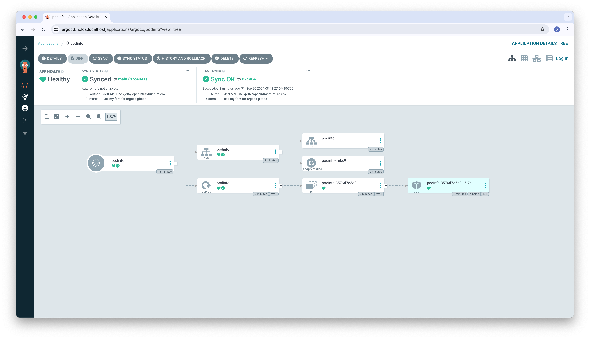
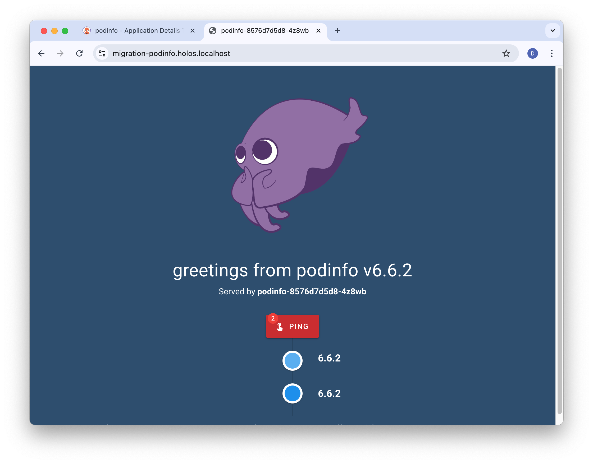

import Tabs from '@theme/Tabs';
import TabItem from '@theme/TabItem';
import Admonition from '@theme/Admonition';

# Deploy a Service

Welcome to the Holos Deploy a Service guide.  In this guide we'll explore how
Holos helps the platform team work efficiently with a migration team at the
fictional [Bank of Holos].  The migration team is responsible for migrating a
service from an acquired company onto the bank's platform.  The platform team
supports the migration team by providing safe and consistent methods to add the
service to the bank's platform.

We'll build on the concepts we learned in the [Quickstart] guide and explore how
the migration team safely integrates a Helm chart from the acquired company into
the bank's platform.  We'll also explore how the platform team uses Holos and
CUE to define consistent and safe structures for Namespaces, AppProjects, and
HTTPRoutes for the benefit of other teams. The migration team uses these
structures to integrate the Helm chart into the bank's platform safely and
consistently in a self-service way, without filing tickets or interrupting the
platform team.

## What you'll need {#requirements}

Like our other guides, this guide is intended to be useful without needing to
run the commands.  If you'd like to render the platform and apply the manifests
to a real Cluster, complete the [Local Cluster
Guide](/docs/guides/local-cluster) before this guide.

:::important
This guide relies on the concepts we covered in the [Quickstart] guide.
:::

You'll need the following tools installed to run the commands in this guide.

1. [holos](/docs/install) - to build the Platform.
2. [helm](https://helm.sh/docs/intro/install/) - to render Holos Components that
wrap Helm charts.
3. [kubectl](https://kubernetes.io/docs/tasks/tools/) - to render Holos
Components that render with Kustomize.

## Fork the Git Repository

If you haven't already done so, [fork the Bank of
Holos](https://github.com/holos-run/bank-of-holos/fork) then clone the
repository to your local machine.

<Tabs groupId="git-clone">
  <TabItem value="command" label="Command">
```bash
# Change YourName
git clone https://github.com/YourName/bank-of-holos
cd bank-of-holos
```
  </TabItem>
  <TabItem value="output" label="Output">
```txt
Cloning into 'bank-of-holos'...
remote: Enumerating objects: 1177, done.
remote: Counting objects: 100% (1177/1177), done.
remote: Compressing objects: 100% (558/558), done.
remote: Total 1177 (delta 394), reused 1084 (delta 303), pack-reused 0 (from 0)
Receiving objects: 100% (1177/1177), 2.89 MiB | 6.07 MiB/s, done.
Resolving deltas: 100% (394/394), done.
```
  </TabItem>
</Tabs>

Run the rest of the commands in this guide from the root of the repository.

## Component Kinds

As we explored in the [Quickstart] guide, the Bank of Holos is organized as a
collection of software components.  There are three kinds of components we work
with day to day:

1. [Helm] wraps a Helm chart.
2. [Kubernetes] uses CUE to produce Kubernetes resources.
3. [Kustomize] wraps a Kustomize Kustomization base.

Holos offers common functionality to every kind of component.  We can:

- **Mix-in additional resources**.  For example, an ExternalSecret to fetch a
Secret for a Helm or Kustomize component.
- **Write resource files** to accompany the rendered kubernetes manifest.  For example,
an ArgoCD Application or Flux Kustomization.
- **Post-process** the rendered manifest with Kustomize, for example to
consistently add common labels.

:::tip
[ComponentFields] in the Author API describes the fields common to all kinds of
component.
:::

We'll start with a [Helm] component to deploy the service, then compare it to a
[Kubernetes] component that deploys the same service.

## Namespaces

Let's imagine the Bank of Holos is working on a project named `migration` to
migrate services from a smaller company they've acquired onto the Bank of Holos
platform.  One of the teams at the bank will own this project during the
migration.  Once migrated, a second team will take over ownership and
maintenance.

When we start a new project, one of the first things we need is a Kubernetes
Namespace so we have a place to deploy the service, set security policies, and
keep track of resource usage with labels.

The platform team owns the `namespaces` component that manages these Namespace
resources.    The bank uses ArgoCD to deploy services with GitOps, so the
migration team also needs an ArgoCD [AppProject] managed for them.

The platform team makes it easy for other teams to register the Namespaces and
AppProjects they need by adding a new file to the repository in a self-service
way.  Imagine we're on the software development team performing the migration.
First, we'll create `projects/migration.cue` to configure the Namespace and
Project we need.

<Tabs groupId="A2411A06-3003-4BF2-AFED-1C1414DBBEA1">
  <TabItem value="projects/migration.cue" label="projects/migration.cue">
```cue showLineNumbers
package holos

// Platform wide definitions
// highlight-next-line
#Migration: Namespace: "migration"

// Register namespaces
// highlight-next-line
#Namespaces: (#Migration.Namespace): _

// Register projects
// highlight-next-line
#AppProjects: migration: _
```
  </TabItem>
</Tabs>

Each of the highlighted lines has a specific purpose.

- Line 4 defines the `#Migration` CUE struct.  The team that currently owns the
migration project defines this struct.
- Line 7 registers the namespace with the `namespaces` component owned by the
platform team.  The `_` value indicates the value is defined elsewhere in CUE.
In this case, the platform team defines what a Namespace is.
- Line 10 registers the project similar to the namespace.  The platform team is
responsible for defining the value of an ArgoCD AppProject resource.

Render the platform to see how adding this file changes the platform as a whole.

<Tabs groupId="D42E5891-E1D6-480D-B041-E1FD5A730A08">
  <TabItem value="command" label="Command">
```bash
holos render platform ./platform
```
  </TabItem>
  <TabItem value="output" label="Output">
```txt
rendered bank-ledger-db for cluster workload in 161.917541ms
rendered bank-accounts-db for cluster workload in 168.719625ms
rendered bank-ledger-writer for cluster workload in 168.695167ms
rendered bank-balance-reader for cluster workload in 172.392375ms
rendered bank-userservice for cluster workload in 173.080583ms
rendered bank-backend-config for cluster workload in 185.272458ms
rendered bank-secrets for cluster workload in 206.420583ms
rendered gateway for cluster workload in 123.106458ms
rendered bank-frontend for cluster workload in 302.898167ms
rendered httproutes for cluster workload in 142.201625ms
rendered bank-transaction-history for cluster workload in 161.31575ms
rendered bank-contacts for cluster workload in 156.310875ms
rendered app-projects for cluster workload in 108.839666ms
rendered ztunnel for cluster workload in 138.403375ms
rendered cni for cluster workload in 231.033083ms
rendered cert-manager for cluster workload in 172.654958ms
rendered external-secrets for cluster workload in 132.204292ms
rendered local-ca for cluster workload in 94.759042ms
rendered istiod for cluster workload in 420.427834ms
rendered argocd for cluster workload in 298.130334ms
rendered gateway-api for cluster workload in 226.0205ms
rendered namespaces for cluster workload in 110.922792ms
rendered base for cluster workload in 537.713667ms
rendered external-secrets-crds for cluster workload in 606.543875ms
rendered crds for cluster workload in 972.991959ms
rendered platform in 1.284129042s
```
  </TabItem>
</Tabs>

We can see the changes clearly with `git`.

<Tabs groupId="804C6899-A1AF-44AA-B858-B9353B7A098E">
  <TabItem value="command" label="Command">
```bash
git status
```
  </TabItem>
  <TabItem value="output" label="Output">
```txt
On branch jeff/251-deploy-service
Changes not staged for commit:
  (use "git add <file>..." to update what will be committed)
  (use "git restore <file>..." to discard changes in working directory)
// highlight-next-line
        modified:   deploy/clusters/workload/components/app-projects/app-projects.gen.yaml
// highlight-next-line
        modified:   deploy/clusters/workload/components/namespaces/namespaces.gen.yaml

Untracked files:
  (use "git add <file>..." to include in what will be committed)
// highlight-next-line
        projects/migration.cue

no changes added to commit (use "git add" and/or "git commit -a")
```
  </TabItem>
</Tabs>

<Tabs groupId="04F51E66-22A5-430E-BF8A-4534A8EABAD6">
  <TabItem value="command" label="Command">
```bash
git diff deploy
```
  </TabItem>
  <TabItem value="output" label="Output">
```diff
diff --git a/deploy/clusters/workload/components/app-projects/app-projects.gen.yaml b/deploy/clusters/workload/components/app-projects/app-projects.gen.yaml
index bdc8371..42cb01a 100644
--- a/deploy/clusters/workload/components/app-projects/app-projects.gen.yaml
+++ b/deploy/clusters/workload/components/app-projects/app-projects.gen.yaml
@@ -50,6 +50,23 @@ spec:
   sourceRepos:
     - '*'
 ---
+# Source: CUE apiObjects.AppProject.migration
+apiVersion: argoproj.io/v1alpha1
+kind: AppProject
+metadata:
+  name: migration
+  namespace: argocd
+spec:
+  clusterResourceWhitelist:
+    - group: '*'
+      kind: '*'
+  description: Holos managed AppProject
+  destinations:
+    - namespace: '*'
+      server: '*'
+  sourceRepos:
+    - '*'
+---
 # Source: CUE apiObjects.AppProject.platform
 apiVersion: argoproj.io/v1alpha1
 kind: AppProject
diff --git a/deploy/clusters/workload/components/namespaces/namespaces.gen.yaml b/deploy/clusters/workload/components/namespaces/namespaces.gen.yaml
index de96ab9..7ddd870 100644
--- a/deploy/clusters/workload/components/namespaces/namespaces.gen.yaml
+++ b/deploy/clusters/workload/components/namespaces/namespaces.gen.yaml
@@ -62,3 +62,11 @@ metadata:
     kubernetes.io/metadata.name: istio-system
 kind: Namespace
 apiVersion: v1
+---
+# Source: CUE apiObjects.Namespace.migration
+metadata:
+  name: migration
+  labels:
+    kubernetes.io/metadata.name: migration
+kind: Namespace
+apiVersion: v1
```
  </TabItem>
</Tabs>

We can see how adding a new file with a couple of lines created the Namespace
and AppProject resource the development team needs to start the migration.  The
development team didn't need to think about the details of what goes into a
Namespace or an AppProject resource, they simply added a file expressing they
need these resources.

Because all configuration in CUE is unified, both the platform team and
development team can work safely together.  The platform team defines the shape
of the Namespace and AppProject, the development team registers them.

At the bank, a code owners file can further optimize self-service and
collaboration.  Files added to the `projects/` directory can automatically
request an approval from the platform team and block merge from other teams.

Let's add and commit these changes.

<Tabs groupId="5938A696-947C-4C82-94B7-4C07FD9B3C57">
  <TabItem value="command" label="Command">
```bash
git add projects/migration.cue deploy
git commit -m 'manage a namespace for the migration project'
```
  </TabItem>
  <TabItem value="output" label="Output">
```txt
[main 6fb70b3] manage a namespace for the migration project
 3 files changed, 38 insertions(+)
 create mode 100644 projects/migration.cue
```
  </TabItem>
</Tabs>

Now that we have a Namespace, we're ready to add a component to migrate the
podinfo service to the platform.

## Helm Component

Let's imagine the service we're migrating was  deployed with a Helm chart.
We'll use the upstream podinfo helm chart as a stand in for the chart we're
migrating to the bank's platform.  We'll wrap the helm chart in a [Helm]
component to migrate it onto the bank's platform.

We'll start by creating a directory for the component.

```bash
mkdir -p projects/migration/components/podinfo
```

We use `projects/migration` so we have a place to add CUE files that affect all
migration project components.  CUE files for components are easily moved into
sub-directories, for example a web tier and a database tier.  Starting a project
with one `components/` sub-directory is a good way to get going and easy to
change later.

:::tip
Components are usually organized into a file system tree reflecting the owner of
groups of component.  We do this to support [code owners] and limit the scope of
configuration changes.
:::

Next, create the `projects/migration/components/podinfo/podinfo.cue` file with
the following content.

<Tabs groupId="2F649D7D-B38A-4E8B-95CB-B261778F8B26">
  <TabItem value="projects/migration/components/podinfo/podinfo.cue" label="projects/migration/components/podinfo/podinfo.cue">
```cue showLineNumbers
package holos

// highlight-next-line
import ks "sigs.k8s.io/kustomize/api/types"

// Produce a helm chart build plan.
// highlight-next-line
(#Helm & Chart).BuildPlan

let Chart = {
  // highlight-next-line
  Name:    "podinfo"
  Version: "6.6.2"
  // highlight-next-line
  Namespace: #Migration.Namespace

  // Necessary to ensure the resources go to the correct namespace.
  // highlight-next-line
  EnableKustomizePostProcessor: true
  // highlight-next-line
  KustomizeFiles: "kustomization.yaml": ks.#Kustomization & {
    namespace: Namespace
  }

  Repo: name: "podinfo"
  Repo: url:  "https://stefanprodan.github.io/podinfo"

  // Allow the platform team to route traffic into our namespace.
  // highlight-next-line
  Resources: ReferenceGrant: grant: #ReferenceGrant & {
    metadata: namespace: Namespace
  }
}

```
  </TabItem>
</Tabs>

**Line 3**: We import the type definitions for a `Kustomization` from the
kubernetes project to type check the file we write out on line 15.  Type
definitions have already been imported into the `bank-of-holos` repository.
When we work with Kubernetes resources we often need to import their type
definitions using `cue get go` or `timoni mod vendor
crds`.

**Line 6**: This component produces a BuildPlan that wraps a Helm Chart.

**Line 9**: The name of the component is `podinfo`.  Holos uses the Component's
Name as the sub-directory name when it writes the rendered manifest into
`deploy/`.  Normally this name also matches the directory and file name of the
component, `podinfo/podinfo.cue`, but `holos` doesn't enforce this convention.

**Line 11**: We use the same namespace we registered with the `namespaces`
component as the value we pass to Helm.  This is a good example of Holos
offering safety and consistency with CUE, if we change the value of
`#Migration.Namespace`, multiple components stay consistent.

**Lines 14-15**: Unfortunately, the Helm chart doesn't set the
`metadata.namespace` field for the resources it generates, which creates a
security problem.  The resources will be created in the wrong namespace.  We
don't want to modify the upstream chart because it creates a maintenance burden.
We solve the problem by having Holos post-process the Helm output with
Kustomize.  This ensures all resources go into the correct namespace.

**Lines 23**: The migration team grants the platform team permission to route
traffic into the `migration` Namespace using a [ReferenceGrant].

:::note
Notice this is also the first time we've seen CUE's **`&` [unification operator]**
used to type-check a struct.
:::

```cue
ks.#Kustomization & { namespace: Namespace }
```

:::important
Holos makes it easy for the migration team to mix-in the [ReferenceGrant] to the
Helm chart from the company the bank acquired.

This is a good example of how Holos **enables multiple teams working together
efficiently**.  In this example the migration team adds a resource to grant
access to the platform team to integrate a service from an acquired company into
the bank's platform.
:::

Unification ensures `holos render platform` fails quickly if the value does not
pass type checking against the official [Kustomization API] spec.  We'll see
this often in Holos, unification with type definitions makes changes safer and
easier.

:::tip
Quite a few upstream vendor Helm charts don't set the `metadata.namespace`,
creating problems like this.  Keep the `EnableKustomizePostProcessor` feature in
mind if you've run into this problem before.
:::

Our new podinfo component needs to be registered so it will be rendered with the
platform.  We could render the new component directly with `holos render
component`, but it's usually faster and easier to register it and render the
whole platform.  This way we get an early indicator of how it's going to
integrate with the whole.  If you've ever spent considerable time building
something only to have it take weeks to integrate with the rest of your
organization, you've probably felt pain then the relief integrating early and
often brings.

Register the new component by creating `platform/migration-podinfo.cue` with the
following content.

<Tabs groupId="AE16A585-8AFE-4100-B761-6195FFEBFE35">
  <TabItem value="platform/migration-podinfo.cue" label="platform/migration-podinfo.cue">
```cue showLineNumbers
package holos

// Manage on workload clusters only
for Cluster in #Fleets.workload.clusters {
  #Platform: Components: "\(Cluster.name)/podinfo": {
    path:    "projects/migration/components/podinfo"
    cluster: Cluster.name
  }
}
```
  </TabItem>
</Tabs>

:::tip
The behavior of files in the `platform/` directory is covered in detail in the
[how platform rendering works](/docs/quickstart/#how-platform-rendering-works)
section of the Quickstart guide.
:::

Before we render the platform, we want to make sure our podinfo component, and
all future migration project components, are automatically associated with the
ArgoCD AppProject we managed along side the Namespace for the project.

Create `projects/migration/app-project.cue` with the following content.

<Tabs groupId="1841CA31-39E5-436B-B311-6B201DF00D31">
  <TabItem value="projects/migration/app-project.cue" label="projects/migration/app-project.cue">
```cue showLineNumbers
package holos

// Assign ArgoCD Applications to the migration AppProject
// highlight-next-line
#ArgoConfig: AppProject: #AppProjects.migration.metadata.name
```
  </TabItem>
</Tabs>

This file provides consistency and safety in a number of ways:

1. All components under `projects/migration/` will automatically have their
ArgoCD Application assigned to the migration `AppProject`.
2. `holos render platform` errors out if `#AppProjects.migration` is not
defined, we defined it in `projects/migration.cue`
3. The platform team is responsible for managing the `AppProject` resource
itself, the team doing the migration refers to the `metadata.name` field defined
by the platform team.

Let's render the platform and see if our migrated service works.

<Tabs groupId="512FB59B-C196-4295-9882-BAA64B380283">
  <TabItem value="command" label="Command">
```bash
holos render platform ./platform
```
  </TabItem>
  <TabItem value="output" label="Output">
```txt
rendered bank-ledger-db for cluster workload in 150.004875ms
rendered bank-accounts-db for cluster workload in 150.807042ms
rendered bank-ledger-writer for cluster workload in 158.850125ms
rendered bank-userservice for cluster workload in 163.657375ms
rendered bank-balance-reader for cluster workload in 167.437625ms
rendered bank-backend-config for cluster workload in 175.174542ms
rendered bank-secrets for cluster workload in 213.723917ms
rendered gateway for cluster workload in 124.668542ms
rendered httproutes for cluster workload in 138.059917ms
rendered bank-contacts for cluster workload in 153.5245ms
rendered bank-transaction-history for cluster workload in 154.283458ms
rendered bank-frontend for cluster workload in 313.496583ms
rendered app-projects for cluster workload in 110.870083ms
rendered cni for cluster workload in 598.301167ms
rendered ztunnel for cluster workload in 523.686958ms
rendered cert-manager for cluster workload in 436.820125ms
rendered external-secrets for cluster workload in 128.181125ms
rendered istiod for cluster workload in 836.051416ms
rendered argocd for cluster workload in 718.162666ms
rendered local-ca for cluster workload in 95.567583ms
// highlight-next-line
rendered podinfo for cluster workload in 743.459292ms
rendered gateway-api for cluster workload in 223.475125ms
rendered base for cluster workload in 956.264625ms
rendered namespaces for cluster workload in 113.534792ms
rendered external-secrets-crds for cluster workload in 598.5455ms
rendered crds for cluster workload in 1.399488458s
rendered platform in 1.704023375s
```
  </TabItem>
</Tabs>

The platform rendered without error and we see, `rendered podinfo for cluster
workload in 743.459292ms`.  Let's take a look at the output manifests.

<Tabs groupId="43514F67-67FD-4BE4-9A69-F6C20888CE01">
  <TabItem value="command" label="Command">
```bash
git add .
git status
```
  </TabItem>
  <TabItem value="output" label="Output">
```txt
On branch main
Changes to be committed:
  (use "git restore --staged <file>..." to unstage)
        new file:   deploy/clusters/workload/components/podinfo/podinfo.gen.yaml
        new file:   deploy/clusters/workload/gitops/podinfo.application.gen.yaml
        new file:   platform/migration-podinfo.cue
        new file:   projects/migration/app-project.cue
        new file:   projects/migration/components/podinfo/podinfo.cue
```
  </TabItem>
</Tabs>

Adding the platform and component CUE files and rendering the platform results
in a new manifest for the Helm output along with an ArgoCD Application for
GitOps.  Here's what they look like:

<Tabs groupId="0F2B3066-B57F-466E-A27F-A603C1803E11">
  <TabItem value="deploy/clusters/workload/gitops/podinfo.application.gen.yaml" label="podinfo.application.gen.yaml">
```yaml showLineNumbers
apiVersion: argoproj.io/v1alpha1
kind: Application
metadata:
  name: podinfo
  namespace: argocd
spec:
  destination:
    server: https://kubernetes.default.svc
  # highlight-next-line
  project: migration
  source:
    path: ./deploy/clusters/workload/components/podinfo
    repoURL: https://github.com/holos-run/bank-of-holos
    targetRevision: main
```
  </TabItem>
  <TabItem value="deploy/clusters/workload/components/podinfo/podinfo.gen.yaml" label="podinfo.gen.yaml">
```yaml showLineNumbers
apiVersion: v1
kind: Service
metadata:
  labels:
    app.kubernetes.io/managed-by: Helm
    app.kubernetes.io/name: podinfo
    app.kubernetes.io/version: 6.6.2
    helm.sh/chart: podinfo-6.6.2
  name: podinfo
  # highlight-next-line
  namespace: migration
spec:
  ports:
  - name: http
    port: 9898
    protocol: TCP
    targetPort: http
  - name: grpc
    port: 9999
    protocol: TCP
    targetPort: grpc
  selector:
    app.kubernetes.io/name: podinfo
  type: ClusterIP
---
apiVersion: apps/v1
kind: Deployment
metadata:
  labels:
    app.kubernetes.io/managed-by: Helm
    app.kubernetes.io/name: podinfo
    app.kubernetes.io/version: 6.6.2
    helm.sh/chart: podinfo-6.6.2
  name: podinfo
  # highlight-next-line
  namespace: migration
spec:
  replicas: 1
  selector:
    matchLabels:
      app.kubernetes.io/name: podinfo
  strategy:
    rollingUpdate:
      maxUnavailable: 1
    type: RollingUpdate
  template:
    metadata:
      annotations:
        prometheus.io/port: "9898"
        prometheus.io/scrape: "true"
      labels:
        app.kubernetes.io/name: podinfo
    spec:
      containers:
      - command:
        - ./podinfo
        - --port=9898
        - --cert-path=/data/cert
        - --port-metrics=9797
        - --grpc-port=9999
        - --grpc-service-name=podinfo
        - --level=info
        - --random-delay=false
        - --random-error=false
        env:
        - name: PODINFO_UI_COLOR
          value: '#34577c'
        image: ghcr.io/stefanprodan/podinfo:6.6.2
        imagePullPolicy: IfNotPresent
        livenessProbe:
          exec:
            command:
            - podcli
            - check
            - http
            - localhost:9898/healthz
          failureThreshold: 3
          initialDelaySeconds: 1
          periodSeconds: 10
          successThreshold: 1
          timeoutSeconds: 5
        name: podinfo
        ports:
        - containerPort: 9898
          name: http
          protocol: TCP
        - containerPort: 9797
          name: http-metrics
          protocol: TCP
        - containerPort: 9999
          name: grpc
          protocol: TCP
        readinessProbe:
          exec:
            command:
            - podcli
            - check
            - http
            - localhost:9898/readyz
          failureThreshold: 3
          initialDelaySeconds: 1
          periodSeconds: 10
          successThreshold: 1
          timeoutSeconds: 5
        resources:
          limits: null
          requests:
            cpu: 1m
            memory: 16Mi
        volumeMounts:
        - mountPath: /data
          name: data
      terminationGracePeriodSeconds: 30
      volumes:
      - emptyDir: {}
        name: data
```
  </TabItem>
</Tabs>

Let's commit these changes and explore how we can manage Helm values more safely
now that the chart is managed with Holos.

<Tabs groupId="AACED4CB-982D-4D95-909B-52AD12642797">
  <TabItem value="command" label="Command">
```bash
git add .
git commit -m 'register the migration project podinfo component with the platform'
```
  </TabItem>
  <TabItem value="output" label="Output">
```txt
[main] register the migration project podinfo component with the platform
 5 files changed, 167 insertions(+)
 create mode 100644 deploy/clusters/workload/components/podinfo/podinfo.gen.yaml
 create mode 100644 deploy/clusters/workload/gitops/podinfo.application.gen.yaml
 create mode 100644 platform/migration-podinfo.cue
 create mode 100644 projects/migration/app-project.cue
 create mode 100644 projects/migration/components/podinfo/podinfo.cue
```
  </TabItem>
</Tabs>

And push the changes.

<Tabs groupId="961A3BC1-F222-426F-AF3A-BE2CB89426A7">
  <TabItem value="command" label="Command">
```bash
git push
```
  </TabItem>
  <TabItem value="output" label="Output">
```txt
Total 0 (delta 0), reused 0 (delta 0), pack-reused 0
To github.com:jeffmccune/bank-of-holos.git
   6fb70b3..b40879f  main -> main
```
  </TabItem>
</Tabs>

:::important
We often need to import the chart's `values.yaml` file when we manage a Helm
chart with Holos.

We'll cover this in depth in another guide.  For now the important thing to know
is we use [cue import] to import a `values.yaml` file into CUE.  Holos caches
charts in the `vendor/` directory of the component if you need to import
`values.yaml` for your own chart before the guide is published.
:::

## Expose the Service

We've migrated the Deployment and Service using the `podinfo` Helm chart we got
from the company the bank acquired, but we still haven't exposed the service.
Let's see how Holos makes it easier and safer to integrate components into the
platform as a whole.  Bank of Holos uses [HTTPRoute] routes from the new Gateway
API.  The company the bank acquired uses older Ingress resources from earlier
Kubernetes versions.

The platform team at the bank defines a `#HTTPRoutes` struct for other teams at
the bank to register with. The `#HTTPRoutes` struct is similar to the
`#Namespaces` and `#AppProjects` structs we've already seen.

As a member of the migration team, we'll add the file
`projects/migration-routes.cue` to expose the service we're migrating.

Go ahead and create this file with the following content.

<Tabs groupId="6F9044EC-1737-4926-BD07-455536BA6573">
  <TabItem value="projects/migration-routes.cue" label="projects/migration-routes.cue">
```cue showLineNumbers
package holos

let Podinfo = {
  podinfo: {
    port:      9898
    namespace: #Migration.Namespace
  }
}

// Route migration-podinfo.example.com to port 9898 of Service podinfo in the
// migration namespace.
// highlight-next-line
#HTTPRoutes: "migration-podinfo": _backendRefs: Podinfo
```
  </TabItem>
  <TabItem value="projects/httproutes.cue" label="projects/httproutes.cue">
```cue showLineNumbers
package holos

import v1 "gateway.networking.k8s.io/httproute/v1"

// #HTTPRoutes defines managed HTTPRoute resources for the platform.  These
// resources are managed in the istio-ingress namespace.  Other components
// define the routes they need close to the root of configuration.
#HTTPRoutes: {
  // For the guides, we simplify this down to a flat namespace.
  // highlight-next-line
  [Name=string]: v1.#HTTPRoute & {
    let HOST = Name + "." + #Platform.Domain

    // highlight-next-line
    _backendRefs: [NAME=string]: {
      name:      NAME
      namespace: string
      port:      number | *80
    }

    metadata: name:      Name
    metadata: namespace: #Istio.Gateway.Namespace
    metadata: labels: app: Name
    spec: hostnames: [HOST]
    spec: parentRefs: [{
      name:      "default"
      namespace: metadata.namespace
    }]
    spec: rules: [
      {
        matches: [{path: {type: "PathPrefix", value: "/"}}]
        // highlight-next-line
        backendRefs: [for x in _backendRefs {x}]
      },
    ]
  }
}
```
  </TabItem>
</Tabs>

In this file we're adding a field to the `#HTTPRoutes` struct the platform team
defined for us.

You might be wondering how we knew all of these fields to put into this file.
Often, the platform team provides instructions like this guide, or we can also
look directly at how they defined the struct in the `projects/httproutes.cue`
file.

There's a few new concepts to notice in the `projects/httproutes.cue` file.

The most important things the migration team takes away from this file are:

1. The platform team requires a `gateway.networking.k8s.io/httproute/v1`
`HTTPRoute`.
2. Line 13 uses a [hidden field] so we can provide backend references as a struct instead of a list.
3. Line 30 uses a [comprehension] to convert the struct to a list.

We can look up the spec for the fields we need to provide in the Gateway API
reference documentation for [HTTPRoute].

:::important
Lists are more difficult to work with in CUE than structs because they're
ordered.  Prefer structs to lists so fields can be unified across many files
owned by many teams.

You'll see this pattern again and again.  The pattern is to use a hidden field
to take input and pair it with a comprehension to produce output for an API that
expects a list.
:::

Let's render the platform to see the fully rendered `HTTPRoute`.

<Tabs groupId="E3389002-FA09-41EF-93CA-F406A7CB68F5">
  <TabItem value="command" label="Command">
```bash
holos render platform ./platform
```
  </TabItem>
  <TabItem value="output" label="Output">
```txt
rendered bank-ledger-db for cluster workload in 142.939375ms
rendered bank-accounts-db for cluster workload in 151.787959ms
rendered bank-ledger-writer for cluster workload in 161.074917ms
rendered bank-balance-reader for cluster workload in 161.303833ms
rendered bank-userservice for cluster workload in 161.752667ms
rendered bank-backend-config for cluster workload in 169.740959ms
rendered bank-secrets for cluster workload in 207.505417ms
rendered gateway for cluster workload in 122.961334ms
rendered bank-frontend for cluster workload in 306.386333ms
rendered bank-transaction-history for cluster workload in 164.252042ms
rendered bank-contacts for cluster workload in 155.57775ms
rendered httproutes for cluster workload in 154.3695ms
rendered cni for cluster workload in 154.227458ms
rendered istiod for cluster workload in 221.045542ms
rendered ztunnel for cluster workload in 147.59975ms
rendered app-projects for cluster workload in 127.480333ms
rendered podinfo for cluster workload in 184.9705ms
rendered base for cluster workload in 359.061208ms
rendered cert-manager for cluster workload in 189.696042ms
rendered external-secrets for cluster workload in 148.129083ms
rendered local-ca for cluster workload in 104.72ms
rendered argocd for cluster workload in 294.485375ms
rendered namespaces for cluster workload in 122.247042ms
rendered gateway-api for cluster workload in 219.049958ms
rendered external-secrets-crds for cluster workload in 340.379125ms
rendered crds for cluster workload in 424.435083ms
rendered platform in 732.025125ms
```
  </TabItem>
</Tabs>

Git diff shows us what changed.

<Tabs groupId="838E5E93-718A-4B5B-A7E9-20D79E4CB80C">
  <TabItem value="command" label="Command">
```bash
git diff
```
  </TabItem>
  <TabItem value="output" label="Output">
```diff
diff --git a/deploy/clusters/workload/components/httproutes/httproutes.gen.yaml b/deploy/clusters/workload/components/httproutes/httproutes.gen.yaml
index 4b476da..a150015 100644
--- a/deploy/clusters/workload/components/httproutes/httproutes.gen.yaml
+++ b/deploy/clusters/workload/components/httproutes/httproutes.gen.yaml
@@ -46,3 +46,27 @@ spec:
         - name: frontend
           namespace: bank-frontend
           port: 80
+---
+# Source: CUE apiObjects.HTTPRoute.migration-podinfo
+apiVersion: gateway.networking.k8s.io/v1
+kind: HTTPRoute
+metadata:
+  name: migration-podinfo
+  namespace: istio-ingress
+  labels:
+    app: migration-podinfo
+spec:
+  hostnames:
+    - migration-podinfo.holos.localhost
+  parentRefs:
+    - name: default
+      namespace: istio-ingress
+  rules:
+    - matches:
+        - path:
+            type: PathPrefix
+            value: /
+      backendRefs:
+        - name: podinfo
+          port: 9898
+          namespace: migration

```
  </TabItem>
</Tabs>

We see the HTTPRoute rendered by the `httproutes` component owned by the
platform team will expose our service at
https://migration-podinfo.holos.localhost and route requests to port 9898 of the
`podinfo` Service in our `migration` Namespace

:::tip
At this point the migration team might submit a pull request, which could
trigger a code review from the platform team.

The platform team is likely very busy. Holos and CUE performs strong type
checking on this `HTTPRoute`, so the platform team may automate this approval
with a pull request check, or not need a cross-functional review at all.

Cross functional changes are safer and easier because the migration team cannot
render the platform unless the HTTPRoute is valid as defined by the platform
team.
:::

This all looks good, so let's commit the changes and try it out.

<Tabs groupId="6E8F388D-97F9-4473-8B3C-B520E28285B1">
  <TabItem value="command" label="Command">
```bash
git add .
git commit -m 'add httproute for migration-podinfo.holos.localhost'
```
  </TabItem>
  <TabItem value="output" label="Output">
```txt
[main 843e429] add httproute for migration-podinfo.holos.localhost
 2 files changed, 37 insertions(+)
 create mode 100644 projects/migration-routes.cue
```
  </TabItem>
</Tabs>

And push the changes for GitOps.

<Tabs groupId="F4BE1661-752E-4E3F-9444-BE870310B090">
  <TabItem value="command" label="Command">
```bash
git push
```
  </TabItem>
  <TabItem value="output" label="Output">
```txt
Enumerating objects: 18, done.
Counting objects: 100% (18/18), done.
Delta compression using up to 14 threads
Compressing objects: 100% (7/7), done.
Writing objects: 100% (10/10), 1.59 KiB | 1.59 MiB/s, done.
Total 10 (delta 4), reused 0 (delta 0), pack-reused 0
remote: Resolving deltas: 100% (4/4), completed with 4 local objects.
To github.com:jeffmccune/bank-of-holos.git
   b40879f..843e429  main -> main
```
  </TabItem>
</Tabs>

## Apply the Manifests

Now that we've integrated the podinfo service from the acquired company into the
bank's platform, let's apply the configuration and deploy the service.  We'll
apply the manifests in a specific order to get the whole cluster up quickly.

Let's get the Bank of Holos platform up and running so we can see if migrating
the `podinfo` Helm chart from the acquired company works.  Run the apply script
in the `bank-of-holos` repository after resetting your cluster following the
[Local Cluster Guide].

<Tabs groupId="B649B71C-7A04-4DE3-9FBF-DCEC1D471D16">
  <TabItem value="command" label="Command">
```bash
./scripts/apply
```
  </TabItem>
  <TabItem value="output" label="Output">
```txt
+ kubectl apply --server-side=true -f deploy/clusters/workload/components/namespaces/namespaces.gen.yaml
namespace/argocd serverside-applied
namespace/bank-backend serverside-applied
namespace/bank-frontend serverside-applied
namespace/bank-security serverside-applied
namespace/cert-manager serverside-applied
namespace/external-secrets serverside-applied
namespace/istio-ingress serverside-applied
namespace/istio-system serverside-applied
namespace/migration serverside-applied
+ kubectl apply --server-side=true -f deploy/clusters/workload/components/argocd-crds/argocd-crds.gen.yaml
customresourcedefinition.apiextensions.k8s.io/applications.argoproj.io serverside-applied
customresourcedefinition.apiextensions.k8s.io/applicationsets.argoproj.io serverside-applied
customresourcedefinition.apiextensions.k8s.io/appprojects.argoproj.io serverside-applied
+ kubectl apply --server-side=true -f deploy/clusters/workload/components/gateway-api/gateway-api.gen.yaml
customresourcedefinition.apiextensions.k8s.io/gatewayclasses.gateway.networking.k8s.io serverside-applied
customresourcedefinition.apiextensions.k8s.io/gateways.gateway.networking.k8s.io serverside-applied
customresourcedefinition.apiextensions.k8s.io/grpcroutes.gateway.networking.k8s.io serverside-applied
customresourcedefinition.apiextensions.k8s.io/httproutes.gateway.networking.k8s.io serverside-applied
customresourcedefinition.apiextensions.k8s.io/referencegrants.gateway.networking.k8s.io serverside-applied
+ kubectl apply --server-side=true -f deploy/clusters/workload/components/external-secrets-crds/external-secrets-crds.gen.yaml
customresourcedefinition.apiextensions.k8s.io/acraccesstokens.generators.external-secrets.io serverside-applied
customresourcedefinition.apiextensions.k8s.io/clusterexternalsecrets.external-secrets.io serverside-applied
customresourcedefinition.apiextensions.k8s.io/clustersecretstores.external-secrets.io serverside-applied
customresourcedefinition.apiextensions.k8s.io/ecrauthorizationtokens.generators.external-secrets.io serverside-applied
customresourcedefinition.apiextensions.k8s.io/externalsecrets.external-secrets.io serverside-applied
customresourcedefinition.apiextensions.k8s.io/fakes.generators.external-secrets.io serverside-applied
customresourcedefinition.apiextensions.k8s.io/gcraccesstokens.generators.external-secrets.io serverside-applied
customresourcedefinition.apiextensions.k8s.io/githubaccesstokens.generators.external-secrets.io serverside-applied
customresourcedefinition.apiextensions.k8s.io/passwords.generators.external-secrets.io serverside-applied
customresourcedefinition.apiextensions.k8s.io/pushsecrets.external-secrets.io serverside-applied
customresourcedefinition.apiextensions.k8s.io/secretstores.external-secrets.io serverside-applied
customresourcedefinition.apiextensions.k8s.io/uuids.generators.external-secrets.io serverside-applied
customresourcedefinition.apiextensions.k8s.io/vaultdynamicsecrets.generators.external-secrets.io serverside-applied
customresourcedefinition.apiextensions.k8s.io/webhooks.generators.external-secrets.io serverside-applied
+ kubectl wait --for=condition=Established crd --all --timeout=300s
customresourcedefinition.apiextensions.k8s.io/acraccesstokens.generators.external-secrets.io condition met
customresourcedefinition.apiextensions.k8s.io/addons.k3s.cattle.io condition met
customresourcedefinition.apiextensions.k8s.io/applications.argoproj.io condition met
customresourcedefinition.apiextensions.k8s.io/applicationsets.argoproj.io condition met
customresourcedefinition.apiextensions.k8s.io/appprojects.argoproj.io condition met
customresourcedefinition.apiextensions.k8s.io/authorizationpolicies.security.istio.io condition met
customresourcedefinition.apiextensions.k8s.io/certificaterequests.cert-manager.io condition met
customresourcedefinition.apiextensions.k8s.io/certificates.cert-manager.io condition met
customresourcedefinition.apiextensions.k8s.io/challenges.acme.cert-manager.io condition met
customresourcedefinition.apiextensions.k8s.io/clusterexternalsecrets.external-secrets.io condition met
customresourcedefinition.apiextensions.k8s.io/clusterissuers.cert-manager.io condition met
customresourcedefinition.apiextensions.k8s.io/clustersecretstores.external-secrets.io condition met
customresourcedefinition.apiextensions.k8s.io/destinationrules.networking.istio.io condition met
customresourcedefinition.apiextensions.k8s.io/ecrauthorizationtokens.generators.external-secrets.io condition met
customresourcedefinition.apiextensions.k8s.io/envoyfilters.networking.istio.io condition met
customresourcedefinition.apiextensions.k8s.io/etcdsnapshotfiles.k3s.cattle.io condition met
customresourcedefinition.apiextensions.k8s.io/externalsecrets.external-secrets.io condition met
customresourcedefinition.apiextensions.k8s.io/fakes.generators.external-secrets.io condition met
customresourcedefinition.apiextensions.k8s.io/gatewayclasses.gateway.networking.k8s.io condition met
customresourcedefinition.apiextensions.k8s.io/gateways.gateway.networking.k8s.io condition met
customresourcedefinition.apiextensions.k8s.io/gateways.networking.istio.io condition met
customresourcedefinition.apiextensions.k8s.io/gcraccesstokens.generators.external-secrets.io condition met
customresourcedefinition.apiextensions.k8s.io/githubaccesstokens.generators.external-secrets.io condition met
customresourcedefinition.apiextensions.k8s.io/grpcroutes.gateway.networking.k8s.io condition met
customresourcedefinition.apiextensions.k8s.io/helmchartconfigs.helm.cattle.io condition met
customresourcedefinition.apiextensions.k8s.io/helmcharts.helm.cattle.io condition met
customresourcedefinition.apiextensions.k8s.io/httproutes.gateway.networking.k8s.io condition met
customresourcedefinition.apiextensions.k8s.io/issuers.cert-manager.io condition met
customresourcedefinition.apiextensions.k8s.io/orders.acme.cert-manager.io condition met
customresourcedefinition.apiextensions.k8s.io/passwords.generators.external-secrets.io condition met
customresourcedefinition.apiextensions.k8s.io/peerauthentications.security.istio.io condition met
customresourcedefinition.apiextensions.k8s.io/proxyconfigs.networking.istio.io condition met
customresourcedefinition.apiextensions.k8s.io/pushsecrets.external-secrets.io condition met
customresourcedefinition.apiextensions.k8s.io/referencegrants.gateway.networking.k8s.io condition met
customresourcedefinition.apiextensions.k8s.io/requestauthentications.security.istio.io condition met
customresourcedefinition.apiextensions.k8s.io/secretstores.external-secrets.io condition met
customresourcedefinition.apiextensions.k8s.io/serviceentries.networking.istio.io condition met
customresourcedefinition.apiextensions.k8s.io/sidecars.networking.istio.io condition met
customresourcedefinition.apiextensions.k8s.io/telemetries.telemetry.istio.io condition met
customresourcedefinition.apiextensions.k8s.io/uuids.generators.external-secrets.io condition met
customresourcedefinition.apiextensions.k8s.io/vaultdynamicsecrets.generators.external-secrets.io condition met
customresourcedefinition.apiextensions.k8s.io/virtualservices.networking.istio.io condition met
customresourcedefinition.apiextensions.k8s.io/wasmplugins.extensions.istio.io condition met
customresourcedefinition.apiextensions.k8s.io/webhooks.generators.external-secrets.io condition met
customresourcedefinition.apiextensions.k8s.io/workloadentries.networking.istio.io condition met
customresourcedefinition.apiextensions.k8s.io/workloadgroups.networking.istio.io condition met
+ kubectl apply --server-side=true -f deploy/clusters/workload/components/external-secrets/external-secrets.gen.yaml
serviceaccount/external-secrets-cert-controller serverside-applied
serviceaccount/external-secrets serverside-applied
serviceaccount/external-secrets-webhook serverside-applied
secret/external-secrets-webhook serverside-applied
clusterrole.rbac.authorization.k8s.io/external-secrets-cert-controller serverside-applied
clusterrole.rbac.authorization.k8s.io/external-secrets-controller serverside-applied
clusterrole.rbac.authorization.k8s.io/external-secrets-view serverside-applied
clusterrole.rbac.authorization.k8s.io/external-secrets-edit serverside-applied
clusterrole.rbac.authorization.k8s.io/external-secrets-servicebindings serverside-applied
clusterrolebinding.rbac.authorization.k8s.io/external-secrets-cert-controller serverside-applied
clusterrolebinding.rbac.authorization.k8s.io/external-secrets-controller serverside-applied
role.rbac.authorization.k8s.io/external-secrets-leaderelection serverside-applied
rolebinding.rbac.authorization.k8s.io/external-secrets-leaderelection serverside-applied
service/external-secrets-webhook serverside-applied
deployment.apps/external-secrets-cert-controller serverside-applied
deployment.apps/external-secrets serverside-applied
deployment.apps/external-secrets-webhook serverside-applied
validatingwebhookconfiguration.admissionregistration.k8s.io/secretstore-validate serverside-applied
validatingwebhookconfiguration.admissionregistration.k8s.io/externalsecret-validate serverside-applied
+ kubectl apply --server-side=true -f deploy/clusters/workload/components/cert-manager/cert-manager.gen.yaml
serviceaccount/cert-manager-cainjector serverside-applied
serviceaccount/cert-manager serverside-applied
serviceaccount/cert-manager-webhook serverside-applied
customresourcedefinition.apiextensions.k8s.io/certificaterequests.cert-manager.io serverside-applied
customresourcedefinition.apiextensions.k8s.io/certificates.cert-manager.io serverside-applied
customresourcedefinition.apiextensions.k8s.io/challenges.acme.cert-manager.io serverside-applied
customresourcedefinition.apiextensions.k8s.io/clusterissuers.cert-manager.io serverside-applied
customresourcedefinition.apiextensions.k8s.io/issuers.cert-manager.io serverside-applied
customresourcedefinition.apiextensions.k8s.io/orders.acme.cert-manager.io serverside-applied
clusterrole.rbac.authorization.k8s.io/cert-manager-cainjector serverside-applied
clusterrole.rbac.authorization.k8s.io/cert-manager-controller-issuers serverside-applied
clusterrole.rbac.authorization.k8s.io/cert-manager-controller-clusterissuers serverside-applied
clusterrole.rbac.authorization.k8s.io/cert-manager-controller-certificates serverside-applied
clusterrole.rbac.authorization.k8s.io/cert-manager-controller-orders serverside-applied
clusterrole.rbac.authorization.k8s.io/cert-manager-controller-challenges serverside-applied
clusterrole.rbac.authorization.k8s.io/cert-manager-controller-ingress-shim serverside-applied
clusterrole.rbac.authorization.k8s.io/cert-manager-cluster-view serverside-applied
clusterrole.rbac.authorization.k8s.io/cert-manager-view serverside-applied
clusterrole.rbac.authorization.k8s.io/cert-manager-edit serverside-applied
clusterrole.rbac.authorization.k8s.io/cert-manager-controller-approve:cert-manager-io serverside-applied
clusterrole.rbac.authorization.k8s.io/cert-manager-controller-certificatesigningrequests serverside-applied
clusterrole.rbac.authorization.k8s.io/cert-manager-webhook:subjectaccessreviews serverside-applied
clusterrolebinding.rbac.authorization.k8s.io/cert-manager-cainjector serverside-applied
clusterrolebinding.rbac.authorization.k8s.io/cert-manager-controller-issuers serverside-applied
clusterrolebinding.rbac.authorization.k8s.io/cert-manager-controller-clusterissuers serverside-applied
clusterrolebinding.rbac.authorization.k8s.io/cert-manager-controller-certificates serverside-applied
clusterrolebinding.rbac.authorization.k8s.io/cert-manager-controller-orders serverside-applied
clusterrolebinding.rbac.authorization.k8s.io/cert-manager-controller-challenges serverside-applied
clusterrolebinding.rbac.authorization.k8s.io/cert-manager-controller-ingress-shim serverside-applied
clusterrolebinding.rbac.authorization.k8s.io/cert-manager-controller-approve:cert-manager-io serverside-applied
clusterrolebinding.rbac.authorization.k8s.io/cert-manager-controller-certificatesigningrequests serverside-applied
clusterrolebinding.rbac.authorization.k8s.io/cert-manager-webhook:subjectaccessreviews serverside-applied
role.rbac.authorization.k8s.io/cert-manager-cainjector:leaderelection serverside-applied
role.rbac.authorization.k8s.io/cert-manager:leaderelection serverside-applied
role.rbac.authorization.k8s.io/cert-manager-webhook:dynamic-serving serverside-applied
rolebinding.rbac.authorization.k8s.io/cert-manager-cainjector:leaderelection serverside-applied
rolebinding.rbac.authorization.k8s.io/cert-manager:leaderelection serverside-applied
rolebinding.rbac.authorization.k8s.io/cert-manager-webhook:dynamic-serving serverside-applied
service/cert-manager serverside-applied
service/cert-manager-webhook serverside-applied
deployment.apps/cert-manager-cainjector serverside-applied
deployment.apps/cert-manager serverside-applied
deployment.apps/cert-manager-webhook serverside-applied
mutatingwebhookconfiguration.admissionregistration.k8s.io/cert-manager-webhook serverside-applied
validatingwebhookconfiguration.admissionregistration.k8s.io/cert-manager-webhook serverside-applied
+ kubectl apply --server-side=true -f deploy/clusters/workload/components/local-ca/local-ca.gen.yaml
clusterissuer.cert-manager.io/local-ca serverside-applied
+ kubectl wait --for=condition=Ready clusterissuer/local-ca --timeout=30s
clusterissuer.cert-manager.io/local-ca condition met
+ kubectl apply --server-side=true -f deploy/clusters/workload/components/argocd/argocd.gen.yaml
serviceaccount/argocd-application-controller serverside-applied
serviceaccount/argocd-applicationset-controller serverside-applied
serviceaccount/argocd-notifications-controller serverside-applied
serviceaccount/argocd-redis-secret-init serverside-applied
serviceaccount/argocd-repo-server serverside-applied
serviceaccount/argocd-server serverside-applied
role.rbac.authorization.k8s.io/argocd-application-controller serverside-applied
role.rbac.authorization.k8s.io/argocd-applicationset-controller serverside-applied
role.rbac.authorization.k8s.io/argocd-notifications-controller serverside-applied
role.rbac.authorization.k8s.io/argocd-redis-secret-init serverside-applied
role.rbac.authorization.k8s.io/argocd-repo-server serverside-applied
role.rbac.authorization.k8s.io/argocd-server serverside-applied
clusterrole.rbac.authorization.k8s.io/argocd-application-controller serverside-applied
clusterrole.rbac.authorization.k8s.io/argocd-notifications-controller serverside-applied
clusterrole.rbac.authorization.k8s.io/argocd-server serverside-applied
rolebinding.rbac.authorization.k8s.io/argocd-application-controller serverside-applied
rolebinding.rbac.authorization.k8s.io/argocd-applicationset-controller serverside-applied
rolebinding.rbac.authorization.k8s.io/argocd-notifications-controller serverside-applied
rolebinding.rbac.authorization.k8s.io/argocd-redis-secret-init serverside-applied
rolebinding.rbac.authorization.k8s.io/argocd-repo-server serverside-applied
rolebinding.rbac.authorization.k8s.io/argocd-server serverside-applied
clusterrolebinding.rbac.authorization.k8s.io/argocd-application-controller serverside-applied
clusterrolebinding.rbac.authorization.k8s.io/argocd-notifications-controller serverside-applied
clusterrolebinding.rbac.authorization.k8s.io/argocd-server serverside-applied
configmap/argocd-cm serverside-applied
configmap/argocd-cmd-params-cm serverside-applied
configmap/argocd-gpg-keys-cm serverside-applied
configmap/argocd-notifications-cm serverside-applied
configmap/argocd-rbac-cm serverside-applied
configmap/argocd-redis-health-configmap serverside-applied
configmap/argocd-ssh-known-hosts-cm serverside-applied
configmap/argocd-tls-certs-cm serverside-applied
secret/argocd-notifications-secret serverside-applied
secret/argocd-secret serverside-applied
service/argocd-applicationset-controller serverside-applied
service/argocd-redis serverside-applied
service/argocd-repo-server serverside-applied
service/argocd-server serverside-applied
deployment.apps/argocd-applicationset-controller serverside-applied
deployment.apps/argocd-notifications-controller serverside-applied
deployment.apps/argocd-redis serverside-applied
deployment.apps/argocd-repo-server serverside-applied
deployment.apps/argocd-server serverside-applied
statefulset.apps/argocd-application-controller serverside-applied
job.batch/argocd-redis-secret-init serverside-applied
referencegrant.gateway.networking.k8s.io/istio-ingress serverside-applied
+ kubectl apply --server-side=true -f deploy/clusters/workload/components/app-projects/app-projects.gen.yaml
appproject.argoproj.io/bank-backend serverside-applied
appproject.argoproj.io/bank-frontend serverside-applied
appproject.argoproj.io/bank-security serverside-applied
appproject.argoproj.io/migration serverside-applied
appproject.argoproj.io/platform serverside-applied
+ kubectl apply --server-side=true -f deploy/clusters/workload/components/istio-base/istio-base.gen.yaml
customresourcedefinition.apiextensions.k8s.io/authorizationpolicies.security.istio.io serverside-applied
customresourcedefinition.apiextensions.k8s.io/destinationrules.networking.istio.io serverside-applied
customresourcedefinition.apiextensions.k8s.io/envoyfilters.networking.istio.io serverside-applied
customresourcedefinition.apiextensions.k8s.io/gateways.networking.istio.io serverside-applied
customresourcedefinition.apiextensions.k8s.io/peerauthentications.security.istio.io serverside-applied
customresourcedefinition.apiextensions.k8s.io/proxyconfigs.networking.istio.io serverside-applied
customresourcedefinition.apiextensions.k8s.io/requestauthentications.security.istio.io serverside-applied
customresourcedefinition.apiextensions.k8s.io/serviceentries.networking.istio.io serverside-applied
customresourcedefinition.apiextensions.k8s.io/sidecars.networking.istio.io serverside-applied
customresourcedefinition.apiextensions.k8s.io/telemetries.telemetry.istio.io serverside-applied
customresourcedefinition.apiextensions.k8s.io/virtualservices.networking.istio.io serverside-applied
customresourcedefinition.apiextensions.k8s.io/wasmplugins.extensions.istio.io serverside-applied
customresourcedefinition.apiextensions.k8s.io/workloadentries.networking.istio.io serverside-applied
customresourcedefinition.apiextensions.k8s.io/workloadgroups.networking.istio.io serverside-applied
serviceaccount/istio-reader-service-account serverside-applied
validatingwebhookconfiguration.admissionregistration.k8s.io/istiod-default-validator serverside-applied
+ kubectl apply --server-side=true -f deploy/clusters/workload/components/istiod/istiod.gen.yaml
serviceaccount/istiod serverside-applied
role.rbac.authorization.k8s.io/istiod serverside-applied
clusterrole.rbac.authorization.k8s.io/istio-reader-clusterrole-istio-system serverside-applied
clusterrole.rbac.authorization.k8s.io/istiod-clusterrole-istio-system serverside-applied
clusterrole.rbac.authorization.k8s.io/istiod-gateway-controller-istio-system serverside-applied
rolebinding.rbac.authorization.k8s.io/istiod serverside-applied
clusterrolebinding.rbac.authorization.k8s.io/istio-reader-clusterrole-istio-system serverside-applied
clusterrolebinding.rbac.authorization.k8s.io/istiod-clusterrole-istio-system serverside-applied
clusterrolebinding.rbac.authorization.k8s.io/istiod-gateway-controller-istio-system serverside-applied
configmap/istio serverside-applied
configmap/istio-sidecar-injector serverside-applied
service/istiod serverside-applied
deployment.apps/istiod serverside-applied
poddisruptionbudget.policy/istiod serverside-applied
horizontalpodautoscaler.autoscaling/istiod serverside-applied
mutatingwebhookconfiguration.admissionregistration.k8s.io/istio-sidecar-injector serverside-applied
validatingwebhookconfiguration.admissionregistration.k8s.io/istio-validator-istio-system serverside-applied
+ kubectl apply --server-side=true -f deploy/clusters/workload/components/istio-cni/istio-cni.gen.yaml
serviceaccount/istio-cni serverside-applied
configmap/istio-cni-config serverside-applied
clusterrole.rbac.authorization.k8s.io/istio-cni serverside-applied
clusterrole.rbac.authorization.k8s.io/istio-cni-repair-role serverside-applied
clusterrole.rbac.authorization.k8s.io/istio-cni-ambient serverside-applied
clusterrolebinding.rbac.authorization.k8s.io/istio-cni serverside-applied
clusterrolebinding.rbac.authorization.k8s.io/istio-cni-repair-rolebinding serverside-applied
clusterrolebinding.rbac.authorization.k8s.io/istio-cni-ambient serverside-applied
daemonset.apps/istio-cni-node serverside-applied
+ kubectl wait --for=condition=Ready pod -l k8s-app=istio-cni-node --timeout=300s -n istio-system
pod/istio-cni-node-7kfbh condition met
+ kubectl apply --server-side=true -f deploy/clusters/workload/components/istio-ztunnel/istio-ztunnel.gen.yaml
serviceaccount/ztunnel serverside-applied
daemonset.apps/ztunnel serverside-applied
+ kubectl apply --server-side=true -f deploy/clusters/workload/components/istio-gateway/istio-gateway.gen.yaml
certificate.cert-manager.io/gateway-cert serverside-applied
gateway.gateway.networking.k8s.io/default serverside-applied
serviceaccount/default-istio serverside-applied
+ kubectl wait --for=condition=Ready pod -l istio.io/gateway-name=default --timeout=300s -n istio-ingress
pod/default-istio-54598d985b-69wmr condition met
+ kubectl apply --server-side=true -f deploy/clusters/workload/components/httproutes/httproutes.gen.yaml
httproute.gateway.networking.k8s.io/argocd serverside-applied
httproute.gateway.networking.k8s.io/bank serverside-applied
httproute.gateway.networking.k8s.io/migration-podinfo serverside-applied
+ kubectl apply --server-side=true -f deploy/clusters/workload/components/bank-secrets/bank-secrets.gen.yaml
configmap/jwt-key-writer serverside-applied
job.batch/jwt-key-writer serverside-applied
role.rbac.authorization.k8s.io/jwt-key-reader serverside-applied
role.rbac.authorization.k8s.io/jwt-key-writer serverside-applied
rolebinding.rbac.authorization.k8s.io/jwt-key-reader serverside-applied
rolebinding.rbac.authorization.k8s.io/jwt-key-writer serverside-applied
serviceaccount/jwt-key-writer serverside-applied
+ kubectl wait --for=condition=complete job.batch/jwt-key-writer -n bank-security --timeout=300s
job.batch/jwt-key-writer condition met
+ kubectl apply --server-side=true -f deploy/clusters/workload/components/bank-backend-config/bank-backend-config.gen.yaml
configmap/demo-data-config serverside-applied
configmap/environment-config serverside-applied
configmap/service-api-config serverside-applied
externalsecret.external-secrets.io/jwt-key serverside-applied
referencegrant.gateway.networking.k8s.io/istio-ingress serverside-applied
secretstore.external-secrets.io/bank-security serverside-applied
serviceaccount/bank-of-holos serverside-applied
+ kubectl apply --server-side=true -f deploy/clusters/workload/components/bank-accounts-db/bank-accounts-db.gen.yaml
configmap/accounts-db-config serverside-applied
service/accounts-db serverside-applied
statefulset.apps/accounts-db serverside-applied
+ kubectl apply --server-side=true -f deploy/clusters/workload/components/bank-ledger-db/bank-ledger-db.gen.yaml
configmap/ledger-db-config serverside-applied
service/ledger-db serverside-applied
statefulset.apps/ledger-db serverside-applied
+ kubectl apply --server-side=true -f deploy/clusters/workload/components/bank-contacts/bank-contacts.gen.yaml
deployment.apps/contacts serverside-applied
service/contacts serverside-applied
+ kubectl apply --server-side=true -f deploy/clusters/workload/components/bank-balance-reader/bank-balance-reader.gen.yaml
deployment.apps/balancereader serverside-applied
service/balancereader serverside-applied
+ kubectl apply --server-side=true -f deploy/clusters/workload/components/bank-userservice/bank-userservice.gen.yaml
deployment.apps/userservice serverside-applied
service/userservice serverside-applied
+ kubectl apply --server-side=true -f deploy/clusters/workload/components/bank-ledger-writer/bank-ledger-writer.gen.yaml
deployment.apps/ledgerwriter serverside-applied
service/ledgerwriter serverside-applied
+ kubectl apply --server-side=true -f deploy/clusters/workload/components/bank-transaction-history/bank-transaction-history.gen.yaml
deployment.apps/transactionhistory serverside-applied
service/transactionhistory serverside-applied
+ kubectl apply --server-side=true -f deploy/clusters/workload/components/bank-frontend/bank-frontend.gen.yaml
configmap/demo-data-config serverside-applied
configmap/environment-config serverside-applied
configmap/service-api-config serverside-applied
deployment.apps/frontend serverside-applied
externalsecret.external-secrets.io/jwt-key serverside-applied
referencegrant.gateway.networking.k8s.io/istio-ingress serverside-applied
secretstore.external-secrets.io/bank-security serverside-applied
service/frontend serverside-applied
serviceaccount/bank-of-holos serverside-applied
+ kubectl apply --server-side=true -f deploy/clusters/workload/gitops
application.argoproj.io/app-projects serverside-applied
application.argoproj.io/argocd-crds serverside-applied
application.argoproj.io/argocd serverside-applied
application.argoproj.io/bank-accounts-db serverside-applied
application.argoproj.io/bank-backend-config serverside-applied
application.argoproj.io/bank-balance-reader serverside-applied
application.argoproj.io/bank-contacts serverside-applied
application.argoproj.io/bank-frontend serverside-applied
application.argoproj.io/bank-ledger-db serverside-applied
application.argoproj.io/bank-ledger-writer serverside-applied
application.argoproj.io/bank-secrets serverside-applied
application.argoproj.io/bank-transaction-history serverside-applied
application.argoproj.io/bank-userservice serverside-applied
application.argoproj.io/cert-manager serverside-applied
application.argoproj.io/external-secrets-crds serverside-applied
application.argoproj.io/external-secrets serverside-applied
application.argoproj.io/gateway-api serverside-applied
application.argoproj.io/httproutes serverside-applied
application.argoproj.io/istio-base serverside-applied
application.argoproj.io/istio-cni serverside-applied
application.argoproj.io/istio-gateway serverside-applied
application.argoproj.io/istio-ztunnel serverside-applied
application.argoproj.io/istiod serverside-applied
application.argoproj.io/local-ca serverside-applied
application.argoproj.io/namespaces serverside-applied
application.argoproj.io/podinfo serverside-applied
+ exit 0
```
  </TabItem>
</Tabs>

:::tip
Browse to https://argocd.holos.localhost/applications/argocd/podinfo and we'll
see our podinfo component is missing in the cluster.
:::


:::warning
If ArgoCD doesn't look like this for you, double check you've configured ArgoCD
to use your RepoURL in `projects/argocd-config.cue` as we did in the
[Quickstart].
:::

Sync the changes to deploy the service.


The Deployment and Service become healthy.



:::tip
Once deployed, browse to https://migration-podinfo.holos.localhost/ to see the
podinfo service migrated onto the Bank of Holos platform.
:::



The migration team has successfully taken the Helm chart from the acquired
company and integrated the `podinfo` Service into the bank's software
development platform!

## Next steps

Now that we've seen how to bring a Helm chart into Holos, let's move on to day 2
platform management tasks.  The [Change a Service] guide walks through a typical
configuration change a team needs to roll out after a service has been deployed
for some time.

[Quickstart]: /docs/quickstart/
[Change a Service]: /docs/guides/change-a-service/
[Helm]: /docs/api/author/v1alpha3/#Helm
[Kubernetes]: /docs/api/author/v1alpha3/#Kubernetes
[Kustomize]: /docs/api/author/v1alpha3/#Kustomize
[ComponentFields]: /docs/api/author/v1alpha3/#ComponentFields
[platform-files]: /docs/quickstart/#how-platform-rendering-works
[AppProject]: https://argo-cd.readthedocs.io/en/stable/user-guide/projects/
[unification operator]: https://cuelang.org/docs/reference/spec/#unification
[code-owners]: https://docs.github.com/en/repositories/managing-your-repositorys-settings-and-features/customizing-your-repository/about-code-owners
[Kustomization API]: https://github.com/kubernetes-sigs/kustomize/blob/release-kustomize-v5.2/api/types/kustomization.go#L34
[cue import]: https://cuelang.org/docs/reference/command/cue-help-import/
[cue get go]: https://cuelang.org/docs/concept/how-cue-works-with-go/
[timoni-crds]: https://timoni.sh/cue/module/custom-resources/
[HTTPRoute]: https://gateway-api.sigs.k8s.io/api-types/httproute/?h=filter
[Ingress]: https://kubernetes.io/docs/concepts/services-networking/ingress/
[hidden field]: https://cuelang.org/docs/tour/references/hidden/
[comprehension]: https://cuelang.org/docs/reference/spec/#comprehensions
[code owners]: https://docs.github.com/en/repositories/managing-your-repositorys-settings-and-features/customizing-your-repository/about-code-owners
[ReferenceGrant]: https://gateway-api.sigs.k8s.io/api-types/referencegrant/
[Local Cluster Guide]: /docs/guides/local-cluster
[Bank of Holos]: https://github.com/holos-run/bank-of-holos
