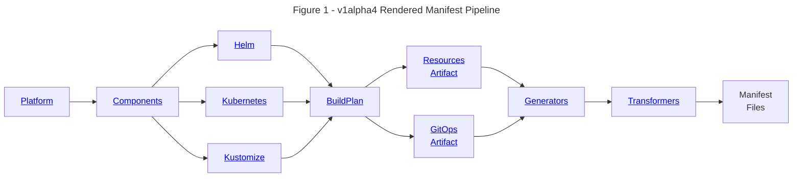

import Tabs from '@theme/Tabs';
import TabItem from '@theme/TabItem';
import Admonition from '@theme/Admonition';

# Helm

## Overview

This guide demonstrates how Holos makes it easier to integrate multiple Helm
charts together with strong type checking and validation.  Holos adds valuable
capabilities to Helm and Kustomize:

1. Inject the same value into two or more charts to integrate them safer than Helm alone.
2. Add strong type checking and validation of constraints for Helm input values.
3. Easily implement the [rendered manifests pattern].

This guide works through managing the [prometheus] and [blackbox] Helm Charts
along side the [httpbin] Kustomize base, integrating all three together in a
unified way with CUE.

## Requirements

We want to probe the [httpbin] service to make sure it's up and running.  Our
organization uses [prometheus] in the observability system.  The httpbin service
doesn't expose a metrics endpoint, so we'll use the blackbox exporter to probe
httpbin and publish a scrape target for prometheus.

Third party software should be managed using the upstream distribution method.
The prometheus community publishes Helm Charts.  httpbin publishes a Kustomize
base.

## Try Locally

This guide is written for use with a local Kubernetes cluster which can be built
quickly with our [Local Cluster] guide.

## Without Holos

Install prometheus and blackbox.

```bash
helm repo add prometheus-community https://prometheus-community.github.io/helm-charts
helm repo update

helm install \
  prometheus \
  prometheus-community/prometheus
helm install \
  --set service.port=80 \
  --set fullnameOverride=blackbox \
  prometheus-blackbox-exporter \
  prometheus-community/prometheus-blackbox-exporter
```

Install httpbin

```
kubectl apply -k github.com/mccutchen/go-httpbin/kustomize
```

## Problems

Helm is simple and straightforward to get started, but there are a number of
problems we'll quickly run into if we go down this path.

1. The prometheus chart tries to connect to blackbox at `http://blackbox:80`
[here](https://github.com/prometheus-community/helm-charts/blob/prometheus-25.27.0/charts/prometheus/values.yaml#L1077)
but the blackbox chart is listening at
`http://prometheus-blackbox-exporter:9115` [here](https://github.com/prometheus-community/helm-charts/blob/prometheus-blackbox-exporter-9.0.1/charts/prometheus-blackbox-exporter/templates/service.yaml#L8).
2. The two charts are not well integrated, they don't work together by default.
3. The prometheus chart does not expose an ergonomic way to reconfigure the
blackbox endpoint.  Therefore we can only configure the blackbox chart.
4. Configuring the
[endpoint](https://github.com/prometheus-community/helm-charts/blob/prometheus-25.27.0/charts/prometheus/values.yaml#L1077)
requires indexing into two deeply nested lists.  Indexing into lists is
unreliable, the target position may change.
5. The blackbox chart authors forgot to include `fullnameOverride` in the `values.yaml` file.
6. httpbin is managed with Kustomize, not Helm, requiring a different process and toolchain.
7. The above commands don't achieve the goal, we still need to manually edit the
`httpbin` Service to add the `prometheus.io/probe: "true"` annotation.
Automation requires crafting another Kustomization layer to patch the base
Service.

These problems complicate the task of integrating blackbox, prometheus, and
httpbin for this simple use case.  We can install the blackbox chart with `--set
fullnameOverride=blackbox` to get it working with the prometheus chart, but
doing so is papering over a pitfall for the next teammate who travels this path.
When the prometheus chart changes the blackbox endpoint, it won't be clear why
or where the integration breaks.

The crux of the issue is there is no good way to pass the same hostname and port
to both charts.  It would be easier, safer, and more reliable if we could ensure
both charts are configured in lock step with one another.

## Solution

Holos leverages CUE making it easy to configure both of these charts in lock
step with each other.  In CUE, this is called _configuration unification_, the C
and U in CUE.  Holos also provides a generalized rendering pipeline that makes
it easier to manage Kustomize bases and Helm Charts using the same tool and
process.



### Installation

Install `holos` with the following command or one of the methods described in
the [Installation] guide.

```bash
go install github.com/holos-run/holos/cmd/holos@latest
```

### Initialization

First, generate the directory structure we're going to work in. Start in an
empty directory then run `holos generate platform v1alpha4` to initialize the
directory structure.

<Tabs groupId="holos generate platform v1alpha4">
  <TabItem value="command" label="Command">
```bash
holos generate platform v1alpha4
```
  </TabItem>
  <TabItem value="output" label="Output">
```txt
no output
```
  </TabItem>
</Tabs>

<Tabs groupId="54F975EF-8512-43E8-AC7E-6B32D9A1E342">
  <TabItem value="command" label="Command">
```bash
git init . && git add . && git commit -m initial
```
  </TabItem>
  <TabItem value="output" label="Output">
```txt
[main (root-commit) 09f9c03] initial
 218 files changed, 73674 insertions(+)
 create mode 100644 .gitignore
 create mode 100644 cue.mod/gen/argoproj.io/application/v1alpha1/types_gen.cue
 create mode 100644 cue.mod/gen/argoproj.io/applicationset/v1alpha1/types_gen.cue
 create mode 100644 cue.mod/gen/argoproj.io/appproject/v1alpha1/types_gen.cue
 create mode 100644 cue.mod/gen/aws.upbound.io/providerconfig/v1beta1/types_gen.cue
 create mode 100644 cue.mod/gen/cert-manager.io/certificate/v1/types_gen.cue
 create mode 100644 cue.mod/gen/cert-manager.io/certificaterequest/v1/types_gen.cue
 create mode 100644 cue.mod/gen/cert-manager.io/clusterissuer/v1/types_gen.cue
 create mode 100644 cue.mod/gen/cert-manager.io/issuer/v1/types_gen.cue
 create mode 100644 cue.mod/gen/extensions.istio.io/wasmplugin/v1alpha1/types_gen.cue
 create mode 100644 cue.mod/gen/external-secrets.io/clusterexternalsecret/v1beta1/types_gen.cue
 create mode 100644 cue.mod/gen/external-secrets.io/clustersecretstore/v1alpha1/types_gen.cue
 create mode 100644 cue.mod/gen/external-secrets.io/clustersecretstore/v1beta1/types_gen.cue
 create mode 100644 cue.mod/gen/external-secrets.io/externalsecret/v1alpha1/types_gen.cue
 create mode 100644 cue.mod/gen/external-secrets.io/externalsecret/v1beta1/types_gen.cue
 create mode 100644 cue.mod/gen/external-secrets.io/pushsecret/v1alpha1/types_gen.cue
 create mode 100644 cue.mod/gen/external-secrets.io/secretstore/v1alpha1/types_gen.cue
 create mode 100644 cue.mod/gen/external-secrets.io/secretstore/v1beta1/types_gen.cue
 create mode 100644 cue.mod/gen/gateway.networking.k8s.io/gateway/v1/types_gen.cue
 create mode 100644 cue.mod/gen/gateway.networking.k8s.io/gateway/v1beta1/types_gen.cue
 create mode 100644 cue.mod/gen/gateway.networking.k8s.io/gatewayclass/v1/types_gen.cue
 create mode 100644 cue.mod/gen/gateway.networking.k8s.io/gatewayclass/v1beta1/types_gen.cue
 create mode 100644 cue.mod/gen/gateway.networking.k8s.io/grpcroute/v1/types_gen.cue
 create mode 100644 cue.mod/gen/gateway.networking.k8s.io/grpcroute/v1alpha2/types_gen.cue
 create mode 100644 cue.mod/gen/gateway.networking.k8s.io/httproute/v1/types_gen.cue
 create mode 100644 cue.mod/gen/gateway.networking.k8s.io/httproute/v1beta1/types_gen.cue
 create mode 100644 cue.mod/gen/gateway.networking.k8s.io/referencegrant/v1alpha2/types_gen.cue
 create mode 100644 cue.mod/gen/gateway.networking.k8s.io/referencegrant/v1beta1/types_gen.cue
 create mode 100644 cue.mod/gen/github.com/holos-run/holos/api/author/v1alpha3/definitions_go_gen.cue
 create mode 100644 cue.mod/gen/github.com/holos-run/holos/api/author/v1alpha4/definitions_go_gen.cue
 create mode 100644 cue.mod/gen/github.com/holos-run/holos/api/core/v1alpha2/apiobjects_go_gen.cue
 create mode 100644 cue.mod/gen/github.com/holos-run/holos/api/core/v1alpha2/buildplan_go_gen.cue
 create mode 100644 cue.mod/gen/github.com/holos-run/holos/api/core/v1alpha2/constants_go_gen.cue
 create mode 100644 cue.mod/gen/github.com/holos-run/holos/api/core/v1alpha2/core_go_gen.cue
 create mode 100644 cue.mod/gen/github.com/holos-run/holos/api/core/v1alpha2/doc_go_gen.cue
 create mode 100644 cue.mod/gen/github.com/holos-run/holos/api/core/v1alpha2/helm_go_gen.cue
 create mode 100644 cue.mod/gen/github.com/holos-run/holos/api/core/v1alpha2/kubernetesobjects_go_gen.cue
 create mode 100644 cue.mod/gen/github.com/holos-run/holos/api/core/v1alpha2/kustomizebuild_go_gen.cue
 create mode 100644 cue.mod/gen/github.com/holos-run/holos/api/core/v1alpha3/apiobjects_go_gen.cue
 create mode 100644 cue.mod/gen/github.com/holos-run/holos/api/core/v1alpha3/buildplan_go_gen.cue
 create mode 100644 cue.mod/gen/github.com/holos-run/holos/api/core/v1alpha3/component_go_gen.cue
 create mode 100644 cue.mod/gen/github.com/holos-run/holos/api/core/v1alpha3/constants_go_gen.cue
 create mode 100644 cue.mod/gen/github.com/holos-run/holos/api/core/v1alpha3/doc_go_gen.cue
 create mode 100644 cue.mod/gen/github.com/holos-run/holos/api/core/v1alpha3/helm_go_gen.cue
 create mode 100644 cue.mod/gen/github.com/holos-run/holos/api/core/v1alpha3/kubernetesobjects_go_gen.cue
 create mode 100644 cue.mod/gen/github.com/holos-run/holos/api/core/v1alpha3/kustomizebuild_go_gen.cue
 create mode 100644 cue.mod/gen/github.com/holos-run/holos/api/core/v1alpha3/platform_go_gen.cue
 create mode 100644 cue.mod/gen/github.com/holos-run/holos/api/core/v1alpha4/types_go_gen.cue
 create mode 100644 cue.mod/gen/github.com/holos-run/holos/api/meta/v1alpha2/meta_go_gen.cue
 create mode 100644 cue.mod/gen/github.com/holos-run/holos/api/v1alpha1/buildplan_go_gen.cue
 create mode 100644 cue.mod/gen/github.com/holos-run/holos/api/v1alpha1/component_go_gen.cue
 create mode 100644 cue.mod/gen/github.com/holos-run/holos/api/v1alpha1/constants_go_gen.cue
 create mode 100644 cue.mod/gen/github.com/holos-run/holos/api/v1alpha1/doc_go_gen.cue
 create mode 100644 cue.mod/gen/github.com/holos-run/holos/api/v1alpha1/form_go_gen.cue
 create mode 100644 cue.mod/gen/github.com/holos-run/holos/api/v1alpha1/helm_go_gen.cue
 create mode 100644 cue.mod/gen/github.com/holos-run/holos/api/v1alpha1/kubernetesobjects_go_gen.cue
 create mode 100644 cue.mod/gen/github.com/holos-run/holos/api/v1alpha1/kustomization_go_gen.cue
 create mode 100644 cue.mod/gen/github.com/holos-run/holos/api/v1alpha1/kustomize_go_gen.cue
 create mode 100644 cue.mod/gen/github.com/holos-run/holos/api/v1alpha1/objectmap_go_gen.cue
 create mode 100644 cue.mod/gen/github.com/holos-run/holos/api/v1alpha1/objectmeta_go_gen.cue
 create mode 100644 cue.mod/gen/github.com/holos-run/holos/api/v1alpha1/platform_go_gen.cue
 create mode 100644 cue.mod/gen/github.com/holos-run/holos/api/v1alpha1/render_go_gen.cue
 create mode 100644 cue.mod/gen/github.com/holos-run/holos/api/v1alpha1/result_go_gen.cue
 create mode 100644 cue.mod/gen/github.com/holos-run/holos/api/v1alpha1/typemeta_go_gen.cue
 create mode 100644 cue.mod/gen/github.com/holos-run/holos/service/gen/holos/object/v1alpha1/object.proto_gen.cue
 create mode 100644 cue.mod/gen/google.golang.org/protobuf/types/known/structpb/struct.pb_go_gen.cue
 create mode 100644 cue.mod/gen/google.golang.org/protobuf/types/known/timestamppb/timestamp.pb_go_gen.cue
 create mode 100644 cue.mod/gen/k8s.io/api/apps/v1/register_go_gen.cue
 create mode 100644 cue.mod/gen/k8s.io/api/apps/v1/types_go_gen.cue
 create mode 100644 cue.mod/gen/k8s.io/api/batch/v1/register_go_gen.cue
 create mode 100644 cue.mod/gen/k8s.io/api/batch/v1/types_go_gen.cue
 create mode 100644 cue.mod/gen/k8s.io/api/core/v1/annotation_key_constants_go_gen.cue
 create mode 100644 cue.mod/gen/k8s.io/api/core/v1/doc_go_gen.cue
 create mode 100644 cue.mod/gen/k8s.io/api/core/v1/register_go_gen.cue
 create mode 100644 cue.mod/gen/k8s.io/api/core/v1/types_go_gen.cue
 create mode 100644 cue.mod/gen/k8s.io/api/core/v1/well_known_labels_go_gen.cue
 create mode 100644 cue.mod/gen/k8s.io/api/core/v1/well_known_taints_go_gen.cue
 create mode 100644 cue.mod/gen/k8s.io/api/rbac/v1/register_go_gen.cue
 create mode 100644 cue.mod/gen/k8s.io/api/rbac/v1/types_go_gen.cue
 create mode 100644 cue.mod/gen/k8s.io/api/rbac/v1beta1/register_go_gen.cue
 create mode 100644 cue.mod/gen/k8s.io/api/rbac/v1beta1/types_go_gen.cue
 create mode 100644 cue.mod/gen/k8s.io/apimachinery/pkg/api/resource/amount_go_gen.cue
 create mode 100644 cue.mod/gen/k8s.io/apimachinery/pkg/api/resource/math_go_gen.cue
 create mode 100644 cue.mod/gen/k8s.io/apimachinery/pkg/api/resource/quantity_go_gen.cue
 create mode 100644 cue.mod/gen/k8s.io/apimachinery/pkg/api/resource/suffix_go_gen.cue
 create mode 100644 cue.mod/gen/k8s.io/apimachinery/pkg/apis/meta/v1/duration_go_gen.cue
 create mode 100644 cue.mod/gen/k8s.io/apimachinery/pkg/apis/meta/v1/group_version_go_gen.cue
 create mode 100644 cue.mod/gen/k8s.io/apimachinery/pkg/apis/meta/v1/meta_go_gen.cue
 create mode 100644 cue.mod/gen/k8s.io/apimachinery/pkg/apis/meta/v1/micro_time_go_gen.cue
 create mode 100644 cue.mod/gen/k8s.io/apimachinery/pkg/apis/meta/v1/register_go_gen.cue
 create mode 100644 cue.mod/gen/k8s.io/apimachinery/pkg/apis/meta/v1/time_go_gen.cue
 create mode 100644 cue.mod/gen/k8s.io/apimachinery/pkg/apis/meta/v1/time_proto_go_gen.cue
 create mode 100644 cue.mod/gen/k8s.io/apimachinery/pkg/apis/meta/v1/types_go_gen.cue
 create mode 100644 cue.mod/gen/k8s.io/apimachinery/pkg/apis/meta/v1/watch_go_gen.cue
 create mode 100644 cue.mod/gen/k8s.io/apimachinery/pkg/runtime/allocator_go_gen.cue
 create mode 100644 cue.mod/gen/k8s.io/apimachinery/pkg/runtime/codec_go_gen.cue
 create mode 100644 cue.mod/gen/k8s.io/apimachinery/pkg/runtime/conversion_go_gen.cue
 create mode 100644 cue.mod/gen/k8s.io/apimachinery/pkg/runtime/converter_go_gen.cue
 create mode 100644 cue.mod/gen/k8s.io/apimachinery/pkg/runtime/doc_go_gen.cue
 create mode 100644 cue.mod/gen/k8s.io/apimachinery/pkg/runtime/embedded_go_gen.cue
 create mode 100644 cue.mod/gen/k8s.io/apimachinery/pkg/runtime/helper_go_gen.cue
 create mode 100644 cue.mod/gen/k8s.io/apimachinery/pkg/runtime/interfaces_go_gen.cue
 create mode 100644 cue.mod/gen/k8s.io/apimachinery/pkg/runtime/negotiate_go_gen.cue
 create mode 100644 cue.mod/gen/k8s.io/apimachinery/pkg/runtime/splice_go_gen.cue
 create mode 100644 cue.mod/gen/k8s.io/apimachinery/pkg/runtime/swagger_doc_generator_go_gen.cue
 create mode 100644 cue.mod/gen/k8s.io/apimachinery/pkg/runtime/types_go_gen.cue
 create mode 100644 cue.mod/gen/k8s.io/apimachinery/pkg/runtime/types_proto_go_gen.cue
 create mode 100644 cue.mod/gen/k8s.io/apimachinery/pkg/types/doc_go_gen.cue
 create mode 100644 cue.mod/gen/k8s.io/apimachinery/pkg/types/namespacedname_go_gen.cue
 create mode 100644 cue.mod/gen/k8s.io/apimachinery/pkg/types/nodename_go_gen.cue
 create mode 100644 cue.mod/gen/k8s.io/apimachinery/pkg/types/patch_go_gen.cue
 create mode 100644 cue.mod/gen/k8s.io/apimachinery/pkg/types/uid_go_gen.cue
 create mode 100644 cue.mod/gen/k8s.io/apimachinery/pkg/util/intstr/intstr_go_gen.cue
 create mode 100644 cue.mod/gen/k8s.io/apimachinery/pkg/watch/doc_go_gen.cue
 create mode 100644 cue.mod/gen/k8s.io/apimachinery/pkg/watch/filter_go_gen.cue
 create mode 100644 cue.mod/gen/k8s.io/apimachinery/pkg/watch/mux_go_gen.cue
 create mode 100644 cue.mod/gen/k8s.io/apimachinery/pkg/watch/streamwatcher_go_gen.cue
 create mode 100644 cue.mod/gen/k8s.io/apimachinery/pkg/watch/watch_go_gen.cue
 create mode 100644 cue.mod/gen/networking.istio.io/destinationrule/v1/types_gen.cue
 create mode 100644 cue.mod/gen/networking.istio.io/destinationrule/v1alpha3/types_gen.cue
 create mode 100644 cue.mod/gen/networking.istio.io/destinationrule/v1beta1/types_gen.cue
 create mode 100644 cue.mod/gen/networking.istio.io/envoyfilter/v1alpha3/types_gen.cue
 create mode 100644 cue.mod/gen/networking.istio.io/gateway/v1/types_gen.cue
 create mode 100644 cue.mod/gen/networking.istio.io/gateway/v1alpha3/types_gen.cue
 create mode 100644 cue.mod/gen/networking.istio.io/gateway/v1beta1/types_gen.cue
 create mode 100644 cue.mod/gen/networking.istio.io/proxyconfig/v1beta1/types_gen.cue
 create mode 100644 cue.mod/gen/networking.istio.io/serviceentry/v1/types_gen.cue
 create mode 100644 cue.mod/gen/networking.istio.io/serviceentry/v1alpha3/types_gen.cue
 create mode 100644 cue.mod/gen/networking.istio.io/serviceentry/v1beta1/types_gen.cue
 create mode 100644 cue.mod/gen/networking.istio.io/sidecar/v1/types_gen.cue
 create mode 100644 cue.mod/gen/networking.istio.io/sidecar/v1alpha3/types_gen.cue
 create mode 100644 cue.mod/gen/networking.istio.io/sidecar/v1beta1/types_gen.cue
 create mode 100644 cue.mod/gen/networking.istio.io/virtualservice/v1/types_gen.cue
 create mode 100644 cue.mod/gen/networking.istio.io/virtualservice/v1alpha3/types_gen.cue
 create mode 100644 cue.mod/gen/networking.istio.io/virtualservice/v1beta1/types_gen.cue
 create mode 100644 cue.mod/gen/networking.istio.io/workloadentry/v1/types_gen.cue
 create mode 100644 cue.mod/gen/networking.istio.io/workloadentry/v1alpha3/types_gen.cue
 create mode 100644 cue.mod/gen/networking.istio.io/workloadentry/v1beta1/types_gen.cue
 create mode 100644 cue.mod/gen/networking.istio.io/workloadgroup/v1/types_gen.cue
 create mode 100644 cue.mod/gen/networking.istio.io/workloadgroup/v1alpha3/types_gen.cue
 create mode 100644 cue.mod/gen/networking.istio.io/workloadgroup/v1beta1/types_gen.cue
 create mode 100644 cue.mod/gen/pkg.crossplane.io/deploymentruntimeconfig/v1beta1/types_gen.cue
 create mode 100644 cue.mod/gen/pkg.crossplane.io/function/v1beta1/types_gen.cue
 create mode 100644 cue.mod/gen/pkg.crossplane.io/provider/v1/types_gen.cue
 create mode 100644 cue.mod/gen/postgres-operator.crunchydata.com/pgadmin/v1beta1/types_gen.cue
 create mode 100644 cue.mod/gen/postgres-operator.crunchydata.com/pgupgrade/v1beta1/types_gen.cue
 create mode 100644 cue.mod/gen/postgres-operator.crunchydata.com/postgrescluster/v1beta1/types_gen.cue
 create mode 100644 cue.mod/gen/security.istio.io/authorizationpolicy/v1/types_gen.cue
 create mode 100644 cue.mod/gen/security.istio.io/authorizationpolicy/v1beta1/types_gen.cue
 create mode 100644 cue.mod/gen/security.istio.io/peerauthentication/v1/types_gen.cue
 create mode 100644 cue.mod/gen/security.istio.io/peerauthentication/v1beta1/types_gen.cue
 create mode 100644 cue.mod/gen/security.istio.io/requestauthentication/v1/types_gen.cue
 create mode 100644 cue.mod/gen/security.istio.io/requestauthentication/v1beta1/types_gen.cue
 create mode 100644 cue.mod/gen/sigs.k8s.io/kustomize/api/types/builtinpluginloadingoptions_string_go_gen.cue
 create mode 100644 cue.mod/gen/sigs.k8s.io/kustomize/api/types/configmapargs_go_gen.cue
 create mode 100644 cue.mod/gen/sigs.k8s.io/kustomize/api/types/doc_go_gen.cue
 create mode 100644 cue.mod/gen/sigs.k8s.io/kustomize/api/types/fieldspec_go_gen.cue
 create mode 100644 cue.mod/gen/sigs.k8s.io/kustomize/api/types/generationbehavior_go_gen.cue
 create mode 100644 cue.mod/gen/sigs.k8s.io/kustomize/api/types/generatorargs_go_gen.cue
 create mode 100644 cue.mod/gen/sigs.k8s.io/kustomize/api/types/generatoroptions_go_gen.cue
 create mode 100644 cue.mod/gen/sigs.k8s.io/kustomize/api/types/helmchartargs_go_gen.cue
 create mode 100644 cue.mod/gen/sigs.k8s.io/kustomize/api/types/iampolicygenerator_go_gen.cue
 create mode 100644 cue.mod/gen/sigs.k8s.io/kustomize/api/types/image_go_gen.cue
 create mode 100644 cue.mod/gen/sigs.k8s.io/kustomize/api/types/kustomization_go_gen.cue
 create mode 100644 cue.mod/gen/sigs.k8s.io/kustomize/api/types/kvpairsources_go_gen.cue
 create mode 100644 cue.mod/gen/sigs.k8s.io/kustomize/api/types/labels_go_gen.cue
 create mode 100644 cue.mod/gen/sigs.k8s.io/kustomize/api/types/loadrestrictions_go_gen.cue
 create mode 100644 cue.mod/gen/sigs.k8s.io/kustomize/api/types/loadrestrictions_string_go_gen.cue
 create mode 100644 cue.mod/gen/sigs.k8s.io/kustomize/api/types/objectmeta_go_gen.cue
 create mode 100644 cue.mod/gen/sigs.k8s.io/kustomize/api/types/pair_go_gen.cue
 create mode 100644 cue.mod/gen/sigs.k8s.io/kustomize/api/types/patch_go_gen.cue
 create mode 100644 cue.mod/gen/sigs.k8s.io/kustomize/api/types/patchstrategicmerge_go_gen.cue
 create mode 100644 cue.mod/gen/sigs.k8s.io/kustomize/api/types/pluginconfig_go_gen.cue
 create mode 100644 cue.mod/gen/sigs.k8s.io/kustomize/api/types/pluginrestrictions_go_gen.cue
 create mode 100644 cue.mod/gen/sigs.k8s.io/kustomize/api/types/pluginrestrictions_string_go_gen.cue
 create mode 100644 cue.mod/gen/sigs.k8s.io/kustomize/api/types/replacement_go_gen.cue
 create mode 100644 cue.mod/gen/sigs.k8s.io/kustomize/api/types/replacementfield_go_gen.cue
 create mode 100644 cue.mod/gen/sigs.k8s.io/kustomize/api/types/replica_go_gen.cue
 create mode 100644 cue.mod/gen/sigs.k8s.io/kustomize/api/types/secretargs_go_gen.cue
 create mode 100644 cue.mod/gen/sigs.k8s.io/kustomize/api/types/selector_go_gen.cue
 create mode 100644 cue.mod/gen/sigs.k8s.io/kustomize/api/types/sortoptions_go_gen.cue
 create mode 100644 cue.mod/gen/sigs.k8s.io/kustomize/api/types/typemeta_go_gen.cue
 create mode 100644 cue.mod/gen/sigs.k8s.io/kustomize/api/types/var_go_gen.cue
 create mode 100644 cue.mod/gen/telemetry.istio.io/telemetry/v1/types_gen.cue
 create mode 100644 cue.mod/gen/telemetry.istio.io/telemetry/v1alpha1/types_gen.cue
 create mode 100644 cue.mod/module.cue
 create mode 100644 cue.mod/pkg/github.com/holos-run/holos/api/author/v1alpha3/definitions.cue
 create mode 100644 cue.mod/pkg/github.com/holos-run/holos/api/author/v1alpha4/definitions.cue
 create mode 100644 cue.mod/pkg/github.com/holos-run/holos/api/core/v1alpha3/apiobjects.cue
 create mode 100644 cue.mod/pkg/github.com/holos-run/holos/api/core/v1alpha4/types.cue
 create mode 100644 cue.mod/pkg/github.com/holos-run/holos/api/v1alpha1/apiobjects.cue
 create mode 100644 cue.mod/pkg/github.com/holos-run/holos/api/v1alpha1/buildplan.cue
 create mode 100644 cue.mod/pkg/github.com/holos-run/holos/api/v1alpha1/constraints.cue
 create mode 100644 cue.mod/pkg/github.com/holos-run/holos/api/v1alpha1/defaults.cue
 create mode 100644 cue.mod/pkg/github.com/holos-run/holos/api/v1alpha1/forms.cue
 create mode 100644 cue.mod/pkg/github.com/holos-run/holos/api/v1alpha1/holos.cue
 create mode 100644 cue.mod/pkg/github.com/holos-run/holos/api/v1alpha1/kubernetes.cue
 create mode 100644 cue.mod/pkg/github.com/holos-run/holos/api/v1alpha1/model.cue
 create mode 100644 cue.mod/pkg/github.com/holos-run/holos/api/v1alpha1/overrides.cue
 create mode 100644 cue.mod/pkg/github.com/holos-run/holos/api/v1alpha1/platform.cue
 create mode 100644 cue.mod/pkg/github.com/holos-run/holos/api/v1alpha1/tags.cue
 create mode 100644 cue.mod/pkg/github.com/holos-run/holos/api/v1alpha1/type_meta.cue
 create mode 100644 cue.mod/pkg/github.com/holos-run/holos/service/gen/holos/object/v1alpha1/object.pb_go_gen.cue
 create mode 100644 cue.mod/pkg/github.com/holos-run/holos/service/gen/holos/object/v1alpha1/object.proto_gen.cue
 create mode 100644 cue.mod/usr/k8s.io/api/apps/v1/types.cue
 create mode 100644 cue.mod/usr/k8s.io/api/batch/v1/types.cue
 create mode 100644 cue.mod/usr/k8s.io/api/core/v1/namespace.cue
 create mode 100644 cue.mod/usr/k8s.io/api/core/v1/types.cue
 create mode 100644 cue.mod/usr/k8s.io/api/rbac/v1/types.cue
 create mode 100644 cue.mod/usr/sigs.k8s.io/kustomize/api/types/patch_go.cue
 create mode 100644 cue.mod/usr/sigs.k8s.io/kustomize/api/types/var_go.cue
 create mode 100644 fleets.cue
 create mode 100644 platform.config.json
 create mode 100644 platform.metadata.json
 create mode 100644 platform/platform.gen.cue
 create mode 100644 resources.cue
 create mode 100644 schema.cue
 create mode 100644 tags.cue
```
  </TabItem>
</Tabs>

A platform is a collection of components. A component is a helm chart, a
kustomize base, resources defined from CUE, etc...

Platforms are empty by default.

<Tabs groupId="BDBA0538-5E75-4B1D-B943-7BD5399E9217">
  <TabItem value="command" label="Command">
```bash
holos render platform ./platform
```
  </TabItem>
  <TabItem value="output" label="Output">
```txt
rendered platform in 16.5µs
```
  </TabItem>
</Tabs>

Holos uses CUE to build a platform specification which is really just a fancy
way of saying a list of components to manage.

<Tabs groupId="D3EE8790-C9F7-4F06-8515-34FF90264899">
  <TabItem value="command" label="Command">
```bash
cue export --out=yaml ./platform
```
  </TabItem>
  <TabItem value="output" label="Output">
```yaml
kind: Platform
apiVersion: v1alpha4
metadata:
  name: default
spec:
  components: []
```
  </TabItem>
</Tabs>

This yaml looks like a Kubernetes resource, but is not. The `holos` executable
processes this Platform resource when you run holos render platform.

Let's manage the same helm chart we installed for Prometheus.  Make the
component directory.

### Config Schema

The prometheus and blackbox charts don't provide a good way to inject the
blackbox host and port to both charts to integrate them together.  Holos and CUE
fill this gap.  We'll define the schema and data in one place, then inject the
validated values into both charts, integrating them together holistically.

Define the host and port in `projects/blackbox.schema.cue`.  We'll inject these
values into both charts to configure them in lock step.

<Tabs groupId="740ABBEB-7A03-4B53-9CD5-4B8C5680172F">
  <TabItem value="projects/blackbox.schema.cue" label="Blackbox Schema">
```txt
projects/blackbox.schema.cue
```
```cue showLineNumbers
package holos

// Define the schema
#blackbox: {
	// host constrained to a lower case dns label
	host: string & =~"^[a-z0-9]([a-z0-9-]{0,61}[a-z0-9])?$"
	// port constrained to a valid range
	port: int & >0 & <=65535
}

// Concrete values that must validate against the schema.
_blackbox: #blackbox & {
	host: "blackbox"
	port: 9115
}
```

:::important
CUE allows us to define types _and_ constraints.  Validation in CUE is better
than general purpose languages limited to type checking only.
:::

  </TabItem>
</Tabs>

### Prometheus Chart

<Tabs groupId="3108B3D5-027C-4ED7-8C04-03671F39788C">
  <TabItem value="projects/platform/components/prometheus/prometheus.cue" label="Component">
Add the CUE configuration to manage the prometheus Helm Chart component.

```bash
mkdir -p projects/platform/components/prometheus
```
```txt
projects/platform/components/prometheus/prometheus.cue
```
```cue showLineNumbers
package holos

// Produce a helm chart build plan.
_Helm.BuildPlan

_Helm: #Helm & {
	Chart: {
		name:    "prometheus"
		version: "25.27.0"
		repository: {
			name: "prometheus-community"
			url:  "https://prometheus-community.github.io/helm-charts"
		}
	}
}
```
  </TabItem>
</Tabs>

Register the prometheus chart with the platform by adding the following file to
the platform directory.

<Tabs groupId="FF5FF6C6-181D-4071-8BCF-5C8E0663C028">
  <TabItem value="platform/prometheus.cue" label="Platform">
```txt
platform/prometheus.cue
```
```cue showLineNumbers
package holos

#Platform: Components: prometheus: {
	name:      "prometheus"
	component: "projects/platform/components/prometheus"
	cluster:   "local"
}
```
  </TabItem>
</Tabs>

Render the platform to render the prometheus chart.

<Tabs groupId="7FC982F4-E355-4AC4-99CE-D03EC0800967">
  <TabItem value="command" label="Command">
```bash
holos render platform ./platform
```
  </TabItem>
  <TabItem value="output" label="Output">
```txt
cached prometheus 25.27.0
rendered prometheus for cluster local in 1.900449291s
rendered platform in 1.900581125s
```
  </TabItem>
  <TabItem value="deploy/clusters/local/components/prometheus/prometheus.gen.yaml" label="prometheus.gen.yaml">

The render platform command wrote a fully rendered manifest to

```txt
deploy/clusters/local/components/prometheus/prometheus.gen.yaml
```

```yaml showLineNumbers
apiVersion: v1
automountServiceAccountToken: true
kind: ServiceAccount
metadata:
  labels:
    app.kubernetes.io/instance: prometheus
    app.kubernetes.io/managed-by: Helm
    app.kubernetes.io/name: alertmanager
    app.kubernetes.io/version: v0.27.0
    argocd.argoproj.io/instance: prometheus
    helm.sh/chart: alertmanager-1.12.0
    holos.run/component.name: prometheus
  name: prometheus-alertmanager
  namespace: default
---
apiVersion: v1
automountServiceAccountToken: true
kind: ServiceAccount
metadata:
  labels:
    app.kubernetes.io/component: metrics
    app.kubernetes.io/instance: prometheus
    app.kubernetes.io/managed-by: Helm
    app.kubernetes.io/name: kube-state-metrics
    app.kubernetes.io/part-of: kube-state-metrics
    app.kubernetes.io/version: 2.13.0
    argocd.argoproj.io/instance: prometheus
    helm.sh/chart: kube-state-metrics-5.25.1
    holos.run/component.name: prometheus
  name: prometheus-kube-state-metrics
  namespace: default
---
apiVersion: v1
automountServiceAccountToken: false
kind: ServiceAccount
metadata:
  labels:
    app.kubernetes.io/component: metrics
    app.kubernetes.io/instance: prometheus
    app.kubernetes.io/managed-by: Helm
    app.kubernetes.io/name: prometheus-node-exporter
    app.kubernetes.io/part-of: prometheus-node-exporter
    app.kubernetes.io/version: 1.8.2
    argocd.argoproj.io/instance: prometheus
    helm.sh/chart: prometheus-node-exporter-4.39.0
    holos.run/component.name: prometheus
  name: prometheus-prometheus-node-exporter
  namespace: default
---
apiVersion: v1
automountServiceAccountToken: true
kind: ServiceAccount
metadata:
  labels:
    app.kubernetes.io/instance: prometheus
    app.kubernetes.io/managed-by: Helm
    app.kubernetes.io/name: prometheus-pushgateway
    app.kubernetes.io/version: v1.9.0
    argocd.argoproj.io/instance: prometheus
    helm.sh/chart: prometheus-pushgateway-2.14.0
    holos.run/component.name: prometheus
  name: prometheus-prometheus-pushgateway
  namespace: default
---
apiVersion: v1
kind: ServiceAccount
metadata:
  labels:
    app.kubernetes.io/component: server
    app.kubernetes.io/instance: prometheus
    app.kubernetes.io/managed-by: Helm
    app.kubernetes.io/name: prometheus
    app.kubernetes.io/part-of: prometheus
    app.kubernetes.io/version: v2.54.1
    argocd.argoproj.io/instance: prometheus
    helm.sh/chart: prometheus-25.27.0
    holos.run/component.name: prometheus
  name: prometheus-server
  namespace: default
---
apiVersion: rbac.authorization.k8s.io/v1
kind: ClusterRole
metadata:
  labels:
    app.kubernetes.io/component: metrics
    app.kubernetes.io/instance: prometheus
    app.kubernetes.io/managed-by: Helm
    app.kubernetes.io/name: kube-state-metrics
    app.kubernetes.io/part-of: kube-state-metrics
    app.kubernetes.io/version: 2.13.0
    argocd.argoproj.io/instance: prometheus
    helm.sh/chart: kube-state-metrics-5.25.1
    holos.run/component.name: prometheus
  name: prometheus-kube-state-metrics
rules:
- apiGroups:
  - certificates.k8s.io
  resources:
  - certificatesigningrequests
  verbs:
  - list
  - watch
- apiGroups:
  - ""
  resources:
  - configmaps
  verbs:
  - list
  - watch
- apiGroups:
  - batch
  resources:
  - cronjobs
  verbs:
  - list
  - watch
- apiGroups:
  - extensions
  - apps
  resources:
  - daemonsets
  verbs:
  - list
  - watch
- apiGroups:
  - extensions
  - apps
  resources:
  - deployments
  verbs:
  - list
  - watch
- apiGroups:
  - ""
  resources:
  - endpoints
  verbs:
  - list
  - watch
- apiGroups:
  - autoscaling
  resources:
  - horizontalpodautoscalers
  verbs:
  - list
  - watch
- apiGroups:
  - extensions
  - networking.k8s.io
  resources:
  - ingresses
  verbs:
  - list
  - watch
- apiGroups:
  - batch
  resources:
  - jobs
  verbs:
  - list
  - watch
- apiGroups:
  - coordination.k8s.io
  resources:
  - leases
  verbs:
  - list
  - watch
- apiGroups:
  - ""
  resources:
  - limitranges
  verbs:
  - list
  - watch
- apiGroups:
  - admissionregistration.k8s.io
  resources:
  - mutatingwebhookconfigurations
  verbs:
  - list
  - watch
- apiGroups:
  - ""
  resources:
  - namespaces
  verbs:
  - list
  - watch
- apiGroups:
  - networking.k8s.io
  resources:
  - networkpolicies
  verbs:
  - list
  - watch
- apiGroups:
  - ""
  resources:
  - nodes
  verbs:
  - list
  - watch
- apiGroups:
  - ""
  resources:
  - persistentvolumeclaims
  verbs:
  - list
  - watch
- apiGroups:
  - ""
  resources:
  - persistentvolumes
  verbs:
  - list
  - watch
- apiGroups:
  - policy
  resources:
  - poddisruptionbudgets
  verbs:
  - list
  - watch
- apiGroups:
  - ""
  resources:
  - pods
  verbs:
  - list
  - watch
- apiGroups:
  - extensions
  - apps
  resources:
  - replicasets
  verbs:
  - list
  - watch
- apiGroups:
  - ""
  resources:
  - replicationcontrollers
  verbs:
  - list
  - watch
- apiGroups:
  - ""
  resources:
  - resourcequotas
  verbs:
  - list
  - watch
- apiGroups:
  - ""
  resources:
  - secrets
  verbs:
  - list
  - watch
- apiGroups:
  - ""
  resources:
  - services
  verbs:
  - list
  - watch
- apiGroups:
  - apps
  resources:
  - statefulsets
  verbs:
  - list
  - watch
- apiGroups:
  - storage.k8s.io
  resources:
  - storageclasses
  verbs:
  - list
  - watch
- apiGroups:
  - admissionregistration.k8s.io
  resources:
  - validatingwebhookconfigurations
  verbs:
  - list
  - watch
- apiGroups:
  - storage.k8s.io
  resources:
  - volumeattachments
  verbs:
  - list
  - watch
---
apiVersion: rbac.authorization.k8s.io/v1
kind: ClusterRole
metadata:
  labels:
    app.kubernetes.io/component: server
    app.kubernetes.io/instance: prometheus
    app.kubernetes.io/managed-by: Helm
    app.kubernetes.io/name: prometheus
    app.kubernetes.io/part-of: prometheus
    app.kubernetes.io/version: v2.54.1
    argocd.argoproj.io/instance: prometheus
    helm.sh/chart: prometheus-25.27.0
    holos.run/component.name: prometheus
  name: prometheus-server
rules:
- apiGroups:
  - ""
  resources:
  - nodes
  - nodes/proxy
  - nodes/metrics
  - services
  - endpoints
  - pods
  - ingresses
  - configmaps
  verbs:
  - get
  - list
  - watch
- apiGroups:
  - extensions
  - networking.k8s.io
  resources:
  - ingresses/status
  - ingresses
  verbs:
  - get
  - list
  - watch
- apiGroups:
  - discovery.k8s.io
  resources:
  - endpointslices
  verbs:
  - get
  - list
  - watch
- nonResourceURLs:
  - /metrics
  verbs:
  - get
---
apiVersion: rbac.authorization.k8s.io/v1
kind: ClusterRoleBinding
metadata:
  labels:
    app.kubernetes.io/component: metrics
    app.kubernetes.io/instance: prometheus
    app.kubernetes.io/managed-by: Helm
    app.kubernetes.io/name: kube-state-metrics
    app.kubernetes.io/part-of: kube-state-metrics
    app.kubernetes.io/version: 2.13.0
    argocd.argoproj.io/instance: prometheus
    helm.sh/chart: kube-state-metrics-5.25.1
    holos.run/component.name: prometheus
  name: prometheus-kube-state-metrics
roleRef:
  apiGroup: rbac.authorization.k8s.io
  kind: ClusterRole
  name: prometheus-kube-state-metrics
subjects:
- kind: ServiceAccount
  name: prometheus-kube-state-metrics
  namespace: default
---
apiVersion: rbac.authorization.k8s.io/v1
kind: ClusterRoleBinding
metadata:
  labels:
    app.kubernetes.io/component: server
    app.kubernetes.io/instance: prometheus
    app.kubernetes.io/managed-by: Helm
    app.kubernetes.io/name: prometheus
    app.kubernetes.io/part-of: prometheus
    app.kubernetes.io/version: v2.54.1
    argocd.argoproj.io/instance: prometheus
    helm.sh/chart: prometheus-25.27.0
    holos.run/component.name: prometheus
  name: prometheus-server
roleRef:
  apiGroup: rbac.authorization.k8s.io
  kind: ClusterRole
  name: prometheus-server
subjects:
- kind: ServiceAccount
  name: prometheus-server
  namespace: default
---
apiVersion: v1
data:
  alertmanager.yml: |
    global: {}
    receivers:
    - name: default-receiver
    route:
      group_interval: 5m
      group_wait: 10s
      receiver: default-receiver
      repeat_interval: 3h
    templates:
    - /etc/alertmanager/*.tmpl
kind: ConfigMap
metadata:
  labels:
    app.kubernetes.io/instance: prometheus
    app.kubernetes.io/managed-by: Helm
    app.kubernetes.io/name: alertmanager
    app.kubernetes.io/version: v0.27.0
    argocd.argoproj.io/instance: prometheus
    helm.sh/chart: alertmanager-1.12.0
    holos.run/component.name: prometheus
  name: prometheus-alertmanager
  namespace: default
---
apiVersion: v1
data:
  alerting_rules.yml: |
    {}
  alerts: |
    {}
  allow-snippet-annotations: "false"
  prometheus.yml: |
    global:
      evaluation_interval: 1m
      scrape_interval: 1m
      scrape_timeout: 10s
    rule_files:
    - /etc/config/recording_rules.yml
    - /etc/config/alerting_rules.yml
    - /etc/config/rules
    - /etc/config/alerts
    scrape_configs:
    - job_name: prometheus
      static_configs:
      - targets:
        - localhost:9090
    - bearer_token_file: /var/run/secrets/kubernetes.io/serviceaccount/token
      job_name: kubernetes-apiservers
      kubernetes_sd_configs:
      - role: endpoints
      relabel_configs:
      - action: keep
        regex: default;kubernetes;https
        source_labels:
        - __meta_kubernetes_namespace
        - __meta_kubernetes_service_name
        - __meta_kubernetes_endpoint_port_name
      scheme: https
      tls_config:
        ca_file: /var/run/secrets/kubernetes.io/serviceaccount/ca.crt
        insecure_skip_verify: true
    - bearer_token_file: /var/run/secrets/kubernetes.io/serviceaccount/token
      job_name: kubernetes-nodes
      kubernetes_sd_configs:
      - role: node
      relabel_configs:
      - action: labelmap
        regex: __meta_kubernetes_node_label_(.+)
      - replacement: kubernetes.default.svc:443
        target_label: __address__
      - regex: (.+)
        replacement: /api/v1/nodes/$1/proxy/metrics
        source_labels:
        - __meta_kubernetes_node_name
        target_label: __metrics_path__
      scheme: https
      tls_config:
        ca_file: /var/run/secrets/kubernetes.io/serviceaccount/ca.crt
        insecure_skip_verify: true
    - bearer_token_file: /var/run/secrets/kubernetes.io/serviceaccount/token
      job_name: kubernetes-nodes-cadvisor
      kubernetes_sd_configs:
      - role: node
      relabel_configs:
      - action: labelmap
        regex: __meta_kubernetes_node_label_(.+)
      - replacement: kubernetes.default.svc:443
        target_label: __address__
      - regex: (.+)
        replacement: /api/v1/nodes/$1/proxy/metrics/cadvisor
        source_labels:
        - __meta_kubernetes_node_name
        target_label: __metrics_path__
      scheme: https
      tls_config:
        ca_file: /var/run/secrets/kubernetes.io/serviceaccount/ca.crt
        insecure_skip_verify: true
    - honor_labels: true
      job_name: kubernetes-service-endpoints
      kubernetes_sd_configs:
      - role: endpoints
      relabel_configs:
      - action: keep
        regex: true
        source_labels:
        - __meta_kubernetes_service_annotation_prometheus_io_scrape
      - action: drop
        regex: true
        source_labels:
        - __meta_kubernetes_service_annotation_prometheus_io_scrape_slow
      - action: replace
        regex: (https?)
        source_labels:
        - __meta_kubernetes_service_annotation_prometheus_io_scheme
        target_label: __scheme__
      - action: replace
        regex: (.+)
        source_labels:
        - __meta_kubernetes_service_annotation_prometheus_io_path
        target_label: __metrics_path__
      - action: replace
        regex: (.+?)(?::\d+)?;(\d+)
        replacement: $1:$2
        source_labels:
        - __address__
        - __meta_kubernetes_service_annotation_prometheus_io_port
        target_label: __address__
      - action: labelmap
        regex: __meta_kubernetes_service_annotation_prometheus_io_param_(.+)
        replacement: __param_$1
      - action: labelmap
        regex: __meta_kubernetes_service_label_(.+)
      - action: replace
        source_labels:
        - __meta_kubernetes_namespace
        target_label: namespace
      - action: replace
        source_labels:
        - __meta_kubernetes_service_name
        target_label: service
      - action: replace
        source_labels:
        - __meta_kubernetes_pod_node_name
        target_label: node
    - honor_labels: true
      job_name: kubernetes-service-endpoints-slow
      kubernetes_sd_configs:
      - role: endpoints
      relabel_configs:
      - action: keep
        regex: true
        source_labels:
        - __meta_kubernetes_service_annotation_prometheus_io_scrape_slow
      - action: replace
        regex: (https?)
        source_labels:
        - __meta_kubernetes_service_annotation_prometheus_io_scheme
        target_label: __scheme__
      - action: replace
        regex: (.+)
        source_labels:
        - __meta_kubernetes_service_annotation_prometheus_io_path
        target_label: __metrics_path__
      - action: replace
        regex: (.+?)(?::\d+)?;(\d+)
        replacement: $1:$2
        source_labels:
        - __address__
        - __meta_kubernetes_service_annotation_prometheus_io_port
        target_label: __address__
      - action: labelmap
        regex: __meta_kubernetes_service_annotation_prometheus_io_param_(.+)
        replacement: __param_$1
      - action: labelmap
        regex: __meta_kubernetes_service_label_(.+)
      - action: replace
        source_labels:
        - __meta_kubernetes_namespace
        target_label: namespace
      - action: replace
        source_labels:
        - __meta_kubernetes_service_name
        target_label: service
      - action: replace
        source_labels:
        - __meta_kubernetes_pod_node_name
        target_label: node
      scrape_interval: 5m
      scrape_timeout: 30s
    - honor_labels: true
      job_name: prometheus-pushgateway
      kubernetes_sd_configs:
      - role: service
      relabel_configs:
      - action: keep
        regex: pushgateway
        source_labels:
        - __meta_kubernetes_service_annotation_prometheus_io_probe
    - honor_labels: true
      job_name: kubernetes-services
      kubernetes_sd_configs:
      - role: service
      metrics_path: /probe
      params:
        module:
        - http_2xx
      relabel_configs:
      - action: keep
        regex: true
        source_labels:
        - __meta_kubernetes_service_annotation_prometheus_io_probe
      - source_labels:
        - __address__
        target_label: __param_target
      - replacement: blackbox
        target_label: __address__
      - source_labels:
        - __param_target
        target_label: instance
      - action: labelmap
        regex: __meta_kubernetes_service_label_(.+)
      - source_labels:
        - __meta_kubernetes_namespace
        target_label: namespace
      - source_labels:
        - __meta_kubernetes_service_name
        target_label: service
    - honor_labels: true
      job_name: kubernetes-pods
      kubernetes_sd_configs:
      - role: pod
      relabel_configs:
      - action: keep
        regex: true
        source_labels:
        - __meta_kubernetes_pod_annotation_prometheus_io_scrape
      - action: drop
        regex: true
        source_labels:
        - __meta_kubernetes_pod_annotation_prometheus_io_scrape_slow
      - action: replace
        regex: (https?)
        source_labels:
        - __meta_kubernetes_pod_annotation_prometheus_io_scheme
        target_label: __scheme__
      - action: replace
        regex: (.+)
        source_labels:
        - __meta_kubernetes_pod_annotation_prometheus_io_path
        target_label: __metrics_path__
      - action: replace
        regex: (\d+);(([A-Fa-f0-9]{1,4}::?){1,7}[A-Fa-f0-9]{1,4})
        replacement: '[$2]:$1'
        source_labels:
        - __meta_kubernetes_pod_annotation_prometheus_io_port
        - __meta_kubernetes_pod_ip
        target_label: __address__
      - action: replace
        regex: (\d+);((([0-9]+?)(\.|$)){4})
        replacement: $2:$1
        source_labels:
        - __meta_kubernetes_pod_annotation_prometheus_io_port
        - __meta_kubernetes_pod_ip
        target_label: __address__
      - action: labelmap
        regex: __meta_kubernetes_pod_annotation_prometheus_io_param_(.+)
        replacement: __param_$1
      - action: labelmap
        regex: __meta_kubernetes_pod_label_(.+)
      - action: replace
        source_labels:
        - __meta_kubernetes_namespace
        target_label: namespace
      - action: replace
        source_labels:
        - __meta_kubernetes_pod_name
        target_label: pod
      - action: drop
        regex: Pending|Succeeded|Failed|Completed
        source_labels:
        - __meta_kubernetes_pod_phase
      - action: replace
        source_labels:
        - __meta_kubernetes_pod_node_name
        target_label: node
    - honor_labels: true
      job_name: kubernetes-pods-slow
      kubernetes_sd_configs:
      - role: pod
      relabel_configs:
      - action: keep
        regex: true
        source_labels:
        - __meta_kubernetes_pod_annotation_prometheus_io_scrape_slow
      - action: replace
        regex: (https?)
        source_labels:
        - __meta_kubernetes_pod_annotation_prometheus_io_scheme
        target_label: __scheme__
      - action: replace
        regex: (.+)
        source_labels:
        - __meta_kubernetes_pod_annotation_prometheus_io_path
        target_label: __metrics_path__
      - action: replace
        regex: (\d+);(([A-Fa-f0-9]{1,4}::?){1,7}[A-Fa-f0-9]{1,4})
        replacement: '[$2]:$1'
        source_labels:
        - __meta_kubernetes_pod_annotation_prometheus_io_port
        - __meta_kubernetes_pod_ip
        target_label: __address__
      - action: replace
        regex: (\d+);((([0-9]+?)(\.|$)){4})
        replacement: $2:$1
        source_labels:
        - __meta_kubernetes_pod_annotation_prometheus_io_port
        - __meta_kubernetes_pod_ip
        target_label: __address__
      - action: labelmap
        regex: __meta_kubernetes_pod_annotation_prometheus_io_param_(.+)
        replacement: __param_$1
      - action: labelmap
        regex: __meta_kubernetes_pod_label_(.+)
      - action: replace
        source_labels:
        - __meta_kubernetes_namespace
        target_label: namespace
      - action: replace
        source_labels:
        - __meta_kubernetes_pod_name
        target_label: pod
      - action: drop
        regex: Pending|Succeeded|Failed|Completed
        source_labels:
        - __meta_kubernetes_pod_phase
      - action: replace
        source_labels:
        - __meta_kubernetes_pod_node_name
        target_label: node
      scrape_interval: 5m
      scrape_timeout: 30s
    alerting:
      alertmanagers:
      - kubernetes_sd_configs:
          - role: pod
        tls_config:
          ca_file: /var/run/secrets/kubernetes.io/serviceaccount/ca.crt
        bearer_token_file: /var/run/secrets/kubernetes.io/serviceaccount/token
        relabel_configs:
        - source_labels: [__meta_kubernetes_namespace]
          regex: default
          action: keep
        - source_labels: [__meta_kubernetes_pod_label_app_kubernetes_io_instance]
          regex: prometheus
          action: keep
        - source_labels: [__meta_kubernetes_pod_label_app_kubernetes_io_name]
          regex: alertmanager
          action: keep
        - source_labels: [__meta_kubernetes_pod_container_port_number]
          regex: "9093"
          action: keep
  recording_rules.yml: |
    {}
  rules: |
    {}
kind: ConfigMap
metadata:
  labels:
    app.kubernetes.io/component: server
    app.kubernetes.io/instance: prometheus
    app.kubernetes.io/managed-by: Helm
    app.kubernetes.io/name: prometheus
    app.kubernetes.io/part-of: prometheus
    app.kubernetes.io/version: v2.54.1
    argocd.argoproj.io/instance: prometheus
    helm.sh/chart: prometheus-25.27.0
    holos.run/component.name: prometheus
  name: prometheus-server
  namespace: default
---
apiVersion: v1
kind: Service
metadata:
  labels:
    app.kubernetes.io/instance: prometheus
    app.kubernetes.io/managed-by: Helm
    app.kubernetes.io/name: alertmanager
    app.kubernetes.io/version: v0.27.0
    argocd.argoproj.io/instance: prometheus
    helm.sh/chart: alertmanager-1.12.0
    holos.run/component.name: prometheus
  name: prometheus-alertmanager
  namespace: default
spec:
  ports:
  - name: http
    port: 9093
    protocol: TCP
    targetPort: http
  selector:
    app.kubernetes.io/instance: prometheus
    app.kubernetes.io/name: alertmanager
    argocd.argoproj.io/instance: prometheus
    holos.run/component.name: prometheus
  type: ClusterIP
---
apiVersion: v1
kind: Service
metadata:
  labels:
    app.kubernetes.io/instance: prometheus
    app.kubernetes.io/managed-by: Helm
    app.kubernetes.io/name: alertmanager
    app.kubernetes.io/version: v0.27.0
    argocd.argoproj.io/instance: prometheus
    helm.sh/chart: alertmanager-1.12.0
    holos.run/component.name: prometheus
  name: prometheus-alertmanager-headless
  namespace: default
spec:
  clusterIP: None
  ports:
  - name: http
    port: 9093
    protocol: TCP
    targetPort: http
  selector:
    app.kubernetes.io/instance: prometheus
    app.kubernetes.io/name: alertmanager
    argocd.argoproj.io/instance: prometheus
    holos.run/component.name: prometheus
---
apiVersion: v1
kind: Service
metadata:
  annotations:
    prometheus.io/scrape: "true"
  labels:
    app.kubernetes.io/component: metrics
    app.kubernetes.io/instance: prometheus
    app.kubernetes.io/managed-by: Helm
    app.kubernetes.io/name: kube-state-metrics
    app.kubernetes.io/part-of: kube-state-metrics
    app.kubernetes.io/version: 2.13.0
    argocd.argoproj.io/instance: prometheus
    helm.sh/chart: kube-state-metrics-5.25.1
    holos.run/component.name: prometheus
  name: prometheus-kube-state-metrics
  namespace: default
spec:
  ports:
  - name: http
    port: 8080
    protocol: TCP
    targetPort: 8080
  selector:
    app.kubernetes.io/instance: prometheus
    app.kubernetes.io/name: kube-state-metrics
    argocd.argoproj.io/instance: prometheus
    holos.run/component.name: prometheus
  type: ClusterIP
---
apiVersion: v1
kind: Service
metadata:
  annotations:
    prometheus.io/scrape: "true"
  labels:
    app.kubernetes.io/component: metrics
    app.kubernetes.io/instance: prometheus
    app.kubernetes.io/managed-by: Helm
    app.kubernetes.io/name: prometheus-node-exporter
    app.kubernetes.io/part-of: prometheus-node-exporter
    app.kubernetes.io/version: 1.8.2
    argocd.argoproj.io/instance: prometheus
    helm.sh/chart: prometheus-node-exporter-4.39.0
    holos.run/component.name: prometheus
  name: prometheus-prometheus-node-exporter
  namespace: default
spec:
  ports:
  - name: metrics
    port: 9100
    protocol: TCP
    targetPort: 9100
  selector:
    app.kubernetes.io/instance: prometheus
    app.kubernetes.io/name: prometheus-node-exporter
    argocd.argoproj.io/instance: prometheus
    holos.run/component.name: prometheus
  type: ClusterIP
---
apiVersion: v1
kind: Service
metadata:
  annotations:
    prometheus.io/probe: pushgateway
  labels:
    app.kubernetes.io/instance: prometheus
    app.kubernetes.io/managed-by: Helm
    app.kubernetes.io/name: prometheus-pushgateway
    app.kubernetes.io/version: v1.9.0
    argocd.argoproj.io/instance: prometheus
    helm.sh/chart: prometheus-pushgateway-2.14.0
    holos.run/component.name: prometheus
  name: prometheus-prometheus-pushgateway
  namespace: default
spec:
  ports:
  - name: http
    port: 9091
    protocol: TCP
    targetPort: 9091
  selector:
    app.kubernetes.io/instance: prometheus
    app.kubernetes.io/name: prometheus-pushgateway
    argocd.argoproj.io/instance: prometheus
    holos.run/component.name: prometheus
  type: ClusterIP
---
apiVersion: v1
kind: Service
metadata:
  labels:
    app.kubernetes.io/component: server
    app.kubernetes.io/instance: prometheus
    app.kubernetes.io/managed-by: Helm
    app.kubernetes.io/name: prometheus
    app.kubernetes.io/part-of: prometheus
    app.kubernetes.io/version: v2.54.1
    argocd.argoproj.io/instance: prometheus
    helm.sh/chart: prometheus-25.27.0
    holos.run/component.name: prometheus
  name: prometheus-server
  namespace: default
spec:
  ports:
  - name: http
    port: 80
    protocol: TCP
    targetPort: 9090
  selector:
    app.kubernetes.io/component: server
    app.kubernetes.io/instance: prometheus
    app.kubernetes.io/name: prometheus
    argocd.argoproj.io/instance: prometheus
    holos.run/component.name: prometheus
  sessionAffinity: None
  type: ClusterIP
---
apiVersion: v1
kind: PersistentVolumeClaim
metadata:
  labels:
    app.kubernetes.io/component: server
    app.kubernetes.io/instance: prometheus
    app.kubernetes.io/managed-by: Helm
    app.kubernetes.io/name: prometheus
    app.kubernetes.io/part-of: prometheus
    app.kubernetes.io/version: v2.54.1
    argocd.argoproj.io/instance: prometheus
    helm.sh/chart: prometheus-25.27.0
    holos.run/component.name: prometheus
  name: prometheus-server
  namespace: default
spec:
  accessModes:
  - ReadWriteOnce
  resources:
    requests:
      storage: 8Gi
---
apiVersion: apps/v1
kind: Deployment
metadata:
  labels:
    app.kubernetes.io/component: metrics
    app.kubernetes.io/instance: prometheus
    app.kubernetes.io/managed-by: Helm
    app.kubernetes.io/name: kube-state-metrics
    app.kubernetes.io/part-of: kube-state-metrics
    app.kubernetes.io/version: 2.13.0
    argocd.argoproj.io/instance: prometheus
    helm.sh/chart: kube-state-metrics-5.25.1
    holos.run/component.name: prometheus
  name: prometheus-kube-state-metrics
  namespace: default
spec:
  replicas: 1
  revisionHistoryLimit: 10
  selector:
    matchLabels:
      app.kubernetes.io/instance: prometheus
      app.kubernetes.io/name: kube-state-metrics
      argocd.argoproj.io/instance: prometheus
      holos.run/component.name: prometheus
  strategy:
    type: RollingUpdate
  template:
    metadata:
      labels:
        app.kubernetes.io/component: metrics
        app.kubernetes.io/instance: prometheus
        app.kubernetes.io/managed-by: Helm
        app.kubernetes.io/name: kube-state-metrics
        app.kubernetes.io/part-of: kube-state-metrics
        app.kubernetes.io/version: 2.13.0
        argocd.argoproj.io/instance: prometheus
        helm.sh/chart: kube-state-metrics-5.25.1
        holos.run/component.name: prometheus
    spec:
      automountServiceAccountToken: true
      containers:
      - args:
        - --port=8080
        - --resources=certificatesigningrequests,configmaps,cronjobs,daemonsets,deployments,endpoints,horizontalpodautoscalers,ingresses,jobs,leases,limitranges,mutatingwebhookconfigurations,namespaces,networkpolicies,nodes,persistentvolumeclaims,persistentvolumes,poddisruptionbudgets,pods,replicasets,replicationcontrollers,resourcequotas,secrets,services,statefulsets,storageclasses,validatingwebhookconfigurations,volumeattachments
        image: registry.k8s.io/kube-state-metrics/kube-state-metrics:v2.13.0
        imagePullPolicy: IfNotPresent
        livenessProbe:
          failureThreshold: 3
          httpGet:
            httpHeaders: null
            path: /livez
            port: 8080
            scheme: HTTP
          initialDelaySeconds: 5
          periodSeconds: 10
          successThreshold: 1
          timeoutSeconds: 5
        name: kube-state-metrics
        ports:
        - containerPort: 8080
          name: http
        readinessProbe:
          failureThreshold: 3
          httpGet:
            httpHeaders: null
            path: /readyz
            port: 8080
            scheme: HTTP
          initialDelaySeconds: 5
          periodSeconds: 10
          successThreshold: 1
          timeoutSeconds: 5
        resources: {}
        securityContext:
          allowPrivilegeEscalation: false
          capabilities:
            drop:
            - ALL
          readOnlyRootFilesystem: true
      hostNetwork: false
      securityContext:
        fsGroup: 65534
        runAsGroup: 65534
        runAsNonRoot: true
        runAsUser: 65534
        seccompProfile:
          type: RuntimeDefault
      serviceAccountName: prometheus-kube-state-metrics
---
apiVersion: apps/v1
kind: Deployment
metadata:
  labels:
    app.kubernetes.io/instance: prometheus
    app.kubernetes.io/managed-by: Helm
    app.kubernetes.io/name: prometheus-pushgateway
    app.kubernetes.io/version: v1.9.0
    argocd.argoproj.io/instance: prometheus
    helm.sh/chart: prometheus-pushgateway-2.14.0
    holos.run/component.name: prometheus
  name: prometheus-prometheus-pushgateway
  namespace: default
spec:
  replicas: 1
  selector:
    matchLabels:
      app.kubernetes.io/instance: prometheus
      app.kubernetes.io/name: prometheus-pushgateway
      argocd.argoproj.io/instance: prometheus
      holos.run/component.name: prometheus
  strategy:
    type: Recreate
  template:
    metadata:
      labels:
        app.kubernetes.io/instance: prometheus
        app.kubernetes.io/managed-by: Helm
        app.kubernetes.io/name: prometheus-pushgateway
        app.kubernetes.io/version: v1.9.0
        argocd.argoproj.io/instance: prometheus
        helm.sh/chart: prometheus-pushgateway-2.14.0
        holos.run/component.name: prometheus
    spec:
      automountServiceAccountToken: true
      containers:
      - image: quay.io/prometheus/pushgateway:v1.9.0
        imagePullPolicy: IfNotPresent
        livenessProbe:
          httpGet:
            path: /-/healthy
            port: 9091
          initialDelaySeconds: 10
          timeoutSeconds: 10
        name: pushgateway
        ports:
        - containerPort: 9091
          name: metrics
          protocol: TCP
        readinessProbe:
          httpGet:
            path: /-/ready
            port: 9091
          initialDelaySeconds: 10
          timeoutSeconds: 10
        volumeMounts:
        - mountPath: /data
          name: storage-volume
          subPath: ""
      securityContext:
        fsGroup: 65534
        runAsNonRoot: true
        runAsUser: 65534
      serviceAccountName: prometheus-prometheus-pushgateway
      volumes:
      - emptyDir: {}
        name: storage-volume
---
apiVersion: apps/v1
kind: Deployment
metadata:
  labels:
    app.kubernetes.io/component: server
    app.kubernetes.io/instance: prometheus
    app.kubernetes.io/managed-by: Helm
    app.kubernetes.io/name: prometheus
    app.kubernetes.io/part-of: prometheus
    app.kubernetes.io/version: v2.54.1
    argocd.argoproj.io/instance: prometheus
    helm.sh/chart: prometheus-25.27.0
    holos.run/component.name: prometheus
  name: prometheus-server
  namespace: default
spec:
  replicas: 1
  revisionHistoryLimit: 10
  selector:
    matchLabels:
      app.kubernetes.io/component: server
      app.kubernetes.io/instance: prometheus
      app.kubernetes.io/name: prometheus
      argocd.argoproj.io/instance: prometheus
      holos.run/component.name: prometheus
  strategy:
    rollingUpdate: null
    type: Recreate
  template:
    metadata:
      labels:
        app.kubernetes.io/component: server
        app.kubernetes.io/instance: prometheus
        app.kubernetes.io/managed-by: Helm
        app.kubernetes.io/name: prometheus
        app.kubernetes.io/part-of: prometheus
        app.kubernetes.io/version: v2.54.1
        argocd.argoproj.io/instance: prometheus
        helm.sh/chart: prometheus-25.27.0
        holos.run/component.name: prometheus
    spec:
      containers:
      - args:
        - --watched-dir=/etc/config
        - --listen-address=0.0.0.0:8080
        - --reload-url=http://127.0.0.1:9090/-/reload
        image: quay.io/prometheus-operator/prometheus-config-reloader:v0.76.0
        imagePullPolicy: IfNotPresent
        livenessProbe:
          httpGet:
            path: /healthz
            port: metrics
            scheme: HTTP
          initialDelaySeconds: 2
          periodSeconds: 10
        name: prometheus-server-configmap-reload
        ports:
        - containerPort: 8080
          name: metrics
        readinessProbe:
          httpGet:
            path: /healthz
            port: metrics
            scheme: HTTP
          periodSeconds: 10
        volumeMounts:
        - mountPath: /etc/config
          name: config-volume
          readOnly: true
      - args:
        - --storage.tsdb.retention.time=15d
        - --config.file=/etc/config/prometheus.yml
        - --storage.tsdb.path=/data
        - --web.console.libraries=/etc/prometheus/console_libraries
        - --web.console.templates=/etc/prometheus/consoles
        - --web.enable-lifecycle
        image: quay.io/prometheus/prometheus:v2.54.1
        imagePullPolicy: IfNotPresent
        livenessProbe:
          failureThreshold: 3
          httpGet:
            path: /-/healthy
            port: 9090
            scheme: HTTP
          initialDelaySeconds: 30
          periodSeconds: 15
          successThreshold: 1
          timeoutSeconds: 10
        name: prometheus-server
        ports:
        - containerPort: 9090
        readinessProbe:
          failureThreshold: 3
          httpGet:
            path: /-/ready
            port: 9090
            scheme: HTTP
          initialDelaySeconds: 30
          periodSeconds: 5
          successThreshold: 1
          timeoutSeconds: 4
        volumeMounts:
        - mountPath: /etc/config
          name: config-volume
        - mountPath: /data
          name: storage-volume
          subPath: ""
      dnsPolicy: ClusterFirst
      enableServiceLinks: true
      securityContext:
        fsGroup: 65534
        runAsGroup: 65534
        runAsNonRoot: true
        runAsUser: 65534
      serviceAccountName: prometheus-server
      terminationGracePeriodSeconds: 300
      volumes:
      - configMap:
          name: prometheus-server
        name: config-volume
      - name: storage-volume
        persistentVolumeClaim:
          claimName: prometheus-server
---
apiVersion: apps/v1
kind: StatefulSet
metadata:
  labels:
    app.kubernetes.io/instance: prometheus
    app.kubernetes.io/managed-by: Helm
    app.kubernetes.io/name: alertmanager
    app.kubernetes.io/version: v0.27.0
    argocd.argoproj.io/instance: prometheus
    helm.sh/chart: alertmanager-1.12.0
    holos.run/component.name: prometheus
  name: prometheus-alertmanager
  namespace: default
spec:
  minReadySeconds: 0
  replicas: 1
  revisionHistoryLimit: 10
  selector:
    matchLabels:
      app.kubernetes.io/instance: prometheus
      app.kubernetes.io/name: alertmanager
      argocd.argoproj.io/instance: prometheus
      holos.run/component.name: prometheus
  serviceName: prometheus-alertmanager-headless
  template:
    metadata:
      annotations:
        checksum/config: 61cb2338bbe4f6b0bfd8f2512c4708f9308bcc282e6826862a4862e2eaa48aef
      labels:
        app.kubernetes.io/instance: prometheus
        app.kubernetes.io/name: alertmanager
        argocd.argoproj.io/instance: prometheus
        holos.run/component.name: prometheus
    spec:
      automountServiceAccountToken: true
      containers:
      - args:
        - --storage.path=/alertmanager
        - --config.file=/etc/alertmanager/alertmanager.yml
        env:
        - name: POD_IP
          valueFrom:
            fieldRef:
              apiVersion: v1
              fieldPath: status.podIP
        image: quay.io/prometheus/alertmanager:v0.27.0
        imagePullPolicy: IfNotPresent
        livenessProbe:
          httpGet:
            path: /
            port: http
        name: alertmanager
        ports:
        - containerPort: 9093
          name: http
          protocol: TCP
        readinessProbe:
          httpGet:
            path: /
            port: http
        resources: {}
        securityContext:
          runAsGroup: 65534
          runAsNonRoot: true
          runAsUser: 65534
        volumeMounts:
        - mountPath: /etc/alertmanager
          name: config
        - mountPath: /alertmanager
          name: storage
      securityContext:
        fsGroup: 65534
        runAsGroup: 65534
        runAsNonRoot: true
        runAsUser: 65534
      serviceAccountName: prometheus-alertmanager
      volumes:
      - configMap:
          name: prometheus-alertmanager
        name: config
  volumeClaimTemplates:
  - metadata:
      labels:
        argocd.argoproj.io/instance: prometheus
        holos.run/component.name: prometheus
      name: storage
    spec:
      accessModes:
      - ReadWriteOnce
      resources:
        requests:
          storage: 2Gi
---
apiVersion: apps/v1
kind: DaemonSet
metadata:
  labels:
    app.kubernetes.io/component: metrics
    app.kubernetes.io/instance: prometheus
    app.kubernetes.io/managed-by: Helm
    app.kubernetes.io/name: prometheus-node-exporter
    app.kubernetes.io/part-of: prometheus-node-exporter
    app.kubernetes.io/version: 1.8.2
    argocd.argoproj.io/instance: prometheus
    helm.sh/chart: prometheus-node-exporter-4.39.0
    holos.run/component.name: prometheus
  name: prometheus-prometheus-node-exporter
  namespace: default
spec:
  revisionHistoryLimit: 10
  selector:
    matchLabels:
      app.kubernetes.io/instance: prometheus
      app.kubernetes.io/name: prometheus-node-exporter
      argocd.argoproj.io/instance: prometheus
      holos.run/component.name: prometheus
  template:
    metadata:
      annotations:
        cluster-autoscaler.kubernetes.io/safe-to-evict: "true"
      labels:
        app.kubernetes.io/component: metrics
        app.kubernetes.io/instance: prometheus
        app.kubernetes.io/managed-by: Helm
        app.kubernetes.io/name: prometheus-node-exporter
        app.kubernetes.io/part-of: prometheus-node-exporter
        app.kubernetes.io/version: 1.8.2
        argocd.argoproj.io/instance: prometheus
        helm.sh/chart: prometheus-node-exporter-4.39.0
        holos.run/component.name: prometheus
    spec:
      automountServiceAccountToken: false
      containers:
      - args:
        - --path.procfs=/host/proc
        - --path.sysfs=/host/sys
        - --path.rootfs=/host/root
        - --path.udev.data=/host/root/run/udev/data
        - --web.listen-address=[$(HOST_IP)]:9100
        env:
        - name: HOST_IP
          value: 0.0.0.0
        image: quay.io/prometheus/node-exporter:v1.8.2
        imagePullPolicy: IfNotPresent
        livenessProbe:
          failureThreshold: 3
          httpGet:
            httpHeaders: null
            path: /
            port: 9100
            scheme: HTTP
          initialDelaySeconds: 0
          periodSeconds: 10
          successThreshold: 1
          timeoutSeconds: 1
        name: node-exporter
        ports:
        - containerPort: 9100
          name: metrics
          protocol: TCP
        readinessProbe:
          failureThreshold: 3
          httpGet:
            httpHeaders: null
            path: /
            port: 9100
            scheme: HTTP
          initialDelaySeconds: 0
          periodSeconds: 10
          successThreshold: 1
          timeoutSeconds: 1
        securityContext:
          allowPrivilegeEscalation: false
          readOnlyRootFilesystem: true
        volumeMounts:
        - mountPath: /host/proc
          name: proc
          readOnly: true
        - mountPath: /host/sys
          name: sys
          readOnly: true
        - mountPath: /host/root
          mountPropagation: HostToContainer
          name: root
          readOnly: true
      hostIPC: false
      hostNetwork: true
      hostPID: true
      nodeSelector:
        kubernetes.io/os: linux
      securityContext:
        fsGroup: 65534
        runAsGroup: 65534
        runAsNonRoot: true
        runAsUser: 65534
      serviceAccountName: prometheus-prometheus-node-exporter
      tolerations:
      - effect: NoSchedule
        operator: Exists
      volumes:
      - hostPath:
          path: /proc
        name: proc
      - hostPath:
          path: /sys
        name: sys
      - hostPath:
          path: /
        name: root
  updateStrategy:
    rollingUpdate:
      maxUnavailable: 1
    type: RollingUpdate
```
  </TabItem>
</Tabs>

### Blackbox Chart

<Tabs groupId="EC427685-1AE6-41BE-BDED-D1EED4FEDF30">
  <TabItem value="projects/platform/components/prometheus/prometheus.cue" label="Component">
Add the CUE configuration to manage the blackbox Helm Chart component.

```bash
mkdir -p projects/platform/components/blackbox
```
```txt
projects/platform/components/blackbox/blackbox.cue
```
```cue showLineNumbers
package holos

// Produce a helm chart build plan.
_Helm.BuildPlan

_Helm: #Helm & {
	Chart: {
		name:    "prometheus-blackbox-exporter"
		version: "9.0.1"
		repository: {
			name: "prometheus-community"
			url:  "https://prometheus-community.github.io/helm-charts"
		}
	}
}
```
  </TabItem>
</Tabs>

<Tabs groupId="F0F268BB-D0E9-4324-AFD1-42D4D4AE2D7E">
  <TabItem value="platform/prometheus.cue" label="Platform">
Register the blackbox chart with the platform by adding the following file to
the platform directory.

```txt
platform/blackbox.cue
```
```cue showLineNumbers
package holos

_Platform: Components: blackbox: {
	name:      "blackbox"
	component: "projects/platform/components/blackbox"
	cluster:   "local"
}
```
  </TabItem>
</Tabs>

Render the platform to render both the prometheus and blackbox charts.

<Tabs groupId="270EB4C3-36B5-416C-966F-C0E5F35B7F3F">
  <TabItem value="command" label="Command">
```bash
holos render platform ./platform
```
  </TabItem>
  <TabItem value="output" label="Output">
```txt
rendered prometheus for cluster local in 209.143125ms
cached prometheus-blackbox-exporter 9.0.1
rendered blackbox for cluster local in 1.563581167s
rendered platform in 1.563640208s
```
  </TabItem>
  <TabItem value="deploy/clusters/local/components/blackbox/blackbox.gen.yaml" label="blackbox.gen.yaml">

The render platform command wrote a fully rendered manifest to

```txt
deploy/clusters/local/components/blackbox/blackbox.gen.yaml
```

```yaml showLineNumbers
apiVersion: v1
kind: ServiceAccount
metadata:
  labels:
    app.kubernetes.io/instance: prometheus-blackbox-exporter
    app.kubernetes.io/managed-by: Helm
    app.kubernetes.io/name: prometheus-blackbox-exporter
    app.kubernetes.io/version: v0.25.0
    argocd.argoproj.io/instance: blackbox
    helm.sh/chart: prometheus-blackbox-exporter-9.0.1
    holos.run/component.name: blackbox
  name: prometheus-blackbox-exporter
  namespace: default
---
apiVersion: v1
data:
  blackbox.yaml: |
    modules:
      http_2xx:
        http:
          follow_redirects: true
          preferred_ip_protocol: ip4
          valid_http_versions:
          - HTTP/1.1
          - HTTP/2.0
        prober: http
        timeout: 5s
kind: ConfigMap
metadata:
  labels:
    app.kubernetes.io/instance: prometheus-blackbox-exporter
    app.kubernetes.io/managed-by: Helm
    app.kubernetes.io/name: prometheus-blackbox-exporter
    app.kubernetes.io/version: v0.25.0
    argocd.argoproj.io/instance: blackbox
    helm.sh/chart: prometheus-blackbox-exporter-9.0.1
    holos.run/component.name: blackbox
  name: prometheus-blackbox-exporter
  namespace: default
---
apiVersion: v1
kind: Service
metadata:
  labels:
    app.kubernetes.io/instance: prometheus-blackbox-exporter
    app.kubernetes.io/managed-by: Helm
    app.kubernetes.io/name: prometheus-blackbox-exporter
    app.kubernetes.io/version: v0.25.0
    argocd.argoproj.io/instance: blackbox
    helm.sh/chart: prometheus-blackbox-exporter-9.0.1
    holos.run/component.name: blackbox
  name: prometheus-blackbox-exporter
  namespace: default
spec:
  ports:
  - name: http
    port: 9115
    protocol: TCP
    targetPort: http
  selector:
    app.kubernetes.io/instance: prometheus-blackbox-exporter
    app.kubernetes.io/name: prometheus-blackbox-exporter
    argocd.argoproj.io/instance: blackbox
    holos.run/component.name: blackbox
  type: ClusterIP
---
apiVersion: apps/v1
kind: Deployment
metadata:
  labels:
    app.kubernetes.io/instance: prometheus-blackbox-exporter
    app.kubernetes.io/managed-by: Helm
    app.kubernetes.io/name: prometheus-blackbox-exporter
    app.kubernetes.io/version: v0.25.0
    argocd.argoproj.io/instance: blackbox
    helm.sh/chart: prometheus-blackbox-exporter-9.0.1
    holos.run/component.name: blackbox
  name: prometheus-blackbox-exporter
  namespace: default
spec:
  replicas: 1
  selector:
    matchLabels:
      app.kubernetes.io/instance: prometheus-blackbox-exporter
      app.kubernetes.io/name: prometheus-blackbox-exporter
      argocd.argoproj.io/instance: blackbox
      holos.run/component.name: blackbox
  strategy:
    rollingUpdate:
      maxSurge: 1
      maxUnavailable: 0
    type: RollingUpdate
  template:
    metadata:
      annotations:
        checksum/config: f43e733459690a84886aec93596a01748c2f936776a534eeaeb9f084e62ebb91
      labels:
        app.kubernetes.io/instance: prometheus-blackbox-exporter
        app.kubernetes.io/name: prometheus-blackbox-exporter
        argocd.argoproj.io/instance: blackbox
        holos.run/component.name: blackbox
    spec:
      automountServiceAccountToken: false
      containers:
      - args:
        - --config.file=/config/blackbox.yaml
        image: quay.io/prometheus/blackbox-exporter:v0.25.0
        imagePullPolicy: IfNotPresent
        livenessProbe:
          failureThreshold: 3
          httpGet:
            path: /-/healthy
            port: http
        name: blackbox-exporter
        ports:
        - containerPort: 9115
          name: http
        readinessProbe:
          httpGet:
            path: /-/healthy
            port: http
        securityContext:
          allowPrivilegeEscalation: false
          capabilities:
            drop:
            - ALL
          readOnlyRootFilesystem: true
          runAsGroup: 1000
          runAsNonRoot: true
          runAsUser: 1000
        volumeMounts:
        - mountPath: /config
          name: config
      hostNetwork: false
      restartPolicy: Always
      serviceAccountName: prometheus-blackbox-exporter
      volumes:
      - configMap:
          name: prometheus-blackbox-exporter
        name: config
```
  </TabItem>
</Tabs>

Now is a good time to commit so we can see the next changes clearly.

<Tabs groupId="85D0F24E-487A-45E1-A0A6-775D5D60F2C3">
  <TabItem value="command" label="Command">
```bash
git add .
git commit -m 'prometheus and blackbox not integrated'
```
  </TabItem>
  <TabItem value="output" label="Output">
```txt
[main 0c546ab] prometheus and blackbox not integrated
 7 files changed, 1662 insertions(+)
 create mode 100644 deploy/clusters/local/components/blackbox/blackbox.gen.yaml
 create mode 100644 deploy/clusters/local/components/prometheus/prometheus.gen.yaml
 create mode 100644 platform/blackbox.cue
 create mode 100644 platform/prometheus.cue
 create mode 100644 projects/blackbox.schema.cue
 create mode 100644 projects/platform/components/blackbox/blackbox.cue
 create mode 100644 projects/platform/components/prometheus/prometheus.cue
```
  </TabItem>
</Tabs>

### Unify Helm Values

Inject the blackbox `host` and `port` fields into both charts to manage them in
lock step.  Holos and CUE offer a holistic integration layer unified across the
whole platform.

We'll import the default chart values directly into CUE so we can work with them
easily as data instead of plain text.

First for prometheus.

<Tabs groupId="5062EB93-F5AA-4038-9CF8-67A5ECA085FD">
  <TabItem value="command" label="Command">
```bash
cue import -p holos -o- -l '_Helm: Values:' \
  projects/platform/components/prometheus/vendor/25.27.0/prometheus/values.yaml \
  > projects/platform/components/prometheus/values.cue
```
  </TabItem>
  <TabItem value="output" label="values.cue">
```cue showLineNumbers
package holos

_Helm: {
	Values: {
		// yaml-language-server: $schema=values.schema.json
		// Default values for prometheus.
		// This is a YAML-formatted file.
		// Declare variables to be passed into your templates.
		rbac: {
			create: true
		}
		podSecurityPolicy: enabled: false
		// - name: "image-pull-secret"
		imagePullSecrets: []

		//# Define serviceAccount names for components. Defaults to component's fully qualified name.
		//#
		serviceAccounts: {
			server: {
				create: true
				name:   ""
				//# Opt out of automounting Kubernetes API credentials.
				//# It will be overriden by server.automountServiceAccountToken value, if set.
				// automountServiceAccountToken: false
				annotations: {}
			}
		}

		//# Additional labels to attach to all resources
		commonMetaLabels: {}

		//# Monitors ConfigMap changes and POSTs to a URL
		//# Ref: https://github.com/prometheus-operator/prometheus-operator/tree/main/cmd/prometheus-config-reloader
		//#
		configmapReload: {
			//# URL for configmap-reload to use for reloads
			//#
			reloadUrl: ""

			//# env sets environment variables to pass to the container. Can be set as name/value pairs,
			//# read from secrets or configmaps.
			// - name: SOMEVAR
			//   value: somevalue
			// - name: PASSWORD
			//   valueFrom:
			//     secretKeyRef:
			//       name: mysecret
			//       key: password
			//       optional: false
			env: []
			prometheus: {
				//# If false, the configmap-reload container will not be deployed
				//#
				enabled: true

				//# configmap-reload container name
				//#
				name: "configmap-reload"

				//# configmap-reload container image
				//#
				image: {
					repository: "quay.io/prometheus-operator/prometheus-config-reloader"
					tag:        "v0.76.0"
					// When digest is set to a non-empty value, images will be pulled by digest (regardless of tag value).
					digest:     ""
					pullPolicy: "IfNotPresent"
				}

				//# config-reloader's container port and port name for probes and metrics
				containerPort:     8080
				containerPortName: "metrics"

				//# Additional configmap-reload container arguments
				//# Set to null for argumentless flags
				//#
				extraArgs: {}

				//# Additional configmap-reload volume directories
				//#
				extraVolumeDirs: []

				//# Additional configmap-reload volume mounts
				//#
				extraVolumeMounts: []

				//# Additional configmap-reload mounts
				//#
				// - name: prometheus-alerts
				//   mountPath: /etc/alerts.d
				//   subPath: ""
				//   configMap: prometheus-alerts
				//   readOnly: true
				extraConfigmapMounts: []

				//# Security context to be added to configmap-reload container
				containerSecurityContext: {}

				//# Settings for Prometheus reloader's readiness, liveness and startup probes
				//# Ref: https://kubernetes.io/docs/tasks/configure-pod-container/configure-liveness-readiness-startup-probes/
				//#
				livenessProbe: {
					httpGet: {
						path:   "/healthz"
						port:   "metrics"
						scheme: "HTTP"
					}
					periodSeconds:       10
					initialDelaySeconds: 2
				}
				readinessProbe: {
					httpGet: {
						path:   "/healthz"
						port:   "metrics"
						scheme: "HTTP"
					}
					periodSeconds: 10
				}
				startupProbe: {
					enabled: false
					httpGet: {
						path:   "/healthz"
						port:   "metrics"
						scheme: "HTTP"
					}
					periodSeconds: 10
				}

				//# configmap-reload resource requests and limits
				//# Ref: http://kubernetes.io/docs/user-guide/compute-resources/
				//#
				resources: {}
			}
		}
		server: {
			//# Prometheus server container name
			//#
			name: "server"

			//# Opt out of automounting Kubernetes API credentials.
			//# If set it will override serviceAccounts.server.automountServiceAccountToken value for ServiceAccount.
			// automountServiceAccountToken: false
			//# Use a ClusterRole (and ClusterRoleBinding)
			//# - If set to false - we define a RoleBinding in the defined namespaces ONLY
			//#
			//# NB: because we need a Role with nonResourceURL's ("/metrics") - you must get someone with Cluster-admin privileges to define this role for you, before running with this setting enabled.
			//#     This makes prometheus work - for users who do not have ClusterAdmin privs, but wants prometheus to operate on their own namespaces, instead of clusterwide.
			//#
			//# You MUST also set namespaces to the ones you have access to and want monitored by Prometheus.
			//#
			// useExistingClusterRoleName: nameofclusterrole
			//# If set it will override prometheus.server.fullname value for ClusterRole and ClusterRoleBinding
			//#
			clusterRoleNameOverride: ""

			// Enable only the release namespace for monitoring. By default all namespaces are monitored.
			// If releaseNamespace and namespaces are both set a merged list will be monitored.
			releaseNamespace: false

			//# namespaces to monitor (instead of monitoring all - clusterwide). Needed if you want to run without Cluster-admin privileges.
			// namespaces:
			//   - yournamespace
			// sidecarContainers - add more containers to prometheus server
			// Key/Value where Key is the sidecar `- name: <Key>`
			// Example:
			//   sidecarContainers:
			//      webserver:
			//        image: nginx
			// OR for adding OAuth authentication to Prometheus
			//   sidecarContainers:
			//     oauth-proxy:
			//       image: quay.io/oauth2-proxy/oauth2-proxy:v7.1.2
			//       args:
			//       - --upstream=http://127.0.0.1:9090
			//       - --http-address=0.0.0.0:8081
			//       - ...
			//       ports:
			//       - containerPort: 8081
			//         name: oauth-proxy
			//         protocol: TCP
			//       resources: {}
			sidecarContainers: {}

			// sidecarTemplateValues - context to be used in template for sidecarContainers
			// Example:
			//   sidecarTemplateValues: *your-custom-globals
			//   sidecarContainers:
			//     webserver: |-
			//       {{ include "webserver-container-template" . }}
			// Template for `webserver-container-template` might looks like this:
			//   image: "{{ .Values.server.sidecarTemplateValues.repository }}:{{ .Values.server.sidecarTemplateValues.tag }}"
			//   ...
			//
			sidecarTemplateValues: {}

			//# Prometheus server container image
			//#
			image: {
				repository: "quay.io/prometheus/prometheus"
				// if not set appVersion field from Chart.yaml is used
				tag: ""
				// When digest is set to a non-empty value, images will be pulled by digest (regardless of tag value).
				digest:     ""
				pullPolicy: "IfNotPresent"
			}

			//# Prometheus server command
			//#
			command: []

			//# prometheus server priorityClassName
			//#
			priorityClassName: ""

			//# EnableServiceLinks indicates whether information about services should be injected
			//# into pod's environment variables, matching the syntax of Docker links.
			//# WARNING: the field is unsupported and will be skipped in K8s prior to v1.13.0.
			//#
			enableServiceLinks: true

			//# The URL prefix at which the container can be accessed. Useful in the case the '-web.external-url' includes a slug
			//# so that the various internal URLs are still able to access as they are in the default case.
			//# (Optional)
			prefixURL: ""

			//# External URL which can access prometheus
			//# Maybe same with Ingress host name
			baseURL: ""

			//# Additional server container environment variables
			//#
			//# You specify this manually like you would a raw deployment manifest.
			//# This means you can bind in environment variables from secrets.
			//#
			//# e.g. static environment variable:
			//#  - name: DEMO_GREETING
			//#    value: "Hello from the environment"
			//#
			//# e.g. secret environment variable:
			//# - name: USERNAME
			//#   valueFrom:
			//#     secretKeyRef:
			//#       name: mysecret
			//#       key: username
			env: []

			// List of flags to override default parameters, e.g:
			// - --enable-feature=agent
			// - --storage.agent.retention.max-time=30m
			// - --config.file=/etc/config/prometheus.yml
			defaultFlagsOverride: []
			extraFlags: [
				//# web.enable-admin-api flag controls access to the administrative HTTP API which includes functionality such as
				//# deleting time series. This is disabled by default.
				// - web.enable-admin-api
				//#
				//# storage.tsdb.no-lockfile flag controls BD locking
				// - storage.tsdb.no-lockfile
				//#
				//# storage.tsdb.wal-compression flag enables compression of the write-ahead log (WAL)
				// - storage.tsdb.wal-compression
				"web.enable-lifecycle"]

			//# Path to a configuration file on prometheus server container FS
			configPath: "/etc/config/prometheus.yml"

			//## The data directory used by prometheus to set --storage.tsdb.path
			//## When empty server.persistentVolume.mountPath is used instead
			storagePath: ""
			global: {
				//# How frequently to scrape targets by default
				//#
				scrape_interval: "1m"
				//# How long until a scrape request times out
				//#
				scrape_timeout: "10s"
				//# How frequently to evaluate rules
				//#
				evaluation_interval: "1m"
			}
			//# https://prometheus.io/docs/prometheus/latest/configuration/configuration/#remote_write
			//#
			remoteWrite: []
			//# https://prometheus.io/docs/prometheus/latest/configuration/configuration/#remote_read
			//#
			remoteRead: []

			//# https://prometheus.io/docs/prometheus/latest/configuration/configuration/#tsdb
			//#
			// out_of_order_time_window: 0s
			tsdb: {}

			//# https://prometheus.io/docs/prometheus/latest/configuration/configuration/#exemplars
			//# Must be enabled via --enable-feature=exemplar-storage
			//#
			// max_exemplars: 100000
			exemplars: {}

			//# Custom HTTP headers for Liveness/Readiness/Startup Probe
			//#
			//# Useful for providing HTTP Basic Auth to healthchecks
			// - name: "Authorization"
			//   value: "Bearer ABCDEabcde12345"
			probeHeaders: []

			//# Additional Prometheus server container arguments
			//# Set to null for argumentless flags
			//#
			// web.enable-remote-write-receiver: null
			extraArgs: {}

			//# Additional InitContainers to initialize the pod
			//#
			extraInitContainers: []

			//# Additional Prometheus server Volume mounts
			//#
			extraVolumeMounts: []

			//# Additional Prometheus server Volumes
			//#
			extraVolumes: []

			//# Additional Prometheus server hostPath mounts
			//#
			// - name: certs-dir
			//   mountPath: /etc/kubernetes/certs
			//   subPath: ""
			//   hostPath: /etc/kubernetes/certs
			//   readOnly: true
			extraHostPathMounts: []
			// - name: certs-configmap
			//   mountPath: /prometheus
			//   subPath: ""
			//   configMap: certs-configmap
			//   readOnly: true
			extraConfigmapMounts: []

			//# Additional Prometheus server Secret mounts
			// Defines additional mounts with secrets. Secrets must be manually created in the namespace.
			// - name: secret-files
			//   mountPath: /etc/secrets
			//   subPath: ""
			//   secretName: prom-secret-files
			//   readOnly: true
			extraSecretMounts: []

			//# ConfigMap override where fullname is {{.Release.Name}}-{{.Values.server.configMapOverrideName}}
			//# Defining configMapOverrideName will cause templates/server-configmap.yaml
			//# to NOT generate a ConfigMap resource
			//#
			configMapOverrideName: ""

			//# Extra labels for Prometheus server ConfigMap (ConfigMap that holds serverFiles)
			extraConfigmapLabels: {}

			//# Override the prometheus.server.fullname for all objects related to the Prometheus server
			fullnameOverride: ""
			ingress: {
				//# If true, Prometheus server Ingress will be created
				//#
				enabled: false

				// For Kubernetes >= 1.18 you should specify the ingress-controller via the field ingressClassName
				// See https://kubernetes.io/blog/2020/04/02/improvements-to-the-ingress-api-in-kubernetes-1.18/#specifying-the-class-of-an-ingress
				// ingressClassName: nginx
				//# Prometheus server Ingress annotations
				//#
				//   kubernetes.io/ingress.class: nginx
				//   kubernetes.io/tls-acme: 'true'
				annotations: {}

				//# Prometheus server Ingress additional labels
				//#
				extraLabels: {}

				//# Redirect ingress to an additional defined port on the service
				// servicePort: 8081
				//# Prometheus server Ingress hostnames with optional path
				//# Must be provided if Ingress is enabled
				//#
				//   - prometheus.domain.com
				//   - domain.com/prometheus
				hosts: []
				path: "/"

				// pathType is only for k8s >= 1.18
				pathType: "Prefix"

				//# Extra paths to prepend to every host configuration. This is useful when working with annotation based services.
				// - path: /*
				//   backend:
				//     serviceName: ssl-redirect
				//     servicePort: use-annotation
				extraPaths: []

				//# Prometheus server Ingress TLS configuration
				//# Secrets must be manually created in the namespace
				//#
				//   - secretName: prometheus-server-tls
				//     hosts:
				//       - prometheus.domain.com
				tls: []
			}

			//# Server Deployment Strategy type
			strategy: {
				type: "Recreate"
			}

			//# hostAliases allows adding entries to /etc/hosts inside the containers
			//   - ip: "127.0.0.1"
			//     hostnames:
			//       - "example.com"
			hostAliases: []

			//# Node tolerations for server scheduling to nodes with taints
			//# Ref: https://kubernetes.io/docs/concepts/scheduling-eviction/taint-and-toleration/
			//#
			// - key: "key"
			//   operator: "Equal|Exists"
			//   value: "value"
			//   effect: "NoSchedule|PreferNoSchedule|NoExecute(1.6 only)"
			tolerations: []

			//# Node labels for Prometheus server pod assignment
			//# Ref: https://kubernetes.io/docs/concepts/scheduling-eviction/assign-pod-node/
			//#
			nodeSelector: {}

			//# Pod affinity
			//#
			affinity: {}

			//# Pod anti-affinity can prevent the scheduler from placing Prometheus server replicas on the same node.
			//# The value "soft" means that the scheduler should *prefer* to not schedule two replica pods onto the same node but no guarantee is provided.
			//# The value "hard" means that the scheduler is *required* to not schedule two replica pods onto the same node.
			//# The default value "" will disable pod anti-affinity so that no anti-affinity rules will be configured (unless set in `server.affinity`).
			//#
			podAntiAffinity: ""

			//# If anti-affinity is enabled sets the topologyKey to use for anti-affinity.
			//# This can be changed to, for example, failure-domain.beta.kubernetes.io/zone
			//#
			podAntiAffinityTopologyKey: "kubernetes.io/hostname"

			//# Pod topology spread constraints
			//# ref. https://kubernetes.io/docs/concepts/scheduling-eviction/topology-spread-constraints/
			topologySpreadConstraints: []

			//# PodDisruptionBudget settings
			//# ref: https://kubernetes.io/docs/concepts/workloads/pods/disruptions/
			//#
			podDisruptionBudget: {
				enabled: false
				// minAvailable: 1
				//# unhealthyPodEvictionPolicy is available since 1.27.0 (beta)
				//# https://kubernetes.io/docs/tasks/run-application/configure-pdb/#unhealthy-pod-eviction-policy
				// unhealthyPodEvictionPolicy: IfHealthyBudget
				maxUnavailable: 1
			}

			//# Use an alternate scheduler, e.g. "stork".
			//# ref: https://kubernetes.io/docs/tasks/administer-cluster/configure-multiple-schedulers/
			//#
			// schedulerName:
			persistentVolume: {
				//# If true, Prometheus server will create/use a Persistent Volume Claim
				//# If false, use emptyDir
				//#
				enabled: true

				//# If set it will override the name of the created persistent volume claim
				//# generated by the stateful set.
				//#
				statefulSetNameOverride: ""

				//# Prometheus server data Persistent Volume access modes
				//# Must match those of existing PV or dynamic provisioner
				//# Ref: http://kubernetes.io/docs/user-guide/persistent-volumes/
				//#
				accessModes: ["ReadWriteOnce"]

				//# Prometheus server data Persistent Volume labels
				//#
				labels: {}

				//# Prometheus server data Persistent Volume annotations
				//#
				annotations: {}

				//# Prometheus server data Persistent Volume existing claim name
				//# Requires server.persistentVolume.enabled: true
				//# If defined, PVC must be created manually before volume will be bound
				existingClaim: ""

				//# Prometheus server data Persistent Volume mount root path
				//#
				mountPath: "/data"

				//# Prometheus server data Persistent Volume size
				//#
				size: "8Gi"

				//# Prometheus server data Persistent Volume Storage Class
				//# If defined, storageClassName: <storageClass>
				//# If set to "-", storageClassName: "", which disables dynamic provisioning
				//# If undefined (the default) or set to null, no storageClassName spec is
				//#   set, choosing the default provisioner.  (gp2 on AWS, standard on
				//#   GKE, AWS & OpenStack)
				//#
				// storageClass: "-"
				//# Prometheus server data Persistent Volume Binding Mode
				//# If defined, volumeBindingMode: <volumeBindingMode>
				//# If undefined (the default) or set to null, no volumeBindingMode spec is
				//#   set, choosing the default mode.
				//#
				// volumeBindingMode: ""
				//# Subdirectory of Prometheus server data Persistent Volume to mount
				//# Useful if the volume's root directory is not empty
				//#
				//# Persistent Volume Claim Selector
				//# Useful if Persistent Volumes have been provisioned in advance
				//# Ref: https://kubernetes.io/docs/concepts/storage/persistent-volumes/#selector
				//#
				// selector:
				//  matchLabels:
				//    release: "stable"
				//  matchExpressions:
				//    - { key: environment, operator: In, values: [ dev ] }
				//# Persistent Volume Name
				//# Useful if Persistent Volumes have been provisioned in advance and you want to use a specific one
				//#
				// volumeName: ""
				subPath: ""
			}
			emptyDir: {
				//# Prometheus server emptyDir volume size limit
				//#
				sizeLimit: ""
			}

			//# Annotations to be added to Prometheus server pods
			//#
			// iam.amazonaws.com/role: prometheus
			podAnnotations: {}

			//# Labels to be added to Prometheus server pods
			//#
			podLabels: {}

			//# Prometheus AlertManager configuration
			//#
			alertmanagers: []

			//# Specify if a Pod Security Policy for node-exporter must be created
			//# Ref: https://kubernetes.io/docs/concepts/policy/pod-security-policy/
			//#
			podSecurityPolicy: {
				//# Specify pod annotations
				//# Ref: https://kubernetes.io/docs/concepts/policy/pod-security-policy/#apparmor
				//# Ref: https://kubernetes.io/docs/concepts/policy/pod-security-policy/#seccomp
				//# Ref: https://kubernetes.io/docs/concepts/policy/pod-security-policy/#sysctl
				//#
				// seccomp.security.alpha.kubernetes.io/allowedProfileNames: '*'
				// seccomp.security.alpha.kubernetes.io/defaultProfileName: 'docker/default'
				// apparmor.security.beta.kubernetes.io/defaultProfileName: 'runtime/default'
				annotations: {}}

			//# Use a StatefulSet if replicaCount needs to be greater than 1 (see below)
			//#
			replicaCount: 1

			//# Number of old history to retain to allow rollback
			//# Default Kubernetes value is set to 10
			//#
			revisionHistoryLimit: 10

			//# Annotations to be added to ConfigMap
			//#
			configMapAnnotations: {}

			//# Annotations to be added to deployment
			//#
			deploymentAnnotations: {}
			statefulSet: {
				//# If true, use a statefulset instead of a deployment for pod management.
				//# This allows to scale replicas to more than 1 pod
				//#
				enabled: false
				annotations: {}
				labels: {}
				podManagementPolicy: "OrderedReady"

				//# Alertmanager headless service to use for the statefulset
				//#
				headless: {
					annotations: {}
					labels: {}
					servicePort: 80
					//# Enable gRPC port on service to allow auto discovery with thanos-querier
					gRPC: {
						enabled: false
						// nodePort: 10901
						servicePort: 10901
					}
				}

				//# Statefulset's persistent volume claim retention policy
				//# pvcDeleteOnStsDelete and pvcDeleteOnStsScale determine whether
				//# statefulset's PVCs are deleted (true) or retained (false) on scaling down
				//# and deleting statefulset, respectively. Requires 1.27.0+.
				//# Ref: https://kubernetes.io/docs/concepts/workloads/controllers/statefulset/#persistentvolumeclaim-retention
				//#
				pvcDeleteOnStsDelete: false
				pvcDeleteOnStsScale:  false
			}

			//# Prometheus server readiness and liveness probe initial delay and timeout
			//# Ref: https://kubernetes.io/docs/tasks/configure-pod-container/configure-liveness-readiness-startup-probes/
			//#
			tcpSocketProbeEnabled:          false
			probeScheme:                    "HTTP"
			readinessProbeInitialDelay:     30
			readinessProbePeriodSeconds:    5
			readinessProbeTimeout:          4
			readinessProbeFailureThreshold: 3
			readinessProbeSuccessThreshold: 1
			livenessProbeInitialDelay:      30
			livenessProbePeriodSeconds:     15
			livenessProbeTimeout:           10
			livenessProbeFailureThreshold:  3
			livenessProbeSuccessThreshold:  1
			startupProbe: {
				enabled:          false
				periodSeconds:    5
				failureThreshold: 30
				timeoutSeconds:   10
			}

			//# Prometheus server resource requests and limits
			//# Ref: http://kubernetes.io/docs/user-guide/compute-resources/
			//#
			// limits:
			//   cpu: 500m
			//   memory: 512Mi
			// requests:
			//   cpu: 500m
			//   memory: 512Mi
			resources: {}

			// Required for use in managed kubernetes clusters (such as AWS EKS) with custom CNI (such as calico),
			// because control-plane managed by AWS cannot communicate with pods' IP CIDR and admission webhooks are not working
			//#
			hostNetwork: false

			// When hostNetwork is enabled, this will set to ClusterFirstWithHostNet automatically
			dnsPolicy: "ClusterFirst"

			// Use hostPort
			// hostPort: 9090
			// Use portName
			portName: ""

			//# Vertical Pod Autoscaler config
			//# Ref: https://github.com/kubernetes/autoscaler/tree/master/vertical-pod-autoscaler
			verticalAutoscaler: {
				//# If true a VPA object will be created for the controller (either StatefulSet or Deployment, based on above configs)
				// updateMode: "Auto"
				// containerPolicies:
				// - containerName: 'prometheus-server'
				enabled: false
			}

			// Custom DNS configuration to be added to prometheus server pods
			// nameservers:
			//   - 1.2.3.4
			// searches:
			//   - ns1.svc.cluster-domain.example
			//   - my.dns.search.suffix
			// options:
			//   - name: ndots
			//     value: "2"
			//   - name: edns0
			dnsConfig: {}

			//# Security context to be added to server pods
			//#
			securityContext: {
				runAsUser:    65534
				runAsNonRoot: true
				runAsGroup:   65534
				fsGroup:      65534
			}

			//# Security context to be added to server container
			//#
			containerSecurityContext: {}
			service: {
				//# If false, no Service will be created for the Prometheus server
				//#
				enabled: true
				annotations: {}
				labels: {}
				clusterIP: ""

				//# List of IP addresses at which the Prometheus server service is available
				//# Ref: https://kubernetes.io/docs/concepts/services-networking/service/#external-ips
				//#
				externalIPs: []
				loadBalancerIP: ""
				loadBalancerSourceRanges: []
				servicePort:     80
				sessionAffinity: "None"
				type:            "ClusterIP"

				//# Enable gRPC port on service to allow auto discovery with thanos-querier
				gRPC: {
					enabled: false
					// nodePort: 10901
					servicePort: 10901
				}

				//# If using a statefulSet (statefulSet.enabled=true), configure the
				//# service to connect to a specific replica to have a consistent view
				//# of the data.
				statefulsetReplica: {
					enabled: false
					replica: 0
				}

				//# Additional port to define in the Service
				// additionalPorts:
				// - name: authenticated
				//   port: 8081
				//   targetPort: 8081
				additionalPorts: []
			}

			//# Prometheus server pod termination grace period
			//#
			terminationGracePeriodSeconds: 300

			//# Prometheus data retention period (default if not specified is 15 days)
			//#
			retention: "15d"

			//# Prometheus' data retention size. Supported units: B, KB, MB, GB, TB, PB, EB.
			//#
			retentionSize: ""
		}

		//# Prometheus server ConfigMap entries for rule files (allow prometheus labels interpolation)
		ruleFiles: {}

		//# Prometheus server ConfigMap entries for scrape_config_files
		//# (allows scrape configs defined in additional files)
		//#
		scrapeConfigFiles: []

		//# Prometheus server ConfigMap entries
		//#
		serverFiles: {
			//# Alerts configuration
			//# Ref: https://prometheus.io/docs/prometheus/latest/configuration/alerting_rules/
			"alerting_rules.yml": {}
			// groups:
			//   - name: Instances
			//     rules:
			//       - alert: InstanceDown
			//         expr: up == 0
			//         for: 5m
			//         labels:
			//           severity: page
			//         annotations:
			//           description: '{{ $labels.instance }} of job {{ $labels.job }} has been down for more than 5 minutes.'
			//           summary: 'Instance {{ $labels.instance }} down'
			//# DEPRECATED DEFAULT VALUE, unless explicitly naming your files, please use alerting_rules.yml
			alerts: {}

			//# Records configuration
			//# Ref: https://prometheus.io/docs/prometheus/latest/configuration/recording_rules/
			"recording_rules.yml": {}
			//# DEPRECATED DEFAULT VALUE, unless explicitly naming your files, please use recording_rules.yml
			rules: {}
			"prometheus.yml": {
				rule_files: [
					"/etc/config/recording_rules.yml",
					"/etc/config/alerting_rules.yml",
					//# Below two files are DEPRECATED will be removed from this default values file
					"/etc/config/rules",
					"/etc/config/alerts",
				]
				scrape_configs: [{
					job_name: "prometheus"
					static_configs: [{
						targets: ["localhost:9090"]
					}]
				}, {

					// A scrape configuration for running Prometheus on a Kubernetes cluster.
					// This uses separate scrape configs for cluster components (i.e. API server, node)
					// and services to allow each to use different authentication configs.
					//
					// Kubernetes labels will be added as Prometheus labels on metrics via the
					// `labelmap` relabeling action.
					// Scrape config for API servers.
					//
					// Kubernetes exposes API servers as endpoints to the default/kubernetes
					// service so this uses `endpoints` role and uses relabelling to only keep
					// the endpoints associated with the default/kubernetes service using the
					// default named port `https`. This works for single API server deployments as
					// well as HA API server deployments.
					job_name: "kubernetes-apiservers"
					kubernetes_sd_configs: [{role: "endpoints"}]

					// Default to scraping over https. If required, just disable this or change to
					// `http`.
					scheme: "https"

					// This TLS & bearer token file config is used to connect to the actual scrape
					// endpoints for cluster components. This is separate to discovery auth
					// configuration because discovery & scraping are two separate concerns in
					// Prometheus. The discovery auth config is automatic if Prometheus runs inside
					// the cluster. Otherwise, more config options have to be provided within the
					// <kubernetes_sd_config>.
					tls_config: {
						ca_file: "/var/run/secrets/kubernetes.io/serviceaccount/ca.crt"
						// If your node certificates are self-signed or use a different CA to the
						// master CA, then disable certificate verification below. Note that
						// certificate verification is an integral part of a secure infrastructure
						// so this should only be disabled in a controlled environment. You can
						// disable certificate verification by uncommenting the line below.
						//
						insecure_skip_verify: true
					}
					bearer_token_file: "/var/run/secrets/kubernetes.io/serviceaccount/token"

					// Keep only the default/kubernetes service endpoints for the https port. This
					// will add targets for each API server which Kubernetes adds an endpoint to
					// the default/kubernetes service.
					relabel_configs: [{
						source_labels: ["__meta_kubernetes_namespace", "__meta_kubernetes_service_name", "__meta_kubernetes_endpoint_port_name"]
						action: "keep"
						regex:  "default;kubernetes;https"
					}]
				}, {
					job_name: "kubernetes-nodes"

					// Default to scraping over https. If required, just disable this or change to
					// `http`.
					scheme: "https"

					// This TLS & bearer token file config is used to connect to the actual scrape
					// endpoints for cluster components. This is separate to discovery auth
					// configuration because discovery & scraping are two separate concerns in
					// Prometheus. The discovery auth config is automatic if Prometheus runs inside
					// the cluster. Otherwise, more config options have to be provided within the
					// <kubernetes_sd_config>.
					tls_config: {
						ca_file: "/var/run/secrets/kubernetes.io/serviceaccount/ca.crt"
						// If your node certificates are self-signed or use a different CA to the
						// master CA, then disable certificate verification below. Note that
						// certificate verification is an integral part of a secure infrastructure
						// so this should only be disabled in a controlled environment. You can
						// disable certificate verification by uncommenting the line below.
						//
						insecure_skip_verify: true
					}
					bearer_token_file: "/var/run/secrets/kubernetes.io/serviceaccount/token"
					kubernetes_sd_configs: [{role: "node"}]
					relabel_configs: [{
						action: "labelmap"
						regex:  "__meta_kubernetes_node_label_(.+)"
					}, {
						target_label: "__address__"
						replacement:  "kubernetes.default.svc:443"
					}, {
						source_labels: ["__meta_kubernetes_node_name"]
						regex:        "(.+)"
						target_label: "__metrics_path__"
						replacement:  "/api/v1/nodes/$1/proxy/metrics"
					}]
				}, {
					job_name: "kubernetes-nodes-cadvisor"

					// Default to scraping over https. If required, just disable this or change to
					// `http`.
					scheme: "https"

					// This TLS & bearer token file config is used to connect to the actual scrape
					// endpoints for cluster components. This is separate to discovery auth
					// configuration because discovery & scraping are two separate concerns in
					// Prometheus. The discovery auth config is automatic if Prometheus runs inside
					// the cluster. Otherwise, more config options have to be provided within the
					// <kubernetes_sd_config>.
					tls_config: {
						ca_file: "/var/run/secrets/kubernetes.io/serviceaccount/ca.crt"
						// If your node certificates are self-signed or use a different CA to the
						// master CA, then disable certificate verification below. Note that
						// certificate verification is an integral part of a secure infrastructure
						// so this should only be disabled in a controlled environment. You can
						// disable certificate verification by uncommenting the line below.
						//
						insecure_skip_verify: true
					}
					bearer_token_file: "/var/run/secrets/kubernetes.io/serviceaccount/token"
					kubernetes_sd_configs: [{role: "node"}]

					// This configuration will work only on kubelet 1.7.3+
					// As the scrape endpoints for cAdvisor have changed
					// if you are using older version you need to change the replacement to
					// replacement: /api/v1/nodes/$1:4194/proxy/metrics
					// more info here https://github.com/coreos/prometheus-operator/issues/633
					relabel_configs: [{
						action: "labelmap"
						regex:  "__meta_kubernetes_node_label_(.+)"
					}, {
						target_label: "__address__"
						replacement:  "kubernetes.default.svc:443"
					}, {
						source_labels: ["__meta_kubernetes_node_name"]
						regex:        "(.+)"
						target_label: "__metrics_path__"
						// Metric relabel configs to apply to samples before ingestion.
						// [Metric Relabeling](https://prometheus.io/docs/prometheus/latest/configuration/configuration/#metric_relabel_configs)
						// metric_relabel_configs:
						// - action: labeldrop
						//   regex: (kubernetes_io_hostname|failure_domain_beta_kubernetes_io_region|beta_kubernetes_io_os|beta_kubernetes_io_arch|beta_kubernetes_io_instance_type|failure_domain_beta_kubernetes_io_zone)
						replacement: "/api/v1/nodes/$1/proxy/metrics/cadvisor"
					}]
				}, {

					// Scrape config for service endpoints.
					//
					// The relabeling allows the actual service scrape endpoint to be configured
					// via the following annotations:
					//
					// * `prometheus.io/scrape`: Only scrape services that have a value of
					// `true`, except if `prometheus.io/scrape-slow` is set to `true` as well.
					// * `prometheus.io/scheme`: If the metrics endpoint is secured then you will need
					// to set this to `https` & most likely set the `tls_config` of the scrape config.
					// * `prometheus.io/path`: If the metrics path is not `/metrics` override this.
					// * `prometheus.io/port`: If the metrics are exposed on a different port to the
					// service then set this appropriately.
					// * `prometheus.io/param_<parameter>`: If the metrics endpoint uses parameters
					// then you can set any parameter
					job_name:     "kubernetes-service-endpoints"
					honor_labels: true
					kubernetes_sd_configs: [{role: "endpoints"}]
					relabel_configs: [{
						source_labels: ["__meta_kubernetes_service_annotation_prometheus_io_scrape"]
						action: "keep"
						regex:  true
					}, {
						source_labels: ["__meta_kubernetes_service_annotation_prometheus_io_scrape_slow"]
						action: "drop"
						regex:  true
					}, {
						source_labels: ["__meta_kubernetes_service_annotation_prometheus_io_scheme"]
						action:       "replace"
						target_label: "__scheme__"
						regex:        "(https?)"
					}, {
						source_labels: ["__meta_kubernetes_service_annotation_prometheus_io_path"]
						action:       "replace"
						target_label: "__metrics_path__"
						regex:        "(.+)"
					}, {
						source_labels: ["__address__", "__meta_kubernetes_service_annotation_prometheus_io_port"]
						action:       "replace"
						target_label: "__address__"
						regex:        "(.+?)(?::\\d+)?;(\\d+)"
						replacement:  "$1:$2"
					}, {
						action:      "labelmap"
						regex:       "__meta_kubernetes_service_annotation_prometheus_io_param_(.+)"
						replacement: "__param_$1"
					}, {
						action: "labelmap"
						regex:  "__meta_kubernetes_service_label_(.+)"
					}, {
						source_labels: ["__meta_kubernetes_namespace"]
						action:       "replace"
						target_label: "namespace"
					}, {
						source_labels: ["__meta_kubernetes_service_name"]
						action:       "replace"
						target_label: "service"
					}, {
						source_labels: ["__meta_kubernetes_pod_node_name"]
						action:       "replace"
						target_label: "node"
					}]
				}, {

					// Scrape config for slow service endpoints; same as above, but with a larger
					// timeout and a larger interval
					//
					// The relabeling allows the actual service scrape endpoint to be configured
					// via the following annotations:
					//
					// * `prometheus.io/scrape-slow`: Only scrape services that have a value of `true`
					// * `prometheus.io/scheme`: If the metrics endpoint is secured then you will need
					// to set this to `https` & most likely set the `tls_config` of the scrape config.
					// * `prometheus.io/path`: If the metrics path is not `/metrics` override this.
					// * `prometheus.io/port`: If the metrics are exposed on a different port to the
					// service then set this appropriately.
					// * `prometheus.io/param_<parameter>`: If the metrics endpoint uses parameters
					// then you can set any parameter
					job_name:        "kubernetes-service-endpoints-slow"
					honor_labels:    true
					scrape_interval: "5m"
					scrape_timeout:  "30s"
					kubernetes_sd_configs: [{role: "endpoints"}]
					relabel_configs: [{
						source_labels: ["__meta_kubernetes_service_annotation_prometheus_io_scrape_slow"]
						action: "keep"
						regex:  true
					}, {
						source_labels: ["__meta_kubernetes_service_annotation_prometheus_io_scheme"]
						action:       "replace"
						target_label: "__scheme__"
						regex:        "(https?)"
					}, {
						source_labels: ["__meta_kubernetes_service_annotation_prometheus_io_path"]
						action:       "replace"
						target_label: "__metrics_path__"
						regex:        "(.+)"
					}, {
						source_labels: ["__address__", "__meta_kubernetes_service_annotation_prometheus_io_port"]
						action:       "replace"
						target_label: "__address__"
						regex:        "(.+?)(?::\\d+)?;(\\d+)"
						replacement:  "$1:$2"
					}, {
						action:      "labelmap"
						regex:       "__meta_kubernetes_service_annotation_prometheus_io_param_(.+)"
						replacement: "__param_$1"
					}, {
						action: "labelmap"
						regex:  "__meta_kubernetes_service_label_(.+)"
					}, {
						source_labels: ["__meta_kubernetes_namespace"]
						action:       "replace"
						target_label: "namespace"
					}, {
						source_labels: ["__meta_kubernetes_service_name"]
						action:       "replace"
						target_label: "service"
					}, {
						source_labels: ["__meta_kubernetes_pod_node_name"]
						action:       "replace"
						target_label: "node"
					}]
				}, {
					job_name:     "prometheus-pushgateway"
					honor_labels: true
					kubernetes_sd_configs: [{role: "service"}]
					relabel_configs: [{
						source_labels: ["__meta_kubernetes_service_annotation_prometheus_io_probe"]
						action: "keep"
						regex:  "pushgateway"
					}]
				}, {

					// Example scrape config for probing services via the Blackbox Exporter.
					//
					// The relabeling allows the actual service scrape endpoint to be configured
					// via the following annotations:
					//
					// * `prometheus.io/probe`: Only probe services that have a value of `true`
					job_name:     "kubernetes-services"
					honor_labels: true
					metrics_path: "/probe"
					params: module: ["http_2xx"]
					kubernetes_sd_configs: [{role: "service"}]
					relabel_configs: [{
						source_labels: ["__meta_kubernetes_service_annotation_prometheus_io_probe"]
						action: "keep"
						regex:  true
					}, {
						source_labels: ["__address__"]
						target_label: "__param_target"
					}, {
						target_label: "__address__"
						replacement:  "blackbox"
					}, {
						source_labels: ["__param_target"]
						target_label: "instance"
					}, {
						action: "labelmap"
						regex:  "__meta_kubernetes_service_label_(.+)"
					}, {
						source_labels: ["__meta_kubernetes_namespace"]
						target_label: "namespace"
					}, {
						source_labels: ["__meta_kubernetes_service_name"]
						target_label: "service"
					}]
				}, {

					// Example scrape config for pods
					//
					// The relabeling allows the actual pod scrape endpoint to be configured via the
					// following annotations:
					//
					// * `prometheus.io/scrape`: Only scrape pods that have a value of `true`,
					// except if `prometheus.io/scrape-slow` is set to `true` as well.
					// * `prometheus.io/scheme`: If the metrics endpoint is secured then you will need
					// to set this to `https` & most likely set the `tls_config` of the scrape config.
					// * `prometheus.io/path`: If the metrics path is not `/metrics` override this.
					// * `prometheus.io/port`: Scrape the pod on the indicated port instead of the default of `9102`.
					job_name:     "kubernetes-pods"
					honor_labels: true
					kubernetes_sd_configs: [{role: "pod"}]
					relabel_configs: [{
						source_labels: ["__meta_kubernetes_pod_annotation_prometheus_io_scrape"]
						action: "keep"
						regex:  true
					}, {
						source_labels: ["__meta_kubernetes_pod_annotation_prometheus_io_scrape_slow"]
						action: "drop"
						regex:  true
					}, {
						source_labels: ["__meta_kubernetes_pod_annotation_prometheus_io_scheme"]
						action:       "replace"
						regex:        "(https?)"
						target_label: "__scheme__"
					}, {
						source_labels: ["__meta_kubernetes_pod_annotation_prometheus_io_path"]
						action:       "replace"
						target_label: "__metrics_path__"
						regex:        "(.+)"
					}, {
						source_labels: ["__meta_kubernetes_pod_annotation_prometheus_io_port", "__meta_kubernetes_pod_ip"]
						action:       "replace"
						regex:        "(\\d+);(([A-Fa-f0-9]{1,4}::?){1,7}[A-Fa-f0-9]{1,4})"
						replacement:  "[$2]:$1"
						target_label: "__address__"
					}, {
						source_labels: ["__meta_kubernetes_pod_annotation_prometheus_io_port", "__meta_kubernetes_pod_ip"]
						action:       "replace"
						regex:        "(\\d+);((([0-9]+?)(\\.|$)){4})"
						replacement:  "$2:$1"
						target_label: "__address__"
					}, {
						action:      "labelmap"
						regex:       "__meta_kubernetes_pod_annotation_prometheus_io_param_(.+)"
						replacement: "__param_$1"
					}, {
						action: "labelmap"
						regex:  "__meta_kubernetes_pod_label_(.+)"
					}, {
						source_labels: ["__meta_kubernetes_namespace"]
						action:       "replace"
						target_label: "namespace"
					}, {
						source_labels: ["__meta_kubernetes_pod_name"]
						action:       "replace"
						target_label: "pod"
					}, {
						source_labels: ["__meta_kubernetes_pod_phase"]
						regex:  "Pending|Succeeded|Failed|Completed"
						action: "drop"
					}, {
						source_labels: ["__meta_kubernetes_pod_node_name"]
						action:       "replace"
						target_label: "node"
					}]
				}, {

					// Example Scrape config for pods which should be scraped slower. An useful example
					// would be stackdriver-exporter which queries an API on every scrape of the pod
					//
					// The relabeling allows the actual pod scrape endpoint to be configured via the
					// following annotations:
					//
					// * `prometheus.io/scrape-slow`: Only scrape pods that have a value of `true`
					// * `prometheus.io/scheme`: If the metrics endpoint is secured then you will need
					// to set this to `https` & most likely set the `tls_config` of the scrape config.
					// * `prometheus.io/path`: If the metrics path is not `/metrics` override this.
					// * `prometheus.io/port`: Scrape the pod on the indicated port instead of the default of `9102`.
					job_name:        "kubernetes-pods-slow"
					honor_labels:    true
					scrape_interval: "5m"
					scrape_timeout:  "30s"
					kubernetes_sd_configs: [{role: "pod"}]
					relabel_configs: [{
						source_labels: ["__meta_kubernetes_pod_annotation_prometheus_io_scrape_slow"]
						action: "keep"
						regex:  true
					}, {
						source_labels: ["__meta_kubernetes_pod_annotation_prometheus_io_scheme"]
						action:       "replace"
						regex:        "(https?)"
						target_label: "__scheme__"
					}, {
						source_labels: ["__meta_kubernetes_pod_annotation_prometheus_io_path"]
						action:       "replace"
						target_label: "__metrics_path__"
						regex:        "(.+)"
					}, {
						source_labels: ["__meta_kubernetes_pod_annotation_prometheus_io_port", "__meta_kubernetes_pod_ip"]
						action:       "replace"
						regex:        "(\\d+);(([A-Fa-f0-9]{1,4}::?){1,7}[A-Fa-f0-9]{1,4})"
						replacement:  "[$2]:$1"
						target_label: "__address__"
					}, {
						source_labels: ["__meta_kubernetes_pod_annotation_prometheus_io_port", "__meta_kubernetes_pod_ip"]
						action:       "replace"
						regex:        "(\\d+);((([0-9]+?)(\\.|$)){4})"
						replacement:  "$2:$1"
						target_label: "__address__"
					}, {
						action:      "labelmap"
						regex:       "__meta_kubernetes_pod_annotation_prometheus_io_param_(.+)"
						replacement: "__param_$1"
					}, {
						action: "labelmap"
						regex:  "__meta_kubernetes_pod_label_(.+)"
					}, {
						source_labels: ["__meta_kubernetes_namespace"]
						action:       "replace"
						target_label: "namespace"
					}, {
						source_labels: ["__meta_kubernetes_pod_name"]
						action:       "replace"
						target_label: "pod"
					}, {
						source_labels: ["__meta_kubernetes_pod_phase"]
						regex:  "Pending|Succeeded|Failed|Completed"
						action: "drop"
					}, {
						source_labels: ["__meta_kubernetes_pod_node_name"]
						action:       "replace"
						target_label: "node"
					}]
				}]
			}
		}

		// adds additional scrape configs to prometheus.yml
		// must be a string so you have to add a | after extraScrapeConfigs:
		// example adds prometheus-blackbox-exporter scrape config
		// - job_name: 'prometheus-blackbox-exporter'
		//   metrics_path: /probe
		//   params:
		//     module: [http_2xx]
		//   static_configs:
		//     - targets:
		//       - https://example.com
		//   relabel_configs:
		//     - source_labels: [__address__]
		//       target_label: __param_target
		//     - source_labels: [__param_target]
		//       target_label: instance
		//     - target_label: __address__
		//       replacement: prometheus-blackbox-exporter:9115
		extraScrapeConfigs: ""

		// Adds option to add alert_relabel_configs to avoid duplicate alerts in alertmanager
		// useful in H/A prometheus with different external labels but the same alerts
		// alert_relabel_configs:
		// - source_labels: [dc]
		//   regex: (.+)\d+
		//   target_label: dc
		alertRelabelConfigs: {}
		networkPolicy: {
			//# Enable creation of NetworkPolicy resources.
			//#
			enabled: false
		}

		// Force namespace of namespaced resources
		forceNamespace: ""

		// Extra manifests to deploy as an array
		// - |
		//   apiVersion: v1
		//   kind: ConfigMap
		//   metadata:
		//   labels:
		//     name: prometheus-extra
		//   data:
		//     extra-data: "value"
		extraManifests: []

		// Configuration of subcharts defined in Chart.yaml
		//# alertmanager sub-chart configurable values
		//# Please see https://github.com/prometheus-community/helm-charts/tree/main/charts/alertmanager
		//#
		alertmanager: {
			//# If false, alertmanager will not be installed
			//#
			enabled:           true
			persistence: size: "2Gi"
			podSecurityContext: {
				runAsUser:    65534
				runAsNonRoot: true
				runAsGroup:   65534
				fsGroup:      65534
			}
		}

		//# kube-state-metrics sub-chart configurable values
		//# Please see https://github.com/prometheus-community/helm-charts/tree/main/charts/kube-state-metrics
		//#
		"kube-state-metrics": {
			//# If false, kube-state-metrics sub-chart will not be installed
			//#
			enabled: true
		}

		//# prometheus-node-exporter sub-chart configurable values
		//# Please see https://github.com/prometheus-community/helm-charts/tree/main/charts/prometheus-node-exporter
		//#
		"prometheus-node-exporter": {
			//# If false, node-exporter will not be installed
			//#
			enabled:                                            true
			rbac: pspEnabled:                                   false
			containerSecurityContext: allowPrivilegeEscalation: false
		}

		//# prometheus-pushgateway sub-chart configurable values
		//# Please see https://github.com/prometheus-community/helm-charts/tree/main/charts/prometheus-pushgateway
		//#
		"prometheus-pushgateway": {
			//# If false, pushgateway will not be installed
			//#
			enabled: true

			// Optional service annotations
			serviceAnnotations: {
				"prometheus.io/probe": "pushgateway"
			}
		}
	}
}
```
  </TabItem>
</Tabs>

Then for blackbox.

<Tabs groupId="843D706B-5BE0-46FE-978F-EA17BC1AD932">
  <TabItem value="command" label="Command">
```bash
cue import -p holos -o- -l '_Helm: Values:' \
  projects/platform/components/blackbox/vendor/9.0.1/prometheus-blackbox-exporter/values.yaml \
  > projects/platform/components/blackbox/values.cue
```
  </TabItem>
  <TabItem value="output" label="values.cue">
```txt
projects/platform/components/blackbox/values.cue
```
```cue showLineNumbers
package holos

_Helm: {
	Values: {
		global: {
			//# Global image registry to use if it needs to be overriden for some specific use cases (e.g local registries, custom images, ...)
			//#
			imageRegistry: ""
		}
		restartPolicy: "Always"
		kind:          "Deployment"

		//# Override the namespace
		//#
		namespaceOverride: ""

		// Override Kubernetes version if your distribution does not follow semver v2
		kubeVersionOverride: ""

		//# set to true to add the release label so scraping of the servicemonitor with kube-prometheus-stack works out of the box
		releaseLabel: false
		// maxUnavailable: 0
		podDisruptionBudget: {}

		//# Allow automount the serviceaccount token for sidecar container (eg: oauthproxy)
		automountServiceAccountToken: false

		//# Additional blackbox-exporter container environment variables
		//# For instance to add a http_proxy
		//#
		//# extraEnv:
		//#   HTTP_PROXY: "http://superproxy.com:3128"
		//#   NO_PROXY: "localhost,127.0.0.1"
		extraEnv: {}

		//# Additional blackbox-exporter container environment variables for secret
		//# extraEnvFromSecret:
		//#   - secretOne
		//#   - secretTwo
		extraEnvFromSecret: ""
		// - name: secret-blackbox-oauth-htpasswd
		//   secret:
		//     defaultMode: 420
		//     secretName: blackbox-oauth-htpasswd
		// - name: storage-volume
		//   persistentVolumeClaim:
		//     claimName: example
		extraVolumes: []

		//# Additional volumes that will be attached to the blackbox-exporter container
		extraVolumeMounts: null

		// - name: ca-certs
		//   mountPath: /etc/ssl/certs/ca-certificates.crt
		//# Additional InitContainers to initialize the pod
		//# This supports either a structured array or a templatable string
		extraInitContainers: []

		//# This supports either a structured array or a templatable string
		// Array mode
		// - name: oAuth2-proxy
		//   args:
		//     - -https-address=:9116
		//     - -upstream=http://localhost:9115
		//     - -skip-auth-regex=^/metrics
		//     - -openshift-delegate-urls={"/":{"group":"monitoring.coreos.com","resource":"prometheuses","verb":"get"}}
		//   image: openshift/oauth-proxy:v1.1.0
		//   ports:
		//       - containerPort: 9116
		//         name: proxy
		//   resources:
		//       limits:
		//         memory: 16Mi
		//       requests:
		//         memory: 4Mi
		//         cpu: 20m
		//   volumeMounts:
		//     - mountPath: /etc/prometheus/secrets/blackbox-tls
		//       name: secret-blackbox-tls
		extraContainers: []

		// String mode
		// extraContainers: |-
		//   - name: oAuth2-proxy
		//     args:
		//       - -https-address=:9116
		//       - -upstream=http://localhost:9115
		//       - -skip-auth-regex=^/metrics
		//       - -openshift-delegate-urls={"/":{"group":"monitoring.coreos.com","resource":"prometheuses","verb":"get"}}
		//     image: {{ .Values.global.imageRegistry }}/openshift/oauth-proxy:v1.1.0
		hostNetwork: false
		strategy: {
			rollingUpdate: {
				maxSurge:       1
				maxUnavailable: 0
			}
			type: "RollingUpdate"
		}
		image: {
			registry:   "quay.io"
			repository: "prometheus/blackbox-exporter"
			// Overrides the image tag whose default is {{ printf "v%s" .Chart.AppVersion }}
			tag:        ""
			pullPolicy: "IfNotPresent"
			//# Optionally specify an array of imagePullSecrets.
			//# Secrets must be manually created in the namespace.
			//# ref: https://kubernetes.io/docs/tasks/configure-pod-container/pull-image-private-registry/
			//#
			// pullSecrets:
			//   - myRegistrKeySecretName
			digest: ""
		}
		// fsGroup: 1000
		podSecurityContext: {}

		//# User and Group to run blackbox-exporter container as
		// Add NET_RAW to enable ICMP
		//    add: ["NET_RAW"]
		securityContext: {
			runAsUser:                1000
			runAsGroup:               1000
			readOnlyRootFilesystem:   true
			runAsNonRoot:             true
			allowPrivilegeEscalation: false
			capabilities: drop: ["ALL"]
		}
		livenessProbe: {
			httpGet: {
				path: "/-/healthy"
				port: "http"
			}
			failureThreshold: 3
		}
		readinessProbe: httpGet: {
			path: "/-/healthy"
			port: "http"
		}
		nodeSelector: {}
		tolerations: []
		affinity: {}

		//# Topology spread constraints rely on node labels to identify the topology domain(s) that each Node is in.
		//# Ref: https://kubernetes.io/docs/concepts/workloads/pods/pod-topology-spread-constraints/
		// - maxSkew: 1
		//   topologyKey: failure-domain.beta.kubernetes.io/zone
		//   whenUnsatisfiable: DoNotSchedule
		//   labelSelector:
		//     matchLabels:
		//       app.kubernetes.io/instance: jiralert
		topologySpreadConstraints: []

		// if the configuration is managed as secret outside the chart, using SealedSecret for example,
		// provide the name of the secret here. If secretConfig is set to true, configExistingSecretName will be ignored
		// in favor of the config value.
		configExistingSecretName: ""
		// Store the configuration as a `Secret` instead of a `ConfigMap`, useful in case it contains sensitive data
		secretConfig: false
		config: modules: http_2xx: {
			prober:  "http"
			timeout: "5s"
			http: {
				valid_http_versions: ["HTTP/1.1", "HTTP/2.0"]
				follow_redirects:      true
				preferred_ip_protocol: "ip4"
			}
		}

		// Set custom config path, other than default /config/blackbox.yaml. If let empty, path will be "/config/blackbox.yaml"
		// configPath: "/foo/bar"
		// - name: certs-configmap
		//   mountPath: /etc/secrets/ssl/
		//   subPath: certificates.crt # (optional)
		//   configMap: certs-configmap
		//   readOnly: true
		//   defaultMode: 420
		extraConfigmapMounts: []

		//# Additional secret mounts
		// Defines additional mounts with secrets. Secrets must be manually created in the namespace.
		// - name: secret-files
		//   mountPath: /etc/secrets
		//   secretName: blackbox-secret-files
		//   readOnly: true
		//   defaultMode: 420
		extraSecretMounts: []
		// limits:
		//   memory: 300Mi
		// requests:
		//   memory: 50Mi
		resources: {}
		priorityClassName: ""
		service: {
			annotations: {}
			labels: {}
			type: "ClusterIP"
			port: 9115
			ipDualStack: {
				enabled: false
				ipFamilies: ["IPv6", "IPv4"]
				ipFamilyPolicy: "PreferDualStack"
			}
		}

		// Only changes container port. Application port can be changed with extraArgs (--web.listen-address=:9115)
		// https://github.com/prometheus/blackbox_exporter/blob/998037b5b40c1de5fee348ffdea8820509d85171/main.go#L55
		containerPort: 9115

		// Number of port to expose on the host. If specified, this must be a valid port number, 0 < x < 65536. If zero, no port is exposed.
		// This is useful for communicating with Daemon Pods when kind is DaemonSet.
		hostPort: 0
		serviceAccount: {
			// Specifies whether a ServiceAccount should be created
			create: true
			// The name of the ServiceAccount to use.
			// If not set and create is true, a name is generated using the fullname template
			name: null
			annotations: {}
		}

		//# An Ingress resource can provide name-based virtual hosting and TLS
		//# termination among other things for CouchDB deployments which are accessed
		//# from outside the Kubernetes cluster.
		//# ref: https://kubernetes.io/docs/concepts/services-networking/ingress/
		ingress: {
			enabled:   false
			className: ""
			labels: {}
			annotations: {}
			// kubernetes.io/ingress.class: nginx
			// kubernetes.io/tls-acme: "true"
			hosts: [{
				//# The host property on hosts and tls is passed through helm tpl function.
				//# ref: https://helm.sh/docs/developing_charts/#using-the-tpl-function
				host: "chart-example.local"
				paths: [{
					path:     "/"
					pathType: "ImplementationSpecific"
				}]
			}]
			//  - secretName: chart-example-tls
			//    hosts:
			//      - chart-example.local
			tls: []
		}
		podAnnotations: {}

		// Annotations for the Deployment
		deploymentAnnotations: {}

		// Annotations for the Secret
		secretAnnotations: {}

		// Hostaliases allow to add additional DNS entries to be injected directly into pods.
		// This will take precedence over your implemented DNS solution
		//  - ip: 192.168.1.1
		//    hostNames:
		//      - test.example.com
		//      - another.example.net
		hostAliases: []
		pod: labels: {}
		// - --history.limit=1000
		extraArgs: []
		replicas: 1
		//    - name: example                    # Human readable URL that will appear in Prometheus / AlertManager
		//      url: http://example.com/healthz  # The URL that blackbox will scrape
		//      hostname: example.com            # HTTP probes can accept an additional `hostname` parameter that will set `Host` header and TLS SNI
		//      labels: {}                       # Map of labels for ServiceMonitor. Overrides value set in `defaults`
		//      interval: 60s                    # Scraping interval. Overrides value set in `defaults`
		//      scrapeTimeout: 60s               # Scrape timeout. Overrides value set in `defaults`
		//      module: http_2xx                 # Module used for scraping. Overrides value set in `defaults`
		//      additionalMetricsRelabels: {}    # Map of metric labels and values to add
		//      additionalRelabeling: []         # List of metric relabeling actions to run
		serviceMonitor: {
			//# If true, a ServiceMonitor CRD is created for a prometheus operator
			//# https://github.com/coreos/prometheus-operator for blackbox-exporter itself
			//#
			selfMonitor: {
				enabled: false
				additionalMetricsRelabels: {}
				additionalRelabeling: []
				labels: {}
				path:   "/metrics"
				scheme: "http"
				tlsConfig: {}
				interval: "30s"
				//# Port can be defined by assigning a value for the port key below
				//# port:
				scrapeTimeout: "30s"
			}

			//# If true, a ServiceMonitor CRD is created for a prometheus operator
			//# https://github.com/coreos/prometheus-operator for each target
			//#
			enabled: false

			// Default values that will be used for all ServiceMonitors created by `targets`
			defaults: {
				additionalMetricsRelabels: {}
				additionalRelabeling: []
				labels: {}
				interval:      "30s"
				scrapeTimeout: "30s"
				module:        "http_2xx"
			}
			//# scheme: HTTP scheme to use for scraping. Can be used with `tlsConfig` for example if using istio mTLS.
			scheme: "http"
			//# path: HTTP path. Needs to be adjusted, if web.route-prefix is set
			path: "/probe"
			//# tlsConfig: TLS configuration to use when scraping the endpoint. For example if using istio mTLS.
			//# Of type: https://github.com/coreos/prometheus-operator/blob/master/Documentation/api.md#tlsconfig
			tlsConfig: {}
			bearerTokenFile: null
			targets:         null
		}

		//# Custom PrometheusRules to be defined
		//# ref: https://github.com/coreos/prometheus-operator#customresourcedefinitions
		prometheusRule: {
			enabled: false
			additionalLabels: {}
			namespace: ""
			rules: []
		}
		//    - name: example                    # Human readable URL that will appear in Google Managed Prometheus / AlertManager
		//      url: http://example.com/healthz  # The URL that blackbox will scrape
		//      hostname: example.com            # HTTP probes can accept an additional `hostname` parameter that will set `Host` header and TLS SNI
		//      labels: {}                       # Map of labels for PodMonitoring. Overrides value set in `defaults`
		//      interval: 60s                    # Scraping interval. Overrides value set in `defaults`
		//      scrapeTimeout: 60s               # Scrape timeout. Overrides value set in `defaults`
		//      module: http_2xx                 # Module used for scraping. Overrides value set in `defaults`
		//      additionalMetricsRelabels: {}    # Map of metric labels and values to add
		podMonitoring: {
			//# If true, a PodMonitoring CR is created for google managed prometheus
			//# https://cloud.google.com/stackdriver/docs/managed-prometheus/setup-managed#gmp-pod-monitoring for blackbox-exporter itself
			//#
			selfMonitor: {
				enabled: false
				additionalMetricsRelabels: {}
				labels: {}
				path:          "/metrics"
				interval:      "30s"
				scrapeTimeout: "30s"
			}

			//# If true, a PodMonitoring CR is created for a google managed prometheus
			//# https://cloud.google.com/stackdriver/docs/managed-prometheus/setup-managed#gmp-pod-monitoring for each target
			//#
			enabled: false

			//# Default values that will be used for all PodMonitoring created by `targets`
			//# Following PodMonitoring API specs https://github.com/GoogleCloudPlatform/prometheus-engine/blob/main/doc/api.md#scrapeendpoint
			defaults: {
				additionalMetricsRelabels: {}
				labels: {}
				interval:      "30s"
				scrapeTimeout: "30s"
				module:        "http_2xx"
			}
			//# scheme: Protocol scheme to use to scrape.
			scheme: "http"
			//# path: HTTP path. Needs to be adjusted, if web.route-prefix is set
			path: "/probe"
			//# tlsConfig: TLS configuration to use when scraping the endpoint. For example if using istio mTLS.
			//# Of type: https://github.com/coreos/prometheus-operator/blob/master/Documentation/api.md#tlsconfig
			tlsConfig: {}
			targets: null
		}

		//# Network policy for chart
		networkPolicy: {
			// Enable network policy and allow access from anywhere
			enabled: false
			// Limit access only from monitoring namespace
			// Before setting this value to true, you must add the name=monitoring label to the monitoring namespace
			// Network Policy uses label filtering
			allowMonitoringNamespace: false
		}

		//# dnsPolicy and dnsConfig for Deployments and Daemonsets if you want non-default settings.
		//# These will be passed directly to the PodSpec of same.
		dnsPolicy: null
		dnsConfig: null

		// Extra manifests to deploy as an array
		// - apiVersion: v1
		//   kind: ConfigMap
		//   metadata:
		//   labels:
		//     name: prometheus-extra
		//   data:
		//     extra-data: "value"
		extraManifests: []

		// global common labels, applied to all resources
		commonLabels: {}

		// Enable vertical pod autoscaler support for prometheus-blackbox-exporter
		verticalPodAutoscaler: {
			enabled: false

			// Recommender responsible for generating recommendation for the object.
			// List should be empty (then the default recommender will generate the recommendation)
			// or contain exactly one recommender.
			// recommenders:
			// - name: custom-recommender-performance
			// List of resources that the vertical pod autoscaler can control. Defaults to cpu and memory
			// Specifies which resource values should be controlled: RequestsOnly or RequestsAndLimits.
			// controlledValues: RequestsAndLimits
			controlledResources: []

			// Define the max allowed resources for the pod
			maxAllowed: {}
			// cpu: 200m
			// memory: 100Mi
			// Define the min allowed resources for the pod
			// cpu: 200m
			// memory: 100Mi
			minAllowed: {}
			updatePolicy: {
				// Specifies minimal number of replicas which need to be alive for VPA Updater to attempt pod eviction
				// minReplicas: 1
				// Specifies whether recommended updates are applied when a Pod is started and whether recommended updates
				// are applied during the life of a Pod. Possible values are "Off", "Initial", "Recreate", and "Auto".
				updateMode: "Auto"
			}
		}
		configReloader: {
			enabled:       false
			containerPort: 8080
			config: {
				logFormat:     "logfmt"
				logLevel:      "info"
				watchInterval: "1m"
			}
			image: {
				registry:   "quay.io"
				repository: "prometheus-operator/prometheus-config-reloader"
				tag:        "v0.71.2"
				pullPolicy: "IfNotPresent"
				digest:     ""
			}
			securityContext: {
				runAsUser:                1000
				runAsGroup:               1000
				readOnlyRootFilesystem:   true
				runAsNonRoot:             true
				allowPrivilegeEscalation: false
				capabilities: drop: ["ALL"]
			}
			resources: {
				limits: memory: "50Mi"
				requests: {
					cpu:    "10m"
					memory: "20Mi"
				}
			}
			livenessProbe: httpGet: {
				path:   "/healthz"
				port:   "reloader-web"
				scheme: "HTTP"
			}
			readinessProbe: httpGet: {
				path:   "/healthz"
				port:   "reloader-web"
				scheme: "HTTP"
			}
			service: port: 8080
			serviceMonitor: selfMonitor: {
				additionalMetricsRelabels: {}
				additionalRelabeling: []
				path:   "/metrics"
				scheme: "http"
				tlsConfig: {}
				interval:      "30s"
				scrapeTimeout: "30s"
			}
		}
	}
}
```
  </TabItem>
</Tabs>

:::important
Values in CUE are straight forward to integrate with the blackbox data structure
we defined in the [Config Schema] section.
:::

<Tabs groupId="9E20A406-A181-4012-8875-77FD319CDC53">
  <TabItem value="command" label="Command">
```bash
git add .
git commit -m 'import values'
```
  </TabItem>
  <TabItem value="output" label="Output">
```txt
[main 9788da3] import values
 2 files changed, 1819 insertions(+)
 create mode 100644 projects/platform/components/blackbox/values.cue
 create mode 100644 projects/platform/components/prometheus/values.cue
```
  </TabItem>
</Tabs>

Then make the following changes to both values files to manage the charts in
lock step.

<Tabs groupId="B3A011D0-2D13-4DA8-B963-92115E734085">
  <TabItem value="command" label="Command">
```bash
git diff
```
  </TabItem>
  <TabItem value="output" label="Output" default>
```diff
--- a/projects/platform/components/blackbox/values.cue
+++ b/projects/platform/components/blackbox/values.cue
@@ -2,6 +2,9 @@ package holos
 
 _Helm: {
 	Values: {
+		// the upstream chart authors forgot to add the fullnameOverride value used in the service template.
+		fullnameOverride: _blackbox.host
+
 		global: {
 			//# Global image registry to use if it needs to be overriden for some specific use cases (e.g local registries, custom images, ...)
 			//#
@@ -196,7 +196,7 @@ _Helm: {
                        annotations: {}
                        labels: {}
                        type: "ClusterIP"
-                       port: 9115
+                       port: _blackbox.port
                        ipDualStack: {
                                enabled: false
                                ipFamilies: ["IPv6", "IPv4"]
--- a/projects/platform/components/prometheus/values.cue
+++ b/projects/platform/components/prometheus/values.cue
@@ -1084,7 +1084,7 @@ _Helm: {
 						target_label: "__param_target"
 					}, {
 						target_label: "__address__"
-						replacement:  "blackbox"
+						replacement:  "\(_blackbox.host):\(_blackbox.port)"
 					}, {
 						source_labels: ["__param_target"]
 						target_label: "instance"
```
  </TabItem>
</Tabs>

Now both charts use the same values in lock step.

<Tabs groupId="1E06B256-0BF8-4823-B9A6-8D029173EA10">
  <TabItem value="command" label="Command">
```bash
git add .
git commit -m 'unify blackbox host configuration'
```
  </TabItem>
  <TabItem value="output" label="Output">
```txt
[main 6777598] unify blackbox host configuration
 2 files changed, 4 insertions(+), 1 deletion(-)
```
  </TabItem>
</Tabs>

Render the platform to see the fully rendered manifests.

<Tabs groupId="49CAABD6-62E6-4856-BF97-22D196BBFD05">
  <TabItem value="command" label="Command">
```bash
holos render platform ./platform
```
  </TabItem>
  <TabItem value="output" label="Output">
```txt
rendered blackbox for cluster local in 359.097083ms
rendered prometheus for cluster local in 374.282375ms
rendered platform in 374.38625ms
```
  </TabItem>
</Tabs>

<Tabs groupId="E9A18CF1-82BE-4DAB-AC5F-BFF0BD44FAB3">
  <TabItem value="command" label="Command">
```bash
git diff
```
  </TabItem>
  <TabItem value="output" label="Output">
```diff
--- a/deploy/clusters/local/components/blackbox/blackbox.gen.yaml
+++ b/deploy/clusters/local/components/blackbox/blackbox.gen.yaml
@@ -9,7 +9,7 @@ metadata:
     argocd.argoproj.io/instance: blackbox
     helm.sh/chart: prometheus-blackbox-exporter-9.0.1
     holos.run/component.name: blackbox
-  name: prometheus-blackbox-exporter
+  name: blackbox
   namespace: default
 ---
 apiVersion: v1
@@ -35,7 +35,7 @@ metadata:
     argocd.argoproj.io/instance: blackbox
     helm.sh/chart: prometheus-blackbox-exporter-9.0.1
     holos.run/component.name: blackbox
-  name: prometheus-blackbox-exporter
+  name: blackbox
   namespace: default
 ---
 apiVersion: v1
@@ -49,7 +49,7 @@ metadata:
     argocd.argoproj.io/instance: blackbox
     helm.sh/chart: prometheus-blackbox-exporter-9.0.1
     holos.run/component.name: blackbox
-  name: prometheus-blackbox-exporter
+  name: blackbox
   namespace: default
 spec:
   ports:
@@ -75,7 +75,7 @@ metadata:
     argocd.argoproj.io/instance: blackbox
     helm.sh/chart: prometheus-blackbox-exporter-9.0.1
     holos.run/component.name: blackbox
-  name: prometheus-blackbox-exporter
+  name: blackbox
   namespace: default
 spec:
   replicas: 1
@@ -133,8 +133,8 @@ spec:
           name: config
       hostNetwork: false
       restartPolicy: Always
-      serviceAccountName: prometheus-blackbox-exporter
+      serviceAccountName: blackbox
       volumes:
       - configMap:
-          name: prometheus-blackbox-exporter
+          name: blackbox
         name: config
--- a/deploy/clusters/local/components/prometheus/prometheus.gen.yaml
+++ b/deploy/clusters/local/components/prometheus/prometheus.gen.yaml
@@ -609,7 +609,7 @@ data:
       - source_labels:
         - __address__
         target_label: __param_target
-      - replacement: blackbox
+      - replacement: blackbox:6115
         target_label: __address__
       - source_labels:
         - __param_target

```
  </TabItem>
</Tabs>

<Tabs groupId="78135AC3-B39E-41AD-AA57-5C2F1E6EB9FA">
  <TabItem value="command" label="Command">
```bash
git add . && git commit -m 'render linked prometheus and blackbox'
```
  </TabItem>
  <TabItem value="output" label="Output">
```txt
[main cd116ed] render linked prometheus and blackbox
 2 files changed, 7 insertions(+), 7 deletions(-)
```
  </TabItem>
</Tabs>

### Better Validation

The following Helm command produces no error and renders invalid output, a
common source of frustration and friction.

<Tabs groupId="C35F942B-5419-42A1-8604-D973975D8898">
  <TabItem value="command" label="Command">
```bash
helm template \
  --set service.port=80 \
  --set fullnameOverride="this is not valid" \
  prometheus-blackbox-exporter \
  prometheus-community/prometheus-blackbox-exporter
```
  </TabItem>
  <TabItem value="output" label="Output">
```yaml showLineNumbers
---
# Source: prometheus-blackbox-exporter/templates/serviceaccount.yaml
apiVersion: v1
kind: ServiceAccount
metadata:
# highlight-next-line
  name: this is not valid
  namespace: default
  labels:
    helm.sh/chart: prometheus-blackbox-exporter-9.0.1
    app.kubernetes.io/name: prometheus-blackbox-exporter
    app.kubernetes.io/instance: prometheus-blackbox-exporter
    app.kubernetes.io/version: "v0.25.0"
    app.kubernetes.io/managed-by: Helm
---
# Source: prometheus-blackbox-exporter/templates/configmap.yaml
apiVersion: v1
kind: ConfigMap
metadata:
# highlight-next-line
  name: this is not valid
  namespace: default
  labels:
    helm.sh/chart: prometheus-blackbox-exporter-9.0.1
    app.kubernetes.io/name: prometheus-blackbox-exporter
    app.kubernetes.io/instance: prometheus-blackbox-exporter
    app.kubernetes.io/version: "v0.25.0"
    app.kubernetes.io/managed-by: Helm
data:
  blackbox.yaml: |
    modules:
      http_2xx:
        http:
          follow_redirects: true
          preferred_ip_protocol: ip4
          valid_http_versions:
          - HTTP/1.1
          - HTTP/2.0
        prober: http
        timeout: 5s
---
# Source: prometheus-blackbox-exporter/templates/service.yaml
apiVersion: v1
kind: Service
metadata:
# highlight-next-line
  name: this is not valid
  namespace: default
  labels:
    helm.sh/chart: prometheus-blackbox-exporter-9.0.1
    app.kubernetes.io/name: prometheus-blackbox-exporter
    app.kubernetes.io/instance: prometheus-blackbox-exporter
    app.kubernetes.io/version: "v0.25.0"
    app.kubernetes.io/managed-by: Helm
spec:
  type: ClusterIP
  ports:
    - port: 80
      targetPort: http
      protocol: TCP
      name: http
    
  selector:
    app.kubernetes.io/name: prometheus-blackbox-exporter
    app.kubernetes.io/instance: prometheus-blackbox-exporter
---
# Source: prometheus-blackbox-exporter/templates/deployment.yaml
apiVersion: apps/v1
kind: Deployment
metadata:
# highlight-next-line
  name: this is not valid
  namespace: default
  labels:
    helm.sh/chart: prometheus-blackbox-exporter-9.0.1
    app.kubernetes.io/name: prometheus-blackbox-exporter
    app.kubernetes.io/instance: prometheus-blackbox-exporter
    app.kubernetes.io/version: "v0.25.0"
    app.kubernetes.io/managed-by: Helm
spec:
  replicas: 1
  selector:
    matchLabels:
      app.kubernetes.io/name: prometheus-blackbox-exporter
      app.kubernetes.io/instance: prometheus-blackbox-exporter
  strategy:
    rollingUpdate:
      maxSurge: 1
      maxUnavailable: 0
    type: RollingUpdate
  template:
    metadata:
      labels:
        app.kubernetes.io/name: prometheus-blackbox-exporter
        app.kubernetes.io/instance: prometheus-blackbox-exporter
      annotations:
        checksum/config: f43e733459690a84886aec93596a01748c2f936776a534eeaeb9f084e62ebb91
    spec:
      automountServiceAccountToken: false
# highlight-next-line
      serviceAccountName: this is not valid
      restartPolicy: Always
      
      containers:
      
      - name: blackbox-exporter
        image: quay.io/prometheus/blackbox-exporter:v0.25.0
        imagePullPolicy: IfNotPresent
        securityContext:
          allowPrivilegeEscalation: false
          capabilities:
            drop:
            - ALL
          readOnlyRootFilesystem: true
          runAsGroup: 1000
          runAsNonRoot: true
          runAsUser: 1000
        args:
        - "--config.file=/config/blackbox.yaml"
        ports:
        - containerPort: 9115
          name: http
        livenessProbe:
          failureThreshold: 3
          httpGet:
            path: /-/healthy
            port: http
        readinessProbe:
          httpGet:
            path: /-/healthy
            port: http
        volumeMounts:
        - mountPath: /config
          name: config
      hostNetwork: false
      volumes:
      - name: config
        configMap:
# highlight-next-line
          name: this is not valid
```
  </TabItem>
</Tabs>

Holos and CUE provide much better validation and early indication of the
problem.  Editors with LSP support benefit from immediate feedback.  The `holos
render platform` command fails immediately with a clear validation error.

<Tabs groupId="BFCF4FCA-33EB-45D8-8D36-CDD80E54C819">
  <TabItem value="command" label="Command">
```bash
git diff
```
  </TabItem>
  <TabItem value="output" label="Output">
```diff
--- a/projects/blackbox.schema.cue
+++ b/projects/blackbox.schema.cue
@@ -10,6 +10,6 @@ package holos
 
 // Concrete values that must validate against the schema.
 _blackbox: #blackbox & {
-	host: "blackbox"
+	host: "this is not valid"
 	port: 6115
 }

```
  </TabItem>
</Tabs>

<Tabs groupId="F5CB3164-6BDB-4600-8545-CB5A9C9050D7">
  <TabItem value="command" label="Command">
```bash
holos render platform ./platform
```
  </TabItem>
  <TabItem value="output" label="Output">
```txt
could not run: could not marshal json projects/platform/components/blackbox: cue: marshal error: _blackbox.host: invalid value "this is not valid" (out of bound =~"^[a-z0-9]([a-z0-9-]{0,61}[a-z0-9])?$") at internal/builder/builder.go:63
_blackbox.host: invalid value "this is not valid" (out of bound =~"^[a-z0-9]([a-z0-9-]{0,61}[a-z0-9])?$"):
    /Users/jeff/demo/projects/blackbox.schema.cue:6:17
    /Users/jeff/demo/projects/blackbox.schema.cue:6:8
    /Users/jeff/demo/projects/blackbox.schema.cue:13:8
could not run: could not render component: exit status 1 at builder/v1alpha4/builder.go:95
```
  </TabItem>
</Tabs>


### Httpbin Kustomization

We need to manage [httpbin] so we can achieve the goal of probing a simple
service with prometheus.  The maintainers provide a Kustomize base in lieu of a
Helm chart.  Holos makes it easy to integrate software regardless of the
distribution method.

We'll use Holos and CUE to add the `prometheus.io/probe: "true"` annotation
using Kustomize without having to write any YAML, only well structured CUE.

Create the httpbin component similar to how we did the prometheus and blackbox
components.

<Tabs groupId="800C3AE7-E7F8-4AFC-ABF1-6AFECD945958">
  <TabItem value="projects/platform/components/httpbin/httpbin.cue" label="Component">
```bash
mkdir -p projects/platform/components/httpbin
```

```txt
projects/platform/components/httpbin/httpbin.cue
```
```cue showLineNumbers
package holos

import "encoding/yaml"

// Produce a Kustomize BuildPlan for Holos
_Kustomize.BuildPlan

// https://github.com/mccutchen/go-httpbin/blob/v2.15.0/kustomize/README.md
_Kustomize: #Kustomize & {
	KustomizeConfig: Resources: "github.com/mccutchen/go-httpbin/kustomize": _
	KustomizeConfig: Kustomization: {
		commonLabels: "app.kubernetes.io/name": "httpbin"
		_patches: probe: {
			target: kind: "Service"
			target: name: "httpbin"
			patch: yaml.Marshal([{
				op:    "add"
				path:  "/metadata/annotations/prometheus.io~1probe"
				value: "true"
			}])
		}
		patches: [for x in _patches {x}]
	}
}
```
  </TabItem>
</Tabs>

Register the component with the platform.

<Tabs groupId="CBD42BC2-38C3-46E2-9F4D-B21D8E909BAC">
  <TabItem value="platform/httpbin.cue" label="Platform">
```txt
platform/httpbin.cue
```
```cue showLineNumbers
package holos

_Platform: Components: httpbin: {
	name:      "httpbin"
	component: "projects/platform/components/httpbin"
	cluster:   "local"
}
```
  </TabItem>
</Tabs>

Render the platform to render the prometheus chart.

<Tabs groupId="6D7CBF37-95CA-4C4A-BE31-624D90EA4157">
  <TabItem value="command" label="Command">
```bash
holos render platform ./platform
```
  </TabItem>
  <TabItem value="output" label="Output">
```txt
rendered blackbox for cluster local in 174.441667ms
rendered prometheus for cluster local in 217.698875ms
rendered httpbin for cluster local in 1.632421292s
rendered platform in 1.632495s
```
  </TabItem>
  <TabItem value="deploy/clusters/local/components/httpbin/httpbin.gen.yaml" label="httpbin.gen.yaml">
```txt
deploy/clusters/local/components/httpbin/httpbin.gen.yaml
```
```yaml showLineNumbers
apiVersion: v1
kind: Service
metadata:
  annotations:
# highlight-next-line
    prometheus.io/probe: "true"
  labels:
    app.kubernetes.io/name: httpbin
    argocd.argoproj.io/instance: httpbin
    holos.run/component.name: httpbin
  name: httpbin
spec:
  ports:
  - appProtocol: http
    name: http
    port: 80
    protocol: TCP
    targetPort: http
  selector:
    app.kubernetes.io/name: httpbin
    argocd.argoproj.io/instance: httpbin
    holos.run/component.name: httpbin
---
apiVersion: apps/v1
kind: Deployment
metadata:
  labels:
    app.kubernetes.io/name: httpbin
    argocd.argoproj.io/instance: httpbin
    holos.run/component.name: httpbin
  name: httpbin
spec:
  selector:
    matchLabels:
      app.kubernetes.io/name: httpbin
      argocd.argoproj.io/instance: httpbin
      holos.run/component.name: httpbin
  template:
    metadata:
      labels:
        app.kubernetes.io/name: httpbin
        argocd.argoproj.io/instance: httpbin
        holos.run/component.name: httpbin
    spec:
      containers:
      - image: mccutchen/go-httpbin
        livenessProbe:
          httpGet:
            path: /status/200
            port: http
        name: httpbin
        ports:
        - containerPort: 8080
          name: http
          protocol: TCP
        readinessProbe:
          httpGet:
            path: /status/200
            port: http
        resources: {}

```
  </TabItem>
</Tabs>

<Tabs groupId="2C00BA41-32FC-41C8-8D88-34EB367ACBB1">
  <TabItem value="command" label="Command">
```bash
git add .
git commit -m 'add httpbin'
```
  </TabItem>
  <TabItem value="output" label="Output">
```txt
[main ee6e1df] add httpbin
 3 files changed, 90 insertions(+)
 create mode 100644 deploy/clusters/local/components/httpbin/httpbin.gen.yaml
 create mode 100644 platform/httpbin.cue
 create mode 100644 projects/platform/components/httpbin/httpbin.cue
```
  </TabItem>
</Tabs>

## Local Cluster

Let's apply the fully rendered manifests `holos` produces for prometheus,
blackbox, and httpbin.  Refer to the [Local Cluster] guide to follow along.

<Tabs groupId="86CDC5B2-C472-45AB-B843-A2219B11F5DA">
  <TabItem value="command" label="Command">
```bash
kubectl apply \
  -f deploy/clusters/local/components/prometheus \
  -f deploy/clusters/local/components/blackbox \
  -f deploy/clusters/local/components/httpbin
```
  </TabItem>
  <TabItem value="output" label="Output">
```txt
serviceaccount/prometheus-alertmanager created
serviceaccount/prometheus-kube-state-metrics created
serviceaccount/prometheus-prometheus-node-exporter created
serviceaccount/prometheus-prometheus-pushgateway created
serviceaccount/prometheus-server created
clusterrole.rbac.authorization.k8s.io/prometheus-kube-state-metrics created
clusterrole.rbac.authorization.k8s.io/prometheus-server created
clusterrolebinding.rbac.authorization.k8s.io/prometheus-kube-state-metrics created
clusterrolebinding.rbac.authorization.k8s.io/prometheus-server created
configmap/prometheus-alertmanager created
configmap/prometheus-server created
service/prometheus-alertmanager created
service/prometheus-alertmanager-headless created
service/prometheus-kube-state-metrics created
service/prometheus-prometheus-node-exporter created
service/prometheus-prometheus-pushgateway created
service/prometheus-server created
persistentvolumeclaim/prometheus-server created
deployment.apps/prometheus-kube-state-metrics created
deployment.apps/prometheus-prometheus-pushgateway created
deployment.apps/prometheus-server created
statefulset.apps/prometheus-alertmanager created
daemonset.apps/prometheus-prometheus-node-exporter created
serviceaccount/blackbox created
configmap/blackbox created
service/blackbox created
deployment.apps/blackbox created
service/httpbin created
deployment.apps/httpbin created
```
  </TabItem>
</Tabs>

Port forward to the prometheus web interface.

```bash
kubectl -n default port-forward svc/prometheus-server 8081:80
```

Then browse to http://localhost:8081/targets?search=httpbin

Prometheus should report `httpbin.default.svc:80` is UP:


## Conclusion

In this guide we saw how Holos makes it easier to holistically integrate the
[prometheus] and [blackbox] charts so they're configured in lock step with each
other.  If we relied on Helm alone, there is no good way to configure both
charts to use the same service endpoint.

We also saw how Holos makes it easier to manage [httpbin] which is distributed
as a Kustomize base.  Holos offers a clear way to post process both Kustomize
and Helm output, for example patching an annotation onto the `httpbin` Service.

Dive deeper with our [guides], or learn more about Holos in our [Technical
Overview].

[rendered manifests pattern]: https://akuity.io/blog/the-rendered-manifests-pattern
[prometheus]: https://github.com/prometheus-community/helm-charts/tree/prometheus-25.27.0/charts/prometheus
[blackbox]: https://github.com/prometheus-community/helm-charts/tree/prometheus-blackbox-exporter-9.0.1/charts/prometheus-blackbox-exporter
[httpbin]: https://github.com/mccutchen/go-httpbin/tree/v2.15.0
[Local Cluster]: /docs/guides/local-cluster/
[guides]: /docs/guides/
[Technical Overview]: /docs/technical-overview/
[Installation]: /docs/install/
[Config Schema]: #config-schema
