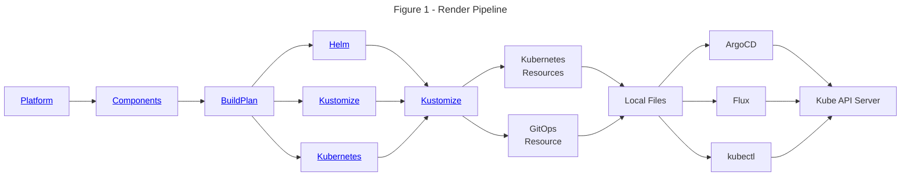

import Tabs from '@theme/Tabs';
import TabItem from '@theme/TabItem';
import Admonition from '@theme/Admonition';

# Quickstart

Welcome to the Holos Quickstart guide.  Holos is an open source tool to manage
software development platforms safely, easily, and consistently.  We'll use
Holos to manage a fictional bank's platform, the Bank of Holos.  In doing so
we'll take the time to explain the foundational concepts of Holos.

 1. **Platform** - Holos breaks a Platform down into Components owned by teams.
 2. **Component** - Components are CUE wrappers around unmodified upstream
 vendor Helm Charts, Kustomize Bases, or plain Kubernetes manifests.
 3. **CUE** - We write CUE to configure the platform.  We'll cover the basics of
 CUE syntax and why Holos uses CUE.
 4. **Tree Unification** - CUE files are organized into a unified filesystem
 tree.  We'll cover how unification makes it easier and safer for multiple teams
 to change the platform.

The Bank of Holos provides a good example of how Holos is designed to make it
easier for multiple teams to deliver services on a platform.  These teams are:

- **Platform**
- **Software development**
- **Security**
- **Quality Assurance**

In this guide we'll show how Holos enables teams to work autonomously
while still allowing the platform team to enforce the standards and policies
they care about to provide a secure and consistent software development platform.

Here's a screenshot of the retail banking application we'll build and deploy on
our platform.  We'll keep each of these teams in mind as we work through the
guides.  Each of our guides focuses on different aspects of delivering the Bank
of Holos.


## What you'll need {#requirements}

This guide is intended to be informative without needing to run the commands.
If you'd like to render the platform and apply the manifests to a real Cluster,
complete the [Local Cluster Guide](/docs/guides/local-cluster) before this
guide.

You'll need the following tools installed to run the commands in this guide.

1. [holos](/docs/install) - to build the Platform.
2. [helm](https://helm.sh/docs/intro/install/) - to render Holos Components that
wrap Helm charts.
3. [kubectl](https://kubernetes.io/docs/tasks/tools/) - to render Holos
Components that render with Kustomize.

## Install Holos

Start by installing the `holos` command line tool with the following command.
If you don't have Go, refer to [Installation](/docs/install/) to download the
executable.

<Tabs groupId="go-install">
  <TabItem value="command" label="Command">
```bash
go install github.com/holos-run/holos/cmd/holos@latest
```
  </TabItem>
  <TabItem value="output" label="Output">
```txt
go: downloading github.com/holos-run/holos v0.97.2
```
  </TabItem>
</Tabs>

:::tip
Nearly all day-to-day platform management tasks use the `holos` command line
tool to render plain Kubernetes manifests.
:::

## Fork the Git Repository

Building a software development platform from scratch takes time so we've
published an example for our guides.  [Fork the Bank of
Holos](https://github.com/holos-run/bank-of-holos/fork) to get started.

Clone the repository to your local machine.

<Tabs groupId="git-clone">
  <TabItem value="command" label="Command">
```bash
# Change YourName
git clone https://github.com/YourName/bank-of-holos
cd bank-of-holos
```
  </TabItem>
  <TabItem value="output" label="Output">
```txt
Cloning into 'bank-of-holos'...
remote: Enumerating objects: 1177, done.
remote: Counting objects: 100% (1177/1177), done.
remote: Compressing objects: 100% (558/558), done.
remote: Total 1177 (delta 394), reused 1084 (delta 303), pack-reused 0 (from 0)
Receiving objects: 100% (1177/1177), 2.89 MiB | 6.07 MiB/s, done.
Resolving deltas: 100% (394/394), done.
```
  </TabItem>
</Tabs>

Run the rest of the commands in this guide from the root of the repository.

## Configuring GitOps {#configuring-gitops}

The Bank of Holos platform is organized as a collection of software components.
Each component represents a piece of software provided by an upstream vendor,
for example ArgoCD, or software developed in-house.  Components are also used to
glue together, or integrate, other components into the platform.

The platform team provides ArgoCD as a means for teams to implement GitOps
within their software development workflow.  Each team using the Bank of Holos
platform uses a Holos resource provided by the platform team to create their
ArgoCD Application definition.  In doing so, the platform team has provided
a "golden path" for each team to independently make the changes they need
while still centrally enforcing the policies that provide a consistent and
safe experience.

Currently each team is using the upstream `bank-of-repo` repository as their
source of truth. We'll start by changing ArgoCD to point to our fork.  This will
allow us to be able to see the results of our changes in ArgoCD using a GitOps
workflow.

<Tabs groupId="argocd-config">
  <TabItem value="command" label="projects/argocd-config.cue">
```cue showLineNumbers
package holos

_ArgoConfig: {
	Enabled: true
	RepoURL: "https://github.com/jeffmccune/bank-of-holos"
}
```
  </TabItem>
</Tabs>

Change the RepoURL to the URL of your fork.  For example:

<Tabs groupId="F3BF73E3-3A70-40AF-9D4D-7134AF0A1763">
  <TabItem value="command" label="projects/argocd-config.cue">
```diff showLineNumbers
diff --git a/projects/argocd-config.cue b/projects/argocd-config.cue
index 1291a31..ff3bbfb 100644
--- a/projects/argocd-config.cue
+++ b/projects/argocd-config.cue
@@ -2,5 +2,5 @@ package holos
 
 _ArgoConfig: {
 	Enabled: true
-	RepoURL: "https://github.com/holos-run/bank-of-holos"
+	RepoURL: "https://github.com/jeffmccune/bank-of-holos"
 }

```
  </TabItem>
</Tabs>

We need to render the platform manifests after we make changes.

## Render the Platform

Platform rendering is is the process of looping over all the components in the
platform and rendering each one into plain kubernetes manifest files.  Holos is
designed to write plain manifest files which can be applied to Kubernetes, but
stops short of applying them so it's easier for team members to review and
understand changes before they're made.

<Tabs groupId="219C5B3D-1369-45F9-B010-64A87EF71190">
  <TabItem value="command" label="Command">
```bash
holos render platform ./platform
```
  </TabItem>
  <TabItem value="output" label="Output">
```txt
rendered app-projects for cluster workload in 206.109166ms
rendered httproutes for cluster workload in 222.3885ms
rendered istio-cni for cluster workload in 236.061167ms
rendered istio-gateway for cluster workload in 238.973167ms
rendered istio-ztunnel for cluster workload in 240.000042ms
rendered istiod for cluster workload in 275.385709ms
rendered bank-accounts-db for cluster workload in 215.252708ms
rendered bank-backend-config for cluster workload in 245.383333ms
rendered bank-secrets for cluster workload in 273.477458ms
rendered bank-userservice for cluster workload in 234.866375ms
rendered istio-base for cluster workload in 541.965042ms
rendered argocd for cluster workload in 352.4625ms
rendered bank-frontend for cluster workload in 374.208084ms
rendered bank-ledger-db for cluster workload in 224.120125ms
rendered bank-ledger-writer for cluster workload in 237.136042ms
rendered bank-balance-reader for cluster workload in 233.804083ms
rendered bank-transaction-history for cluster workload in 236.114542ms
rendered bank-contacts for cluster workload in 222.469875ms
rendered argocd-crds for cluster workload in 812.078042ms
rendered gateway-api for cluster workload in 173.66425ms
rendered external-secrets for cluster workload in 231.326958ms
rendered local-ca for cluster workload in 183.12425ms
rendered namespaces for cluster workload in 173.256125ms
rendered cert-manager for cluster workload in 432.088959ms
rendered external-secrets-crds for cluster workload in 496.282459ms
rendered platform in 1.106735958s
```
  </TabItem>
</Tabs>

Rendering the platform to plain manifest files allows us to see the changes
clearly.  We can see this one line change affected dozens ArgoCD Application
resources across the platform.

<Tabs groupId="266D26D4-31FC-45D1-88EF-EAD23BBBDCDD">
  <TabItem value="command" label="Command">
```bash
git status
```
  </TabItem>
  <TabItem value="output" label="Output">
```txt
On branch jeff/291-consistent-fields
Changes not staged for commit:
  (use "git add <file>..." to update what will be committed)
  (use "git restore <file>..." to discard changes in working directory)
	modified:   deploy/clusters/local/gitops/app-projects.gen.yaml
	modified:   deploy/clusters/local/gitops/argocd-crds.gen.yaml
	modified:   deploy/clusters/local/gitops/argocd.gen.yaml
	modified:   deploy/clusters/local/gitops/bank-accounts-db.gen.yaml
	modified:   deploy/clusters/local/gitops/bank-backend-config.gen.yaml
	modified:   deploy/clusters/local/gitops/bank-balance-reader.gen.yaml
	modified:   deploy/clusters/local/gitops/bank-contacts.gen.yaml
	modified:   deploy/clusters/local/gitops/bank-frontend.gen.yaml
	modified:   deploy/clusters/local/gitops/bank-ledger-db.gen.yaml
	modified:   deploy/clusters/local/gitops/bank-ledger-writer.gen.yaml
	modified:   deploy/clusters/local/gitops/bank-secrets.gen.yaml
	modified:   deploy/clusters/local/gitops/bank-transaction-history.gen.yaml
	modified:   deploy/clusters/local/gitops/bank-userservice.gen.yaml
	modified:   deploy/clusters/local/gitops/cert-manager.gen.yaml
	modified:   deploy/clusters/local/gitops/external-secrets-crds.gen.yaml
	modified:   deploy/clusters/local/gitops/external-secrets.gen.yaml
	modified:   deploy/clusters/local/gitops/gateway-api.gen.yaml
	modified:   deploy/clusters/local/gitops/httproutes.gen.yaml
	modified:   deploy/clusters/local/gitops/istio-base.gen.yaml
	modified:   deploy/clusters/local/gitops/istio-cni.gen.yaml
	modified:   deploy/clusters/local/gitops/istio-gateway.gen.yaml
	modified:   deploy/clusters/local/gitops/istio-ztunnel.gen.yaml
	modified:   deploy/clusters/local/gitops/istiod.gen.yaml
	modified:   deploy/clusters/local/gitops/local-ca.gen.yaml
	modified:   deploy/clusters/local/gitops/namespaces.gen.yaml
	modified:   projects/argocd-config.cue

no changes added to commit (use "git add" and/or "git commit -a")
```
  </TabItem>
</Tabs>

Take a look at the Application resource for the bank-frontend component to see
the changed `spec.source.repoURL` field.

<Tabs groupId="665E5402-FB42-4975-B654-3922EE73EE07">
  <TabItem value="command" label="Command">
```bash
git diff deploy/clusters/local/gitops/bank-frontend.gen.yaml
```
  </TabItem>
  <TabItem value="output" label="Output">
```diff showLineNumbers
diff --git a/deploy/clusters/local/gitops/bank-frontend.gen.yaml b/deploy/clusters/local/gitops/bank-frontend.gen.yaml
index e07d5ea..14cc71c 100644
--- a/deploy/clusters/local/gitops/bank-frontend.gen.yaml
+++ b/deploy/clusters/local/gitops/bank-frontend.gen.yaml
@@ -11,5 +11,5 @@ spec:
   project: bank-frontend
   source:
     path: deploy/clusters/local/components/bank-frontend
-    repoURL: https://github.com/holos-run/bank-of-holos
+    repoURL: https://github.com/jeffmccune/bank-of-holos
     targetRevision: main

```
  </TabItem>
</Tabs>

We'll add, commit, and push this change to our fork then take a little time to
explain what happened when we made the change and rendered the platform.

<Tabs groupId="BD6A968F-FFDF-486B-8EC0-BA8B39C19303">
  <TabItem value="command" label="Command">
```bash
git add .
git commit -m 'quickstart: change argocd repo url to our fork'
git push origin
```
  </TabItem>
  <TabItem value="output" label="Output">
```txt
[main f2f8bc2] quickstart: change argocd repo url to our fork
 26 files changed, 26 insertions(+), 26 deletions(-)
Enumerating objects: 41, done.
Counting objects: 100% (41/41), done.
Delta compression using up to 14 threads
Compressing objects: 100% (31/31), done.
Writing objects: 100% (33/33), 2.95 KiB | 2.95 MiB/s, done.
Total 33 (delta 28), reused 0 (delta 0), pack-reused 0
remote: Resolving deltas: 100% (28/28), completed with 4 local objects.
To github.com:jeffmccune/bank-of-holos.git
   c2951ec..f2f8bc2  main -> main
```
  </TabItem>
</Tabs>

## Platform Rendering Explained

So what happens when we run `holos render platform`?  We saw `holos` write plain
manifest files, let's dive into how and why we implemented platform rendering
like this.



### Why do we render the platform? {#why-render-the-platform}

We built Holos to make the process of managing a platform safer, easier, and
more consistent.  Before Holos we used Helm, Kustomize, and scripts to glue
together all of the software that goes into a platform.  Then we coaxed the
output of each tool into something that works with GitOps.  This approach has a
number of shortcomings.  We wanted to see the manifests before ArgoCD or Flux
applied them, so we wrote a lot of difficult to maintain scripts to get the
template output into something useful.  We tried avoiding the scripts by having
ArgoCD handle the Helm charts directly, but we could no longer see the changes
clearly during code review.

The platform rendering process allows us to have it both ways.  We avoid the
unsafe text templates and glue scripts by using CUE.  We're able to review the
exact changes that _will be_ applied during code review because holos renders
the whole platform to plain manifest files.

Finally, because we usually make each change by rendering the whole platform,
we're able to see and consider how a single-line change, like the one we just
made, affects the whole platform.  Before we made Holos we were frustrated with
how difficult it was to get this zoomed-out, broad perspective of each change we
made.

:::tip
Holos implements the [rendered manifests pattern] so you don't have to build it
yourself.
:::

### How does platform rendering work? {#how-platform-rendering-works}

Holos is declarative. CUE provides resources that declare what `holos` needs to
do.  The output of `holos` is always the same for the same inputs, so `holos` is
also idempotent.

When we run `holos render platform`, CUE builds the Platform specification
(spec).  This is a fancy way of saying a list of software to manage on each
cluster in the platform.  The CUE files in the `platform` directory provide the
platform spec to `holos`.

Let's open up two of these CUE files to see how this works.  Ignore the other
files for now, they behave the same as these two.

<Tabs groupId="6F01F2F7-C101-4212-A844-0E370B836B54">
  <TabItem value="argocd" label="platform/argocd.cue">
```cue showLineNumbers
package holos

// Manage the Component on every Cluster in the Platform
for Fleet in _Fleets {
	for Cluster in Fleet.clusters {
		_Platform: Components: "\(Cluster.name):argocd-crds": {
			name:      "argocd-crds"
			component: "projects/platform/components/argocd/crds"
			cluster:   Cluster.name
		}
		_Platform: Components: "\(Cluster.name):argocd": {
			name:      "argocd"
			component: "projects/platform/components/argocd/argocd"
			cluster:   Cluster.name
		}
	}
}
```
  </TabItem>
  <TabItem value="external-secrets" label="platform/external-secrets.cue">
```cue showLineNumbers
package holos

// Manage the component on every cluster in the platform
for Fleet in _Fleets {
	for Cluster in Fleet.clusters {
		_Platform: Components: "\(Cluster.name):external-secrets-crds": {
			name:      "external-secrets-crds"
			component: "projects/platform/components/external-secrets-crds"
			cluster:   Cluster.name
		}
		_Platform: Components: "\(Cluster.name):external-secrets": {
			name:      "external-secrets"
			component: "projects/platform/components/external-secrets"
			cluster:   Cluster.name
		}
	}
}
```
  </TabItem>
</Tabs>

There's quite a few new concepts to unpack in these two CUE files.

1. A Fleet is just a collection of clusters that share a similar, but not
identical configuration.  Most platforms have a management fleet with one
cluster to manage the platform, and a workload fleet for clusters that host the
services we deploy onto the platform.
2. A Cluster is a Kubernetes cluster.  Each component is rendered to plain
manifests for a cluster.

:::important
On lines 6 and 11 we see a Component being assigned to the Platform.  We also
start to dive into the syntax of CUE, which we need to understand a little
before going further.
:::

> In its simplest form, CUE looks a lot like JSON. This is because CUE is a
superset of JSON.  Or, put differently: all valid JSON is CUE.[^1]
>
> 1. C-style comments are allowed
> 2. field names without special characters don't need to be quoted
> 3. commas after a field are optional (and are usually omitted)
> 4. commas after the final element of a list are allowed
> 5. **the outermost curly braces in a CUE file are optional**
>
> JSON objects are called structs in CUE. JSON arrays are called lists, Object
members are called fields, which link their name, or label, to a value.

There are two important things to know about CUE to understand these two files.
First, the curly braces have been omitted which is item 5 on the list above.
Second, CUE is about _unification_.

:::important
Unlike most other languages, it is common to declare the same field in multiple
places.  CUE **unifies** the value of the field.  We can think of CUE as a
Configuration Unification Engine.
:::

Now that we know curly braces can be omitted and values are unified, we can
understand how the rest of the CUE files in the platform directory behave.

:::tip
Each CUE file in the platform directory adds components to the
`_Platform.Components` struct.
:::

The final file in the directory is responsible for producing the Platform spec.
It looks like this.

<Tabs groupId="166F0925-9405-4571-A0AB-C7E2107876FD">
  <TabItem value="command" label="platform/platform.gen.cue">
```cue showLineNumbers
package holos

import api "github.com/holos-run/holos/api/author/v1alpha4"

_Platform: api.#Platform & {
	Name: "default"
}

// Render a Platform resource for holos to process
_Platform.Resource
```
  </TabItem>
</Tabs>

This file provides the value of the `_Platform.Resource` field, the platform
spec, to `holos`.

Let's take a look at that Output value:

<Tabs groupId="475C92AC-C6DA-4FB9-859C-722921277CFC">
  <TabItem value="command" label="Command">
```bash
cue export --out yaml ./platform
```
  </TabItem>
  <TabItem value="output" label="Output">
```yaml showLineNumbers
kind: Platform
apiVersion: v1alpha4
metadata:
  name: default
spec:
  components:
    - name: httproutes
      component: projects/platform/components/httproutes
      cluster: local
    - name: istio-gateway
      component: projects/platform/components/istio/gateway
      cluster: local
    - name: istio-base
      component: projects/platform/components/istio/base
      cluster: local
    - name: istiod
      component: projects/platform/components/istio/istiod
      cluster: local
    - name: istio-cni
      component: projects/platform/components/istio/cni
      cluster: local
    - name: istio-ztunnel
      component: projects/platform/components/istio/ztunnel
      cluster: local
    - name: app-projects
      component: projects/platform/components/app-projects
      cluster: local
    - name: argocd-crds
      component: projects/platform/components/argocd/crds
      cluster: local
    - name: argocd
      component: projects/platform/components/argocd/argocd
      cluster: local
    - name: bank-secrets
      component: projects/bank-of-holos/security/components/bank-secrets
      cluster: local
    - name: bank-frontend
      component: projects/bank-of-holos/frontend/components/bank-frontend
      cluster: local
    - name: bank-backend-config
      component: projects/bank-of-holos/backend/components/bank-backend-config
      cluster: local
    - name: bank-accounts-db
      component: projects/bank-of-holos/backend/components/bank-accounts-db
      cluster: local
    - name: bank-userservice
      component: projects/bank-of-holos/backend/components/bank-userservice
      cluster: local
    - name: bank-ledger-db
      component: projects/bank-of-holos/backend/components/bank-ledger-db
      cluster: local
    - name: bank-ledger-writer
      component: projects/bank-of-holos/backend/components/bank-ledger-writer
      cluster: local
    - name: bank-balance-reader
      component: projects/bank-of-holos/backend/components/bank-balance-reader
      cluster: local
    - name: bank-transaction-history
      component: projects/bank-of-holos/backend/components/bank-transaction-history
      cluster: local
    - name: bank-contacts
      component: projects/bank-of-holos/backend/components/bank-contacts
      cluster: local
    - name: cert-manager
      component: projects/platform/components/cert-manager
      cluster: local
    - name: external-secrets-crds
      component: projects/platform/components/external-secrets-crds
      cluster: local
    - name: external-secrets
      component: projects/platform/components/external-secrets
      cluster: local
    - name: gateway-api
      component: projects/platform/components/gateway-api
      cluster: local
    - name: local-ca
      component: projects/platform/components/local-ca
      cluster: local
    - name: namespaces
      component: projects/platform/components/namespaces
      cluster: local
```
  </TabItem>
</Tabs>

:::tip
You don't normally need to execute `cue`, CUE is built into `holos`.  We use it
here to gain insight.
:::

We see the platform spec is essentially a list of components, each assigned to a
cluster.

:::important
Notice CUE unifies `Components` from multiple files into one list.

We'll see this unification behavior again and again.  Unification is the
defining characteristic of CUE that makes it a unique, powerful, and _safe_
configuration language.
:::

Holos takes this list of components and builds each one by executing the following command.

```bash
holos render component --cluster-name="example" "path/to/the/component"
```

We can think of platform rendering as rendering a list of components, passing
the cluster name each time.  Rendering each component writes the fully rendered
manifest for that component to the `deploy/` directory, organized by cluster for
GitOps.

## Render a Component

Rendering a component works much the same way as rendering a platform. `holos`
uses CUE to produce a specification, then processes it.  The specification of a
component is called a BuildPlan.  A BuildPlan is a list of zero or more
kubernetes resources, Helm charts, Kustomize bases, and additional files to
write into the `deploy/` directory.

Now let's look at the cert-manager component.  Notice the
`platform/cert-manager.cue` file has the field `path:
"projects/platform/components/cert-manager"`.  This path indicates where to
start working with the cert-manager component.

<Tabs groupId="129DD743-0FE3-44C0-ACA4-6569C98BA40E">
  <TabItem value="cert-manager" label="projects/platform/components/cert-manager/cert-manager.cue">
```cue showLineNumbers
package holos

// Produce a helm chart build plan.
_HelmChart.BuildPlan

_HelmChart: #Helm & {
	Name:      "cert-manager"
	Namespace: _CertManager.Namespace

	Chart: {
		version: _CertManager.Version
		repository: {
			name: "jetstack"
			url:  "https://charts.jetstack.io"
		}
	}
	EnableHooks: true

	Values: #Values & {
		crds: enabled:            true
		startupapicheck: enabled: false
		// https://github.com/cert-manager/cert-manager/issues/6716
		global: leaderElection: namespace: Namespace
	}
}
```
  </TabItem>
  <TabItem value="root" label="projects/cert-manager.cue">
```cue showLineNumbers
package holos

#CertManager: {
	Version:   string
	Namespace: string
}

// Platform wide configuration
_CertManager: {
	Version:   "v1.16.1"
	Namespace: "cert-manager"
}

// Register the namespace
_Namespaces: (_CertManager.Namespace): _
```
  </TabItem>
</Tabs>

This file introduces a few new concepts.

1. Line 4 indicates this component produces a BuildPlan that wraps a Helm Chart.
2. Notice `_HelmChart` is referenced on line 4 before it's defined on line 6.
**Order is irrelevant in CUE**.  Complex changes are simpler and easier when we
don't have to think about order.
3. Line 8 and 11: The chart version and namespace are defined in a different
file closer to the root, `projects/cert-manager.cue`
4. Line 19: Helm values are defined in CUE to take advantage of strong type
checking and manage multiple Helm charts consistently with the same values.

Let's take a look at the BuildPlan that results from the CUE configuration
described above.

<Tabs groupId="B54D5791-4E5B-4148-A368-62D9BE80760C">
  <TabItem value="command" label="Command">
```bash
cue export --out yaml ./projects/platform/components/cert-manager
```
  </TabItem>
  <TabItem value="output" label="Output">
```yaml showLineNumbers
kind: BuildPlan
apiVersion: v1alpha4
metadata:
  name: cert-manager
spec:
  component: no-component
  artifacts:
    - artifact: clusters/no-cluster/components/cert-manager/cert-manager.gen.yaml
      generators:
        - kind: Helm
          output: helm.gen.yaml
          helm:
            chart:
              name: cert-manager
              version: v1.16.1
              release: cert-manager
              repository:
                name: jetstack
                url: https://charts.jetstack.io
            values:
              global:
                imagePullSecrets: []
                commonLabels: {}
                priorityClassName: ""
                rbac:
                  create: true
                  aggregateClusterRoles: true
                podSecurityPolicy:
                  enabled: false
                  useAppArmor: true
                logLevel: 2
                leaderElection:
                  namespace: cert-manager
              installCRDs: false
              crds:
                enabled: true
                keep: true
              replicaCount: 1
              strategy: {}
              podDisruptionBudget:
                enabled: false
              featureGates: ""
              maxConcurrentChallenges: 60
              image:
                repository: quay.io/jetstack/cert-manager-controller
                pullPolicy: IfNotPresent
              clusterResourceNamespace: ""
              namespace: ""
              serviceAccount:
                create: true
                automountServiceAccountToken: true
              enableCertificateOwnerRef: false
              config: {}
              dns01RecursiveNameservers: ""
              dns01RecursiveNameserversOnly: false
              disableAutoApproval: false
              approveSignerNames:
                - issuers.cert-manager.io/*
                - clusterissuers.cert-manager.io/*
              extraArgs: []
              extraEnv: []
              resources: {}
              securityContext:
                runAsNonRoot: true
                seccompProfile:
                  type: RuntimeDefault
              containerSecurityContext:
                allowPrivilegeEscalation: false
                capabilities:
                  drop:
                    - ALL
                readOnlyRootFilesystem: true
              volumes: []
              volumeMounts: []
              podLabels: {}
              hostAliases: []
              nodeSelector:
                kubernetes.io/os: linux
              ingressShim: {}
              affinity: {}
              tolerations: []
              topologySpreadConstraints: []
              livenessProbe:
                enabled: true
                initialDelaySeconds: 10
                periodSeconds: 10
                timeoutSeconds: 15
                successThreshold: 1
                failureThreshold: 8
              enableServiceLinks: false
              prometheus:
                enabled: true
                servicemonitor:
                  enabled: false
                  prometheusInstance: default
                  targetPort: 9402
                  path: /metrics
                  interval: 60s
                  scrapeTimeout: 30s
                  labels: {}
                  annotations: {}
                  honorLabels: false
                  endpointAdditionalProperties: {}
                podmonitor:
                  enabled: false
                  prometheusInstance: default
                  path: /metrics
                  interval: 60s
                  scrapeTimeout: 30s
                  labels: {}
                  annotations: {}
                  honorLabels: false
                  endpointAdditionalProperties: {}
              webhook:
                replicaCount: 1
                timeoutSeconds: 30
                config: {}
                strategy: {}
                securityContext:
                  runAsNonRoot: true
                  seccompProfile:
                    type: RuntimeDefault
                containerSecurityContext:
                  allowPrivilegeEscalation: false
                  capabilities:
                    drop:
                      - ALL
                  readOnlyRootFilesystem: true
                podDisruptionBudget:
                  enabled: false
                validatingWebhookConfiguration:
                  namespaceSelector:
                    matchExpressions:
                      - key: cert-manager.io/disable-validation
                        operator: NotIn
                        values:
                          - "true"
                mutatingWebhookConfiguration:
                  namespaceSelector: {}
                extraArgs: []
                extraEnv: []
                featureGates: ""
                resources: {}
                livenessProbe:
                  failureThreshold: 3
                  initialDelaySeconds: 60
                  periodSeconds: 10
                  successThreshold: 1
                  timeoutSeconds: 1
                readinessProbe:
                  failureThreshold: 3
                  initialDelaySeconds: 5
                  periodSeconds: 5
                  successThreshold: 1
                  timeoutSeconds: 1
                nodeSelector:
                  kubernetes.io/os: linux
                affinity: {}
                tolerations: []
                topologySpreadConstraints: []
                podLabels: {}
                serviceLabels: {}
                serviceIPFamilyPolicy: ""
                serviceIPFamilies: []
                image:
                  repository: quay.io/jetstack/cert-manager-webhook
                  pullPolicy: IfNotPresent
                serviceAccount:
                  create: true
                  automountServiceAccountToken: true
                securePort: 10250
                hostNetwork: false
                serviceType: ClusterIP
                url: {}
                networkPolicy:
                  enabled: false
                  ingress:
                    - from:
                        - ipBlock:
                            cidr: 0.0.0.0/0
                  egress:
                    - ports:
                        - port: 80
                          protocol: TCP
                        - port: 443
                          protocol: TCP
                        - port: 53
                          protocol: TCP
                        - port: 53
                          protocol: UDP
                        - port: 6443
                          protocol: TCP
                      to:
                        - ipBlock:
                            cidr: 0.0.0.0/0
                volumes: []
                volumeMounts: []
                enableServiceLinks: false
              cainjector:
                enabled: true
                replicaCount: 1
                config: {}
                strategy: {}
                securityContext:
                  runAsNonRoot: true
                  seccompProfile:
                    type: RuntimeDefault
                containerSecurityContext:
                  allowPrivilegeEscalation: false
                  capabilities:
                    drop:
                      - ALL
                  readOnlyRootFilesystem: true
                podDisruptionBudget:
                  enabled: false
                extraArgs: []
                extraEnv: []
                featureGates: ""
                resources: {}
                nodeSelector:
                  kubernetes.io/os: linux
                affinity: {}
                tolerations: []
                topologySpreadConstraints: []
                podLabels: {}
                serviceLabels: {}
                image:
                  repository: quay.io/jetstack/cert-manager-cainjector
                  pullPolicy: IfNotPresent
                serviceAccount:
                  create: true
                  automountServiceAccountToken: true
                volumes: []
                volumeMounts: []
                enableServiceLinks: false
              acmesolver:
                image:
                  repository: quay.io/jetstack/cert-manager-acmesolver
                  pullPolicy: IfNotPresent
              startupapicheck:
                enabled: false
                securityContext:
                  runAsNonRoot: true
                  seccompProfile:
                    type: RuntimeDefault
                containerSecurityContext:
                  allowPrivilegeEscalation: false
                  capabilities:
                    drop:
                      - ALL
                  readOnlyRootFilesystem: true
                timeout: 1m
                backoffLimit: 4
                jobAnnotations:
                  helm.sh/hook: post-install
                  helm.sh/hook-weight: "1"
                  helm.sh/hook-delete-policy: before-hook-creation,hook-succeeded
                extraArgs:
                  - -v
                extraEnv: []
                resources: {}
                nodeSelector:
                  kubernetes.io/os: linux
                affinity: {}
                tolerations: []
                podLabels: {}
                image:
                  repository: quay.io/jetstack/cert-manager-startupapicheck
                  pullPolicy: IfNotPresent
                rbac:
                  annotations:
                    helm.sh/hook: post-install
                    helm.sh/hook-weight: "-5"
                    helm.sh/hook-delete-policy: before-hook-creation,hook-succeeded
                serviceAccount:
                  create: true
                  annotations:
                    helm.sh/hook: post-install
                    helm.sh/hook-weight: "-5"
                    helm.sh/hook-delete-policy: before-hook-creation,hook-succeeded
                  automountServiceAccountToken: true
                volumes: []
                volumeMounts: []
                enableServiceLinks: false
              extraObjects: []
              creator: helm
              enabled: true
            enableHooks: true
            namespace: cert-manager
        - kind: Resources
          output: resources.gen.yaml
          resources: {}
      transformers:
        - kind: Kustomize
          inputs:
            - helm.gen.yaml
            - resources.gen.yaml
          output: combined.gen.yaml
          kustomize:
            kustomization:
              resources:
                - helm.gen.yaml
                - resources.gen.yaml
              kind: Kustomization
              apiVersion: kustomize.config.k8s.io/v1beta1
        - kind: Kustomize
          inputs:
            - combined.gen.yaml
          output: clusters/no-cluster/components/cert-manager/cert-manager.gen.yaml
          kustomize:
            kustomization:
              namespace: cert-manager
              commonLabels:
                holos.run/component.name: cert-manager
                argocd.argoproj.io/instance: cert-manager
              resources:
                - combined.gen.yaml
    - artifact: clusters/no-cluster/gitops/cert-manager.gen.yaml
      generators:
        - kind: Resources
          output: application.gen.yaml
          resources:
            Application:
              cert-manager:
                apiVersion: argoproj.io/v1alpha1
                kind: Application
                metadata:
                  name: cert-manager
                  namespace: argocd
                spec:
                  destination:
                    server: https://kubernetes.default.svc
                  project: platform
                  source:
                    path: deploy/clusters/no-cluster/components/cert-manager
                    repoURL: https://github.com/jeffmccune/bank-of-holos
                    targetRevision: main
      transformers:
        - kind: Kustomize
          inputs:
            - application.gen.yaml
          output: clusters/no-cluster/gitops/cert-manager.gen.yaml
          kustomize:
            kustomization:
              commonLabels:
                holos.run/component.name: cert-manager
              resources:
                - application.gen.yaml
```
  </TabItem>
</Tabs>

:::important
Again, you don't normally need to execute `cue`, it's built into `holos`.  We
use it here to show how Holos works with Helm.
:::

Looking at the BuildPlan, we see `holos` will render the Helm chart into the
deploy directory along with an ArgoCD Application resource in the `gitops/`
directory.

:::tip
The BuildPlan API is flexible enough to write any file into the `deploy/`
directory.  Holos uses this flexibility to support both Flux and ArgoCD.
:::

When we run `cue export`, we get back a [Core API] BuildPlan.  The BuildPlan is
produced by the `#Helm` definition on line 4 which is part of the [Author API].
The Core API is the contract between CUE and `holos`.  As such, it's not as
friendly as the Author API.  The Author API is the contract component authors
and platform engineers use to configure and manage the platform.  The Author API
is meant for people, the Core API is meant for machines.  This explains why we
see quite a few fields in the exported BuildPlan we didn't cover in this guide.
Day to day we don't need to be concerned with those fields because the Author
API handles them for us.

:::tip
Our intent is to provide an ergonomic way to manage the platform with the Author
API.
:::

When the Author API doesn't offer a path forward, authors may use the Core API
directly from CUE.  We can think of the Core API as an escape hatch for the
Author API.  We'll see some examples of this in action in the more advanced
guides.

## Review

Let's review the concepts we've covered in this guide:

- A Holos platform is comprised of the CUE files that define the platform specification within the `platform` directory.
- The files in the `platform` directory each model an individual Holos component, and provide the path to the directory where the component's CUE configuration resides.
- A Holos platform must be rendered to generate Kubernetes manifest files.
- Holos resources enable teams to work autonomously while still allowing for centralized enforcement of company policies.
- Changes to one component can impact other components, and we can use `holos render platform` with `git diff` to assess the impact.

## Next Steps

Thank you for finishing the Quickstart guide.  Dive deeper with the next guide
on how to [Deploy a Service] which explains how to take one of your existing
Helm charts or Deployments and manage it with Holos.

[application]: https://argo-cd.readthedocs.io/en/stable/user-guide/application-specification/
[core]: /docs/api/core/v1alpha4/
[Core API]: /docs/api/core/
[Author API]: /docs/api/author/
[Deploy a Service]: /docs/guides/deploy-a-service/
[Manage a Project]: /docs/guides/manage-a-project/
[rendered manifests pattern]: https://akuity.io/blog/the-rendered-manifests-pattern/
[^1]: [The Basics of CUE](https://cuelang.org/docs/tour/basics/json-superset/)
