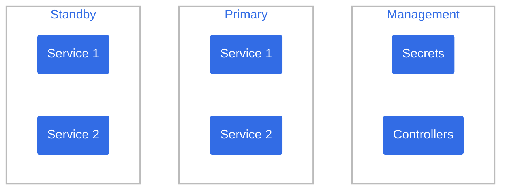

# Architecture

This page describes the architecture of the Holos reference platform.

## Overview

The reference platform manages three kubernetes clusters by default.  One management cluster and two workload clusters.

The services in each cluster type are:

:::tip
The management cluster is designed to operate reliably on spot instances.  A highly available management cluster typically costs less than a cup of coffee per month to operate.
:::

1. Management Cluster
   - **SecretStore** to provide namespace scoped secrets to workload clusters.
   - **CertManager** to provision TLS certificates and make them available to workload clusters.
   - **ClusterAPI** to provision and manage workload clusters via GitOps.  For example, EKS or GKE clusters.
   - **Crossplane** to provision and manage cloud resources via GitOps.  For example, buckets, managed databases, any other cloud resource.
   - **CronJobs** to refresh short lived credentials.  For example image pull credentials.
   - **ArgoCD** to manage resources within the management cluster via GitOps.
2. Primary Workload Cluster
   - **ArgoCD** to continuously deploy your applications and services via GitOps.
   - **External Secrets Operator** to synchronize namespace scoped secrets.
   - **Istio** to provide a Gateway to expose services.
   - **ZITADEL** to provide SSO login for all other services (e.g. ArgoCD, Grafana, Backstage, etc...)
   - **PostgreSQL** for in-cluster databases.
   - **Backstage** to provide your developer portal into the whole platform.
   - **Observability** implemented by Prometheus, Grafana, and Loki to provide monitoring and logging.
   - **AuthorizationPolicy** to provide role based access control to all services in the cluster.
3. Standby Workload Cluster
   - Identical configuration to the primary cluster.
   - May be scaled down to zero to reduce expenses.
   - Intended to take the primary cluster role quickly, within minutes, for disaster recovery or regular maintenance purposes.

## Security

### Namespaces

Namespaces are security boundaries in the reference platform.  A given namespace is treated as the same security context across multiple clusters following the [SIG Multi-cluster Position](https://github.com/kubernetes/community/blob/dd4c8b704ef1c9c3bfd928c6fa9234276d61ad18/sig-multicluster/namespace-sameness-position-statement.md).

The namespace sameness principle makes role based access control straightforward to manage and comprehend.  For example, granting a developer the ability to create secrets in namespace `example` means the developer has the ability to do so in the secret store in the management cluster and also synchronize the secret to the services they own in the workload clusters.

## Data Platform

Holos is designed to work with two distinct types of databases by default:

 1. In-cluster PostgresSQL databases for lower cost and rapid development and testing.
 2. Out-of-cluster SQL databases for production services, e.g. RDS, CloudSQL, Aurora, Redshift, etc...

:::tip
To simplify maintenance the holos reference platform provisions databases from the most recent backup by default.
:::

In-cluster databases in the holos reference platform automatically save backups to an S3 or GCS bucket.  For regular maintenance and disaster recovery, the standby cluster automatically restores databases from the most recent backup in the bucket.  This capability makes  maintenance much simpler, most maintenance tasks are carried out on the standby cluster which is then promoted to the primary.  Software upgrades in particular are intended to be carried out against the standby, verified, then promoted to primary.  Once live traffic shifts to the upgraded services in the new primary the previous cluster can be spun down to save cost or upgraded safely in place.
