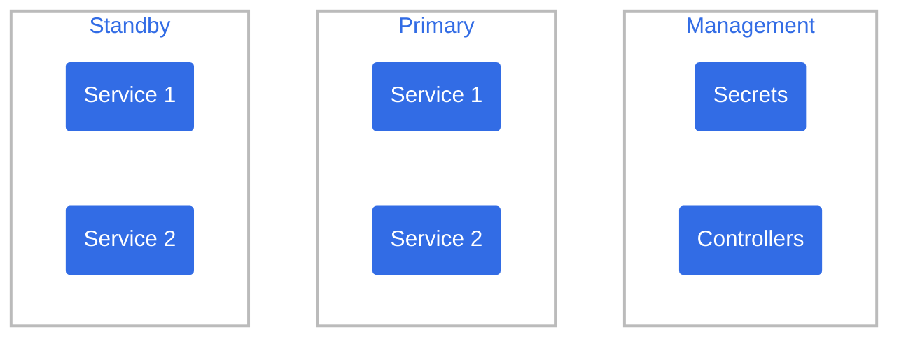

# Architecture

This page describes the architecture of the Holos reference platform.

## System Context

```mermaid
graph TB
   subgraph "Management"
       secrets(Secrets)
       c1(Controllers)
   end

   subgraph "Primary"
       s1p(Service 1)
       s2p(Service 2)
   end

   subgraph "Standby"
       s1s(Service 1)
       s2s(Service 2)
   end
 
   classDef plain fill:#ddd,stroke:#fff,stroke-width:4px,color:#000;
   classDef k8s fill:#326ce5,stroke:#fff,stroke-width:4px,color:#fff;
   classDef cluster fill:#fff,stroke:#bbb,stroke-width:2px,color:#326ce5;
   class c1,s1p,s2p,s1s,s2s,secrets k8s;
   class Management,Primary,Standby cluster;

```

## Applications

## Component

## Code
