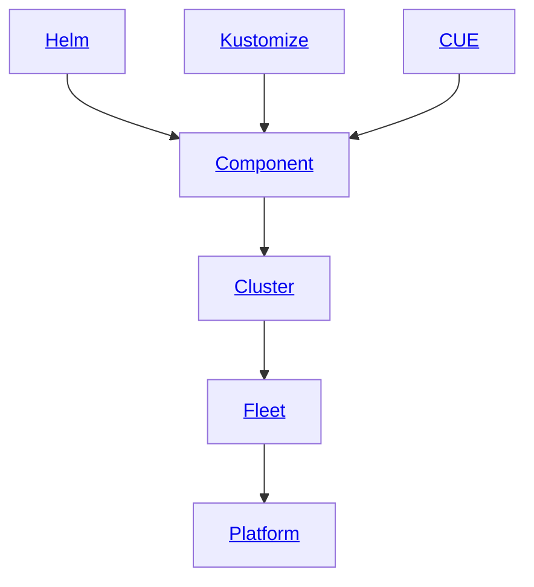
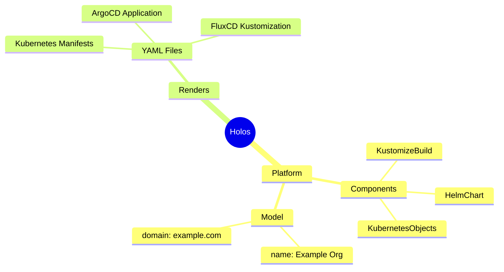

import RenderingPipeline from '@site/src/components/_rendering-pipeline.mdx';

# Concepts

## Introduction

This page is intended as a high level conceptual overview of the key concepts in
Holos.  Refer to the [Core API](/docs/api/core/) for low level reference
documentation.

Holos is a tool built for platform engineers.  The Holos authors share three
core values which guide our design decisions for the tool.

1. Safety
2. Ease of use
3. Consistency

Each of the following concepts are intended to support and strengthen one or
more of these core values.  In this way we hope to lighten the burden carried by
platform engineers.

## Concepts

- [Component](<#component>) - The primary building block in Holos, wraps a Helm chart, Kustomize base, or plain resources defined in CUE.
- [Platform](<#platform>) - A collection of Components integrated into a software development platform.
- [Model](<#model>) - Structured data included in the Platform specification, available to all Components.  For example, your organization's domain name.
- [Rendering](<#rendering>) - Holos is a tool that makes the process of rendering Kubernetes manifests safer, easier, and consistent.
- [Cluster](<#cluster>) - A Kubernetes cluster.  Components are rendered for and applied to a Cluster.
- [Fleet](<#fleet>) - A collection of Clusters with a similar purpose.  A Platform is typically composed of two Fleets, one for management the second for workloads.



:::tip
This graph is organized as a tree.  We often say configuration at the root
defines the broad Platform.  Configuration at a leaf defines a Component of the
Platform.  The concept of a tree also reflects the filesystem organization of
the configuration.
:::

<!--



-->


## Component

A Component is the primary building block when managing software with Holos.  A
software project you wish to integrate into your platform, for example ArgoCD,
is managed using one or more components.

The primary Component kinds are:

1. **HelmChart** to render config provided by Helm.
2. **KustomizeBuild** to render config provided by Kustomize.
3. **KubernetesObjects** to render config provided by CUE.

Components are intended to integrate unmodified upstream software releases into
your Platform.  In this way, the focus of a Component is more about the unique
differentiating aspects of your platform than the upstream software contained in
the Component.

#### Example HelmChart Component

The ArgoCD Component is a good example of a HelmChart component because it takes
advantage of most of the key features that empower you to focus on the key
differentiators of your unique platform.

Take note of the following key points in this example ArgoCD Component:

1. The Component wraps the ArgoCD Helm Chart in a way that's easy to upgrade and maintain over time.
2. Newer Gateway API resources are mixed-in replacing the older Ingress resource included in the chart.
3. Helm output is passed through Kustomize to configure secure mutual TLS encryption.
4. Helm values are easier and safer to manipulate with CUE instead of text markup.
5. Kustomize is easier and safer to manipulate with CUE instead of text markup.
6. Platform data Model values are easily accessible, for example the OIDC issuer and the organizations's domain name.

The Component wraps around the unmodified upstream ArgoCD helm chart
providing easier upgrades as new versions are released.

Note how the Component facilitates composition by allowing us to mix-in new
functionality from the ecosystem without modifying the upstream chart.  The
Platform this Component integrates with uses the new Gateway API, but the
upstream helm chart does not yet support Gateway API.  See how the Resources
field is used to mix-in a ReferenceGrant from the Gateway API without modifying
the upstream helm chart.

The Platform uses Istio to implement service to service encryption with mutual
TLS.  The Component passes the Helm output to Kustomize to integrate with Istio.
Kustomize is used to patch the argocd-server Deployment resource to inject the
Istio sidecar for mutual TLS.

Helm values are safer and easier to work with in CUE.  Note how you can modify
helm values using well defined data instead of manipulating text yaml files.
Similarly, the yaml files used for Kustomize are produced by CUE, which is again
safer and easier because the Kustomize spec has been imported into CUE and is
validated.

Finally, the domain name used by this Platform is easily accessible from the
PlatformSpec which is defined at the root level and made available to all
components integrated into the platform.  Similarly, data values shared by all
of the Components that make up ArgoCD is defined in a structure accessible by
each of these components.

```cue
package holos

import (
	"encoding/yaml"
	"strings"
)

// Produce a helm chart build plan.
(#Helm & Chart).Output

let Chart = {
	Name:      "argo-cd"
	Namespace: "argocd"
	Version:   "7.1.1"

	Chart: chart: release: "argocd"

	// The upstream chart uses a Job to create the argocd-redis Secret.  Enable
	// hooks to enable the Job.
	Chart: enableHooks: true

	Repo: name: "argocd"
	Repo: url:  "https://argoproj.github.io/argo-helm"

	// Ensure all of our mix-in resources go into the same namespace as the Chart.
	Resources: [_]: [_]: metadata: namespace: Namespace

	// Grant the Gateway namespace the ability to refer to the backend service
	// from HTTPRoute resources.
	Resources: ReferenceGrant: (#IstioGatewaysNamespace): #ReferenceGrant

	// Pass the helm output through kustomize.
	EnableKustomizePostProcessor: true

	// Force all resources into the component namespace, some resources in the
	// helm chart do not specify the namespace so they will get mis-applied
	// when the kubectl (client-go) context is another namespace.
	KustomizeFiles: "kustomization.yaml": namespace: Namespace

	// Patch the backend with the service mesh sidecar.
	KustomizePatches: {
		mesh: {
			target: {
				group:   "apps"
				version: "v1"
				kind:    "Deployment"
				name:    "argocd-server"
			}
			patch: yaml.Marshal(IstioInject)
		}
	}

	Values: #Values & {
		kubeVersionOverride: "1.29.0"
		// handled in the argo-crds component
		crds: install:  false
		global: domain: "argocd.\(_Platform.Model.org.domain)"
		dex: enabled:   false
		// the service mesh handles secure mTLS
		configs: params: "server.insecure": true
		configs: cm: {
			"admin.enabled":           false
			"oidc.config":             yaml.Marshal(OIDCConfig)
			"users.anonymous.enabled": "false"
		}

		// Refer to https://argo-cd.readthedocs.io/en/stable/operator-manual/rbac/
		let Policy = [
			"g, argocd-view, role:readonly",
			"g, prod-cluster-view, role:readonly",
			"g, prod-cluster-edit, role:readonly",
			"g, prod-cluster-admin, role:admin",
		]

		configs: rbac: "policy.csv": strings.Join(Policy, "\n")
	}
}

let IstioInject = [{
	op:    "add",
	path:  "/spec/template/metadata/labels/sidecar.istio.io~1inject",
	value: "true",
}]

let OIDCConfig = {
	name:            "Holos Platform"
	issuer:          _ArgoCD.issuerURL
	clientID:        _ArgoCD.clientID
	requestedScopes: _ArgoCD.scopesList
	// Set redirect uri to https://argocd.example.com/pkce/verify
	enablePKCEAuthentication: true
	// groups is essential for rbac
	requestedIDTokenClaims: groups: essential: true
}
```

## Platform

A Platform refers to all of the software and services integrated together to
provide your organization's software development platform.  Holos is designed to
manage all of the resources that compose your Platform using the [Kubernetes
Resource Model][krm] (KRM).  Nearly all platforms are larger than Kubernetes
itself.  For example, your developers likely need a GCS or S3 bucket to store
data.  Holos takes advantage of Crossplane to manage resources in a consistent
way.

Holos defines a [Platform][Platform] object which collects multiple Components
together along with organizational data defined by your Model.  Consider the
following example, which is a Platform that manages a single Component which
manages namespaces for each cluster in the Platform.

```cue
package holos

import v1 "github.com/holos-run/holos/api/v1alpha2"

v1.#Platform & {
	metadata: name: "example"

	spec: components: [{
		path:    "components/namespaces"
		cluster: "cluster1"
	}]
}
```

This platform is rendered by the command:

```bash
holos render platform ./platform
```

When Holos renders the platform, it iterates over each component, generates and
executes a [BuildPlan][BuildPlan], then writes the fully rendered output of the
component to the filesystem.  In this simple example, two files are produced:

1. `deploy/clusters/cluster1/components/namespaces/namespaces.gen.yaml`
2. `deploy/clusters/cluster1/gitops/namespaces.application.gen.yaml`

The first file is a plain kubernetes manifest containing Namespace resources.
The second file is an ArgoCD Application resource to deploy and manage the
resources defined in the first file.

## Model

The Platform Model is where you store top-level data values used throughout
multiple components in your Platform.  Your organization's domain name is a
prime example of the kind of data stored in the Model.  Many components derive
host names from your organization's domain name.  CUE makes this process safe,
easy, and consistent.  For example:

```cue
hostname: "argocd.\(_Platform.Model.org.domain)"
```

When Holos renders a Platform, the model is loaded from a JSON file in the local
filesystem.  The platform model file is intended to be committed to version
control along with the rest of the Holos Platform and Component code.

Holos additionally provides a web ui and form to make it easy to enter and
validate top level configuration data.  You have complete control over the web
form, it's rendered from JSON data defined by CUE.  Customizing the web form is
an advanced topic, the key concept to take away is the Model is for top level,
platform-wide data.  You control the shape and structure of the Model, and you
have the ability to collect Model values using a simple web form.

## Rendering

Holos uses the Kubernetes resource model to manage configuration.  The Holos
command line interface is the primary method you'll use to manage your platform.
Holos uses CUE to provide a unified configuration model of the platform.  This
unified configuration is built up from components packaged with Helm, Kustomize,
CUE, or any other tool that can produce Kubernetes resource manifests as output.

This process can be thought of as a data **rendering pipeline**.  The key
concept is that Holos will always produce fully rendered output, but delegates
the _application_ of the configuration to other tools like kubectl apply,
ArgoCD, or Flux.

<RenderingPipeline />

## Cluster

A Cluster represents a Kubernetes cluster.  One component may be reused across
multiple different Clusters.

## Fleet

A Fleet represents a group of Clusters that share a similar purpose.  A Platform
typically has two Fleets, one for management and one for workloads.

[krm]: https://docs.google.com/document/d/1RmHXdLhNbyOWPW_AtnnowaRfGejw-qlKQIuLKQWlwzs/view#heading=h.sa6p0aye4ide
[Platform]: /docs/api/core/v1alpha2/#Platform
[BuildPlan]: /docs/api/core/v1alpha2/#BuildPlan
