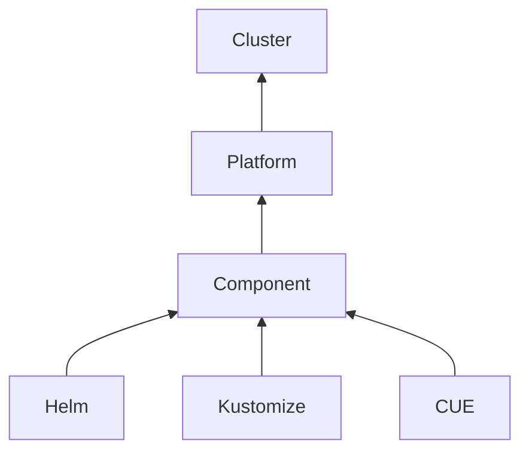

# Overview

Holos is an open-source tool that simplifies software integration for platform
teams. While most Kubernetes tools focus on application management, Holos takes
a holistic infrastructure-as-code (IaC) approach, targeting the integration
layer where applications and organizational data converge. By providing
well-defined, typed structures for consistent validation, Holos reduces errors,
streamlines integration, and creates clear pathways for teams to easily
integrate their services.

# How Holos works

Holos implements the [rendered manifests pattern][rmp], generating fully
rendered Kubernetes manifests from [CUE language][CUE] abstractions called
Components. These Components can model [Helm charts][Helm], [Kustomize
bases][Kustomize], or native Kubernetes resources. A Holos Platform consists of
one or more Components and is applied to one or more Kubernetes clusters.

# Holos' role in your workflow

Holos generates, but does not apply, rendered manifests, allowing teams to use
`git diff` to clearly see changes and assess the impact on clusters and services
before deploying. Instead, Holos manages the GitOps configuration for tools like
ArgoCD and Flux CD, enabling continuous deployment of resource changes with the
full visibility and control that these tools provide. As a result, expect Holos
to sit at the very end of a CI pipeline.

# Advantages of using Holos

### Safety

* CUE constraints on Holos Components surface validation errors early in the
development process, reducing the number of failed deployments and the time
spent troubleshooting them.
* Holos natively provides a "blast radius" to code
changes by identifying the rendered manifests across your fleet of Kubernetes
clusters that will be affected by the change.
* CUE's unification strategy allows multiples teams to contribute to the desired
state of a service:
    * The Platform team provides definitions for shared resources.
    * Engineering teams populate definitions with service-specific data.
    * The Security team provides concrete values that cannot be changed to harden the company's security posture.

### Flexibility

* CUE is adept at modeling variation and organizational complexity at scale,
while Holos enables seamless integration of CUE data with native Kubernetes
tools such as [Helm][Helm] and [Kustomize][Kustomize].
* Holos is extensible, allowing Holos Components to be modeled from any tool that
generates (e.g. `helm`) or transforms (e.g.  `kustomize`) manifest data.

### Consistency

* Holos manages the execution context for Helm and Kustomize, ensuring that
rendered manifests are consistently and reliably reproducible, no matter where
Holos is run.
* CUE constraints ensure that data abstractions include the required information
in the expected format, triggering early failures if any required data is
missing.

# When not to use Holos

Holos excels at configuration management and is most effective when integrated
into a broader Kubernetes deployment strategy. If you need a single tool to
manage the entire lifecycle of a Kubernetes cluster, Holos may not fully meet
your needs on its own.

# Next Steps

Now that you have a base understanding of how Holos works, continue
to the [Setup page](./2-setup.mdx) that guides you through installing Holos and
initializing your first Platform.

[rmp]: https://akuity.io/blog/the-rendered-manifests-pattern
[Helm]: https://helm.sh/
[Kustomize]: https://kustomize.io/
[CUE]: https://cuelang.org/
