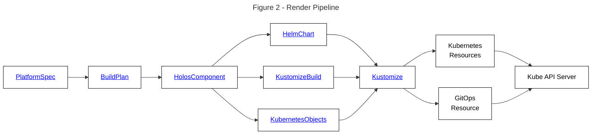

import Tabs from '@theme/Tabs';
import TabItem from '@theme/TabItem';

# Try Holos Locally

Learn how to configure and deploy the Holos reference platform to your local host with k3d.

---

This guide assumes commands are run from your local host.  Capitalized terms
have specific definitions described in the [Glossary](/docs/glossary)

## Requirements

You'll need the following tools installed on your local host to complete this guide.

 1. [k3d](https://k3d.io/#installation)
 2. [Docker](https://docs.docker.com/get-docker/) to use k3d.
 2. [holos](/docs/tutorial/install) to build the platform configuration.
 3. [kubectl](https://kubernetes.io/docs/tasks/tools/) to interact with the Kubernetes cluster.
 4. [helm](https://helm.sh/docs/intro/install/) to render Holos components that integrate vendor provided Helm charts.
 5. [mkcert](https://github.com/FiloSottile/mkcert?tab=readme-ov-file#installation) for local trusted certificates.
 6. [jq](https://jqlang.github.io/jq/download/) to manipulate json output.

## Outcome

At the end of this guide you'll have built a development platform which
integrates the following components together to implement Zero Trust security:

 1. ArgoCD to review and apply platform configuration changes.
 2. Istio service mesh with mTLS encryption.
 3. ZITADEL to provide single sign-on identity tokens with multi factor authentication.

The platform running on your local host will configure Istio to authenticate and
authorize requests using an oidc id token issued by ZITADEL _before_ the request
ever reaches ArgoCD.

:::tip

With Holos, developers don't need to write authentication or authorization logic
for many use cases.  Single sign-on and role based access control are provided
by the platform itself for all service running in the platform using
standardized policies.

:::

The `k3d` platform is intentionally less holistic than the Holos reference
platform.  Larger, more holistic integrations are traded in for a shorter and
smoother on-ramp to learn about some of the value of Holos:

 1. Holos wraps unmodified Helm charts provided by software vendors.
 2. Holos eliminates the need to template yaml.
 3. Holos is composeable, scaling down to local host and up to multi-cloud and multi-cluster.
 4. The Zero Trust security model implemented by the reference platform.
 5. Configuration unification with CUE.

## Register with Holos

Register an account with the Holos web service.  Registration is necessary to
save platform configuration values using a simple web form and explore how Holos
implements Zero Trust.

```bash
holos register user
```

## Create the Platform

Create the platform in the Holos web service to store the Platform Form and the
form values which represents the Platform Model.

```bash
holos create platform --name k3d --display-name "Try Holos Locally"
```

## Generate the Platform

Holos builds the platform by building each component of the platform into fully
rendered Kubernetes configuration resources.  Generate the source code for the
platform in a blank local directory.  This directory is named `holos-infra` by
convention because it represents the Holos managed platform infrastructure.

Create a new Git repository to store the platform code:

```bash
mkdir holos-k3d
cd holos-k3d
git init .
```

Generate the platform code in the current directory:

```bash
holos generate platform k3d
```

Make the first commit:

```bash
git add .
git commit -m "holos generate platform k3d - $(holos --version)"
```

## Push the Platform Form

Push the Platform Form to the web app so we can provide top level configuration
values the platform components derive their final configuration from.

```bash
holos push platform form .
```

Visit the printed URL to view the Platform Form.

:::tip

You have complete control over the form fields and validation rules.

:::

## Submit the Platform Model

Fill out the form and submit the Platform Model.  The default values are
sufficient.

## Pull the Platform Model

The Platform Model is the JSON representation of the Platform Form values.
Holos provides the Platform Model to CUE to render the platform configuration to
plain YAML. Configuration that varies is derived from the Platform Model using
CUE.

Pull the Platform Model to your local host to render the platform.

```bash
holos pull platform model .
```

The `platform.config.json` file is intended to be committed to version conrol.

```bash
git add platform.config.json
git commit -m "Add platform model"
```

:::danger

Do not store secrets in the Platform Model.

:::

Holos uses ExternalSecret resources to securely sync with a SecretStore and
ensure Secrets are never stored in version control.

## Render the Platform

Rendering the platform iterates over each platform component and renders the
component into the final resources that will be sent to the API Server.

```bash
holos render platform ./platform
```

This command writes the fully rendered yaml to the `deploy/` directory.

:::warning

Do not edit the files in the `deploy` as they will be written over.

:::

Commit the rendered platform configuration for `git diff` later.

```bash
git add deploy
git commit -m "holos render platform ./platform"
```

### Rendering

Holos uses the kubernetes resource model to manage configuration.  The `holos` command line interface (cli) is the primary method you'll use to manage your platform.  Holos uses CUE to provide a unified configuration model of the platform which is built from components packaged with Helm, Kustomize, CUE, or any tool that can produce kubernetes resources as output.  This process can be thought of as a yaml **rendering pipeline**.

Each component in a platform defines a rendering pipeline shown in Figure 2 to produce kubernetes api resources



The `holos` cli can be thought of as executing a data pipeline.  The Platform Model is the top level input to the pipeline and specifies the ways your platform varies from other organizations.  The `holos` cli takes the Platform Model as input and executes a series of steps to produce the platform configuration.  The platform configuration output of `holos` are full Kubernetes API resources, suitable for application to a cluster with `kubectl apply -f`, or GitOps tools such as ArgoCD or Flux.

## Review the Platform Config

:::tip

This section is optional, included to provide insight into how Holos uses CUE
and Helm to unify and render the platform configuration.

:::

Take a moment to review the platform config `holos` rendered.

### ArgoCD Application

Note the Git URL you entered into the Platform Form is used to derive the ArgoCD
`Application` resource from the Platform Model.

```yaml
# deploy/clusters/workload/gitops/namespaces.application.gen.yaml
apiVersion: argoproj.io/v1alpha1
kind: Application
metadata:
  name: namespaces
  namespace: argocd
spec:
  destination:
    server: https://kubernetes.default.svc
  project: default
  source:
    # highlight-next-line
    path: /deploy/clusters/workload/components/namespaces
    # highlight-next-line
    repoURL: https://github.com/holos-run/holos-k3d
    # highlight-next-line
    targetRevision: HEAD
```

One ArgoCD `Application` resource is produced for each Holos component by default.  Note the `cert-manger` component renders the output using Helm.  Holos unifies the Application resource using CUE.  The CUE definition which produces the rendered output is defined in `buildplan.cue` around line 222.

:::tip

Note how CUE does not use error-prone text templates, the language is well specified and typed which reduces errors when unifying the configuration with the Platform Model in the following `#Argo` definition.

:::

```cue
// buildplan.cue

// #Argo represents an argocd Application resource for each component, written
// using the #HolosComponent.deployFiles field.
#Argo: {
	ComponentName: string

	Application: app.#Application & {
		metadata: name:      ComponentName
		metadata: namespace: "argocd"
		spec: {
			destination: server: "https://kubernetes.default.svc"
			project: "default"
			source: {
        // highlight-next-line
				path:           "\(_Platform.Model.argocd.deployRoot)/deploy/clusters/\(_ClusterName)/components/\(ComponentName)"
        // highlight-next-line
				repoURL:        _Platform.Model.argocd.repoURL
        // highlight-next-line
				targetRevision: _Platform.Model.argocd.targetRevision
			}
		}
	}

	// deployFiles represents the output files to write along side the component.
	deployFiles: "clusters/\(_ClusterName)/gitops/\(ComponentName).application.gen.yaml": yaml.Marshal(Application)
}
```

### Helm Chart

Holos uses CUE to safely integrate the unmodified upstream `cert-manager` Helm
chart.

:::tip

Holos fully supports your existing Helm charts.  Consider leveraging `holos` as
an safer alternative to umbrella charts.

:::

```cue
// components/cert-manager/cert-manager.cue
package holos

// Produce a helm chart build plan.
(#Helm & Chart).Output

let Chart = {
	Name:      "cert-manager"
	Version:   "1.14.5"
	Namespace: "cert-manager"

	Repo: name: "jetstack"
	Repo: url:  "https://charts.jetstack.io"

  // highlight-next-line
	Values: {
		installCRDs: true
		startupapicheck: enabled: false
		// Must not use kube-system on gke autopilot.  GKE Warden blocks access.
    // highlight-next-line
		global: leaderElection: namespace: Namespace

		// https://cloud.google.com/kubernetes-engine/docs/concepts/autopilot-resource-requests#min-max-requests
		resources: requests: {
			cpu:                 "250m"
			memory:              "512Mi"
			"ephemeral-storage": "100Mi"
		}
    // highlight-next-line
		webhook: resources:        Values.resources
    // highlight-next-line
		cainjector: resources:     Values.resources
    // highlight-next-line
		startupapicheck: resource: Values.resources

		// https://cloud.google.com/kubernetes-engine/docs/how-to/autopilot-spot-pods
		nodeSelector: {
			"kubernetes.io/os": "linux"
			if _ClusterName == "management" {
				"cloud.google.com/gke-spot": "true"
			}
		}
		webhook: nodeSelector:         Values.nodeSelector
		cainjector: nodeSelector:      Values.nodeSelector
		startupapicheck: nodeSelector: Values.nodeSelector
	}
}
```

## Create the Workload Cluster

The Workload Cluster is where your applications and services will be deployed.
In production this is usually an EKS, GKE, or AKS cluster.

:::tip

Holos supports any compliant Kubernetes cluster and was developed and tested on GKE, EKS, Talos,
and Kubeadm clusters.

:::

```bash
k3d cluster create \
  --port "443:443@loadbalancer" \
  --k3s-arg "--disable=traefik@server:0" \
  workload
```

Traefik is disabled because Istio provides the same functionality.

## Apply the Platform Components

Use `kubectl` to apply each platform component.  In production, it's common to fully automate this process with ArgoCD, but we use `kubectl` in development and exploration contexts to the same effect.

### Namespaces

```bash
kubectl apply --server-side=true -f ./deploy/clusters/workload/components/namespaces
```

### Cert Manager

```bash
kubectl apply --server-side=true -f ./deploy/clusters/workload/components/cert-manager
```

### Gateway API

We use `HTTPRoute` resources from the Gateway API to expose services in a standard way.

```bash
kubectl apply --server-side=true -f ./deploy/clusters/workload/components/gateway-api
```

### Istio Base

```bash
kubectl apply --server-side=true -f ./deploy/clusters/workload/components/istio-base
```

### Istio CNI

```bash
kubectl apply --server-side=true -f ./deploy/clusters/workload/components/istio-cni
```

### Istio Controller

```bash
kubectl apply --server-side=true -f ./deploy/clusters/workload/components/istiod
```

:::warning

Verify all pods are READY before continuing.

:::

<!-- Note the istio-cni configuration is fiddly.  Refer to https://istio.io/latest/docs/ambient/install/platform-prerequisites/#k3d -->

```bash
kubectl get pods -A
```

```txt
NAMESPACE      NAME                                      READY   STATUS    RESTARTS   AGE
cert-manager   cert-manager-666cb4fb5f-hj64r             1/1     Running   0          24s
cert-manager   cert-manager-cainjector-fd5479b67-fvv9j   1/1     Running   0          24s
cert-manager   cert-manager-webhook-588b7d86c8-h9bq4     1/1     Running   0          24s
istio-system   istio-cni-node-bwkrh                      1/1     Running   0          11s
istio-system   istiod-6b48fd8448-gfv7h                   1/1     Running   0          8s
kube-system    coredns-6799fbcd5-97f9v                   1/1     Running   0          81s
kube-system    local-path-provisioner-6f5d79df6-9dq6f    1/1     Running   0          81s
kube-system    metrics-server-54fd9b65b-njrbk            1/1     Running   0          81s
```

### Local CA

Create and apply the `local-ca` Secret containing the ca private key.  This
Secret is necessary to issue certificates trusted by your browser.

```bash
bash ./scripts/local-ca
```

:::note

Admin access is necessary to install the local CA into the system trust store.

:::

### ClusterIssuer

Apply the ClusterIssuer which issues Certificate resources using the local ca.

```bash
kubectl apply --server-side=true -f deploy/clusters/workload/components/local-ca
```

Verify the `ClusterIssuer` is ready:

```bash
kubectl get clusterissuer
```

```txt
NAME       READY   AGE
local-ca   True    4s
```

### Certificates

Apply the Certificates needed by the default Gateway to expose Services:

```bash
kubectl apply --server-side=true -f deploy/clusters/workload/components/certificates
```

Verify the certs have been issued and are ready:

```bash
kubectl get cert -A
```

```txt
NAMESPACE        NAME                        READY   SECRET                      AGE
istio-gateways   argocd.holos.localhost      True    argocd.holos.localhost      5s
istio-gateways   backstage.holos.localhost   True    backstage.holos.localhost   5s
istio-gateways   httpbin.holos.localhost     True    httpbin.holos.localhost     5s
```

### Istio Gateway

The Gateway component configures the ingress gateway used to expose services running in the cluster.

```bash
kubectl apply --server-side=true -f ./deploy/clusters/workload/components/gateway
```

Verify the Gateway is programmed and the listeners have been accepted:

```bash
kubectl get -n istio-gateways gateway default -o json \
  | jq -r '.status.conditions[].message'
```

```txt
Resource accepted
Resource programmed, assigned to service(s) default-istio.istio-gateways.svc.cluster.local:443
```

### DNS Setup

Configure your localhost to resolve `*.holos.localhost` to your loopback
interface.  This is necessary for your browser requests to reach the k3d
workload cluster.

<Tabs>
  <TabItem value="macos" label="macOS" default>
    ```bash
    brew install dnsmasq
    ```

    ```bash
    cat <<EOF >"$(brew --prefix)/etc/dnsmasq.d/holos.localhost.conf"
    # Refer to https://holos.run/docs/tutorial/local/k3d/
    address=/holos.localhost/127.0.0.1
    EOF
    ```

    ```bash
    if [[ -r /Library/LaunchDaemons/homebrew.mxcl.dnsmasq.plist ]]; then
      echo "dnsmasq already configured"
    else
      sudo cp "$(brew list dnsmasq | grep 'dnsmasq.plist$')" \
        /Library/LaunchDaemons/homebrew.mxcl.dnsmasq.plist
      sudo launchctl unload /Library/LaunchDaemons/homebrew.mxcl.dnsmasq.plist
      sudo launchctl load /Library/LaunchDaemons/homebrew.mxcl.dnsmasq.plist
      dscacheutil -flushcache
      echo "dnsmasq configured"
    fi
    ```

    ```bash
    sudo mkdir -p /etc/resolver
    sudo tee /etc/resolver/holos.localhost <<EOF
    domain holos.localhost
    nameserver 127.0.0.1
    EOF
    sudo killall -HUP mDNSResponder
    ```
  </TabItem>
  <TabItem value="linux" label="Linux">
		```
		Please contribute.
		```
  </TabItem>
  <TabItem value="windows" label="Windows">
		```
		Please contribute.
		```
  </TabItem>
</Tabs>


### httpbin

httpbin is a simple backend service useful to dump request headers.

```bash
kubectl apply --server-side=true -f deploy/clusters/workload/components/httpbin-backend
```

### httpbin routes

Expose the httpbin service and make it accessible to the browser.

```bash
kubectl apply --server-side=true -f deploy/clusters/workload/components/httpbin-routes
```

:::important

Browse to [https://httpbin.holos.localhost/](https://httpbin.holos.localhost/) to verify end to end connectivity.

:::

The browser should not report any security warnings and you should see the httpbin index page.

Verify curl gets an ok response from httpbin:

```bash
curl https://httpbin.holos.localhost/dump/request
```

```txt
GET /dump/request HTTP/1.1
Host: httpbin.holos.localhost
Accept: */*
User-Agent: curl/8.6.0
X-B3-Parentspanid: 543b565fcac9425e
X-B3-Sampled: 0
X-B3-Spanid: 8ccc0d4d1488fd85
X-B3-Traceid: e6f3f756ade6e4a0543b565fcac9425e
X-Envoy-Attempt-Count: 1
X-Envoy-Internal: true
X-Forwarded-Client-Cert: By=spiffe://cluster.local/ns/holos-system/sa/default;Hash=8f561682a113fe7a1852b9488fe8fe497bc60da2d10761443c5f163eae92ef12;Subject="";URI=spiffe://cluster.local/ns/istio-gateways/sa/default-istio
X-Forwarded-For: 10.42.0.1
X-Forwarded-Proto: https
X-Request-Id: 6141bd39-fb1d-437f-9d17-50767d75a332
```

### Auth Proxy

The auth proxy is responsible for authenticating web browser requests.  The auth
proxy provides a standard oidc id token to all services integrated with the
mesh.

Generate a random cookie encryption Secret and apply.

```bash
LC_ALL=C tr -dc A-Za-z0-9 </dev/urandom \
  | head -c 32 \
  | kubectl create secret generic "authproxy" \
    --from-file=cookiesecret=/dev/stdin \
    --dry-run=client -o yaml \
  | kubectl apply -n istio-gateways -f-
```

:::tip

The Holos reference platform uses an ExternalSecret to automatically sync this Secret from your SecretStore.

:::

```bash
kubectl apply --server-side=true -f deploy/clusters/workload/components/authproxy
```

### Auth Routes

The auth routes holos component is responsible for handling requsts with a path
prefix of `/holos/authproxy`.  These requests are redirected to the auth proxy
which is responsible for authenticating the request and providing the standard
oidc id token.

```bash
kubectl apply --server-side=true -f deploy/clusters/workload/components/authroutes
```

:::important

Verify authentication is working by visiting
[https://httpbin.holos.localhost/holos/authproxy](https://httpbin.holos.localhost/holos/authproxy).
Expect a simple `Authenticated` response.

:::

:::note

Istio will respond with `no healthy upstream` until the pod becomes ready.

:::

Once authenticated, visit [https://httpbin.holos.localhost/holos/authproxy/userinfo](https://httpbin.holos.localhost/holos/authproxy/userinfo) which returns a subset of claims from your id token:

```json
{
  "user": "275552236589843464",
  "email": "demo@holos.run",
  "preferredUsername": "demo"
}
```

### Auth Policy

Configure authorization policies using the claims provided in the authenticated id token.

```bash
kubectl apply --server-side=true -f deploy/clusters/workload/components/authpolicy
```

:::important

Requests to https://httpbin.holos.localhost are protected by AuthorizationPolicy
platform resources after applying this component.

:::

### Zero Trust

A basic Zero Trust security model is now in place.  Verify authentication is
working by browsing to
[https://httpbin.holos.localhost/dump/request](https://httpbin.holos.localhost/dump/request).

:::note

Istio make take a few seconds to program the Gateway with the AuthorizationPolicy resources.

:::

:::tip

Note the `x-oidc-id-token` header is not sent by your browser but is received by the backend service.  This design reduces the risk of exposing id tokens.  Requests over the internet are also smaller and more reliable because large id tokens with may claims are confined to the cluster.

:::

Verify unauthenicated requests are blocked:

```bash
curl https://httpbin.holos.localhost/dump/request
```

Expect a response that redirects to the identity provider.

Verify authenticated requests are allowed:

```bash
curl -H x-oidc-id-token:$(holos token) https://httpbin.holos.localhost/dump/request
```

Expect a response from the backend httpbin service with the id token header the platform authenticated and authorized.

:::tip

Note how the platform secures both web browser and command line api access to the backend httpbin service.  httpbin itself has no authentication or authorization functionality.

:::

## Summary

TODO

1. Configured the Service Mesh with mTLS.
2. Configured authentication and authorization.
3. Protected a backend service without backend code changes.
4. ArgoCD
5. Backstage
