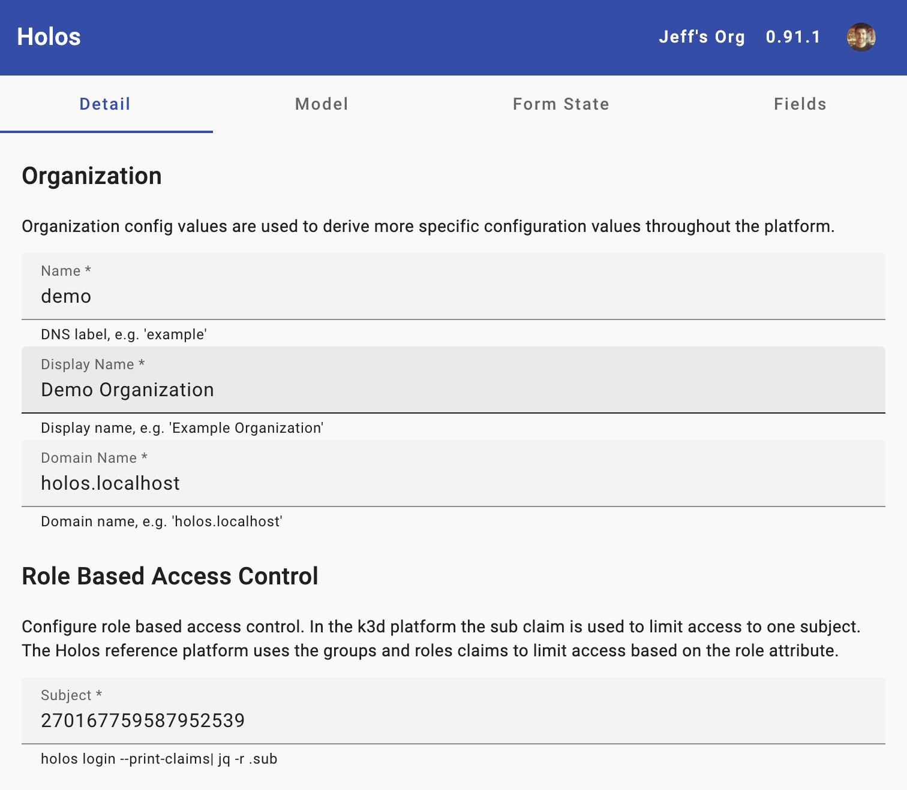
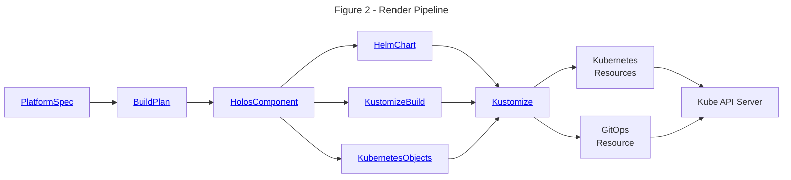
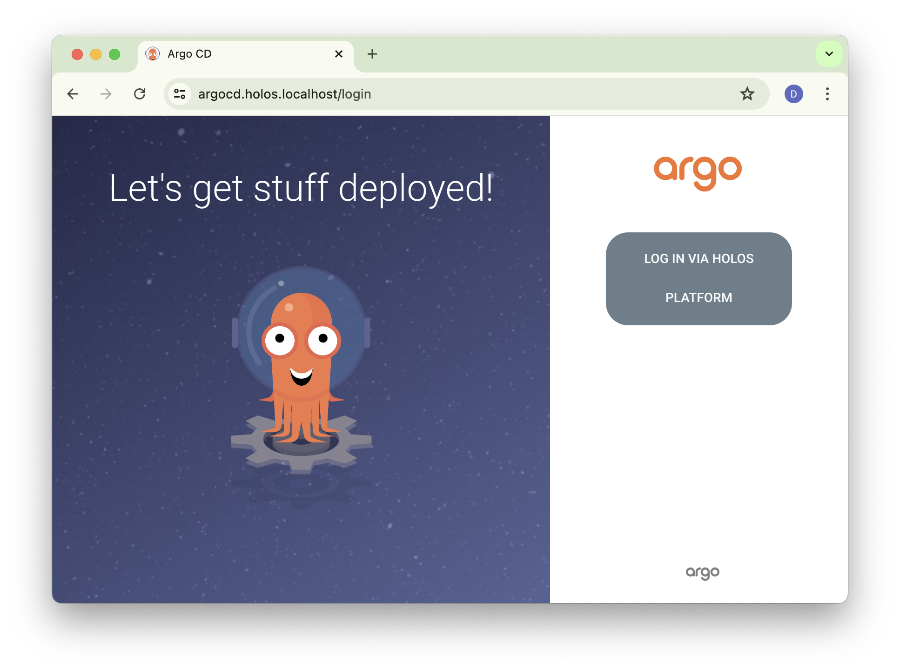
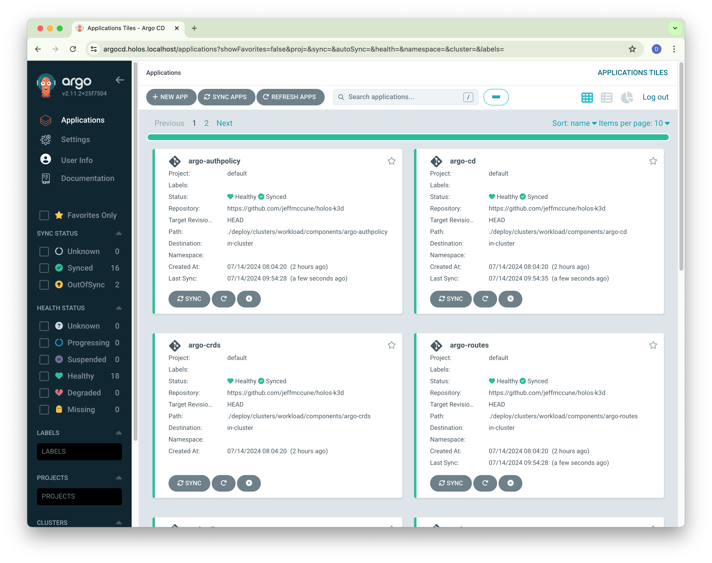

import Tabs from '@theme/Tabs';
import TabItem from '@theme/TabItem';

# Try Holos Locally

Learn how to configure and deploy the Holos reference platform to your local
host with k3d.

---

This guide assumes commands are run from your local host.  Capitalized terms
have specific definitions described in the [Glossary](/docs/glossary).

## What you'll need {#Requirements}

:::tip

Registering an account **is recommended** to see how authorization works in
Holos, but **you can complete this guide without signing up.**

:::

You'll need the following tools installed on your local host to complete this guide.

 1. [holos](/docs/tutorial/install) - to build the platform.
 2. [k3d](https://k3d.io/#installation) - to provide an api server.
 3. [Orb](https://docs.orbstack.dev/install) or [Docker](https://docs.docker.com/get-docker/) - to use k3d.
 4. [kubectl](https://kubernetes.io/docs/tasks/tools/) - to interact with the Kubernetes cluster.
 5. [helm](https://helm.sh/docs/intro/install/) - to render Holos components that integrate vendor provided Helm charts.
 6. [mkcert](https://github.com/FiloSottile/mkcert?tab=readme-ov-file#installation) - for local trusted certificates.
 7. [jq](https://jqlang.github.io/jq/download/) - to manipulate json output.

## Goal {#Goal}

At the end of this guide you'll have built a software development platform that
provides Zero Trust security by holistically integrating off-the-shelf
components.

 1. ArgoCD to review and apply platform configuration changes.
 2. Istio service mesh with mTLS encryption.
 3. ZITADEL to provide single sign-on identity tokens with multi factor authentication.

Istio will be configured to authenticate and authorize requests using an OIDC
ID-Token issued by ZITADEL _before_ requests reach backend services.

:::tip

With Holos, developers don't need to write authentication or authorization logic
for many common use cases.

:::

The platform provides single sign-on and role based access control for all
services running on the platform.

The `k3d` platform is derived from the Holos reference platform.  The `k3d`
platform is intended to provide a smooth on-ramp to evaluate Holos.

 1. Holos provides a unified configuration model purpose built to integrate
 unmodified Helm charts, Kustomize bases, or any manifest provided by a software
 vendor.
 2. Holos eliminates the need to template yaml, a common source of errors.
 3. Holos platforms are composable, scaling down to your laptop and up to
 multiple clusters across multiple regions.
 4. The unified configuration model is well suited to provide a Zero Trust
 security model.

### Clean Up {#Clean-Up}

It's nice to know what kind of mess we're going to make before we make it.
This guide strives to keep things neat and tidy.  All of the resources are
located in k3d and the `holos-k3d` directory.  If you want to clean up at any
point, do so with:

```bash
k3d cluster delete workload
rm -rf holos-k3d
```

# Get Started {#Get-Started}

Let's get started building a Holos platform.

## Repository

Holos uses a Git repository to store all configuration code and data necessary
to build the platform.

[Fork the holos-k3d](https://github.com/holos-run/holos-k3d/fork) repository and
clone it locally.  Replace the URL with your fork.

```bash
git clone https://github.com/holos-run/holos-k3d.git
cd holos-k3d
```

## Sign In or Out {#Sign-In}

Holos provides integrated authentication and authorization which we'll use in
this guide to protect a service.  It is recommended to register an account to
see the technical details of how this works.  Registration also allows you to
see how Holos empowers you to expose top-level configuration data using a simple
web form.

You may complete the guide without signing up.  If you opt-out the guide will
use fake authentication headers in place of real oidc id tokens.

<Tabs groupId="registration">
  <TabItem value="registered" label="Sign In">
    ```bash
    holos register user
    ```
  </TabItem>
  <TabItem value="unregistered" label="Sign Out">
    ```bash
    holos logout
    ```
  </TabItem>
</Tabs>

## Create the Platform {#Create-Platform}

A platform resource in the Holos web service is necessary to store the web form
used to submit top level configuration values.

Create the platform resource using the command line tool which makes an rpc call
to the web service.

<Tabs groupId="registration">
  <TabItem value="registered" label="Signed In">

    ```bash
    holos create platform --name k3d --display-name "Try Holos Locally"
    ```
  </TabItem>
  <TabItem value="unregistered" label="Signed Out">
    ```bash
    touch platform.metadata.json
    ```
  </TabItem>
</Tabs>

## Generate the Platform {#Generate-Platform}

Generate the platform code in root of the new repository:

```bash
holos generate platform k3d
```

Commit the generated platform config to the repository:

```bash
git add .
git commit -m "holos generate platform k3d - $(holos --version)"
```

## Push the Git repository

This tutorial deploys ArgoCD, which needs to sync configuration from a Git
repository.  Push the repository you created to a new blank repository.  Note
that holos is designed to never store secrets in version control.

```bash
git push origin HEAD:main
```

## Push the Platform Form

Each Holos platform has a Platform Form used to submit top level, platform-wide
configuration values.  The purpose of the form is to validate configuration
values and simplify complicated configurations and integrations.

<Tabs groupId="registration">
  <TabItem value="registered" label="Signed In">
    **Push the Platform Form** to the web service to publish it and make it
    accessible through a web browser.

    ```bash
    holos push platform form .
    ```

    **Browse to the URL printed back** to view the form.
  </TabItem>
  <TabItem value="unregistered" label="Signed Out">
    **No action needed.**

    ```bash
    # holos push platform form .
    ```
  </TabItem>
</Tabs>


The Platform Form looks like:



## Submit the Platform Model

Holos needs initial values to render the platform.  The Platform Model is the
holos term used for these initial, top level configuration values.  The Platform
Form is a web browser UI to provide these values.

Holos platforms configure role based access control to only allow access
protected services.  In the k3d platform used for this guide, role based access
control is accomplished by validating the OIDC id token subject claim.

### Role Based Access Control {#RBAC}

Provide the value of the `sub` subject claim of your identity to ensure only you
have administrative access to the platform.

<Tabs groupId="registration">
  <TabItem value="registered" label="Signed In">
    **Copy and paste the `sub` value into the Subject field.**

    ```bash
    holos login --print-claims --log-level=error | jq -r .sub
    ```

    The command should print a large whole number, for example
    `215559239589843464`.

    Don't forget to submit the form.
  </TabItem>
  <TabItem value="unregistered" label="Signed Out">
    **No action needed.**

    ```bash
    # holos login --print-claims --log-level=error | jq -r .sub
    ```

    The platform will use a fake `sub` claim value of `"999999999999999999"`
    when signed out.
  </TabItem>
</Tabs>


### GitOps {#GitOps}

<Tabs groupId="registration">
  <TabItem value="registered" label="Signed In">
    **Enter the url of your `holos-k3d` GitHub fork** into the ArgoCD GIt repository URL field.

    Don't forget to submit the form.
  </TabItem>
  <TabItem value="unregistered" label="Signed Out">
    Configure the ArgoCD repoURL in the next section.
  </TabItem>
</Tabs>

## Pull the Platform Model {#Pull-the-Platform-Model}

Once the form has been submitted, the model needs to be pulled into the Git
repository so `holos` can operate locally.

Holos stores the Platform Model in the `platform.config.json` file. Holos
provides this file as input to CUE when rendering the platform.  The file is
intended to be added to version control.

<Tabs groupId="registration">
  <TabItem value="registered" label="Signed In">
    **Pull the Platform Model** into the repository.

    ```bash
    holos pull platform model .
    ```
  </TabItem>
  <TabItem value="unregistered" label="Signed Out">
    **Manually create the `platform.config.json` file.**
    Update the `repoURL` field to refer to your fork url.

    Beware modifying field values other than `repoURL`, you may run into trouble
    accessing the platform services later.

    ```bash
    cat <<EOF >platform.config.json
    {
      "platformModel": {
        "argocd": {
          "clientID": "275571279971577269@holos_quickstart",
          "deployRoot": ".",
          "repoURL": "$(git config --get remote.origin.url)",
          "targetRevision": "HEAD"
        },
        "org": {
          "displayName": "Demo Organization",
          "domain": "holos.localhost",
          "name": "demo"
        },
        "rbac": {
          "mode": "fake",
          "sub": "999999999999999999"
        }
      }
    }
    EOF
    ```
  </TabItem>
</Tabs>

```bash
git add platform.config.json
git commit -m "Add platform model"
```

## Render the Platform {#Render-the-Platform}

With the `platform.config.json` file and the generated platform code in place,
`holos` has everything necessary to render the platform.

Rendering a platform is a process of iterating over each platform component and
rendering the component into plain YAML manifests to be sent to the API server.

```bash
holos render platform ./platform
```

This command writes fully rendered manifest files to the `deploy/` directory.

Commit the rendered platform manifests so they can be applied via GitOps later
on.

```bash
git add deploy
git commit -m "holos render platform ./platform"
```

### Rendering {#Rendering}

:::tip

This section provides a brief overview of the rendering process, a core design
principle in Holos.

:::

Holos uses the Kubernetes resource model to manage configuration.  The `holos`
command line interface is the primary method you'll use to manage your platform.
Holos uses CUE to provide a unified configuration model of the platform.  This
unified configuration is built up from components packaged with Helm, Kustomize,
CUE, or any other tool that can produce Kubernetes resource manifests as output.

This process can be thought of as a data **rendering pipeline**.  The key
concept is that `holos` will always produce fully rendered output, but delegates
the _application_ of the configuration to other tools like `kubectl apply`,
ArgoCD, or Flux.



## Create the Workload Cluster

The Workload Cluster is where your applications and services will be deployed.
In production this is usually an EKS, GKE, or AKS cluster.

:::tip

Holos supports all compliant Kubernetes clusters. Holos was developed and tested
on GKE, EKS, Talos, k3s, and Kubeadm clusters.  The Holos server currently runs
on a Holos platform on EKS and GKE in multiple regions.

:::

<Tabs>
  <TabItem value="evaluate" label="Try Holos" default>
  Use this command when evaluating Holos.

  ```bash
  k3d cluster create workload \
    --port "443:443@loadbalancer" \
    --k3s-arg "--disable=traefik@server:0"
  ```
  </TabItem>
  <TabItem value="develop" label="Develop Holos" default>
  Use this command when developing Holos locally.

  ```bash
  k3d registry create registry.holos.localhost --port 5100
  ```

  ```bash
  k3d cluster create workload \
    --registry-use k3d-registry.holos.localhost:5100 \
    --port "443:443@loadbalancer" \
    --k3s-arg "--disable=traefik@server:0"
  ```
  </TabItem>
</Tabs>

Traefik is disabled because Istio provides the same functionality.

## Local CA {#Local-CA}

Create and apply the `local-ca` Secret containing the CA private key. This
Secret is necessary to issue certificates trusted by your browser when using the
local k3d platform.

```bash
bash ./scripts/local-ca
```

:::note

Admin access is necessary for `mkcert` to install the newly generated CA cert
into your local host's trust store.

:::

## DNS Setup {#DNS}

Configure your localhost to resolve `*.holos.localhost` to your loopback
interface.  This is necessary for your browser requests to reach the k3d
workload cluster.

<Tabs>
  <TabItem value="macos" label="macOS" default>
    ```bash
    brew install dnsmasq
    ```

    ```bash
    cat <<EOF >"$(brew --prefix)/etc/dnsmasq.d/holos.localhost.conf"
    # Refer to https://holos.run/docs/tutorial/local/k3d/
    address=/holos.localhost/127.0.0.1
    EOF
    ```

    Cache sudo credentials to avoid copy paste issues.

    ```bash
    sudo -v
    ```

    ```bash
    if [[ -r /Library/LaunchDaemons/homebrew.mxcl.dnsmasq.plist ]]; then
      echo "dnsmasq already configured"
    else
      sudo cp "$(brew list dnsmasq | grep 'dnsmasq.plist$')" \
        /Library/LaunchDaemons/homebrew.mxcl.dnsmasq.plist
      sudo launchctl unload /Library/LaunchDaemons/homebrew.mxcl.dnsmasq.plist
      sudo launchctl load /Library/LaunchDaemons/homebrew.mxcl.dnsmasq.plist
      dscacheutil -flushcache
      echo "dnsmasq configured"
    fi
    ```

    ```bash
    sudo mkdir -p /etc/resolver
    sudo tee /etc/resolver/holos.localhost <<EOF
    domain holos.localhost
    nameserver 127.0.0.1
    EOF
    sudo killall -HUP mDNSResponder
    ```
  </TabItem>
  <TabItem value="linux" label="Linux">
    [NSS-myhostname](http://man7.org/linux/man-pages/man8/nss-myhostname.8.html)
    ships with many Linux distributions and should resolve *.localhost
    automatically to 127.0.0.1.

    Otherwise it is installable with:

    ```bash
    sudo apt install libnss-myhostname
    ```
  </TabItem>
  <TabItem value="windows" label="Windows">
    Ensure the loopback interface has at least the following names in `C:\windows\system32\drivers\etc\hosts`

		```
    127.0.0.1 httpbin.holos.localhost argocd.holos.localhost app.holos.localhost
		```
  </TabItem>
</Tabs>

## Apply the Platform Components

Use `kubectl` to apply each platform component.  In production, it's common to
fully automate this process with ArgoCD, but we use `kubectl` in development
and exploration contexts to the same effect.

### Namespaces

```bash
kubectl apply --server-side=true -f ./deploy/clusters/workload/components/namespaces
```

### Custom Resource Definitions

Services are exposed with standard `HTTPRoute` resources from the Gateway API.

```bash
kubectl apply --server-side=true -f ./deploy/clusters/workload/components/gateway-api
kubectl apply --server-side=true -f ./deploy/clusters/workload/components/istio-base
kubectl apply --server-side=true -f ./deploy/clusters/workload/components/argo-crds
```

### Cert Manager {#cert-manager}

Apply the cert-manager controller:

```bash
kubectl apply --server-side=true -f ./deploy/clusters/workload/components/cert-manager
```

Apply the ClusterIssuer which issues Certificate resources using the local
certificate authority.

```bash
kubectl -n cert-manager wait pod -l app.kubernetes.io/component=webhook --for=condition=Ready
kubectl apply --server-side=true -f deploy/clusters/workload/components/local-ca
kubectl apply --server-side=true -f deploy/clusters/workload/components/certificates
```

### Istio {#Istio}

```bash
kubectl apply --server-side=true -f ./deploy/clusters/workload/components/istio-cni
kubectl apply --server-side=true -f ./deploy/clusters/workload/components/istiod
kubectl apply --server-side=true -f ./deploy/clusters/workload/components/gateway
```

Verify the Gateway is programmed and the listeners have been accepted:

```bash
kubectl get -n istio-gateways gateway default -o json \
  | jq -r '.status.conditions[].message'
```

Resource programmed indicates the Gateway is ready.

```txt
Resource accepted
Resource programmed, assigned to service(s) default-istio.istio-gateways.svc.cluster.local:443
```

If you see `Failed to assign` then the Gateway pods are likely still starting
up.  Check them with `kubectl get pods -n istio-gateways`.

```
Resource accepted
Failed to assign to any requested addresses: no instances found for hostname "default-istio.istio-gateways.svc.cluster.local"
```

### httpbin {#httpbin}

httpbin is a simple backend service useful for end-to-end testing.

```bash
kubectl apply --server-side=true -f deploy/clusters/workload/components/httpbin-backend
kubectl apply --server-side=true -f deploy/clusters/workload/components/httpbin-routes
```

:::important

Browse to [https://httpbin.holos.localhost/](https://httpbin.holos.localhost/)
to verify end to end connectivity.

:::

### Cookie Secret

The auth proxy stores session information in an encrypted cookie.  Generate a
random cookie encryption Secret and apply.

```bash
LC_ALL=C tr -dc A-Za-z0-9 </dev/urandom \
  | head -c 32 \
  | kubectl create secret generic "authproxy" \
    --from-file=cookiesecret=/dev/stdin \
    --dry-run=client -o yaml \
  | kubectl apply -n istio-gateways -f-
```

### Auth Proxy

The auth proxy is responsible for authenticating web browser requests.  The auth
proxy provides a standard oidc id token to all backend services integrated with
the mesh.

```bash
kubectl apply --server-side=true -f deploy/clusters/workload/components/authproxy
kubectl apply --server-side=true -f deploy/clusters/workload/components/authroutes
```

<Tabs groupId="registration">
  <TabItem value="registered" label="Signed In">
    Verify authentication is working by visiting
    [https://httpbin.holos.localhost/holos/authproxy](https://httpbin.holos.localhost/holos/authproxy).
    The auth proxy should respond with a simple `Authenticated` response.

    Istio will respond with `no healthy upstream` until the pod becomes ready.
    Wait for the pod to become ready with:

    ```bash
    kubectl -n holos-system wait pod -l app.kubernetes.io/instance=httpbin --for=condition=Ready
    ```

    Once authenticated, visit
    [https://httpbin.holos.localhost/holos/authproxy/userinfo](https://httpbin.holos.localhost/holos/authproxy/userinfo)
    which returns a subset of claims from your id token:

    ```json
    {
      "user": "275552236589843464",
      "email": "demo@holos.run",
      "preferredUsername": "demo"
    }
    ```

  </TabItem>
  <TabItem value="unregistered" label="Signed Out">
    For simplicity, the `k3d` platform relies upon `https://login.holos.run` to
    issue id tokens.  You cannot authenticate unless you sign in.

    Authorization has been configured against fake authentication headers
    instead of the real `x-oidc-id-token` header.

    Note the Holos reference platform supports self-hosting your own identity
    provider.
  </TabItem>
</Tabs>

### Auth Policy

Configure authorization policies using the claims provided in the authenticated
id token.

```bash
kubectl apply --server-side=true -f deploy/clusters/workload/components/authpolicy
```

Istio make take a few seconds to program the Gateway with the AuthorizationPolicy resources.

### Zero Trust

A basic Zero Trust security model is now in place.  The platform authenticates
and authorizes requests before the reach the backend service.

#### Browser

<Tabs groupId="registration">
  <TabItem value="registered" label="Signed In">
    Verify authentication is working by browsing to [https://httpbin.holos.localhost/dump/request](https://httpbin.holos.localhost/dump/request).

    Refresh the page a few times.  The `httpbin` backend pods should echo back
    the `x-oidc-id-token` header the auth proxy injected into the request after
    authenticating you.

    Note the `x-oidc-id-token` header is not sent by your browser but is received
    by the backend service.  This design reduces the risk of exposing id tokens
    in the browser.  In addition, browser request size remains constant as more
    claim values are added to id tokens.  This improves reliability because id
    tokens often overflow request header buffers when they pass through middle
    boxes across the internet.
  </TabItem>
  <TabItem value="unregistered" label="Signed Out">
    The platform has been configured to authorize requests with a `User-Agent: anonymous` header.

    1. Open an incognito window to verify the platform is enforcing this
    authorization policy.
    2. Browse to
    [https://httpbin.holos.localhost/dump/request](https://httpbin.holos.localhost/dump/request)
    and expect to be redirected to the sign in page by the auth proxy.
        - You **do not** need to register or sign in.
        - This step verifies the platform is redirecting unauthenticated
        requests to the identity provider.
        - Close this window and open a new incognito window.
    3. Set your `User-Agent` header to `anonymous` using your browser developer tools.
        - For Chrome the process is described
        [here](https://developer.chrome.com/docs/devtools/device-mode/override-user-agent#override_the_user_agent_string).
        - The purpose is to fake an authenticated request.
    4. Browse to
    [https://httpbin.holos.localhost/dump/request](https://httpbin.holos.localhost/dump/request).
        - The platform should allow the request through to the backend pod.
        - `httpbin` should echo back your request which should contain `User-Agent: anonymous`.
  </TabItem>
</Tabs>

This section verifies authorization of browser requests.  In the next section
requests from command line tools and api clients are authorized.

#### Command Line

Verify unauthenticated requests are blocked outside the browser:

```bash
curl -I https://httpbin.holos.localhost/dump/request
```

You should get back a 302 response that redirects the request to the identity
provider to authenticate.

Next, verify authorization policy is taking effect.

<Tabs groupId="registration">
  <TabItem value="registered" label="Signed In">
    The platform is configured to validate the id token present in the
    `x-oidc-id-token` header.

    ```bash
    curl -H x-oidc-id-token:$(holos token) https://httpbin.holos.localhost/dump/request
    ```
  </TabItem>
  <TabItem value="unregistered" label="Signed Out">
    The platform is configured to authorize any request with `User-Agent:
    anonymous` in place of validating the oidc id token.

    ```bash
    curl -A anonymous https://httpbin.holos.localhost/dump/request
    ```
  </TabItem>
</Tabs>

You will receive a response from the backend httpbin service that echos back
your request if the AuthorizationPolicy resources are working as expected .

:::tip

Note how the platform secures both web browser and command line api access to
the backend httpbin service.  httpbin itself has no authentication or
authorization functionality.

:::

### ArgoCD

ArgoCD automatically applies resources defined in Git similar to how this guide
uses `kubectl apply`.

Apply controller deployments and supporting resources.

```bash
kubectl apply --server-side=true -f ./deploy/clusters/workload/components/argo-cd
kubectl apply --server-side=true -f ./deploy/clusters/workload/components/argo-authpolicy
kubectl apply --server-side=true -f ./deploy/clusters/workload/components/argo-routes
```

Verify all Pods are running and all containers are ready.

```bash
kubectl get pods -n argocd
```

```txt
NAME                                                READY   STATUS      RESTARTS   AGE
argocd-application-controller-0                     1/1     Running     0          10s
argocd-applicationset-controller-578db65fcd-lnn76   1/1     Running     0          10s
argocd-notifications-controller-67c856dbb7-12stk    1/1     Running     0          10s
argocd-redis-698f57d9b9-v4kqs                       1/1     Running     0          10s
argocd-redis-secret-init-z5zg8                      0/1     Completed   0          10s
argocd-repo-server-69f78dfb8-f6pb7                  1/1     Running     0          10s
argocd-server-58f7f4466d-db5fv                      2/2     Running     0          10s
```

:::important

Browse to [https://argocd.holos.localhost/](https://argocd.holos.localhost/) to access ArgoCD.

:::

<Tabs groupId="registration">
  <TabItem value="registered" label="Signed In">
    ArgoCD is configured to authenticate using the Holos identity provider.

    

    Login using the SSO button and verify you get to the Applications page.

    
  </TabItem>
  <TabItem value="unregistered" label="Signed Out">
    ArgoCD is configured to allow anonymous users.  Note, the platform
    authorization policy allows requests only if the `User-Agent: anonymous`
    header is set.

    
  </TabItem>
</Tabs>

:::note

Both the platform layer and the ArgoCD application layer perform authentication
and authorization using the same identity provider.  The Zero Trust model
provides additional layers of security.

:::

### ArgoCD Applications

Apply the Application resources for all of the Holos components that compose the
platform.  The Application resources provide drift detection and optional
automatic reconciliation of platform components.

```bash
kubectl apply --server-side=true -f deploy/clusters/workload/gitops
```

Browse to or refresh [https://argocd.holos.localhost/applications](https://argocd.holos.localhost/applications).


:::important

If you do not see any applications after refreshing the page ensure the `sub`
value in the Platform Model (`platform.config.json`) is correct and matches
`holos login --print-claims`.

:::

### Sync Applications

Navigate to the [namespaces Application](https://argocd.holos.localhost/applications/argocd/namespaces).


Review the differences between the live platform and the git configuration.


Sync the application to reconcile the differences.


The Holos components should report Sync OK.


:::tip

Automatic reconciliation is turned off by default.

:::

Optionally enable automatic reconciliation by adding `spec.syncPolicy.automated:
{}` to the `#Argo` definition.

Add the following to `buildplan.site.cue` to avoid `holos generate platform k3d`
writing over the customization.

:::tip

CUE merges definitions located in multiple files.  This feature is used to
customize the platform.

:::

```bash
cat <<EOF > buildplan.site.cue
package holos
// Enable automated sync of platform components.
#Argo: Application: spec: syncPolicy: automated: {}
EOF
```

Re-render the platform.

```bash
holos render platform ./platform
```

Add and commit the changes.

```bash
git add .
git commit -m 'enable argocd automatic sync'
git push origin HEAD
```

Apply the new changes.

```bash
kubectl apply --server-side=true -f deploy/clusters/workload/gitops
```

Automatic reconciliation is enabled for all platform components.



## Review the Platform Manifests {#Review}

:::tip

This section is optional, included to provide insight into how Holos uses CUE
and Helm to unify and render the platform configuration.

:::

Take a moment to review the manifests `holos` rendered to build the platform.

### ArgoCD Application

Note the Git URL you entered into the Platform Form is used to derive the ArgoCD
`Application` resource from the Platform Model.

```yaml
# deploy/clusters/workload/gitops/namespaces.application.gen.yaml
apiVersion: argoproj.io/v1alpha1
kind: Application
metadata:
  name: namespaces
  namespace: argocd
spec:
  destination:
    server: https://kubernetes.default.svc
  project: default
  source:
    # highlight-next-line
    path: /deploy/clusters/workload/components/namespaces
    # highlight-next-line
    repoURL: https://github.com/holos-run/holos-k3d
    # highlight-next-line
    targetRevision: HEAD
```

One ArgoCD `Application` resource is produced for each Holos component by
default.  Note the `cert-manger` component renders the output using Helm.
Holos unifies the Application resource using CUE.  The CUE definition which
produces the rendered output is defined in `buildplan.cue` around line 222.

:::tip

Note how CUE does not use error-prone text templates, the language is well
specified and typed which reduces errors when unifying the configuration with
the Platform Model in the following `#Argo` definition.

:::

```cue
// buildplan.cue

// #Argo represents an argocd Application resource for each component, written
// using the #HolosComponent.deployFiles field.
#Argo: {
	ComponentName: string

	Application: app.#Application & {
		metadata: name:      ComponentName
		metadata: namespace: "argocd"
		spec: {
			destination: server: "https://kubernetes.default.svc"
			project: "default"
			source: {
        // highlight-next-line
				path:           "\(_Platform.Model.argocd.deployRoot)/deploy/clusters/\(_ClusterName)/components/\(ComponentName)"
        // highlight-next-line
				repoURL:        _Platform.Model.argocd.repoURL
        // highlight-next-line
				targetRevision: _Platform.Model.argocd.targetRevision
			}
		}
	}

	// deployFiles represents the output files to write along side the component.
	deployFiles: "clusters/\(_ClusterName)/gitops/\(ComponentName).application.gen.yaml": yaml.Marshal(Application)
}
```

### Helm Chart

Holos uses CUE to safely integrate the unmodified upstream `cert-manager` Helm
chart.

:::tip

Holos fully supports your existing Helm charts.  Consider leveraging `holos` as
an safer alternative to umbrella charts.

:::

```cue
// components/cert-manager/cert-manager.cue
package holos

// Produce a helm chart build plan.
(#Helm & Chart).Output

let Chart = {
	Name:      "cert-manager"
	Version:   "1.14.5"
	Namespace: "cert-manager"

	Repo: name: "jetstack"
	Repo: url:  "https://charts.jetstack.io"

  // highlight-next-line
	Values: {
		installCRDs: true
		startupapicheck: enabled: false
		// Must not use kube-system on gke autopilot.  GKE Warden blocks access.
    // highlight-next-line
		global: leaderElection: namespace: Namespace

		// https://cloud.google.com/kubernetes-engine/docs/concepts/autopilot-resource-requests#min-max-requests
		resources: requests: {
			cpu:                 "250m"
			memory:              "512Mi"
			"ephemeral-storage": "100Mi"
		}
    // highlight-next-line
		webhook: resources:        Values.resources
    // highlight-next-line
		cainjector: resources:     Values.resources
    // highlight-next-line
		startupapicheck: resource: Values.resources

		// https://cloud.google.com/kubernetes-engine/docs/how-to/autopilot-spot-pods
		nodeSelector: {
			"kubernetes.io/os": "linux"
			if _ClusterName == "management" {
				"cloud.google.com/gke-spot": "true"
			}
		}
		webhook: nodeSelector:         Values.nodeSelector
		cainjector: nodeSelector:      Values.nodeSelector
		startupapicheck: nodeSelector: Values.nodeSelector
	}
}
```

## Summary

In this guide, you built a software development platform which:

1. Configures a Service Mesh with mTLS encryption between services.
2. Configures authentication and authorization of users and developers.
3. Protects a backend service (httpbin) without making any backend code changes.
4. Leverages ArgoCD to automatically deploy configuration and applications.
