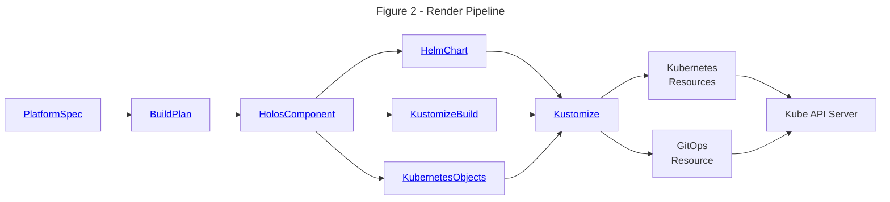

import Tabs from '@theme/Tabs';
import TabItem from '@theme/TabItem';

# Try Holos Locally

Learn how to configure and deploy the Holos reference platform to your local
host with k3d.

---

This guide assumes commands are run from your local host.  Capitalized terms
have specific definitions described in the [Glossary](/docs/glossary).

## Requirements

You'll need the following tools installed on your local host to complete this guide.

 1. [k3d](https://k3d.io/#installation) - to provide an api server.
 2. [Docker](https://docs.docker.com/get-docker/) - to use k3d.
 3. [holos](/docs/tutorial/install) - to build the platform.
 4. [kubectl](https://kubernetes.io/docs/tasks/tools/) - to interact with the Kubernetes cluster.
 5. [helm](https://helm.sh/docs/intro/install/) - to render Holos components that integrate vendor provided Helm charts.
 6. [mkcert](https://github.com/FiloSottile/mkcert?tab=readme-ov-file#installation) - for local trusted certificates.
 7. [jq](https://jqlang.github.io/jq/download/) - to manipulate json output.

## Outcome

At the end of this guide you'll have built a development platform that provides
Zero Trust security by holistically integrating off-the-shelf components.

 1. ArgoCD to review and apply platform configuration changes.
 2. Istio service mesh with mTLS encryption.
 3. ZITADEL to provide single sign-on identity tokens with multi factor authentication.

The platform running on your local host will configure Istio to authenticate and
authorize requests using an oidc id token issued by ZITADEL _before_ the request
ever reaches ArgoCD.

:::tip

With Holos, developers don't need to write authentication or authorization logic
for many use cases.

:::

Single sign-on and role based access control are provided by the platform itself
for all service running in the platform using standardized policies.

The `k3d` platform is derived from the larger holos reference platform to
provide a smooth on-ramp to evaluate the value Holos offers.

 1. Holos wraps unmodified Helm charts provided by software vendors.
 2. Holos eliminates the need to template yaml.
 3. Holos is composable, scaling down to local host and up to multi-cloud and multi-cluster.
 4. The Zero Trust security model implemented by the reference platform.
 5. Configuration unification with CUE.

## Register with Holos

Register an account with the Holos web service. This registration is required
to save platform configuration values via a simple web form and to explore how
Holos implements Zero Trust.

```bash
holos register user
```

## Create the Platform

Create the platform, which stores the Platform Form and its values in the Holos
web service. The Platform Form represents the Platform Model.

```bash
holos create platform --name k3d --display-name "Try Holos Locally"
```

## Generate the Platform

Holos builds the platform by building each component of the platform into fully
rendered Kubernetes configuration resources.  Generate the source code for the
platform in a blank local directory.  This directory is named `holos-infra` by
convention because it represents the Holos managed platform infrastructure.

Create a new Git repository to store the platform code:

```bash
mkdir holos-k3d
cd holos-k3d
git init .
```

Generate the platform code in the current directory:

```bash
holos generate platform k3d
```

Commit the generated platform config to the repository:

```bash
git add .
git commit -m "holos generate platform k3d - $(holos --version)"
```

## Push the Platform Form

Push the Platform Form to the web service to provide top-level configuration
values from which the platform components derive their final configuration.

```bash
holos push platform form .
```

Visit the printed URL to view the Platform Form.

:::tip

You have complete control over the form fields and validation rules.

:::

## Submit the Platform Model

Fill out the form and submit the Platform Model.

For the Role Based Access Control section, provide the value of the `sub`
subject claim of your identity to ensure only you have administrative access to
ArgoCD.

```bash
holos login --print-claims | jq -r .sub
```

For the ArgoCD Git repository URL, enter the url of a public repository where
you will push your local `holos-k3d` repository.

```bash
git remote add origin https://github.com/example/holos-k3d
git push origin HEAD:main
```

## Pull the Platform Model

The Platform Model is the JSON representation of the Platform Form values.
Holos provides the Platform Model to CUE to render the platform configuration to
plain YAML. Configuration that varies is derived from the Platform Model using
CUE.

Pull the Platform Model to your local host to render the platform.

```bash
holos pull platform model .
```

The `platform.config.json` file is intended to be committed to version control.

```bash
git add platform.config.json
git commit -m "Add platform model"
```

:::danger

Do not store secrets in the Platform Model.

:::

Holos uses ExternalSecret resources to securely sync with a SecretStore and
ensure Secrets are never stored in version control.

## Render the Platform

Rendering the platform iterates over each platform component and renders the
component into the final Kubernetes resources that will be sent to the API Server.

```bash
holos render platform ./platform
```

This command writes fully rendered Kubernetes resource yaml to the `deploy/` directory.

:::warning

Do not edit the files in the `deploy` as they will be written over.

:::

Commit the rendered platform configuration for `git diff` later.

```bash
git add deploy
git commit -m "holos render platform ./platform"
```

### Rendering

Holos uses the Kubernetes resource model to manage configuration.  The `holos`
command line interface (cli) is the primary method you'll use to manage your
platform.  Holos uses CUE to provide a unified configuration model of the
platform which is built from components packaged with Helm, Kustomize, CUE, or
any tool that can produce Kubernetes resources as output.  This process can be
thought of as a yaml **rendering pipeline**.

Each component in a platform defines a rendering pipeline shown in Figure 2 to
produce Kubernetes api resources



The `holos` cli can be thought of as executing a data pipeline.  The Platform
Model is the top level input to the pipeline and specifies the ways your
platform varies from other organizations.  The `holos` cli takes the Platform
Model as input and executes a series of steps to produce the platform
configuration.  The platform configuration output of `holos` are full
Kubernetes API resources, suitable for application to a cluster with `kubectl
apply -f`, or GitOps tools such as ArgoCD or Flux.

## Review the Platform Config

:::tip

This section is optional, included to provide insight into how Holos uses CUE
and Helm to unify and render the platform configuration.

:::

Take a moment to review the platform config `holos` rendered.

### ArgoCD Application

Note the Git URL you entered into the Platform Form is used to derive the ArgoCD
`Application` resource from the Platform Model.

```yaml
# deploy/clusters/workload/gitops/namespaces.application.gen.yaml
apiVersion: argoproj.io/v1alpha1
kind: Application
metadata:
  name: namespaces
  namespace: argocd
spec:
  destination:
    server: https://kubernetes.default.svc
  project: default
  source:
    # highlight-next-line
    path: /deploy/clusters/workload/components/namespaces
    # highlight-next-line
    repoURL: https://github.com/holos-run/holos-k3d
    # highlight-next-line
    targetRevision: HEAD
```

One ArgoCD `Application` resource is produced for each Holos component by
default.  Note the `cert-manger` component renders the output using Helm.
Holos unifies the Application resource using CUE.  The CUE definition which
produces the rendered output is defined in `buildplan.cue` around line 222.

:::tip

Note how CUE does not use error-prone text templates, the language is well
specified and typed which reduces errors when unifying the configuration with
the Platform Model in the following `#Argo` definition.

:::

```cue
// buildplan.cue

// #Argo represents an argocd Application resource for each component, written
// using the #HolosComponent.deployFiles field.
#Argo: {
	ComponentName: string

	Application: app.#Application & {
		metadata: name:      ComponentName
		metadata: namespace: "argocd"
		spec: {
			destination: server: "https://kubernetes.default.svc"
			project: "default"
			source: {
        // highlight-next-line
				path:           "\(_Platform.Model.argocd.deployRoot)/deploy/clusters/\(_ClusterName)/components/\(ComponentName)"
        // highlight-next-line
				repoURL:        _Platform.Model.argocd.repoURL
        // highlight-next-line
				targetRevision: _Platform.Model.argocd.targetRevision
			}
		}
	}

	// deployFiles represents the output files to write along side the component.
	deployFiles: "clusters/\(_ClusterName)/gitops/\(ComponentName).application.gen.yaml": yaml.Marshal(Application)
}
```

### Helm Chart

Holos uses CUE to safely integrate the unmodified upstream `cert-manager` Helm
chart.

:::tip

Holos fully supports your existing Helm charts.  Consider leveraging `holos` as
an safer alternative to umbrella charts.

:::

```cue
// components/cert-manager/cert-manager.cue
package holos

// Produce a helm chart build plan.
(#Helm & Chart).Output

let Chart = {
	Name:      "cert-manager"
	Version:   "1.14.5"
	Namespace: "cert-manager"

	Repo: name: "jetstack"
	Repo: url:  "https://charts.jetstack.io"

  // highlight-next-line
	Values: {
		installCRDs: true
		startupapicheck: enabled: false
		// Must not use kube-system on gke autopilot.  GKE Warden blocks access.
    // highlight-next-line
		global: leaderElection: namespace: Namespace

		// https://cloud.google.com/kubernetes-engine/docs/concepts/autopilot-resource-requests#min-max-requests
		resources: requests: {
			cpu:                 "250m"
			memory:              "512Mi"
			"ephemeral-storage": "100Mi"
		}
    // highlight-next-line
		webhook: resources:        Values.resources
    // highlight-next-line
		cainjector: resources:     Values.resources
    // highlight-next-line
		startupapicheck: resource: Values.resources

		// https://cloud.google.com/kubernetes-engine/docs/how-to/autopilot-spot-pods
		nodeSelector: {
			"kubernetes.io/os": "linux"
			if _ClusterName == "management" {
				"cloud.google.com/gke-spot": "true"
			}
		}
		webhook: nodeSelector:         Values.nodeSelector
		cainjector: nodeSelector:      Values.nodeSelector
		startupapicheck: nodeSelector: Values.nodeSelector
	}
}
```

## Create the Workload Cluster

The Workload Cluster is where your applications and services will be deployed.
In production this is usually an EKS, GKE, or AKS cluster.

:::tip

Holos supports any compliant Kubernetes cluster and was developed and tested on
GKE, EKS, Talos, and Kubeadm clusters.

:::

<Tabs>
  <TabItem value="evaluate" label="Evaluate" default>
  Use this command when evaluating Holos.

  ```bash
  k3d cluster create workload \
    --port "443:443@loadbalancer" \
    --k3s-arg "--disable=traefik@server:0"
  ```
  </TabItem>
  <TabItem value="develop" label="Develop" default>
  Use this command when developing Holos.

  ```bash
  k3d registry create registry.holos.localhost --port 5100
  ```

  ```bash
  k3d cluster create workload \
    --registry-use k3d-registry.holos.localhost:5100 \
    --port "443:443@loadbalancer" \
    --k3s-arg "--disable=traefik@server:0"
  ```
  </TabItem>
</Tabs>

Traefik is disabled because Istio provides the same functionality.

## Local CA

Create and apply the `local-ca` Secret containing the CA private key. This
Secret is necessary to issue certificates trusted by your browser when using the
local k3d platform.

```bash
bash ./scripts/local-ca
```

:::note

Admin access is necessary for `mkcert` to install the newly generated CA cert
into your local host's trust store.

:::

## DNS Setup

Configure your localhost to resolve `*.holos.localhost` to your loopback
interface.  This is necessary for your browser requests to reach the k3d
workload cluster.

<Tabs>
  <TabItem value="macos" label="macOS" default>
    ```bash
    brew install dnsmasq
    ```

    ```bash
    cat <<EOF >"$(brew --prefix)/etc/dnsmasq.d/holos.localhost.conf"
    # Refer to https://holos.run/docs/tutorial/local/k3d/
    address=/holos.localhost/127.0.0.1
    EOF
    ```

    ```bash
    if [[ -r /Library/LaunchDaemons/homebrew.mxcl.dnsmasq.plist ]]; then
      echo "dnsmasq already configured"
    else
      sudo cp "$(brew list dnsmasq | grep 'dnsmasq.plist$')" \
        /Library/LaunchDaemons/homebrew.mxcl.dnsmasq.plist
      sudo launchctl unload /Library/LaunchDaemons/homebrew.mxcl.dnsmasq.plist
      sudo launchctl load /Library/LaunchDaemons/homebrew.mxcl.dnsmasq.plist
      dscacheutil -flushcache
      echo "dnsmasq configured"
    fi
    ```

    ```bash
    sudo mkdir -p /etc/resolver
    sudo tee /etc/resolver/holos.localhost <<EOF
    domain holos.localhost
    nameserver 127.0.0.1
    EOF
    sudo killall -HUP mDNSResponder
    ```
  </TabItem>
  <TabItem value="linux" label="Linux">
    [NSS-myhostname](http://man7.org/linux/man-pages/man8/nss-myhostname.8.html)
    ships with many Linux distributions and should resolve *.localhost
    automatically to 127.0.0.1.

    Otherwise it is installable with:

    ```bash
    sudo apt install libnss-myhostname
    ```
  </TabItem>
  <TabItem value="windows" label="Windows">
    Ensure the loopback interface has at least the following names in `C:\windows\system32\drivers\etc\hosts`

		```
    127.0.0.1 httpbin.holos.localhost argocd.holos.localhost app.holos.localhost
		```
  </TabItem>
</Tabs>

## Apply the Platform Components

Use `kubectl` to apply each platform component.  In production, it's common to
fully automate this process with ArgoCD, but we use `kubectl` in development
and exploration contexts to the same effect.

### Namespaces

```bash
kubectl apply --server-side=true -f ./deploy/clusters/workload/components/namespaces
```

### Custom Resource Definitions

Services are exposed with standard `HTTPRoute` resources from the Gateway API.

```bash
kubectl apply --server-side=true -f ./deploy/clusters/workload/components/gateway-api
kubectl apply --server-side=true -f ./deploy/clusters/workload/components/istio-base
kubectl apply --server-side=true -f ./deploy/clusters/workload/components/argo-crds
```

### Cert Manager

Apply the cert-manager controller:

```bash
kubectl apply --server-side=true -f ./deploy/clusters/workload/components/cert-manager
```

Apply the ClusterIssuer which issues Certificate resources using the local
certificate authority.

```bash
kubectl apply --server-side=true -f deploy/clusters/workload/components/local-ca
kubectl apply --server-side=true -f deploy/clusters/workload/components/certificates
```

:::note

If you get a `no endpoints available for service "cert-manager-webhook"` Error
from server, retry this command.  The `cert-manager` Deployment may still be
starting up.

:::


### Istio

```bash
kubectl apply --server-side=true -f ./deploy/clusters/workload/components/istio-cni
kubectl apply --server-side=true -f ./deploy/clusters/workload/components/istiod
kubectl apply --server-side=true -f ./deploy/clusters/workload/components/gateway
```

Verify the Gateway is programmed and the listeners have been accepted:

```bash
kubectl get -n istio-gateways gateway default -o json \
  | jq -r '.status.conditions[].message'
```

Resource programmed indicates the Gateway is ready.

```txt
Resource accepted
Resource programmed, assigned to service(s) default-istio.istio-gateways.svc.cluster.local:443
```

If you see `Failed to assign` then the Gateway pods are likely still starting
up.  Check them with `kubectl get pods -n istio-gateways`.

```
Resource accepted
Failed to assign to any requested addresses: no instances found for hostname "default-istio.istio-gateways.svc.cluster.local"
```

### httpbin

httpbin is a simple backend service useful for end-to-end testing.

```bash
kubectl apply --server-side=true -f deploy/clusters/workload/components/httpbin-backend
kubectl apply --server-side=true -f deploy/clusters/workload/components/httpbin-routes
```

:::important

Browse to [https://httpbin.holos.localhost/](https://httpbin.holos.localhost/)
to verify end to end connectivity.

:::

### Cookie Secret

Generate a random cookie encryption Secret and apply.

```bash
LC_ALL=C tr -dc A-Za-z0-9 </dev/urandom \
  | head -c 32 \
  | kubectl create secret generic "authproxy" \
    --from-file=cookiesecret=/dev/stdin \
    --dry-run=client -o yaml \
  | kubectl apply -n istio-gateways -f-
```
:::tip

The Holos reference platform uses an ExternalSecret to automatically sync this
Secret from your SecretStore.

:::


### Auth Proxy

The auth proxy is responsible for authenticating web browser requests.  The auth
proxy provides a standard oidc id token to all services integrated with the
mesh.

```bash
kubectl apply --server-side=true -f deploy/clusters/workload/components/authproxy
kubectl apply --server-side=true -f deploy/clusters/workload/components/authroutes
```

:::important

Verify authentication is working by visiting
[https://httpbin.holos.localhost/holos/authproxy](https://httpbin.holos.localhost/holos/authproxy).
Expect a simple `Authenticated` response.

:::

:::note

Istio will respond with `no healthy upstream` until the pod becomes ready.
Check on the progress with `kubectl describe pod --namespace holos-system
--selector app.kubernetes.io/instance=httpbin`.

:::

Once authenticated, visit
[https://httpbin.holos.localhost/holos/authproxy/userinfo](https://httpbin.holos.localhost/holos/authproxy/userinfo)
which returns a subset of claims from your id token:

```json
{
  "user": "275552236589843464",
  "email": "demo@holos.run",
  "preferredUsername": "demo"
}
```

### Auth Policy

Configure authorization policies using the claims provided in the authenticated
id token.

```bash
kubectl apply --server-side=true -f deploy/clusters/workload/components/authpolicy
```

:::important

Requests to `https://httpbin.holos.localhost` are protected by
AuthorizationPolicy platform resources after applying this component.

:::

### Zero Trust

A basic Zero Trust security model is now in place.  Verify authentication is
working by browsing to
[https://httpbin.holos.localhost/dump/request](https://httpbin.holos.localhost/dump/request).

:::note

Istio make take a few seconds to program the Gateway with the
AuthorizationPolicy resources.

:::

:::tip

Note the `x-oidc-id-token` header is not sent by your browser but is received
by the backend service.  This design reduces the risk of exposing id tokens.
Requests over the internet are also smaller and more reliable because large id
tokens with may claims are confined to the cluster.

:::

Verify unauthenticated requests are blocked:

```bash
curl -I https://httpbin.holos.localhost/dump/request
```

You should get back a 302 response that redirects the request to the identity
provider to authenticate.

Verify authenticated requests are allowed:

```bash
curl -H x-oidc-id-token:$(holos token) https://httpbin.holos.localhost/dump/request
```

Expect a response from the backend httpbin service with the id token header the
platform authenticated and authorized.

:::tip

Note how the platform secures both web browser and command line api access to
the backend httpbin service.  httpbin itself has no authentication or
authorization functionality.

:::

### ArgoCD

ArgoCD automatically applies resources defined in Git similar to how this guide
uses `kubectl apply`.

Apply controller deployments and supporting resources.

```bash
kubectl apply --server-side=true -f ./deploy/clusters/workload/components/argo-cd
kubectl apply --server-side=true -f ./deploy/clusters/workload/components/argo-authpolicy
kubectl apply --server-side=true -f ./deploy/clusters/workload/components/argo-routes
```

Verify all Pods are running and all containers are ready.

```bash
kubectl get pods -n argocd
```

```txt
NAME                                                READY   STATUS      RESTARTS   AGE
argocd-application-controller-0                     1/1     Running     0          10s
argocd-applicationset-controller-578db65fcd-lnn76   1/1     Running     0          10s
argocd-notifications-controller-67c856dbb7-12stk    1/1     Running     0          10s
argocd-redis-698f57d9b9-v4kqs                       1/1     Running     0          10s
argocd-redis-secret-init-z5zg8                      0/1     Completed   0          10s
argocd-repo-server-69f78dfb8-f6pb7                  1/1     Running     0          10s
argocd-server-58f7f4466d-db5fv                      2/2     Running     0          10s
```

Browse to [https://argocd.holos.localhost/](https://argocd.holos.localhost/) and
verify you get the ArgoCD login page.


:::note

Both the platform layer and the ArgoCD application layer performs authentication
and authorization using the same identity provider.  Note how the Zero Trust
model provides an additional layer of security without friction.

:::

Login using the SSO button and verify you get to the Applications page.


### ArgoCD Applications

Apply the Application resources for all of the Holos components that compose the
platform.  The Application resources provide drift detection and optional
automatic reconciliation of platform components.

```bash
kubectl apply --server-side=true -f deploy/clusters/workload/gitops
```

Browse to or refresh [https://argocd.holos.localhost/applications](https://argocd.holos.localhost/applications).


:::important

If you do not see any applications after refreshing the page ensure the `sub`
value in the Platform Model (`platform.config.json`) is correct and matches
`holos login --print-claims`.

:::

### Sync Applications

Navigate to the [namespaces Application](https://argocd.holos.localhost/applications/argocd/namespaces).


Review the differences between the live platform and the git configuration.


Sync the application to reconcile the differences.


The Holos components should report Sync OK.


:::tip

Automatic reconciliation is turned off by default.

:::

Optionally enable automatic reconciliation by adding `spec.syncPolicy.automated:
{}` to the `#Argo` definition.

Add the following to `buildplan.site.cue` to avoid `holos generate platform k3d`
writing over the customization.

:::tip

CUE merges definitions located in multiple files.  This feature is used to
customize the platform.

:::

```bash
cat <<EOF > buildplan.site.cue
package holos
// Enable automated sync of platform components.
#Argo: Application: spec: syncPolicy: automated: {}
EOF
```

Re-render the platform.

```bash
holos render platform ./platform
```

Add and commit the changes.

```bash
git add .
git commit -m 'enable argocd automatic sync'
git push origin HEAD
```

Apply the new changes.

```bash
kubectl apply --server-side=true -f deploy/clusters/workload/gitops
```

Automatic reconciliation is enabled for all platform components.


## Summary

TODO

1. Configured the Service Mesh with mTLS.
2. Configured authentication and authorization.
3. Protected a backend service without backend code changes.
4. ArgoCD
