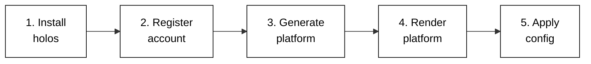
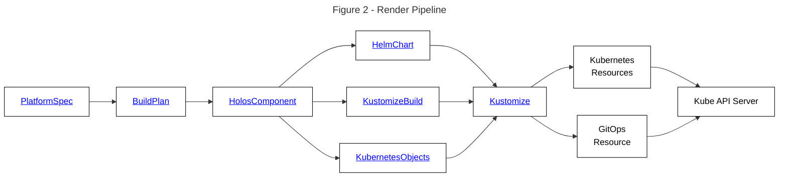

# Overview

<!-- https://kubernetes.io/docs/contribute/style/diagram-guide/ -->

This tutorial covers the following process of getting started with Holos.

## Rendering Pipeline

Holos uses the kubernetes resource model to manage configuration.  The `holos` command line interface (cli) is the primary method you'll use to manage your platform.  Holos uses CUE to provide a unified configuration model of the platform which is built from components packaged with Helm, Kustomize, CUE, or any tool that can produce kubernetes resources as output.  This process can be thought of as a yaml **rendering pipeline**.

Each component in a platform defines a rendering pipeline shown in Figure 2 to produce kubernetes api resources

The `holos` cli can be thought of as executing a data pipeline.  The Platform Model is the top level input to the pipeline and specifies the ways your platform varies from other organizations.  The `holos` cli takes the Platform Model as input and executes a series of steps to produce the platform configuration.  The platform configuration output of `holos` are full Kubernetes API resources, suitable for application to a cluster with `kubectl apply -f`, or GitOps tools such as ArgoCD or Flux.
