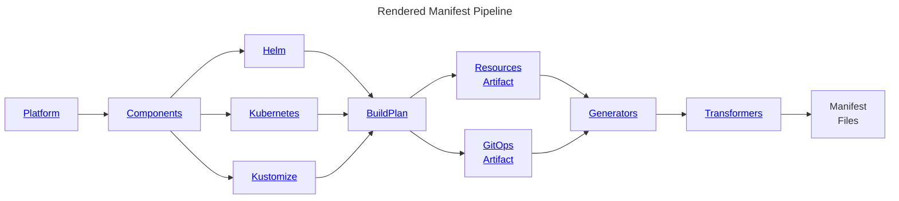

<head>
  <title>Announcing Holos</title>
  <meta property="og:title" content="Announcing Holos" />
</head>

I'm excited to share Holos, a Go command line tool we developed to make it
easier to manage a platform built on Kubernetes.  Holos implements the rendered
manifests pattern as a data pipeline to fully render manifests generated from
[Helm], [Kustomize], or [CUE] in a holistic way.

[Helm]: https://helm.sh/
[Kustomize]: https://kustomize.io/
[CUE]: https://cuelang.org/

<!-- truncate -->

At the start of the pandemic I was migrating our platform from VMs managed by
Puppet to Kubernetes.  My primary goal was to build an observability system
similar to what we had when we managed Puppet at Twitter prior to the
acquisition.  I started building the observability system with the official
[prometheus community charts], but quickly ran into issues where the
individual charts didn’t work with each other.  I was frustrated with how
complicated and difficult to configure these charts were.  They weren’t well
integrated, so I switched to the [kube-prometheus-stack] umbrella chart which
attempts to solve this integration problem.

The umbrella chart got us further, as long as we didn’t stray too far from the
default values, but we quickly ran into operational challenges.  Upgrading the
chart introduced breaking changes we couldn’t see until they were applied,
causing incidents.  We needed to manage secrets securely so we mixed in
ExternalSecrets with many of the charts.  We decided to handle these
customizations by implementing the [rendered manifests pattern] using scripts in
our CI pipeline.

These scripts got us further, but we found them costly to maintain.
Teammates needed to be careful to execute them with the same context they were
executed in CI.  We realized we were reinventing Hiera to manage a hierarchy of
helm values.yaml files to inject into multiple charts.

At this point I started looking for a more holistic solution to this problem of
integrating multiple charts together.  We saw the value in the rendered
manifests pattern, but we couldn’t find an agreed upon implementation.  We built
a Go command line tool to implement the pattern as a data pipeline.  I’d been
thinking about the comments from the [Why are we templating YAML] posts and
wondering what an answer to this question would look like.

The Go command line tool was an incremental improvement over the CI scripts, but
we still didn’t have a good way to handle the data values.  We were still
templating YAML which didn’t catch errors early enough.  It was too easy to
render invalid resources Kubernetes rejected, causing deployment problems.  I
searched for a solution to manage helm values, something like Hiera which we
knew well from Puppet, but not hierarchical because we knew it was important to
trace where config values came from in an outage.  A few HN comments mentioned
CUE, and an engineer we worked with at Twitter used CUE to configure Envoy at
scale, so I gave it a try.  I quickly appreciated how CUE provides both strong
type checking and validation of constraints, unifies all configuration data, and
provides clarity into where values originate from.

Take a look at Holos if you’re looking to implement the rendered manifests
pattern or can’t shake that feeling it should be easier to integrate third party
software into Kubernetes like we felt.

1. [Tutorial] takes a tour of Holos features starting from scratch.
2. [Topics] cover how to customize and tailor Holos to your unique needs.

[Open Infrastructure Services]: https://openinfrastructure.co/
[Why are we templating YAML]: https://hn.algolia.com/?dateRange=all&page=0&prefix=false&query=https%3A%2F%2Fleebriggs.co.uk%2Fblog%2F2019%2F02%2F07%2Fwhy-are-we-templating-yaml&sort=byDate&type=story

[Tutorial]: /docs/
[Topics]: /docs/topics/

[Holos]: https://holos.run/
[Helm]: https://helm.sh/
[Kustomize]: https://kustomize.io/
[CUE]: https://cuelang.org/
[rendered manifests pattern]: https://akuity.io/blog/the-rendered-manifests-pattern/
[prometheus community charts]: https://github.com/prometheus-community/helm-charts
[kube-prometheus-stack]: https://github.com/prometheus-community/helm-charts/tree/main/charts/kube-prometheus-stack
