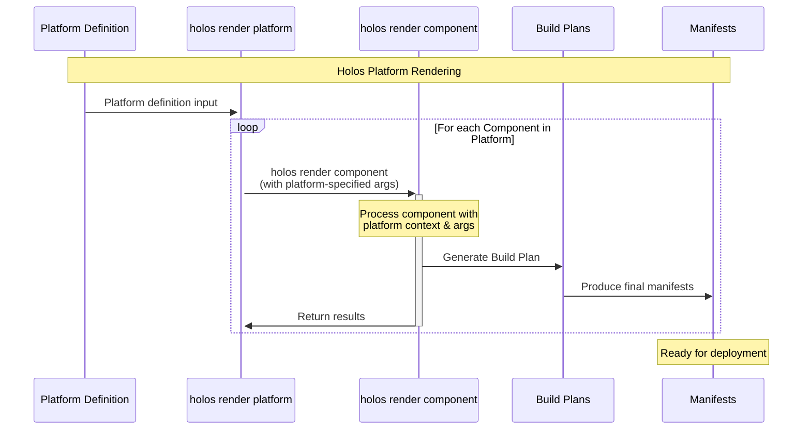

```mermaid
sequenceDiagram
    participant PD as Platform Definition
    participant HRP as holos render platform
    participant HRC as holos render component
    participant BP as Build Plans
    participant M as Manifests

    Note over PD,M: Holos Platform Rendering
    
    PD->>+HRP: Platform definition input
    
    loop For each Component in Platform
        HRP->>+HRC: holos render component<br/>(with platform-specified args)
        Note over HRC: Process component with<br/>platform context & args
        HRC->>BP: Generate Build Plan
        BP->>M: Produce final manifests
        HRC->>-HRP: Return results
    end
    
    Note over M: Ready for deployment
```
