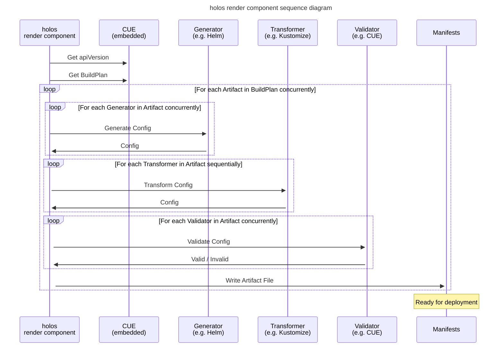

```mermaid
---
title: holos render component sequence diagram
---
sequenceDiagram
  participant HRC as holos<br />render component
  participant CUE as CUE<br />(embedded)
  participant G as Generator<br />(e.g. Helm)
  participant T as Transformer<br />(e.g. Kustomize)
  participant V as Validator<br />(e.g. CUE)
  participant M as Manifests

  HRC ->>+ CUE: Get apiVersion
  HRC ->>+ CUE: Get BuildPlan
  loop For each Artifact in BuildPlan concurrently
    loop For each Generator in Artifact concurrently
        HRC ->>+ G: Generate Config
        G ->>+ HRC: Config
    end
    loop For each Transformer in Artifact sequentially
        HRC ->>+ T: Transform Config
        T ->>+ HRC: Config
    end
    loop For each Validator in Artifact concurrently
        HRC ->>+ V: Validate Config
        V ->>+ HRC: Valid / Invalid
    end
    HRC ->>+ M: Write Artifact File
  end
  Note over M: Ready for deployment
```
