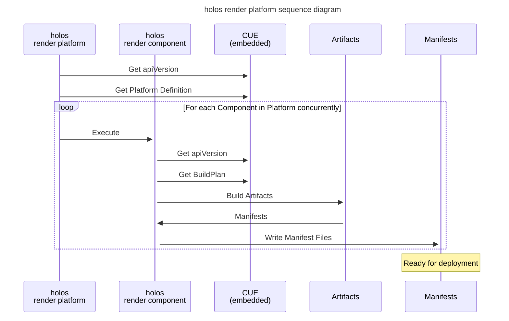

```mermaid
---
title: holos render platform sequence diagram
---
sequenceDiagram
  participant HRP as holos<br />render platform
  participant HRC as holos<br />render component
  participant CUE as CUE<br />(embedded)
  participant A as Artifacts
  participant M as Manifests
  HRP ->>+ CUE: Get apiVersion
  HRP ->>+ CUE: Get Platform Definition
  loop For each Component in Platform concurrently
    HRP ->>+ HRC: Execute
    HRC ->>+ CUE: Get apiVersion
    HRC ->>+ CUE: Get BuildPlan
    HRC ->>+ A: Build Artifacts
    A ->>+ HRC: Manifests
    HRC ->>+ M: Write Manifest Files
  end
  Note over M: Ready for deployment
```
