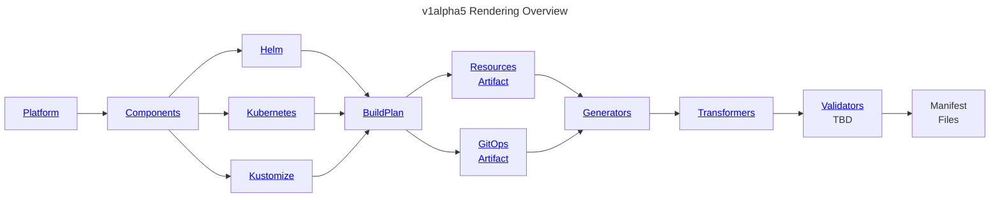

```mermaid
---
title: v1alpha5 Rendering Overview
---
graph LR
    Platform[<a href="/docs/v1alpha5/api/author/#Platform">Platform</a>]
    Component[<a href="/docs/v1alpha5/api/author/#ComponentConfig">Components</a>]

    Helm[<a href="/docs/v1alpha5/api/author/#Helm">Helm</a>]
    Kustomize[<a href="/docs/v1alpha5/api/author/#Kustomize">Kustomize</a>]
    Kubernetes[<a href="/docs/v1alpha5/api/author/#Kubernetes">Kubernetes</a>]

    BuildPlan[<a href="/docs/v1alpha5/api/core/#BuildPlan">BuildPlan</a>]

    ResourcesArtifact[<a href="/docs/v1alpha5/api/core/#Artifact">Resources<br/>Artifact</a>]
    GitOpsArtifact[<a href="/docs/v1alpha5/api/core/#Artifact">GitOps<br/>Artifact</a>]

    Generators[<a href="/docs/v1alpha5/api/core/#Generator">Generators</a>]
    Transformers[<a href="/docs/v1alpha5/api/core/#Transformer">Transformers</a>]
    Validators[<a href="/docs/v1alpha5/api/core/#Transformer">Validators</a><br/>TBD]
    Files[Manifest<br/>Files]

    Platform --> Component
    Component --> Helm --> BuildPlan
    Component --> Kubernetes --> BuildPlan
    Component --> Kustomize --> BuildPlan

    BuildPlan --> ResourcesArtifact --> Generators
    BuildPlan --> GitOpsArtifact --> Generators

    Generators --> Transformers --> Validators --> Files
```
