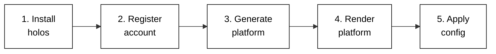

# Overview

<!-- https://kubernetes.io/docs/contribute/style/diagram-guide/ -->

This tutorial covers the following process of getting started with Holos.

```mermaid
graph LR
    A[1. Install <br>holos] -->
    B[2. Register <br>account] -->
    C[3. Generate <br>platform] -->
    D[4. Render <br>platform] -->
    E[5. Apply <br>config]
 
    classDef box fill:#fff,stroke:#000,stroke-width:1px,color:#000;
    class A,B,C,D,E box
```
